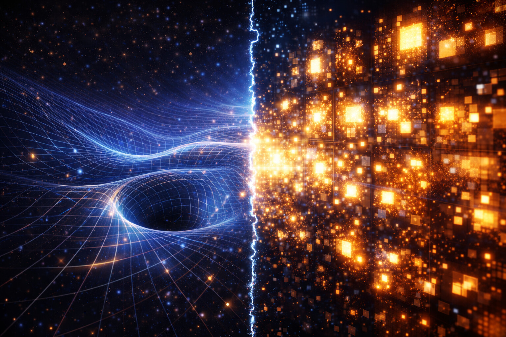
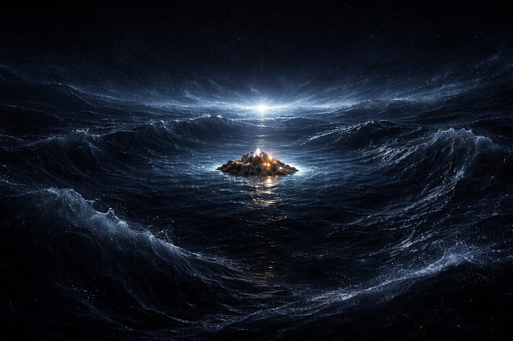
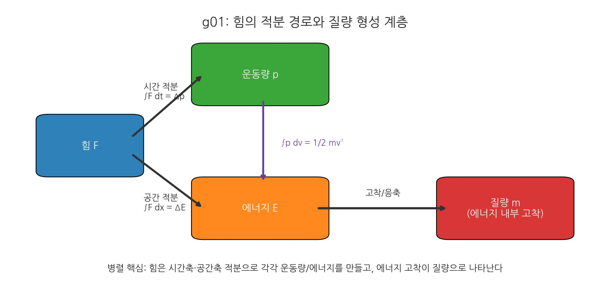
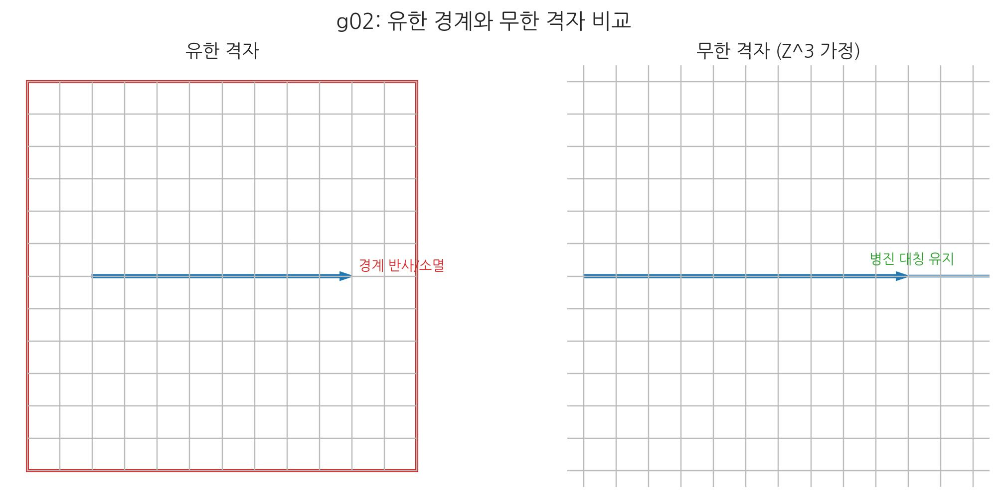
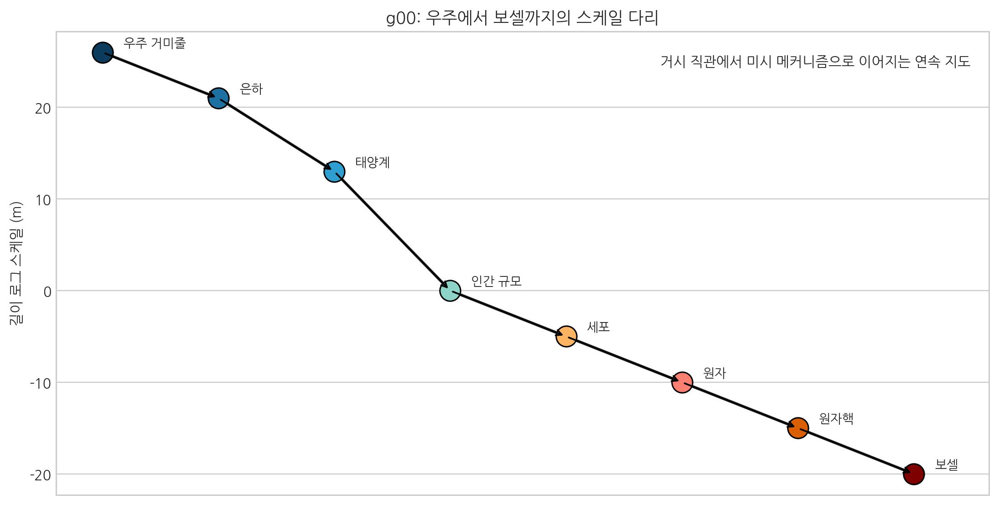

# 00. 잃어버린 힘의 고리를 찾아서

## 읽기 가이드

이 책의 전체 논리 구조는 다음 흐름을 따른다. 먼저 기존 물리학의 모순과 공백을 문제로 제기한다. 이어 중력파·엔트로피·우주 팽창 같은 관측 단서를 모으고, 보셀·적층·위상·시간 해석의 핵심 공리를 세운다. 그 다음 흐름·비틀림·잠금 모드로 중력·전자기력·강력·약력을 재해석하고, 마지막에는 예측·질의응답·부록·기술 문서로 검증 가능성과 정합성을 점검한다.

다만 실제 장 배열은 이 논리 단계를 기계적으로 한 줄로 늘어놓은 방식은 아니다. 개념 정립에 해당하는 장들(예: 04, 07, 11)은 문제 제기와 단서 수집 사이에 전략적으로 앞당겨 배치되어 있고, 통합 장(12)도 개별 힘 해석 장(13~16)에 앞서 전체 지도를 먼저 제시하는 역할을 맡는다.

따라서 처음부터 차례대로 읽어도 되지만, 반드시 정독만이 좋은 방법은 아니다. 먼저 자신이 관심 있는 세부 목차나 장부터 읽고, 이후 앞뒤 장을 오가며 전체 체계를 거꾸로 맞춰 보는 방식도 충분히 유효하다.

## 두 개의 정교한, 그러나 양립하기 어려운 지도

현대 물리학은 인류 지성사에서 가장 위대한 두 가지 성취 위에 서 있다. 하나는 거시 세계의 유려한 공간을 설명하는 아인슈타인의 **일반상대성이론(General Relativity)**이며, 다른 하나는 미시 세계의 양자 통계를 다루는 **양자역학(Quantum Mechanics)**이다.

이 두 이론은 각각의 영역에서 놀라울 정도로 정밀하게 자연을 기술한다. 우리가 매일 사용하는 GPS의 시간 오차 보정은 상대성 이론 덕분이며, 손안의 스마트폰을 작동시키는 반도체 설계는 양자역학이 없었다면 불가능했을 것이다.

 

 

하지만 치명적인 문제가 있다. 이 두 지도를 하나로 겹치려 하는 순간, 모순이 발생한다는 점이다. 블랙홀의 중심(특이점)이나 우리 관측 우주의 국소적 팽창 사이클인 **빅뱅(Big Bang)**처럼 '엄청난 질량이 아주 작은 공간에 뭉쳐 있는' 극한의 상황에서, 두 이론은 서로 다른 답을 내놓거나 수학적으로 붕괴한다.

지난 100년 동안 물리학자들은 이 두 이론을 통합하기 위해 끈 이론(String Theory)과 고리 양자 중력(Loop Quantum Gravity) 등 수많은 시도를 해왔지만, 여전히 우리는 우주를 관통하는 단 하나의 방정식, '모든 것의 이론(Theory of Everything)'을 완성하지 못했다.

## 95%의 무지, 그리고 암흑의 바다

더 큰 문제는 우리가 우주의 5%밖에 이해하지 못하고 있다는 사실이다. 관측되는 은하의 회전 속도를 설명하기 위해, 우리는 보이지 않는 질량인 **암흑 물질(Dark Matter)**을 가정해야 했다. 또한, 우주가 중력을 이기고 가속 팽창하는 현상을 설명하기 위해 정체불명의 **암흑 에너지(Dark Energy)**를 도입해야 했다.

 

 

이들은 현재 명확한 실체가 규명되지 않은 채, 방정식의 빈틈을 메우는 '미지수(X)'로 남아 있다. 우리가 무언가를 근본적으로 놓치고 있을 수 있다. 기존의 퍼즐 조각을 억지로 맞추려 하기보다, 퍼즐 판 자체를 뒤집어 봐야 할 시점인지도 모른다.

## 관점의 반전: 중력을 양자화하지 마라

기존의 통합 노력은 대부분 "중력을 다른 힘(전자기력, 강력, 약력)처럼 취급하여 양자화(Quantization)"하려는 시도였다. 하지만 일반상대성이론이 남긴 가장 큰 통찰은, **중력은 독립적인 입자 교환력이라기보다 시공간의 기하학적 구조 변화로 기술된다는 점**이다.

이 때문에 중력을 반드시 다른 힘과 동일한 방식으로 다루어야 하는지에 대해서는 재검토의 여지가 생긴다.

## 텅 빈 공간에도 밀도가 있다

아인슈타인은 중력이 다른 세 가지 힘과 구별되는 성격을 지닌다는 점을 꿰뚫어 보았다. 다만 그는 중력을 시공간의 기하로 설명하는 데 성공했지만, 전자기력을 비롯한 다른 상호작용과 그 기하를 하나의 틀로 끝내 통합하지는 못했다.

이 책은 우주의 근본 작동 원리를 **SALT(층화된 장력으로 읽는 공간 해석)**라는 관점으로 제안한다. SALT는 공간을 수동적 배경이 아니라, 상태가 갱신되는 동적 매질로 해석한다. 또한 입자와 상호작용은 보셀이라는 최소 구조 단위의 상태 변화로 발현된다고 본다. 즉 우주는 비어 있는 무대가 아니라, 구조와 장력을 지닌 활성 매질이다. 입자는 이 활성 매질의 에너지가 탄성 전달 상태에서 국소 고착 상태로 전이할 때 나타나는 구조적 현상이다. 즉 무대와 그 위의 입자는 분리된 두 실체가 아니라, 같은 매질 상태가 다르게 드러난 것일 뿐이다. 질량이 공간의 또 다른 작품이라면, 우주의 끝은 어디일까? 끝없이 펼쳐진 공간의 세계, 이것이 곧 우리가 마주한 우주의 실체일지 모른다.

SALT는 아래 5대 기본 공리를 이후 전개될 모든 설명의 출발점으로 둔다.

### 왜 5대 공리인가

5대 공리는 SALT의 설명을 일관된 문법으로 묶어 주는 최소 기준이다.  
이 공리들이 있어야 장마다 용어가 흔들리지 않고, 같은 상태 변수로 서로 다른 관측 채널을 비교할 수 있다.  
즉 공리의 역할은 주장 확장이 아니라, **설명의 재현성과 검증 가능성**을 확보하는 데 있다.

 

 

::: {.note-theory}
**SALT 핵심 요약: 5대 기본 공리**
:::

1. **공간 보셀 (이산 단위)**: SALT는 공간을 보셀 격자라는 최소 물리 단위(이산 격자 단위)의 배열로 본다.
2. **위상적 적층 (밀도)**: SALT는 공간 밀도 증가를 보셀 크기 축소가 아니라, 3차원 해상도를 유지한 채 위상 레이어가 누적되는 현상으로 본다.
3. **질량 (위상 매듭)**: SALT는 질량을 별개의 알갱이가 아니라, 보셀의 위상 회전이 임계 이상 누적되어 영구 고착된 매듭 상태로 본다.
4. **상호작용 (장력 차 완화)**: SALT는 우주의 힘을 장력 차 완화 과정으로 보며, 중력을 유효 경사도 \(-\nabla\mu\)를 따른 흐름으로 해석한다.
5. **필연적 회전 (상태 고정/재현)**: SALT는 입자의 회전(Spin)을 보셀의 존재 고정/재현을 위한 기본 동역학 상태로 본다.

여기서 SALT가 보른 규칙 수준 통계 정합을 요구하는 이유는 "입자가 본질적으로 확률 구름으로 존재한다"는 존재론을 그대로 채택하기 위해서가 아니다.
관측 대상과 관측 도구가 같은 보셀 매질 위에서 함께 영향을 받는다는 전제 아래, 플랑크 해상도 이하 직접 분해 관측이 닫히므로 관측 가능 통계의 재현을 1차 검증 기준으로 둔다.

::: {.note-theory}
#### [개념 길잡이] 공간 보셀 요약

- **정체성**: 보셀은 더 이상 쪼갤 수 없는 플랑크 스케일 고정 부피 셀이며, 공간 상태 패턴(밀도/위상/장력)이 변하는 **동적 물리 셀**이다.
- **동역학/보존 전제**: SALT는 우주를 외부 에너지 주입계가 아니라 보셀 상태 전이계로 해석하며, 보존 판정은 전역 무한합보다 **국소 보존**(연속 방정식) 성립 여부를 1차 기준으로 둔다.
- **상태의 두 얼굴(입자 vs 빛)**: 보셀의 위상 장력이 누적되어 고착되면 **'질량'**이 되고, 텐션을 옆으로 릴레이하면 **'빛/파동'**이 된다. 즉, 물질과 공간은 단일 보셀 매질의 두 가지 동역학 모드다.

> 💡 **심화 안내**: 무한/무경계 격자 정합, 국소 보존 기준, 보셀 물리 한계의 상세 표준은 이 책 후반부 **[20. 부록: 주요 용어 및 참고 자료]**의 보셀 마스터 정리를 따른다.
:::

::: {.note-theory}
#### 5대 공리의 수학적 표현 (요약)

[가설] 아래 식은 SALT 해석의 출발점이며, 이후 장에서 검증 기준으로 사용한다.

> 핵심: 공리 전개를 읽을 때, 힘의 시간/공간 적분이 운동량·에너지로 분기되고 에너지 고착이 질량으로 이어진다는 큰 지도를 먼저 잡아두자.

- \(\sigma\): 국소 보셀 변형에 대응하는 유효 응력
- \(\sigma_c\): 탄성 거동이 소성 고착으로 전이되는 임계 응력
- \(\tau_{\mathrm{relax}}\): 형성된 매듭이 자연 이완되는 특성 시간
- \(T_{\mathrm{obs}}\): 관측 또는 실험이 유효하게 추적하는 시간 척도
- \(\mathcal{U}\): 밀도와 위상 배치가 만드는 장력 퍼텐셜
- \(W\): 위상 감김수 또는 매듭지수
- \(\rho, \theta\): 각각 적층 밀도와 위상 변수

**①** **공간 보셀 (이산 격자)**
   \[
   B=\mathbb{Z}^3\times \mathbb{Z}_T
   \]
   공간은 연속 배경이 아니라, 최소 물리 단위(이산 격자 단위)가 배열된 격자 위에서 기술된다. 이 표현은 경계가 없는(무한/무경계) 모형화와 정합적으로 사용할 수 있으며, 관측식에서 쓰는 연속 시간 \(t\)는 시간 인덱스 \(T\)의 거시적 근사 표현이다.

   > 💡 **심층 고찰: 왜 보셀 격자는 끝이 없는 무한(\(\mathbb{Z}^3\))이어야 하는가?**
   >
   > *   **무한 배경은 곧 무한 에너지가 아니다:** 보셀이 무한히 존재한다는 사실은 에너지의 무한 창조를 뜻하지 않는다. 이완된 진공은 단지 물리적 수용 여지(가용 상태공간)이며, 물리적 에너지는 보셀의 개수가 아니라 기본 상태에서의 위상/밀도 변형(\(\nabla\theta, \nabla\rho\))으로 정의된다. 보존의 핵심도 전역 합계가 아니라 인접 보셀 간 **국소 연속 보존** \(\partial_t n + \nabla\cdot \mathbf{J}_n = 0\) 이다.
   > *   **유한 격자의 문제는 두 경우로 나뉜다:** (1) **유한 + 경계 있음**: 파동의 반사/흡수 경계조건을 별도로 도입해야 하며, 경계 효과로 병진 대칭이 깨져 운동량 보존 해석이 불안정해진다(상세 내용은 **21. 부록: 주요 과학이론과 SALT의 뇌터의 정리** 참조). 팽창을 모사하려면 외부에서 보셀을 추가하는 비자연적 규칙이 필요해진다. (2) **유한 + 경계 없음(폐곡면)**: 가장자리 문제는 사라지지만, 전역 대칭 및 모드 이산화 제약이 생겨 SALT의 기본 가정(균질한 \(\mathbb{Z}^3\) 격자, 국소 규칙 기반의 자연 확산)과 긴장이 커진다.
   > *   **결론:** SALT의 최소 공리(균질성, 국소성, 보존성)를 가장 적은 가정으로 만족하는 배경은 끝과 경계가 없는 무한 격자 \(\mathbb{Z}^3\)이다. 이때 관측되는 우주 팽창은 '공간의 생성'이 아니라, 초기 고장력 상태의 국소적 이완과 확산으로 해석된다.

> 핵심: 무한/무경계 배경 가정이 왜 필요한지, 수식 설명과 함께 즉시 시각적으로 확인한다.

**②** **위상적 적층 (밀도)**
   \[
   \Psi(x,t)=\sum_{k=1}^{N(x,t)}a_k(x,t)e^{i\theta_k(x,t)},\qquad \rho(x,t)=|\Psi(x,t)|
   \]
   밀도 증가는 보셀 크기 변화가 아니라, 같은 위치에서 위상 레이어가 더 쌓이고(또는 레이어 가중치 \(a_k\)가 재배열되어) 나타나는 현상으로 표현된다.

**③** **질량 (위상 매듭 고착)**
   \[
   \sigma(x,t)>\sigma_c,\qquad W\neq 0,\qquad \tau_{\mathrm{relax}}\gg T_{\mathrm{obs}}
   \]
   질량은 국소 변형이 임계 응력 \(\sigma_c\)를 넘어 탄성 영역을 이탈하고, 매듭지수 \(W\)가 0이 아닌 위상 고착이 형성되며, 그 이완 시간 \(\tau_{\mathrm{relax}}\)이 관측 시간 \(T_{\mathrm{obs}}\)보다 충분히 길 때 성립하는 영속적 매듭 상태로 정의된다.

**④** **상호작용 (장력 퍼텐셜, 기울기와 위상 동역학)**
   \[
   \mathcal{U}=\mathcal{U}(\rho,\nabla\rho,\nabla\theta),\qquad \mathbf{F}_{\mathrm{eff}}=-\nabla\Phi_{\mathrm{eff}}
   \]
   \[
   \mathbf{g}_{\mathrm{eff}}\propto-\nabla\mu\quad(\text{저차 근사 }-\nabla\rho),\qquad \text{전자기 반응}\sim \nabla\theta
   \]
   핵심 요약:
   - 중력은 유효 경사도 \(-\nabla\mu\) 흐름으로, 전자기 반응은 위상 기울기 \(\nabla\theta\) 전파로 기술한다.
   - 저차 근사에서는 \(-\nabla\rho\)가 나타날 수 있고, \(\nabla(\rho^2)=2\rho\nabla\rho\)이므로 방향은 같고 가중만 다르다.
   - 내부(레이어 간): 강력=위상 잠금, 약력=잠금 해제/재배열(가설). 외부(보셀 간): 중력=인장 흐름, 전자기=위상 재배열.

   표준 유도(요약):
   - \(n\equiv \rho^2,\ \mu\equiv \delta E/\delta n,\ \mathbf{J}_n=-Mn\nabla\mu,\ \partial_t n+\nabla\cdot\mathbf{J}_n=0\)
   - 1차 구동력은 \(-\nabla\mu\)이며, \(\nabla\rho\)와 \(\nabla(\rho^2)\)는 선택한 \(\varepsilon\)에서 파생된다.
   - 예시: \(\varepsilon(n,\theta)=V(n)+\frac{K_n}{2}|\nabla n|^2+\frac{K_\theta}{2}n|\nabla\theta|^2\)

   직관:
   ① \(n=\rho^2\): 지형 높이 ② \(\mu\): 유효 경사도 ③ \(\mathbf{J}_n\): 물길 ④ 보존식: 지역 간 이동의 총량 보존

**⑤** **필연적 회전 (상태 고정/재현의 기본 동역학)**
   \[
   \Psi=\rho e^{i\theta},\qquad \omega(x,t)=\partial_t\theta(x,t)
   \]
   보셀 상태는 본질적으로 위상 회전을 포함하며, 이 회전이 상태 갱신의 기본 리듬이 된다. 외란이 없고 \(\rho,\omega\)가 일정하면 \(\theta(t)=\omega t+\theta_0\)로 선형 증가한다.
:::

내용을 다시 요약하자면 다음과 같다.

1. SALT는 중력·전자기력·강력·약력(기본 4상호작용)과 핵력(잔류 결속)을 서로 다른 실체로만 보지 않고, 같은 공간 매질의 서로 다른 발현으로 본다.
2. 상태 변수는 진폭 \(\rho\), 위상 \(\theta\), 밀도형 상태량 \(n=\rho^2\), 유효 경사도 \(-\nabla\mu\)로 표준화한다.
3. 이를 수학 공식으로 표현하면 다음과 같다.

\[
\Psi=\rho e^{i\theta},\qquad
n\equiv \rho^2,\qquad
\mathbf{J}_n=-Mn\nabla\mu,\qquad
\partial_t n+\nabla\cdot\mathbf{J}_n=0
\]

## 공간 개념의 재해석: 물리학에 시공간은 없다

아인슈타인은 빛의 속도(\(c\))를 상수로 유지하기 위해 시간(\(t\))을 늘리고 줄이는 4차원 시공간 개념을 제시했다. SALT는 여기에 대해 더 물리적인 해석을 시도한다.

**"시간이 늘어난다기보다, 빛이 지나가야 할 길이 더 길어지는 것이다."**

물속에서 빛이 느려지는 이유는 시간이 느려져서가 아니라 물이라는 매질의 밀도 때문이다. 같은 방식으로, 중력이 강한 곳에서 나타나는 신호 지연도 공간 밀도 변화로 해석할 수 있다. 바깥 관측자에게는 시간이 느려진 것처럼 보이지만, SALT 관점에서는 빛이 더 복잡한 경로와 전달 조건을 거치며 늦게 도착한 결과로 읽혀진다. 따라서 더 낮은 밀도의 관측자에게는 높은 밀도 공간의 시간이 느려진 것처럼 착각될 수 있다 다만 국소 관측자 기준에서 빛의 속도는 언제나 \(c\)로 측정되며, 지연은 관측 프레임을 비교할 때 드러난다.
SALT는 시간 자체의 신축을 기본 가정으로 두지 않는다. 관측되는 시간지연은 공간 밀도 변화에 따른 신호 전달 지연으로 해석한다. 이 가설은 24장의 \(c_{eff}(\rho)\) 모델과 Shapiro 지연·중력 적색편이·렌즈 시간지연·GPS/GNSS·GW-EM 도착시각 비교 채널로 검증한다.

SALT의 우주에서 **시간의 흐름**은 누구에게나 같은 시계이고, **공간 밀도**는 상황에 따라 늘어나고 조여지는 그물망이다. 여기서 시간 인덱스는 계산기술 용어가 아니라, 상태 변화를 순서화해 표기하는 물리적 명칭이다.

SALT는 **보셀**이라는 공간의 최소 물리 단위(이산 격자 단위)를 가정한다. 이 책은 보셀이 어떻게 질량이라는 실체를 이루고, 우리가 물질과 힘이라고 부르는 현상으로 이어지는지를 추적하는 탐구 보고서다.

여기서 핵심은 공간의 본질에 대한 사고의 전환이다. SALT에서 보셀은 굳어 있는 블록이 아니라, 보편 시간 인덱스의 플랑크 시간마다 상태가 끊임없이 변화하는 텅 빈 공간이다. 이 텅 빈 공간이 내부의 소용돌이에 의해 빛이나 전자기파를 튕겨낼 수 있게 되는 순간, 그것이 바로 우리의 눈과 손에 느껴지는 '질량'으로 드러나게 된다.

그렇다면 아무것도 없는 텅 빈 공간이 도대체 어떻게 소용돌이를 이룬다는 것인가? 보셀 내부를 채우는 미지의 기체라도 존재하는 것일까?

바로 이 지점에서 '공간의 밀도'라는 새로운 개념이 등장한다. 이 밀도는 단순한 물질의 빽빽함이 아니라, 공간 자체의 **'진폭'과 '위상'**이라는 정보로 치환되어 설명된다. 이는 우리가 지금까지 상식이라 믿어왔던 낡은 공간의 틀을 완전히 부수고, 새로운 물리학의 영역을 개척하는 첫걸음이다.

이제, 공간의 진짜 모습을 마주할 때다. **"힘이라 부르던 현상은 무엇을 얼마나 잘못 이름 붙인 것인가"**라는 질문을 따라가며, 우리는 관찰자를 넘어 공간의 건축가 관점으로 이동하게 된다.

::: {.note-theory}
**참고: LQG와 SALT: 닮은 점과 갈라지는 지점**

고리 양자 중력(LQG)은 '시공간 자체의 양자화'를 전제한다는 점에서 SALT와 가까운 문제의식을 공유한다. 두 이론은 모두 공간을 매끄러운 배경이 아니라 이산적 구조로 본다.

다만 시간 처리 방식과 물리적 해석 층위는 다르다. LQG가 추상 수학 구조를 중심으로 전개된다면, SALT는 우주를 이루는 보셀이 스스로 회전 균형을 맞추고, 그 안에 층을 쌓아가며 질량과 힘을 만든다고 본다.

상세 비교와 수학적 정리는 부록 장에서 다룬다.
- 이론 비교: `21_부록_주요 과학이론과 SALT`
- 수학 골격: `24_부록_기술백서_수학적_골격`
:::

> 핵심: 거시와 미시가 단절된 세계가 아니라, 하나의 연속 스케일 위에서 같은 법칙으로 이어진다는 점을 먼저 잡아두자.

이제 출발한다. 다음 장에서 '힘'이라는 단어의 전제를 먼저 해체한다.

참고로 본서의 검증 문맥은 거시 판별(\(\Lambda\)CDM, 표준우주론 대비)과 미시 판별(SM, 표준모형 대비)을 분리해 운영한다.

다음 장, **01. 힘이라는 단어는 왜 착각인가?**
