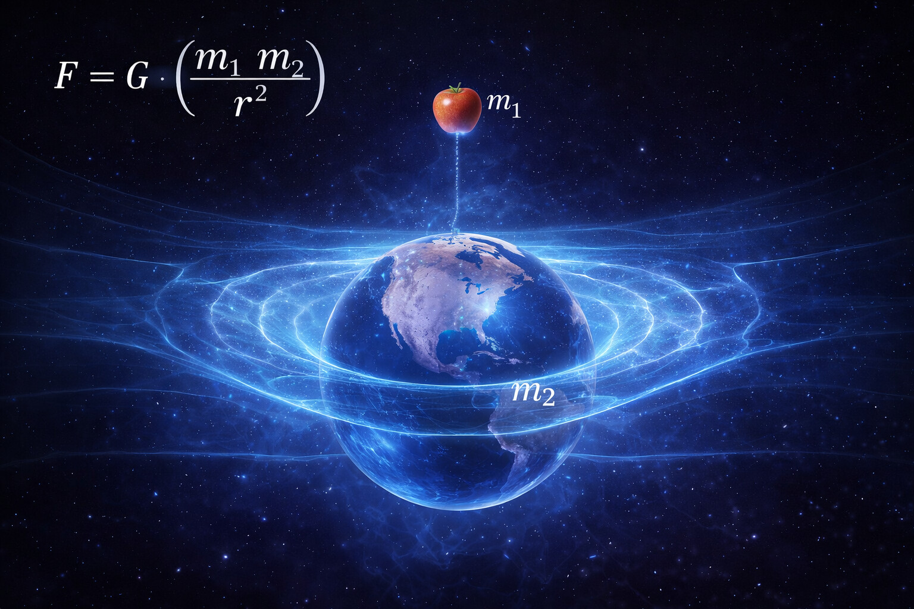
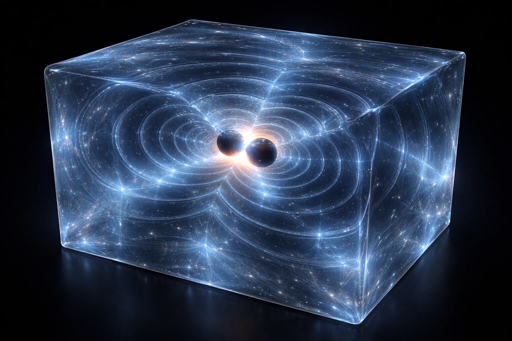
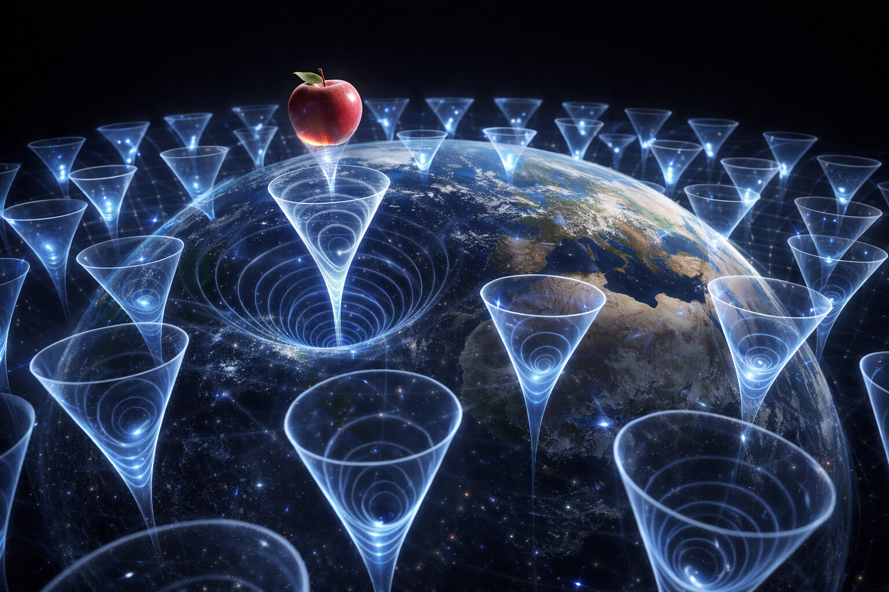
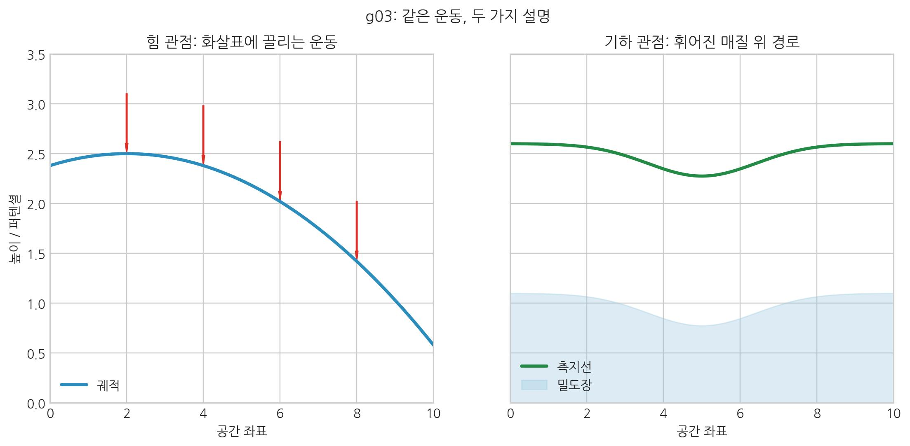

# 01. 힘이라는 단어는 왜 착각인가?

## 보이지 않는 밧줄

이 장은 문제 제기의 출발점에 해당하며, 우리가 너무 익숙하게 받아들인 '힘' 개념 자체를 다시 의심하게 만든다.
즉 00장에서 제시한 통합 스케일의 출발점을, 여기서는 언어의 재정의라는 형태로 구체화한다.

우리는 일상에서 '힘'이라는 단어를 너무나 자연스럽게 사용한다. 사과가 나무에서 떨어질 때, 우리는 지구가 사과를 '당긴다'고 표현한다. 무거운 상자를 들어 올릴 때 우리는 근육의 힘으로 중력을 '거스른다'고 느낀다.

아이작 뉴턴은 이 직관을 수학으로 정리했다. 그의 그림에서는 우주가 큰 빈 상자(절대 공간)이고, 그 안의 물체들은 서로를 **보이지 않는 밧줄**로 당긴다. 그 밧줄이 만유인력이다.

> F = G · m₁m₂ / r²

이 간결한 수식은 두 물체 사이에 작용하는 '당기는 힘'이 질량이 클수록, 거리가 가까울수록 강력해진다는 사실을 높은 정확도로 설명하는 듯했다.

 

 

하지만 이 설명에는 치명적인 약점이 숨어 있다. 바로 **"어떻게?"**라는 질문이다.
태양은 1억 5천만 킬로미터나 떨어진 지구를 도대체 어떻게 붙잡고 있는가? 그 사이의 공간은 텅 비어 있는데, 힘은 무엇을 타고 전달되는가?

뉴턴조차도 '원격 작용(Action at a Distance)'이라 불리는 이 기묘한 성질을 설명하지 못해 괴로워했다. 그는 "물체가 텅 빈 공간을 건너 다른 물체에 영향을 준다는 생각은 너무나 설명이 쉽지 않다"라고 고백했을 정도다.

- **[검증됨]** 뉴턴 역학은 거시 규모에서 매우 높은 예측력을 보인다.
- **[가설]** SALT는 '힘'을 독립 실체보다 공간 매질의 구동/재배열로 해석한다.
- **[예측]** 이 해석이 타당하면, 중력·전자기·강력·약력이 같은 변수 집합으로 연결되어야 한다.

 

"중력이 물질에 고유하고 본질적인 성질이라서, 어떤 매개도 없이 진공을 가로질러 한 물체가 다른 물체에 작용한다는 생각은, 나에게는 너무나도 큰 부조리로 보인다. 철학적으로 사고할 능력이 있는 사람이라면 그런 생각에 빠질 수 없다고 나는 믿는다."

― <strong>아이작 뉴턴</strong>이 1693년 <strong>리처드 벤틀리</strong>에게 보낸 편지 중

### 중력을 '힘'으로 오해한 대가

중력을 단순히 '당기는 힘'으로 정의하는 순간, 물리학은 해결 불가능한 모순에 빠진다.

1.  **직관적으로 설명이 어려운 원거리 작용**: 텅 빈 진공을 가로질러 어떻게 수억 킬로미터 밖의 물체를 '즉각' 붙잡을 수 있는가? 매질이 없는 힘 전달은 물리적 매개 해석이 필요한 지점이다.
2.  **유령 입자, 중력자**: 모든 힘은 전달자가 필요하지만(빛-광자), 100년간 찾아 헤맨 '중력자(Graviton)'는 아직 발견되지 않았다. SALT는 이것이 중력을 입자 교환력으로 보지 않아도 된다는 신호일 수 있다고 해석한다.
3.  **질량 없는 빛의 굴절**: 뉴턴식 공식으로는 질량이 0인 빛을 당길 수 없다. 하지만 빛도 휜다. 당기는 밧줄이 없다는 관측 근거다.
4.  **등가 원리의 역설**: 왜 무거운 공과 가벼운 깃털이 똑같이 떨어지는가? '당기는 힘'이라면 무거운 쪽을 더 강하게 당겨야 한다. 이 모순을 해결하기 위해 현대 물리학은 '관성과 중력이 우연히 같다'는 궁색한 가정을 유지하고 있다.

이 모든 모순은 중력을 공간과 별개의 '힘'으로 보기 때문에 발생한다. 이제 우리는 이 낡은 정의를 버려야 한다.

SALT는 이를 **'공간의 흐름'**으로 본다. 모든 물체가 같은 물살을 타고 **서핑**하듯 움직이기 때문에, 질량이 달라도 같은 방식으로 떨어진다고 해석한다.

## 무대가 흔들린다

우리의 언어는 '힘'을 주체와 객체 간의 행위로 정의한다. "A가 B를 상호작용한다"는 문장은 주체(A), 객체(B), 그리고 그 사이의 동역학적 변화를 전제한다. 여기서 간과된 것은 바로 **행위가 일어나는 공간**, 즉 '무대'다.

연극을 볼 때 우리는 배우만 움직인다고 생각하고, 무대 바닥은 가만하다고 본다. 뉴턴 물리학의 공간도 그랬다. 물체는 움직여도 공간 자체는 변하지 않는 배경으로 취급됐다.

그러나 현대 천체 물리학의 관측 결과는 이 믿음을 크게 흔들었다.
2015년, LIGO(레이저 간섭계 중력파 관측소)는 13억 광년 밖에서 두 개의 블랙홀이 충돌하며 발생한 **중력파(Gravitational Waves)**를 검출했다.

이것은 다음을 의미한다. 두 거대한 질량이 충돌했을 때, 그들끼리만 서로 강하게 당긴 것이 아니다. 그 충돌의 충격으로 **우주 공간 그 자체가 출렁거렸다.**

 

 

공간이 출렁인다는 사실은 공간이 단순한 빈 배경이 아니라는 뜻이다. 공간은 구부러지고 흔들릴 수 있는 **물리적 실체**다. 우리가 진공을 '아무것도 없는 곳'으로 여기지만, SALT는 이를 팽팽한 **보이지 않는 천**에 더 가깝게 본다.

## 언어의 감옥

우리가 '중력'을 '힘'이라 부르는 순간, 현상을 힘의 한 종류로만 읽게 된다. 이 틀에 처음 의문을 던진 사람이 아인슈타인이다. 그는 중력을 힘이 아니라 공간의 구부러짐으로 보자고 제안했다. 다만 통일장이론이 미완으로 남으면서, 이 해석의 완성도는 여전히 열린 문제다.

::: {.note-theory}
### 프레임 드래깅 (Frame Dragging)

실제 물리학(일반상대성이론)에서도 회전하는 질량은 주변 **공간**을 꼬아서 끌고 간다. 이를 '렌즈-티링 효과(Lense-Thirring Effect)'라고 하며, 이는 **공간**이 단순한 무대가 아니라 질량과 함께 엉겨서 돌아가는 역동적인 실체임을 강하게 시사한다.
:::

**힘은 분리된 실체라기보다, 입체 구조적 기울기로 구현된다.**

 

 

공간 자체가 움직인다는 생각은 낯설다. 그래도 이 책은 그 관점을 끝까지 밀어붙인다. 중력이 **공간** 변환이 만든 기울기라면, 전자기력·강력·약력도 같은 맥락에서 읽을 수 있다. 미시 현상 역시 보이지 않는 **공간**의 미세 이동으로 해석할 수 있다.

> 핵심: 같은 현상도 "힘에 끌림"으로 볼 수 있고 "기울어진 무대에서의 이동"으로도 볼 수 있다. SALT는 후자를 택한다.

## 밀도-상호작용 통합이론

SALT는 기본 4상호작용(중력·전자기력·강력·약력)과 핵력(잔류 결속)을 입자가 주고받는 '힘'이 아니라, **공간** 보셀의 **'정적 상태(힘)'**와 보셀의 비틀림으로 전달되는 **'동적 상태(파동)'**가 함께 빚어내는 질서로 치환한다.

여기서 우리는 **질량(Mass)**과 **빛(Light)**의 핵심적인 차이를 이해해야 한다.
- **물질 (매듭)**: 보셀 격자의 층들이 복잡하게 엉겨 붙어 영구적으로 고착된 상태다. 이 매듭이 이동하려면 주변 공간 원단을 물리적으로 밀어내며 지나가야 하므로 **저항(질량)**이 발생한다.
- **빛 (파동)**: 보셀 자체는 제자리에 머물고, 보셀의 회전 위상만이 인접 보셀로 전달되는 상태다. 매질을 직접 끌고 다닐 필요가 없기에 **저항(질량)이 0**인 상태로 전파된다.

이제 그 뼈대이자 우주의 핵심 실체 후보인 **공간 밀도**의 세계로 들어가보자.

SALT 해석에서 지구는 주변 **공간 밀도**를 바꾼다. 그 결과 평평하던 공간에 움푹 **파인 비탈**이 생긴다. 사과는 누가 줄로 당겨서 떨어지는 게 아니라, 그 기울어진 길을 따라 내려간다.

중심에는 공간을 안쪽으로 감아들이는 **소용돌이 같은 흐름**이 있고, 물질은 그 흐름을 따른다. 보이지 않는 **밧줄**보다, 자연스러운 공간 흐름으로 이해하는 편이 맞다.

고밀도 층을 통과하는 빛이 경로 의존적 위상/지연 정보를 실어 나오면, 내부 상태 구조가 경계 신호에 투영되어 보일 수 있다. 이는 홀로그램 원리와 **유사한 정보 투영 과정**으로 해석할 수 있다.
이 지연 축은 24장 기술백서의 \(c_{eff}(\rho)\) 및 샤피로/적색편이/렌즈 지연 공동 검증 절차(13.1~13.4)로 시험 가능하다.

이제 문제 제기는 끝났다. 다음 장에서는 중력을 먼저 **유효 경사도 \(-\nabla\mu\) (저차 근사 \(-\nabla\rho\))**의 언어로 다시 읽고, 왜 그것이 '당기는 힘'이 아니라 공간의 작용으로 보아야 하는지를 단계적으로 풀어간다.

다음 장, **02. 중력은 공간이 작용하는 힘이다**
