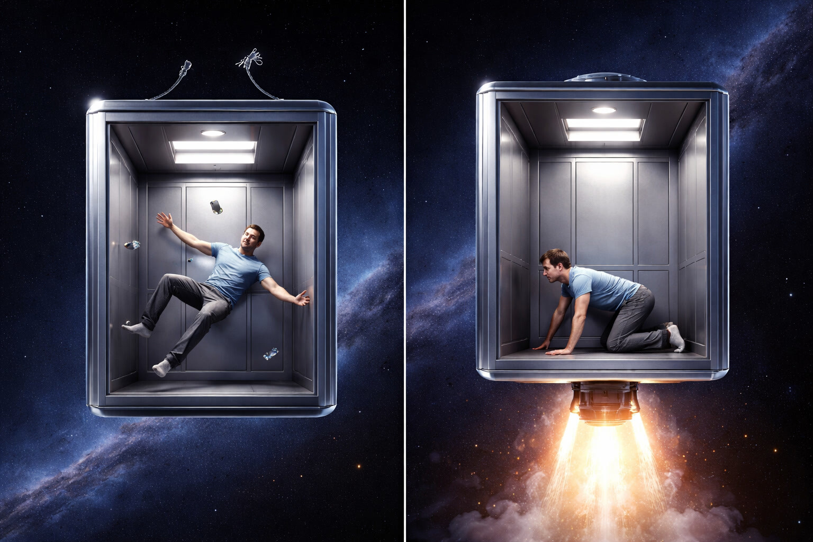
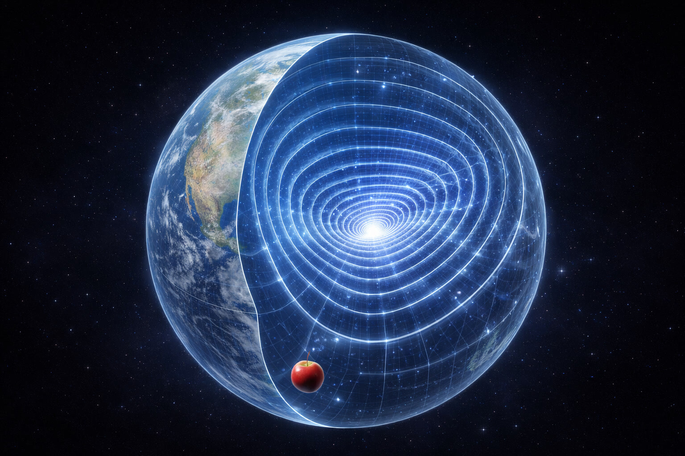
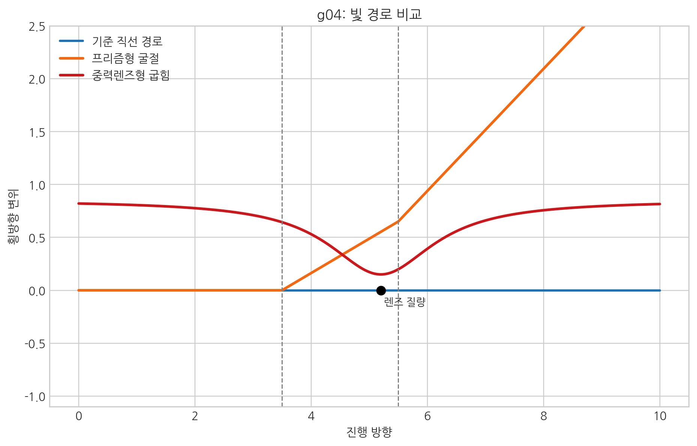

# 02. 중력은 공간이 작용하는 힘이다

## 아인슈타인의 가장 행복한 생각

1907년, 아인슈타인은 스위스 베른의 특허청 의자에 앉아 있다가 문득 한 가지 상상을 떠올렸다.
"만약 어떤 사람이 지붕에서 떨어진다면, 그는 자신의 무게를 느끼지 못할 것이다."

이 생각은 아인슈타인이 훗날 "내 생애 가장 행복한 생각"이라 부를 만큼 중요했다. 만약 정말 줄에 끌리듯 당겨진다면, 떨어질 때도 몸이 잡아당겨지는 느낌이 나야 한다. 그런데 자유낙하에서는 오히려 **무중력**에 가까운 느낌이 든다. 겉으로는 중력이 사라진 것처럼 보인다.

아인슈타인은 여기서 중력을 '힘이 아닌 시공간의 기하학적 곡률'로 정의했다(일반상대론의 기술 언어).
하지만 SALT는 여기서 한 걸음 더 나아간다.
**중력이 느껴지지 않는 것이 아니라, 물체가 공간의 물살(장력)에 동기화되어 힘의 저항이 작아진 상태**라고 정의한다.
즉, 중력은 여전히 '공간이 작용하는 힘'이다.
이는 01장에서 제기한 "힘이라는 언어의 한계"를 중력 사례로 검증하는 첫 단계다.

### 중력의 실체에 대한 관측 근거

- **파운드-렙카 실험 (1959)**: 지면의 빛이 위쪽보다 느리게 도달함을 보여주었다. 이는 **'중심부로 갈수록 공간(보셀)이 더 촘촘하게 압축되어 있어 빛이 가야 할 길이 더 멀다'**는 관측 근거다.

## 관성은 중력의 다른 이름이다

엘리베이터 실험을 생각해보자. 창문 없는 엘리베이터가 우주 공간에서 위쪽으로 가속한다면, 당신은 영문도 모른 채 바닥으로 몸이 쏠리는 힘을 느낄 것이다. 이 힘은 지구에 가만히 서 있을 때 느끼는 중력과 구별할 수 없다. 아인슈타인은 여기서 결론을 내렸다. **"중력과 가속도는 동일하다."** (등가 원리, Equivalence Principle)

 

 

이 원리는 고정관념을 뒤집는다. 우주에서 가장 자연스러운 상태는 자유낙하다. 뉴턴에서는 힘이 0인 **관성** 상태이고, SALT에서는 **공간 장력 변화에 몸을 맡겨 가장 안정한 위상으로 흐르는 상태**다. 결국 관성과 중력은 같은 뿌리, 곧 보셀 격자와의 상호작용에서 나온다.

- **[검증됨]** 등가 원리, 자유낙하, 중력 시간지연은 실험적으로 확인되어 있다.
- **[가설]** SALT는 중력을 유효 경사도에 따른 공간 흐름으로 해석한다.
- **[예측]** \(-\nabla\mu\) 기반 표현이 낙하·렌즈·지연 채널을 함께 설명해야 한다.
\[
n\equiv \rho^2,\qquad \mathbf{g}_{\mathrm{eff}}\propto-\nabla\mu\quad(\text{저차 근사 }-\nabla\rho)
\]

#### 위치에너지와 보셀 해석은 충돌하지 않는다

여기서 의문이 생길 수 있다.  
"낙하는 위치에너지 차이로 설명하는데, SALT의 보셀 꼬임 해석과 모순되지 않는가?"

결론은 모순되지 않는다. 두 설명은 서로 다른 층위다.

- 거시(관측) 층위: 물체는 **높은 퍼텐셜에서 낮은 퍼텐셜** 쪽으로 이동한다.
- 미시(기전) 층위: 그 퍼텐셜 기울기 자체가 보셀의 적층·위상 재배열(국소 꼬임/완화)에서 만들어진다.

즉 "퍼텐셜을 따른 낙하"는 관측 언어이고, "보셀 꼬임이 만든 흐름"은 형성 기전 언어다.  
둘은 같은 현상을 다른 해상도로 기술한 관계다.
미시 관측에서 보른 규칙 수준의 통계 기술을 쓰더라도, 이는 입자의 확률 구름 존재론을 채택한다는 뜻이 아니라 관측 대상과 도구가 같은 보셀 매질 영향을 함께 받는 해상도 한계를 반영한 판독 규칙이라는 뜻이다.

#### 왜 질량 중심은 퍼텐셜이 더 낮은가

여기서 또 자주 생기는 오해가 있다.  
"질량은 내부에 많은 에너지를 품은 상태인데, 왜 질량 중심 쪽 퍼텐셜은 낮다고 하나?"

핵심은 에너지 항을 분리해서 보는 것이다.

- 질량의 내부 에너지: 물체 자체에 저장된 에너지(고착/결속 상태 에너지)
- 중력 퍼텐셜 에너지: 물체와 물체 사이의 위치에 따라 달라지는 상호작용 에너지

즉 "내부 에너지가 크다"와 "중력 퍼텐셜이 더 낮다"는 서로 다른 양을 말한다.  
낙하는 내부 에너지가 줄어서가 아니라, 상호작용 퍼텐셜 에너지가 더 낮은 상태로 이동하며 그 차이가 운동에너지 등으로 전환되는 과정이다.

그런데 우리는 지금 의자에 앉아 무게를 느낀다. 그 이유를 살펴보자. 지면이 우리의 자유낙하를 가로막고 있기 때문이다. 공간의 관점에서는 우리가 지구 중심으로 낙하하는 것이 '정지(자연스러운 상태)'인데, **지면이 우리를 끊임없이 밀어 올리며 그 낙하를 방해하고 있는 것이다.**

즉, 우리는 가만히 서 있는 게 아니라 **위로 밀어 올리는 엘리베이터(지표면) 위에 올라탄 상태**에 가깝다.

우리가 느끼는 무게는 지구의 인장력에 대해 지면이 버티며 되밀어 올리는 저항을 몸으로 받는 상태다.
이것은 그냥 무중력 상태에서 우주에 떠 있는 것과는 전혀 다르다.

자유낙하는 공간의 흐름에 몸을 맡긴 상태에 가깝고, 지면 위에 서 있는 상태는 그 자연스러운 흐름이 지면에 의해 끊임없이 방해받는 상태이기 때문이다.
이는 수학적으로 서로 다른 기준계와 운동 상태의 차이로 기술할 수 있으며, 물리적으로는 자유낙하와 지면의 지지가 서로 다른 조건이라는 뜻이다.

> 한 줄 요약: 중력은 "없는 힘"이 아니라, 공간 흐름과 동기화된 상태에서 저항이 최소로 보이는 현상이다.

## 중력은 연결된 공간이 만들어내는 장력의 힘이다

우리가 느끼는 중력에 대해 좀더 깊이 들어가 보자.

사과가 바닥으로 떨어지는 이유는 지구와 사과 사이의 **공간 자체가 끊어지지 않고 하나로 연결되어 있기 때문**이다.

많은 사람들이 '물질'과 '빈 공간'을 별개로 생각한다. 지구가 있고, 그 주변에 텅 빈 무대가 있다고 착각하는 것이다. 우주는 **'보셀(Voxel)'**이라는 미세한 공간 입자들로 꽉 채워진 거대한 **단일 구조체**다.

**질량은 별개의 물체가 아니다. 공간 그 자체의 매듭이다.**

1.  **매듭과 그물망**: 평평한 그물망(공간) 한 부분을 비틀어 단단한 매듭(지구)을 만들었다고 생각해보자. 이 매듭은 밖에서 붙인 것이 아니라, 그물망 자체가 꼬여 생긴 것이다.
    중력의 정체는 **공간의 휘어짐**이자 동시에 **공간의 압축**이다.

    지구처럼 큰 질량 주변에서는 보셀 격자가 더 촘촘하다. 질량은 공간 매질이 강하게 엉겨 크게 뭉친 상태라고 볼 수 있다. 그래서 평평한 우주 공간보다 질량 주변의 공간 밀도가 높다.
2.  **장력의 전달**: 매듭이 생기면 주변 그물망이 그쪽으로 팽팽해진다. 이것이 중력이다. 지구가 사과를 따로 당긴다기보다, **지구 주변의 촘촘한 공간이 바깥 공간을 함께 끌어당기는 것**에 가깝다.

지구와 사과 역시 작은 매듭이다. 따라서 거대한 매듭(지구)이 주변 공간을 끌어당길 때, 그 공간 그물망의 일부인 사과도 함께 딸려가는 것은 너무나 당연한 물리적 현상이다.

**"무엇이 사과를 당기는가?"**
사과는 보이지 않는 힘에 의해 '떨어지는' 게 아니다. **거대한 매듭이 주변 공간을 옭아매는 장력에 이끌려, 가장 밀도가 높은 곳(지구 중심)으로 자연스럽게 합류하는 과정**이다.

 

만약 지표면이 없고 지구의 장력이 계속 당긴다면, 사과는 지구 중심까지 빨려 들어가 아예 하나로 합쳐져야 할 것이다. 실제로 중력은 사과를 지구 중심까지 무한히 끌고 가려 한다. 하지만 **지표면이라는 거대한 장벽**이 이를 막아선다.

> 한 줄 요약: 물체가 떨어지는 이유는 외부 줄당김이 아니라, 연결된 공간 장력이 중심 방향으로 흐름을 만들기 때문이다.

## 공간의 밀도가 높으면 생기는 현상들

일반상대성이론은 "질량이 공간을 휘게 한다"고 말한다. 그 곡률의 실체는 바로 **공간 밀도의 차이**라고 말할 수 있다. 공간의 밀도에 따라 실질적인 거리는 더 길어지고 있는 것이다.  
흔히 이 지연을 "그곳의 시간이 느려졌다"고 표현하지만, SALT에서는 밀도 변화로 인해 신호가 더 복잡한 경로와 전달 조건을 거치며 늦게 도착한 결과로 읽는다. 바깥 관측자에게는 시간이 느려졌다고 느껴져도, 양 끝 관측 프레임을 비교할 때 드러나는 지연일 뿐이며 국소 시계는 변함없이 플랑크 클럭을 따라 흐른다.

참고로 SALT에서는 더이상 시공간이라는 표현을 사용하지 않는다. 보편적 시간은 모든 곳에서 똑같이 갱신된다. 단지 **서로 다른 밀도(와류의 세기)를 가진 공간**에서 바라볼 때, 상대방의 시간이 느리게(또는 빠르게) 흐르는 것처럼 보일 뿐이다.

**시간이 늘어난 것이 아니라, 공간이 중심으로 휘감겨 빛이 이동해야 할 '길'이 구불구불하게 늘어난 것이다.**
중력은 보이지 않는 당김 입자가 아니라, 공간에 형성된 **물살의 방향(기울기 힘)**이다.
수학적으로는 유효 경사도 \(-\nabla\mu\)로 정식화한다.
여기서 말하는 '흐름'은 보셀이 물처럼 떠내려간다는 뜻이 아니다. 보셀은 각자의 자리를 지키고, 바뀌는 것은 상태다. TV 화면도 픽셀 위치는 그대로인데 디지털 신호가 바뀌면서 영상이 움직여 보인다.

## 밀도의 임계점: 공간 격자의 위상 포화

그렇다면 장력이 계속 당겨질 때 공간 밀도는 어디까지 높아질 수 있을까?
SALT는 이를 **"위상적 적층"**으로 설명한다.

일반 고체처럼 부피를 압축하는 방식이 아니라, 보셀의 3차원 해상도는 유지한 채 내부 위상 레이어가 더 많이 점유되는 방식으로 고밀도가 형성된다.
이는 포토샵에서 캔버스 크기는 그대로 두고 레이어만 더 쌓는 모습과 비슷하다.

다만 여기서 겹쳐지는 것은 단순한 그림이 아니라, 같은 3차원 보셀 안에 더 많은 위상 상태가 적층되는 것이라고 이해하는 편이 정확하다.
이때 관측되는 밀도 \(\rho\)는 그 내부 적층 구조가 바깥으로 드러난 요약값이며, 실제 레이어 수와 위상 배열 자체는 그보다 더 미세한 내부 상태다.

핵심은 **'꼬임의 속도'**가 아니라 **'꼬임의 결합 구조'**다. 여기서 위상은 \(\theta\)로 표현되는 꼬임의 관계를 뜻하고, 밀도는 \(\rho\)로 표현되는 유효 적층 강도(진폭)를 뜻한다. 보셀은 위상 정렬(잠금) 상태를 이루며, 같은 \((x,y,z,t)\) 좌표에서 여러 내부 위상 상태를 중첩한 채 에너지를 저장한다.

즉 SALT에서 밀도 증가는 "회전이 빨라진다"는 뜻이 아니다. **독립적인 레이어들이 \(\theta\)로 표현되는 위상 관계를 유지한 채 더 촘촘히 적층되고, 그 결과가 \(\rho\)라는 밀도값으로 드러난다**는 뜻이다. 다시 말해 적층은 내부 구조이고, \(\rho\)는 그 적층 구조가 바깥으로 드러난 요약값이다. 관측되는 중력 효과는 이 유효 적층 강도 \(\rho\)에서 결정된다.

::: {.note-theory}
**참고: 질문: '표준 보셀 2개'와 '2배 밀도의 보셀 1개'는 같은 것인가?**

**에너지 총량(중력)**의 측면에서는 같다. 우주 전체의 에너지 총량 정리 입장에서는 두 경우 모두 '2단위의 질량'으로 기록되며, 먼 거리에서 발생하는 중력 효과는 동일하다.

하지만 **구조적 강도(입자)**의 측면에서는 핵심적인 차이가 있다. '2배 밀도의 보셀 1개'는 에너지가 한 점에 극한으로 응축된 **고강도 상태(입자 핵)**를 의미하며, '표준 보셀 2개'는 에너지가 넓게 퍼져 있는 **저강도 상태(공간의 왜곡)**를 의미한다. 전자는 강력한 핵력이 발현될 수 있는 '물질'의 씨앗이 되지만, 후자는 단순한 '공간의 흐름'에 머물게 된다.
:::

::: {.note-theory}
**참고: 해상도의 공리: 왜 고밀도가 되어도 보셀은 작아지지 않는가?**

"보셀의 해상도는 일정하다"는 SALT의 공리와 "밀도가 높아진다"는 설명은 전혀 모순되지 않는다. 여기서 **해상도**는 3차원 공간을 나누는 **'격자의 크기'**를 말하며, **밀도**는 그 격자 하나가 담고 있는 **'위상의 깊이'**를 의미하기 때문이다.

디지털 화면도 해상도(1024x1024)는 그대로인데, 픽셀당 색 깊이(8비트 vs 32비트)는 달라질 수 있다. 고밀도 보셀도 크기가 줄어드는 게 아니라, 한 칸 안의 **내부 레이어**가 더 촘촘해진 상태다. 그래서 SALT는 공간 칸 크기를 유지한 채 더 깊은 에너지를 담는다고 본다.
:::

::: {.note-theory}
**참고: 수리적 임계점: 보셀의 정보 용량 한계 (VIC - 베켄슈타인 경계의 적용)**

왜 무한히 쌓이지 않는가?
현대 물리학의 '홀로그래피 원리'에 따르면, 어떤 영역의 최대 정보량은 그 표면적에 비례한다($I \le A/4\ell_p^2$).

보셀($\ell_p^3$)은 6개의 면($6\ell_p^2$)을 가지므로, 산술적으로 **보셀 한 칸이 담을 수 있는 최대 위상 복잡도는 약 1.5비트 내외로 제한**된다.
이 정보 용량(VIC - 보셀 정보 용량)이 가득 차면, 보셀 매질은 더 이상의 상태 전이가 진행되지 못하고 위상 고정 상태가 된다.
:::

중력(장력)이 **적층 한계(반발력)**를 압도하면 보셀은 더는 유연하게 밀도를 조절하지 못한다. 격자의 정보 용량(VIC)이 포화되어 상태 변화가 멈추는 **위상적 동결**에 들어간다. SALT에서 이것이 **블랙홀**이다.

- **위상적 적층**: 밀도가 높아지지만, 여전히 상태 전이가 가능한 **'동태적 고밀도'** 상태
- **위상적 동결**: 정보 용량이 꽉 차서 더 이상의 변화가 불가능한 **'정태적 포화'** 상태 (블랙홀)

::: {.note-theory}
**참고: 블랙홀의 밀도는 모두 같을까?**

개별 **보셀(Voxel)** 수준에서는 모두 동일한 정보 임계점(VIC)에 도달해 굳어버린 상태이다.
하지만 우리가 관측하는 블랙홀의 **평균 밀도**는 크기에 따라 천차만별이다.

거대 블랙홀일수록 사건의 지평선 내부 부피($R^3$)가 표면적($R^2$)보다 훨씬 빠르게 커지기 때문에, 오히려 평균 밀도는 물(H₂O)보다 낮아지기도 한다.
즉, **보셀 한 칸은 '위상 포화 상태'로 동일하지만, 그 셀들이 모인 전체 구조의 '평균 농도'는 블랙홀의 크기에 따라 달라지는 것**이다.
:::

블랙홀은 단순히 밀도가 높은 지점이 아니라, 보셀들이 허용된 기하학적 최소 체적 내에서 **내부 적층이 포화**되어 버린, 우주의 초고밀도 정보 저장소인 셈이다.

이때 **정보 저장소**라는 표현은 외부에서 정보를 쉽게 꺼낼 수 있다는 뜻이 아니다.
보셀 매질이 새 상태를 형성·전이하는 동역학 기능을 멈추고, 기존 정보가 영구 고정된 포화 격자 상태로 변했음을 의미한다.

블랙홀로 빨려 들어간 빛과 물질의 정보는 사라지지 않고 이 동결된 격자 표면에 기록되며, 우주는 **호킹 복사**라는 아주 느리고 희미한 과정을 통해 이 잠긴 정보를 한 줄씩 다시 읽어내며 우주로 되돌려 보낸다.

> 한 줄 요약: 밀도 증가는 보셀 축소가 아니라 내부 적층 심화이며, 임계 포화점이 블랙홀 상태다.

## 상호작용의 위계: 탄성과 소성의 단계

우주의 입체 구조적 매듭(물질)이 어떤 때는 밀어내고, 어떤 때는 미칠 듯이 서로를 찾아 뭉치는 이유를 살펴본다. SALT는 이를 물리적 재료(공간)의 **변형 단계**로 설명한다.

1.  **탄성 구간: 중력**
    보셀의 비틀림이 **탄성 한계 이내**인 구간이다. 이때 공간은 부드럽게 늘어나며 복원력을 가진다. 물체들은 서로의 장력을 공유하여 우주 전체의 입체 구조적 스트레스를 낮추기 위해 서로를 향해 자연스럽게 미끄러진다.

2.  **항복점 구간: 전자기력**
    입체 구조적 매듭(물질)이 일정 거리 이내로 가까워지면, 보셀 표면의 비틀림이 급격히 증가하며 저항하는 구간이다. 이때 회전 방향(키랄성)에 따라 서로 맞물리거나(인력) 튕겨 나간다(척력). 이것이 전자기력이다.

3.  **소성 구간: 강력**
    보셀의 비틀림이 **탄성 한계를 초과하여 영구적으로 변형**된 구간이다. 입자들은 더 이상 탄성적으로 복원되지 않고, 서로 엉겨 붙어 **'소성 맞물림'** 상태를 형성한다. 이것이 원자핵이 구성되는 **강한 결합(자가 응축)**의 본질이다.

결국 우주의 모든 힘은 '당기는 성질'이 강한 강력과 중력, 그리고 인력뿐 아니라 유일하게 '미는 힘(척력)'을 행사하는 전자기력 등의 다양한 상호작용으로 나타난다. 이것은 별개의 능력이 아니라, **공간이라는 원단이 장력의 강도에 따라 보여주는 입체적 반응(탄성 대 소성), 그리고 그 변형에 저항하는 보셀(Voxel)들의 집단적 반발력**인 셈이다.

사과가 나무에서 떨어지는 이유는 지구가 당겨서가 아니다. 사과는 **질량이라는 거대한 와류가 주변 공간을 빨아들이는 흐름**에 몸을 싣고 미끄러져 내려가고 있을 뿐이다. 겉보기에는 바닥으로 떨어지는 것처럼 보이지만, 입체 구조적으로는 와류의 중심, 즉 '더 넓은 공간이 집약된 곳'을 향한 자연스러운 직진이다.

 

 

아래 삽화는 같은 "빛 경로 변화"를 두 가지 익숙한 사례로 나눠 보여준다.  
주황 경로는 프리즘 경계에서 꺾이는 굴절이고, 빨강 경로는 질량 중심 근처에서 부드럽게 휘는 중력 렌즈형 편향이다.  
핵심은 "힘이 빛을 당긴다"보다 "매질/경사 조건에 따라 경로가 재구성된다"는 점이다.

**핵심:** 프리즘은 경계에서 꺾이고, 중력은 연속 곡률로 휘어진다. 이 차이가 곧 매질 해석의 차이다.

 

### SALT 관점의 중력 정의: 우주의 숨결

SALT는 중력을 다음과 같이 세 가지 핵심 입체 구조적 현상으로 정의한다.

1.  **와류의 흡입**: 질량(매듭)이라는 강력한 와류 구조는 존재를 유지하기 위해 주변 보셀을 끊임없이 안으로 휘감아 빨아들인다. 중력은 이 **'공간 매질이 빨려 들어가는 물살'** 그 자체다.
2.  **연결된 응집력**: 내부 응집력은 **연결된 공간 천**을 통해 바깥으로 전달된다. 중심에 가까울수록 더 팽팽해지고, 외부 물체는 이 **장력 기울기**를 따라 중심으로 미끄러진다. 우리가 느끼는 '당기는 힘'의 실체다.
3.  **자가 응축**: 여러 매듭이 모여 장력을 공유함으로써, 공간의 복원력(본래의 평평한 상태로 돌아가려는 성질)으로 인한 **긴장**을 최소화하려는 본능이다. 이는 물방울이 표면적을 최소화(구형)하여 내부의 에너지를 가장 안정적인 상태로 만들려 하는 것과 기하학적으로 동일한 원리로 볼 수 있다.

> "중력은 **우주의 숨결**과 비슷하다. 질량 중심이 주변 공간을 들이마시고, 그 물살을 따라 바깥 물체들이 안쪽으로 모인다."

### 중력의 무한 동력: 멈추면 쓰러지는 팽이

여기서 질문이 생긴다. 공간을 빨아들이는 '흡입구(질량)'와 장력을 내보내는 '물보라(빛)'라는 이 큰 펌프를 무엇이 계속 돌리는가? 배터리도 없는 우주에서 어떻게 수십억 년 동안 멈추지 않을 수 있을까?

그 해답은 바로 **'시간의 흐름에 저항하는 존재의 관성'**에 있다.

질량은 **계속 돌지 않으면 쓰러지는 팽이**와 비슷하다. 보편 시간 인덱스가 한 흐름 진행할 때마다 우주는 평평한 상태로 돌아가려는 복원력을 받는다. 그 힘에 맞서 형태(매듭)를 지키는 핵심 방식이 스핀이다.

즉, 질량은 멈춰 있는 돌멩이가 아니라, **무너지지 않기 위해 끊임없이 회전하고 있는 '긴장 상태' 그 자체**다. 이 팽팽한 회전이 멈추면 질량은 즉시 공간으로 풀어져 사라진다.

결국 중력은 별도 가상 입자 교환을 상정한 외부 힘이라기보다, **엔트로피의 파도 속에서 스스로 형성된 존재의 균형상태가 만들어내는 공간 기울기 힘이며 거기엔 끊임없는 회전(스핀)**이 동반된다.

### 밀도와 질량의 실체: 극한의 고장력 상태

현대 물리학의 **$E=mc^2$**은 질량이 곧 에너지임을 가르쳐주었다. SALT는 여기서 한 걸음 더 나아가 **"에너지는 공간 보셀에 걸린 장력의 총량이며, 질량은 그 장력이 탄성 한계를 넘어 고착된 고밀도 상태"**라고 정의한다.

::: {.note-theory}
**참고: 에너지가 곧 공간의 밀도인가?**

엄밀히 말하면 에너지는 보셀 격자가 받는 **'긴장과 비틀림의 강도'**이다.
그리고 공간의 밀도가 높다는 것은 같은 3차원 부피 안에 위상적으로 더 많은 층이 적층되어, 그만큼 더 많은 에너지를 한곳에 응축하고 있음을 의미한다.
따라서 **"공간의 위상적 밀도가 높을수록 더 큰 에너지를 가진다"**는 말은 SALT에서 참이다.
이때 흐름의 1차 구동력은 \(-\nabla\mu\)이며, \(\nabla\rho\)는 저차 근사에서 나타난다.
반대로 공간의 밀도가 0이 되면 어떻게 될까?
공간의 밀도가 0이라는 것은 보셀 격자 자체가 존재하지 않는다는 뜻이며, 그것은 곧 **에너지가 전달될 매질도, 존재할 터전도 없는 '무(無)'의 상태**를 의미한다.
그러나 그러한 상태는 존재할 수 없다.

우리가 흔히 말하는 '텅 빈 진공'은 밀도가 0인 상태가 아니라, 가장 낮은 에너지와 장력을 가진 **'기저 밀도(밀도 = 1)'** 상태이다.
즉, 현대판 **에테르**의 최소구성단위가 곧 보셀인 셈이다.
:::

질량은 공간 보셀들이 강력에 의해 촘촘히 엮여, 더 이상 탄성력으로 풀려나갈 수 없는 **'에너지 매듭'** 상태다. 실제로 현대 물리학은 **양성자 질량의 98%가 글루온 장의 에너지**라는 사실을 밝혀냈는데, 이는 질량의 본질이 알갱이가 아닌 고도로 응축된 입체 구조적 에너지라는 SALT의 선언에 대한 강력한 실증적 토대가 된다.

우주 물질이 흩어지지 않고 뭉치는 이유는 단순한 인력이 아니다. 여러 매듭(질량)이 가까워지면 공간 원단에 건 장력을 공유해 **전체 구조 긴장**을 줄일 수 있다. 이것이 SALT의 **자가 응축**이다.

::: {.note-theory}
**참고: 빛은 에너지가 탈출하는 현상인가?**

맞다. 질량(매듭)에 에너지가 과밀해지면 장력 일부가 파동으로 공간을 타고 빠져나간다. 이것이 **빛(복사 에너지)**이다. 중력이 안쪽으로 감아들이는 흐름이라면, 발광은 내부 압력을 바깥으로 방출해 해소하는 발산이다.
:::

아인슈타인은 중력을 힘의 목록에서 제외함으로써 기하학이라는 우아한 답을 얻었다.
하지만 SALT는 그 기하학의 배후에 숨겨진 **'공간의 밀도'**를 찾아냈다.
이로써 중력은 다시 '힘'의 지위를 회복하며, 전자기력, 강력과 함께 **공간의 탄성-소성 변형**이라는 하나의 원리로 통합된다.

중력은 결코 힘의 예외적인 현상이 아니다.
그것은 우주라는 거대한 단일 구조체가 자신의 형상을 유지하기 위해 작용하는 힘의 일종이다.
따라서 검증 맥락도 분리해 읽어야 하며, 거시 현상은 표준우주론(ΛCDM) 비교 기준으로, 미시 현상은 표준모형(SM) 비교 기준으로 각각 판별한다.

> 한 줄 요약: 중력·전자기력·강력은 서로 다른 물질이 아니라, 같은 공간 매질의 변형 단계로 연결된다(약력·핵력의 분리 정의는 후속 장에서 다룬다).

다음 장에서는 이 장력 응축이 어떤 임계 조건에서 풀리지 않는 매듭으로 고정되어 '질량'으로 관측되는지 다룬다.

다음 장, **03. 질량은 어디서 오는가?**
