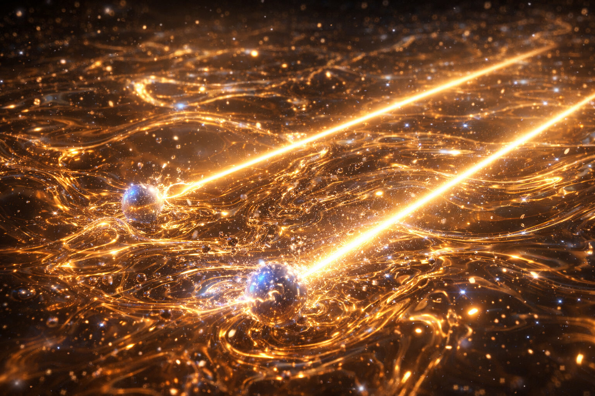
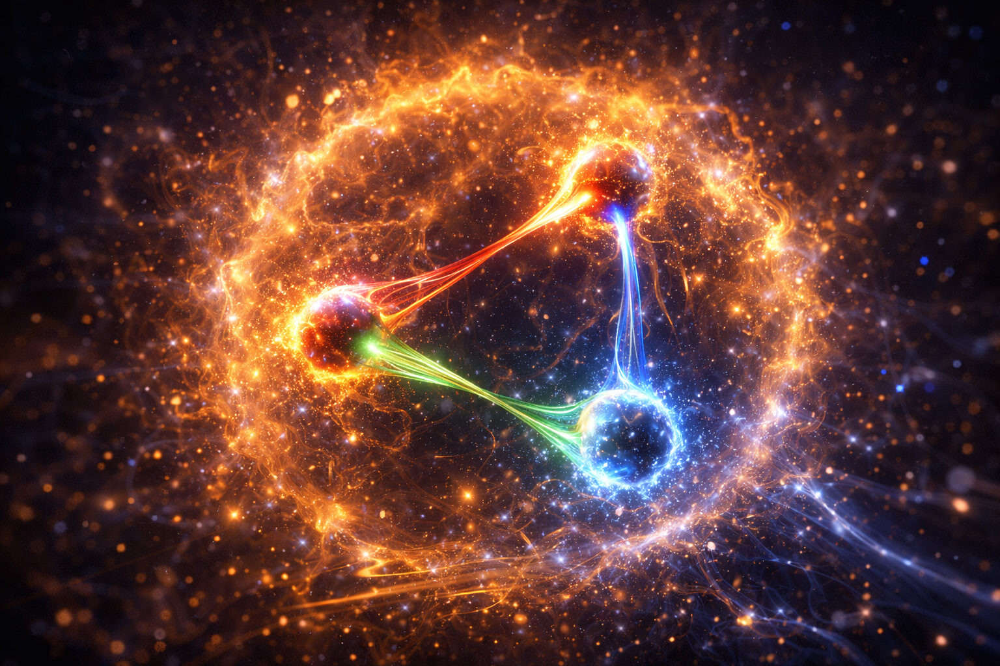
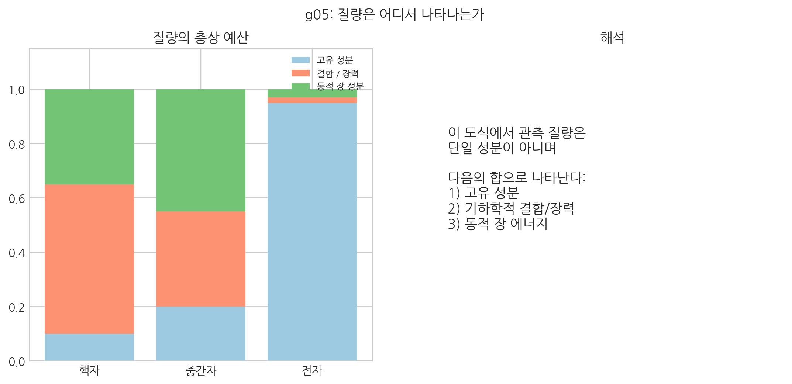
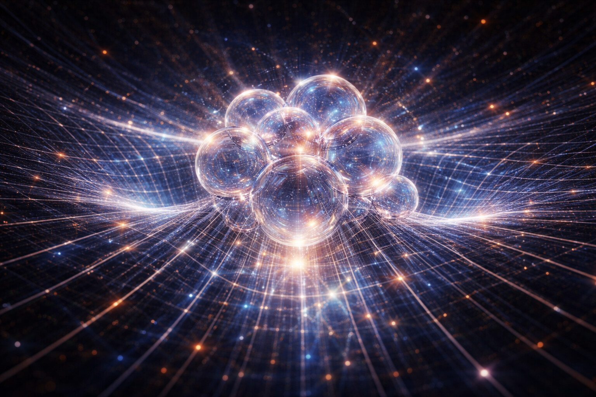

# 03. 질량은 어디서 오는가?

## 거꾸로 흐르는 강물

열역학 제2법칙에 따르면, 우주의 모든 에너지는 무질서한 상태로 퍼져나가야 한다. 뜨거운 커피는 식고, 향수는 방 안으로 흩어진다. 이를 '엔트로피 증가의 법칙'이라 부른다.
즉 02장에서 제기한 "장력 응축의 고정 조건"을, 이 장에서는 질량 형성의 임계 문제로 정면에서 다룬다.

그런데 이상한 점이 있다. 우주의 물질은 흩어지지 않고 오히려 뭉쳐 '물질'이라는 질서를 만든다.

이 질문은 물리학의 오랜 난제였다. 물질은 왜 엔트로피를 거스르고 있는가? 이에 대해 끈이론의 권위자 **에릭 페를린데(Erik Verlinde)**는 어떻게 설명했는지 살펴보자.

::: {.note-evidence}
### 에릭 페를린데의 엔트로피 중력 (2010)

- **경향성의 발견**: 그는 중력을 "엔트로피(정보)가 증가하는 방향으로 공간이 재배열되는 현상"이라고 정의했다. (※ 이후 2016년, 암흑물질 현상을 설명하기 위해 '발현적 중력(Emergent Gravity)'으로 이론을 확장했다.)
- **정보의 역설**: 여기서 '정보가 많다'는 것은 질서 정연하다는 뜻이 아니라, 물리학적으로 **'상태를 설명하는 데 더 많은 상태 기술량이 필요하다(무질서/엔트로피가 높다)'**는 의미이다.
- **SALT의 해답**: 그는 왜 특정 지점에 정보가 집중되는지는 설명하지 못했지만, SALT는 그 지점을 공간의 내부 레이어가 겹겹이 적층된 **'매듭 구조'**로 해석해 본다.
:::

## 빛은 왜 질량이 '0'인가?

물리학의 기본 상태에서 우주의 모든 보셀 매질의 순수한 비틀림 전이(빛)는 질량이 없다. 질량이 없는 비틀림 전이는 태어나는 순간부터 우주 제한 속도인 **'빛의 속도(c)'**로 영원히 달린다.

만약 전자를 구성하는 보셀 꼬임 단위가 공간 격자에 고착되지 않고 빛처럼 순수한 비틀림 전이 상태였다면, 원자핵 주변에 머물지 않고 우주 저편으로 날아가 버렸을 것이다. 보셀 꼬임 단위가 도망가면 안정적인 원자는 만들어질 수 없고, 당연히 별과 생명도 존재할 수 없다.

우주에 '물질(매듭)'이 존재하기 위해서는 공간 격자가 이 보셀 꼬임 단위들의 광속 질주를 늦춰 고착시켜야 했다. 광속으로 달리지 못하게 막아야 비로소 한곳에 머물며 '형체(교차)'를 이룰 수 있기 때문이다.

이 역할을 하는 것이 바로 **힉스 장**이다. 현대 물리학은 우주 전체가 힉스 장이라는 보이지 않는 에너지장으로 채워져 있으며, 입자가 이 장과의 상호작용으로 질량을 얻는다고 본다.

SALT의 관점에서 **힉스 장은 별도의 에너지장이 아니라, 공간 보셀 격자 자체가 가진 '입체 구조적 저항' 그 자체다.** 공간(보셀 격자)은 매끄러운 빙판이 아니라, 입자가 지나가려 할 때 비틀림과 압착에 저항하는 탄성체다.

힉스 메커니즘은 일종의 **'공간의 탄성 한계 시험'**이며, 이 저항을 뚫고 보셀에 매듭이 생기는 순간, 즉 **'소성 고착'**이 일어나는 찰나가 바로 입자가 질량을 획득하는 순간이다.

### 질량 획득의 순간: 자유 전파는 어떻게 구조가 되는가?
보셀이 매듭이 되어 질량을 획득할 때, 보셀의 물리적 상태에는 극적인 변화가 일어난다.

1.  **에너지의 상전이**: 질량이 없는 상태(광자 등)에서 보셀은 순수한 비틀림 전이를 옆 보셀로 전달하며 빛의 속도로 전파된다. 하지만 탄성 한계를 넘어 매듭이 묶이는 순간, 이 전파 에너지의 상당 부분은 매듭 구조를 유지하기 위한 **'구조적 장력'**으로 응축된다.
2.  **스핀의 보존과 구조적 심화**: 입자의 스핀(1/2, 1 등)은 '보셀 매질의 기본 동역학 규격'이므로 유지되지만, 핵심은 회전이 더 빨라지거나 느려지는 데 있지 않다. 독립적으로 전파되던 위상 관계가 입체적인 비틀림 구조 속에 잠겨 더 깊은 내부 응력으로 전환되는 데 있다.
3.  **$E=mc^2$의 실체**: 이 유명한 공식은 바로 '자유롭게 전달되던 에너지($E$)'가 '구조적으로 갇힌 장력($mc^2$)'으로 등가 교환되었음을 의미한다.

따라서 질량이란 공간이라는 매질과 구조적으로 결합하여, 보셀 매질의 동역학이 자유 전파가 아닌 내부 구조 유지로 전환된 상태라고 정의할 수 있다.

- **[검증됨]** 힉스 메커니즘과 핵자 질량의 장 에너지 기여는 표준 이론/실험 축에서 확립되어 있다.
- **[가설]** SALT는 질량을 위상 매듭의 소성 고착으로 해석한다.
- **[예측]** 질량 상태는 임계 조건으로 판별 가능해야 한다.
\[
\sigma>\sigma_c,\qquad W\neq0,\qquad \tau_{\mathrm{relax}}\gg T_{\mathrm{obs}}
\]
용어 구분: \(\rho\)는 진폭, \(n=\rho^2\)는 밀도형 상태량이다.
질량의 성립 판별은 위 임계식으로 두고, 형성된 질량 주변의 흐름 구동력은 후속 장에서 \(-\nabla\mu\) 축으로 연결한다.

::: {.note-theory}
### 왜 '보셀(Voxel)'인가?

- **상태 가변성**: 보셀은 재료가 아니라 상태 단위다. 전달 모드면 빛, 고착 모드면 질량으로 관측된다.
- **동적 매질**: 보셀은 정지 점이 아니라 회전·진동 상태를 갖는 상태 단위다.
- **파동 대 구조**: 보셀 사이로 전달되는 응력 전달이 파동이고, 보셀 자체의 영구 고착이 물질이다.
- **에너지 정의**: 에너지는 외래 물질이 아니라 보셀의 변형 상태(비틀림/압축)로 정의된다.
- **밀도 효과**: 내부 레이어 적층이 커질수록 고착 강도도 커진다. 극한에서는 블랙홀 같은 포화 상태로 이어진다.
:::

::: {.note-theory}
### SALT의 이중성: 파동과 입자가 '함께' 존재하는 메커니즘
"파동이면 알갱이가 없고, 알갱이면 파동이 없다"는 생각은 고정관념이다. SALT는 이를 **TV 화면**과 **도미노** 비유로 설명한다.

1.  **파동성:** 멀리서 보면 도미노 줄이 한 번에 넘어가듯, 빛은 연속된 물결처럼 보인다.
2.  **입자성:** 가까이서 보면 결국 **도미노 한 개가 옆 도미노를 치는 사건**의 연속이다. 이때는 0.5개가 아니라 항상 **1개 단위**가 필요하다. 이것이 광자(양자)다.

**결론: "빛 입자가 보셀 사이를 통째로 달리는 것"이 아니다.**
보셀은 자리에 있고, **위상만 인접 칸으로 전달**된다. 그것이 빛이다.

- **멀리서 보면:** 물결처럼 연속적이다(파동).
- **가까이서 보면:** 한 칸씩 전달되는 신호다(입자).

즉, 입자는 **에너지 전달의 최소 단위**이고, 파동은 **그 단위가 퍼지는 방식**이다. 보셀은 그 과정이 일어나는 **무대**다.
:::

질량의 본질은 이 격자의 **'탄성 한계를 넘었는가, 넘지 않았는가'**의 차이다.

- **빛 (광자) - 탄성 유동**: 보셀 탄성 한계 안에서 일어나는 **비틀림 전달**이다. 빛은 보셀과 분리된 존재가 아니라, 인접 보셀 사이 비틀림이 전달되는 **위상 전달**이다. 보셀 스핀은 전달을 이어주는 복원 장력의 근원이다.
  또 한 시간의 흐름당 1보셀 이상 전달할 수 없으므로, 빛의 속도 \(c\)는 매질 복원력과 시간의 흐름이 정한 **국소 인과 전달 한계**로 나타난다.
- **물질 (전자/쿼크) - 소성 고착**: 탄성 한계를 넘어 공간 구조에 걸린 상태다. 보셀 스핀 에너지가 옆으로 전달되지 못하고, 하나 이상의 보셀이 에너지를 붙잡아 **회전 와류**로 고정된다. 이 고착이 광속 질주에 제동을 걸고, 그 저항이 **질량**이다.

힉스 메커니즘은 입자가 공간 격자에 붙잡혀 존재 상태를 고정/재현하는 **'소성 구간의 닻'**으로 해석할 수 있다.

이렇게 보셀에 꽉 묶인 와류는 한번 형성되면 쉽게 풀리거나 변화하지 않는다. **회전하는 와류가 현재의 운동 상태를 유지하려는 이 '동적 저항성'**을 물리학에서는 **관성**이라 부르고, 그 와류의 총체적인 에너지 규모(고집의 크기)를 **질량**이라 정의한다.

(혼동을 피하기 위해 설명하자면, 여기서의 '저항'은 전기를 방해하는 저항이 아니라 **'회전하는 와류의 입체적 상태 변화를 거부하는 성질(관성)'**을 뜻한다.)

이 관성 덕분에 에너지는 빛처럼 우주로 흩어지지 않고 한곳에 뭉쳐, 우리가 만질 수 있는 **'물질'**이라는 단단한 형태를 유지하게 된다.

::: {.note-theory}
**참고: 배터리와 커패시터 비유로 본 질량**

쉽게 말해, 빛은 **에너지가 지나가는 상태**에 가깝고 질량은 **에너지가 붙잡힌 상태**에 가깝다. 그래서 질량은 커패시터보다 배터리에 더 가까운 비유가 된다.
단, 질량은 화학 배터리와 달리 보셀 격자의 위상 매듭이 만든 **구조적 저장 에너지**다.
:::

 

 

## 저항을 뚫는 힘: 임계점의 돌파

사실 보셀 격자는 본래 비틀림에 저항한다. 이것이 바로 초기 우주의 **'탄성 장벽'**이다. 자연 상태의 공간은 비틀림을 거부하며 밀어낸다.

따라서 질량이 탄생하려면 이 저항을 뚫을 수 있는 **'외부의 압도적인 에너지 주입'**이 필수적이다. 빅뱅과 같은 극한의 고에너지 환경에서 에너지가 공간의 **'탄성 한계'**를 초과하는 순간, 격자는 더 이상 버티지 못하고 **'항복'**하며 구조가 무너지게 된다.

**엔트로피(확산)를 이기는 유일한 힘은, 바로 이 '임계점을 넘은 에너지의 주입'뿐이다.** 공간의 저항을 뚫고 강제로 매듭지어진 에너지는 이제 스스로를 더욱 단단히 움켜쥐며 버티기 시작한다. 이것이 물질이 흩어지지 않고 질량을 유지하는 원동력이다.

## 공간 잠금쇠: 꼬임과 교차

단순히 꼬는 것만으로는 부족하다. 꼬인 **가닥들이 탄성 한계를 넘어 서로 엇갈려 지나가며(교차) 매듭**을 짓는 순간, 질량이 생성된다.

이 상태를 **'소성 맞물림'**이라고 부른다. 가닥들이 물리적으로 서로 맞물려 잠긴 상태다. SALT는 이 상태를 **강력**의 기하학적 실체로 해석한다. 강력은 별개의 힘이 아니라, 보셀 격자가 스스로를 묶어버린 극한의 **'입체 구조적 고착 상태'**다.
여기서 말하는 것은 강력(직접 잠금)이며, 핵력은 이 강력의 바깥에서 나타나는 잔류 유효 결속으로 15장에서 분리해 다룬다.

::: {.note-theory}
**SALT 핵심 요약: 질량 형성의 3단계 공정**
:::

1.  **와류**: 보셀 격자가 중심을 향해 회전하며 꼬이는 동역학 상태.
2.  **적층**: 같은 3차원 위치에서 내부 위상 층이 겹겹이 쌓여 상태 용량을 키우는 과정.
3.  **교차**: 적층된 가닥들이 서로 엇갈려 잠기며 영구적인 매듭(소성 맞물림)을 형성하는 결속 행위.

이 과정을 거쳐 보셀에 꽉 묶인 와류는 한번 회전을 시작하면 쉽게 멈추지 않는다. 이 '회전 유지 본능'이 바로 우리가 아는 **관성**이다.

::: {.note-theory}
**참고:** 같은 임계 원리는 미시 관측에서도 반복된다. 8장에서 다룰 이중 슬릿의 "관측 시 파동→입자 전환" 역시, 관측 상호작용이 국소 응력을 임계치 위로 밀어 올릴 때 발생하는 **탄성→소성 전이**로 같은 축에서 해석할 수 있다.
:::

## 질량은 공간의 매듭이다

힉스장에 의한 2%와 결합 에너지(글루온 장)에 의한 98%. 이 둘을 관통하는 하나의 원리는 무엇인가? 바로 **공간 밀도의 응축**이다.

> 핵심: 질량은 단일 성분이 아니라, 구조적 결속과 동역학이 합쳐져 관측되는 총합으로 읽어야 한다.

SALT는 힉스장을 별도 물질이 아니라, 공간 자체의 **탄성 저항·소성 한계**로 본다. 힉스장과 보셀 매질을 분리할 필요가 없다. 보셀의 비틀림 저항이 임계점을 넘어 잠기면, 우리는 그 상태를 '질량을 가진 입자'라고 부른다.

::: {.note-theory}
**참고: 탄성 저항의 수학적 의미와 상태 전이**

SALT에서 탄성 저항은 보셀 변형에 대한 복원력으로 쓸 수 있다:

\[
F_{elastic} = -k_{eff}\,\xi,\qquad
U_{elastic}=\frac{1}{2}k_{eff}\xi^2
\]

여기서 아래첨자 `elastic`은 탄성(복원) 성분, `eff`는 effective(유효) 값을 뜻한다. \(\xi\)는 보셀의 국소 변형량, \(k_{eff}\)는 유효 강성이다.
변형 응력 \(\tau\)가 임계값 \(\tau_y\)를 넘지 않으면(\(\tau < \tau_y\)) 에너지는 전달 모드(광자)로 흘러가고, 임계값을 넘으면(\(\tau \ge \tau_y\)) 국소 위상 잠금이 발생해 고착 모드(전자/쿼크 씨앗)로 전이된다.
즉 "원래 보셀만 있었다"는 전제와 모순되지 않는다. 전자·쿼크·광자는 별개의 재료가 아니라, **동일한 보셀 매질의 상태(전달/적층/잠금)**를 다르게 부르는 이름이다.
:::

물질은 공간 위에 얹힌 돌멩이가 아니다. **공간 자체가 꼬여 생긴 고정 주름**에 가깝다.

수증기가 물방울, 얼음으로 바뀌듯, 흐르던 공간 에너지도 국소적으로 꼬여 상전이를 거치며 **소성 고착** 상태가 된다.

1.  **힉스 저항**: 탄성 한계를 시험하는 입체적 마찰.
2.  **결합 에너지**: 보셀 가닥이 한계를 넘어 꼬이고 교차하여 영구적 매듭이 된 소성 상태.

우주 공간이라는 밧줄을 세게 비틀어 매듭을 만든다고 생각해보자. 매듭 지점은 **더 두껍고(고밀도), 더 단단해지며(에너지 응축)**, 주변 줄을 팽팽히 당기는 **장력**을 만든다.

 

 

## 중력의 진짜 모습: 와류가 만드는 흐름

지구가 우리를 보이지 않는 힘으로 당기는 것이 아니다. 지구라는 거대한 공간 와류가 주변 공간을 자신의 중심부로 **지속적으로 유입**시키고 있고, 우리는 그 **밀려 들어가는** 공간의 흐름에 이끌려가는 것이다.
중력은 정적인 상태가 아니라, 질량이라는 입체 구조적 매듭이 주변 공간을 끊임없이 변형하며 흡수하는 **능동적인 과정**이다.

호수 물이 배수구로 빨려 들어가듯, 모든 질량은 공간에 **와류 흐름**을 만들고 주변을 끌어들인다. 우리가 '중력장'이라 부르는 것이 이 흐름의 그물망이다.

그런데 이상하다. 전 우주의 공간을 꼬아서 매듭(물질)을 만들 정도라면, 그 힘은 엄청나게 강력해야 하지 않을까? 하지만 현실의 중력은 자석(전자기력) 하나만도 못할 정도로 약하게 보인다.

이 간극을 이해하려면, 우리는 먼저 현미경을 들고 공간의 바닥까지 내려가 보아야 한다.
우리가 지금까지 매끄러운 비단인 줄 알았던 우주의 공간이, 사실은 거칠고 자글자글한 **'보셀(Voxel)'**로 이루어져 있다면 어떨까?

멀리서는 매끈하지만, 가까이서는 계단처럼 끊겨 보이는 보셀의 세계. 중력이 왜 약하게 보이는지 단서가 여기에 있다.

---

다음 장에서는 이 장력망의 기본 단위인 보셀을 분해해, 질량이 형성되는 적층 규칙을 단계적으로 정리한다.

다음 장, **04. 우주의 적층 기술: 물질을 만드는 법**
