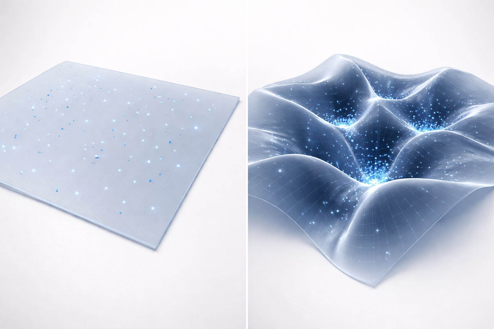
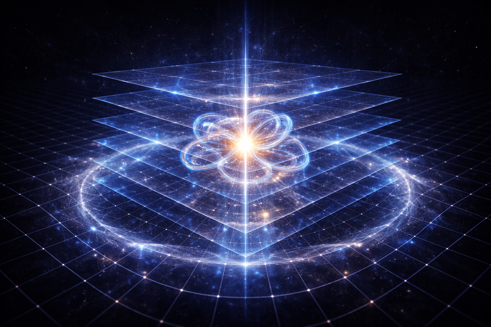
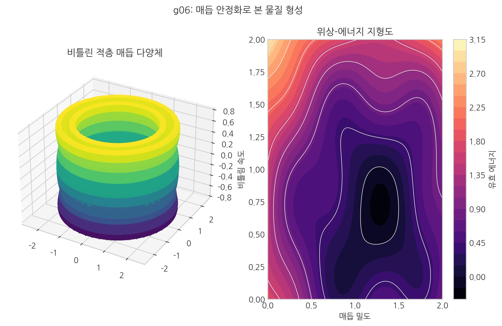

# 04. 우주의 적층 기술: 물질을 만드는 법

이 장은 03장에서 제시한 "질량=공간 매듭" 명제를 실제 적층 규칙으로 풀어 쓰는 구간이다.

## 공간은 왜 입체로만 만족하지 않는가?

우리는 3차원 공간($x, y, z$)에 산다고 느끼지만, 물리적으로 관측 가능한 좌표계는 시간($t$)까지 포함한 **4차원($x,y,z,t$)**이다. SALT는 이 4차원 위에서 공간을 기술한다.

다만 보셀의 실체는 좌표만으로 끝나지 않는다. 각 보셀에는 좌표와 별도로 **내부 상태공간**이 붙어 있으며, 여기서 위상과 적층 정보가 정의된다. 이것이 물질이 왜 파동성과 구조를 동시에 가지는지 설명하는 핵심이다.

정리하면 다음과 같다.

1.  **베이스 좌표 ($x,y,z,t$)**: 우리가 관측하고 측정하는 4차원 시공간 좌표.
2.  **내부 상태(위상 / 층 지칭표)**: 동일한 좌표점에 부착된 보셀의 위상·적층 상태.

포토샵 레이어처럼, 캔버스 좌표는 그대로이고 레이어 값만 달라진다. 즉 \(\theta\)는 새 좌표축이 아니라 **보셀 내부 상태값**이다.

- **[검증됨]** 관측 좌표는 \((x,y,z,t)\) 좌표계에서 기술된다.
- **[가설]** SALT는 적층을 내부 상태공간의 레이어 구조로 해석한다.
- **[예측]** 같은 좌표에서도 레이어 배열 변화가 다른 관측 신호를 만들어야 한다.
정의 고정: \(\rho=|\Psi|\) (진폭), \(n=\rho^2\) (밀도형 상태량).

## 독립변수 간의 함수적 회전

입자의 회전(스핀)은 단순히 제자리에서 뱅글뱅글 도는 바퀴가 아니다. 그것은 바탕 좌표($x,y,z,t$) 위에서 내부 위상($\theta$)이 어떻게 진화하는지로 나타나는 **'상태 동역학'**이다.

예를 들어, 어떤 입자의 상태는 \(f(x,y,z,t;\theta)\)처럼 쓸 수 있다.
- 중요한 점은 \(\theta\)를 좌표축으로 취급하는 것이 아니라, **각 좌표점에 붙은 내부 상태 변수**로 취급한다는 것이다.
- 이 회전의 '기하학적 설계'가 바로 입자의 정체(전자, 쿼크 등)를 결정하는 **위상 회전 무늬**이다.

## 시간 축으로의 투영: 파동의 탄생

가장 놀라운 점은, 이 내부 상태의 진화가 우리가 측정하는 4차원($x,y,z,t$) 좌표계에서 **'파동'**으로 나타난다는 사실이다.

즉 파동은 $x,y,z,t$ 위에서 관측되는 결과이며, 그 원인은 각 점의 내부 위상 상태가 시간에 따라 바뀌는 동역학이다.

- **사인/코사인 곡선**: 내부 위상이 가장 부드럽고 일정하게 진행할 때 관측 좌표계에서 나타나는 기본 파형이다. 우리가 '빛'이나 '기본 파동'이라고 부르는 가장 순수한 형태다.
- **복합 곡선**: 회전이 비선형적으로 일어나거나 여러 축의 상태가 함께 얽히면, 단순한 사인파가 아니라 감쇠되거나 뒤틀린 복합 파형이 나타난다.

결국 파동함수는, 보셀 내부 상태 변화가 우리가 보는 4차원 좌표계에 드러난 결과다.

::: {.note-theory}
**정밀 해설: SALT의 주요 상태 변수 및 매핑**
:::

비유를 넘어선 물리학적 가설로서 SALT는 다음과 같은 **상태 변수**를 통해 정의된다.

1.  **적층 밀도 ($\rho$)**: 보셀 격자 한 점에 내부 위상 레이어가 얼마나 중첩되어 있는지를 나타내는 유효 상태 변수다. 이는 로컬 공간이 수용할 수 있는 '정보 집약도'의 척도이며, **에너지-질량 밀도**에 대응한다.
2.  **보셀 유입 속도장 ($v$)**: 주변 보셀 격자가 고밀도(흡입점) 지점을 향해 이동하는 벡터장이다. 이 흐름의 발산($\nabla \cdot v$)이 음수인 지점이 바로 에너지가 공간에서 적층되는 핵심 지점이다.
3.  **위상 꼬임 지수 ($\Theta$)**: 보셀 내부의 위상 회전 상태를 나타낸다. 이는 전하나 스핀과 같은 양자역학적 성질을 기하학적으로 기술한다.

#### 물리량과의 대응
- **중력 가속도 ($g$)**: 유효 경사도($-\nabla\mu$)가 1차 구동력이며, 저차 근사에서는 적층 밀도의 기울기($-\nabla \rho$)와 유입 흐름의 가속도($dv/dt$)로 나타난다.
- **신호 지연 ($\Delta t$)**: 로컬 적층 밀도($\rho$)가 높을수록 도착 지연이 커진다. 파일 레이어가 많을수록 열림이 느려지듯, 보셀 처리량이 늘면 지연이 누적된다.

이러한 수치적 매핑을 통해 SALT는 단순한 은유를 넘어, 기존 물리학의 측정값들과 정합성을 가진 **테스트 가능한 모델**로 기능한다. 구체적인 동역학 방정식은 24장 `수학적 골격`에서 자세히 다룬다.

---

::: {.note-theory}
**핵심 직관: 왜 물질은 빛과 다른 모양으로 관측되는가?**
:::

공간의 관점에서 보면, 우리가 관측하는 '파동'의 모양은 그 에너지가 보셀에 어떻게 담겨 있느냐에 따라 결정된다.

**①** **빛 (전자기파 - E field)**:
- **형태**: 깨끗한 사인파로 진동한다.
- **SALT 해석**: 공간 보셀이 제자리에서 규칙적으로 흔들리기만 하는 상태다. 보셀에 에너지가 영구적으로 적층되지 않았기 때문에, 측정 장비에는 **공간장의 순수한 떨림**이 그대로 기록된다.
**②** **전자 (물질파 - $|\psi|^2$)**:
- **형태**: 단봉(봉우리) 형태의 확률 분포로 나타난다.
- **SALT 해석**: 보셀들이 같은 위치에서 내부 위상 층을 겹겹이 **적층**하여 매듭을 형성했다. 우리가 관측하는 '확률 봉우리'는 사실 **보셀이 어디에 얼마나 빽빽하게 쌓여 있는지**를 보여주는 **'공간 밀도 지도'**다.
여기서 말하는 확률 분포는 입자가 본질적으로 확률 구름이라는 뜻이 아니라, 관측 대상과 관측 도구가 같은 보셀 매질 영향을 함께 받는 조건에서 나타나는 판독 통계다.

#### 파동의 3단계 사례 연구

동일한 시간축에서 이들의 차이를 비교하면 '적층 기술'의 실체가 더 분명해진다.

- **(A) 단색광**: 끊기지 않는 사인파. 가장 기본 파형이다.
- **(B) 펄스 레이저**: 짧게 나타나는 사인파 묶음. 전자와 비슷해 보여도 내부는 파동 구조다.
- > **[이론] LOST 정리(Lewandowski-Okolów-Sahlmann-Thiemann)**
> 이 정리는 배경 독립 양자기하에서 면적·부피 연산자가 이산값을 가질 수 있음을 보인다. SALT의 '이산 보셀 격자'도 이 **기하의 이산성** 계열과 맞닿아 있으며, 우주 바탕 격자를 연속체가 아닌 이산 격자 단위(Voxel)로 보는 직관에 근거를 준다.
 이는 **질량(적층) 없이** 에너지만 찰나적으로 이동하는 상태다.
- **(C) 전자 파동묶음**: 내부의 사인파 진동은 숨겨지고, 오직 **'적층된 밀도의 봉우리'**만이 핵심 관측량이 된다. 이것은 공간이 단순히 흔들리는 것을 넘어, **공간 자체가 한 덩어리로 묶여** 묵직한 질량의 존재감을 드러내고 있음을 의미한다.

**결국 "전자가 어디에 있는가?"라는 질문은 "보셀의 적층 밀도가 어디에서 가장 높은가?"와 같은 질문이다.**

::: {.note-theory}
**핵심 직관: 힘과 파동의 엔트로피 평행이론**
:::

결국 **힘**이든 **파동**이든, 우주의 모든 현상은 **'적층 밀도'**라는 하나의 뿌리에서 뻗어 나온 결과물이다. 내부 적층이 형성된 공간 매질의 관점에서 보면, 힘과 파동은 엔트로피가 증가하듯 더 낮은 긴장 상태를 찾아가는 공간의 자연스러운 흐름이다.

1.  **힘 - 입체 구조적 고착 상태**: 에너지가 특정 지점에 내부적으로 쌓이며 중첩된 상태이다. 힘이 밀도를 향한 '수직적 파동'의 응집 결과라면, 이것은 우리 눈에는 질서(물질, 별)를 유지하는 힘으로 관측된다.
2.  **파동 - 입체 구조적 이완 과정**: 에너지가 한 지점에 머물지 못하고 이웃한 보셀로 전달되며 흩어지는 과정이다. 이것은 밀도의 '넓이'를 넓히는 '수평적 파동'이며, 우리 눈에는 파동과 신호로 관측된다.

결국 우주의 현상은 공간 밀도 차이에서 나온다. 물질은 그중에서도 파동이 **위상 교차**를 통해 매듭으로 고정된 특수 상태다.

::: {.note-theory}
**정밀 해설: 파동으로 본 적층의 기하학**
:::
>
> SALT에서 물질은 고정된 고체가 아니라, 특정 지점에 결속된 **'수직적 정상파'**이다. 이를 파동 분석 관점에서 정리하면 다음과 같다.
>
> 1. **진폭($\rho$)**: 내부 적층 깊이를 요약하는 상태값.
> 2. **주파수($\omega$)**: 보셀 회전 속도에 대응하는 동역학 변수.
> 3. **공명/관성**: 교차 조건에서 정상파가 고착되고, 위상 이행 저항이 관성으로 나타난다.
>
> **밀도에 따른 파동 변화 (요약)**
> 고밀도 구역에서는 전파 속도 저하(굴절), 진동수 저하(적색편이), 유효 진폭 재분배가 함께 나타난다.
>
> 결국 **물질(질량)**은 내부 적층 구조가 응축된 공간 속에서 우주가 울리고 있는 **'기하학적 공명'** 그 자체이다.

 

 

## 물질의 생사를 결정하는 파동의 간섭

> 핵심: 매듭은 아무 조건에서나 생기지 않는다. 특정 위상·밀도 영역에서만 안정 상태가 형성된다.

앞서 물질을 '기하학적 공명(정상파)'이라 정의했듯이, SALT는 물질의 탄생과 소멸 역시 파동의 **간섭 현상**으로 설명한다. 매듭은 박제된 고체가 아니라, 끊임없이 진동하며 형태를 유지하는 동역학적 시스템이기 때문이다.

- **상쇄**: 만약 외부에서 이 정상파와 정반대 방향으로 회전하는 위상(반입자)이 충돌하면, 보셀의 회전 에너지는 순식간에 **상쇄 간섭**을 일으키며 0으로 돌아간다. 입체적 매듭이 풀리며 에너지가 빛으로 흩어지는 이 현상이 바로 **'쌍소멸'**이다.
- **증폭**: 반대로 같은 위상의 회전 에너지가 주입되어 **보강 간섭**이 일어나면, 와류는 더욱 강화되고 주변 공간의 적층 밀도는 더욱 높아진다. 이것이 입체 구조적 매듭(물질)이 에너지를 흡수하여 질량을 불리는 과정이다.

결국 물질의 존재 여부는 **'공간의 공명 상태'**가 외부 파동과 만나 어떻게 조화를 이루거나 충돌하느냐에 달려 있다.

::: {.note-theory}
**핵심 직관: 입자의 정체를 결정하는 3가지 열쇠: 설계와 가동**
:::

방금 설명한 '공명(정상파)'의 원리를 이해했다면, 이제 전자, 빛, 쿼크 같은 입자들이 어떻게 나뉘는지 궁금해질 것이다. 여기서 흔히 하는 오해는 "회전 속도(주파수)가 입자의 종류를 결정한다"고 생각하는 것이다. 하지만 SALT에서 입자의 정체는 **'회전 속도'**가 아니라 **'입체적 구조(설계)'**에 의해 결정된다.

자동차에 비유하면 더 쉽다.

1.  **스핀(회전 대칭) — "차종의 설계도"**:
    차종이 차를 가르듯, 스핀이 입자 종류를 가른다. 360° 한 바퀴면 **스핀 1(광자)**, 720° 두 바퀴면 **스핀 1/2(전자)**다.

2. **전하(구조적 완결성) — "부품 조립 상태"**:
    전하는 구조가 얼마나 닫혔는지를 보여준다. 전자는 위상이 닫힌 '완성차(+1, -1)', 쿼크는 일부만 닫힌 '미완성 부품'에 가깝다.

3.  **주파수/진폭(가동 속도) — "동역학 속도"**:
    정해진 차종(스핀/전하)이 **얼마나 세게 가동되는가**를 나타낸다.
    여기서 중요한 것은 회전 속도(주파수)가 높아진다고 해서 레이어가 합쳐지거나 뭉개지지 않는다는 점이다.
    각 레이어는 자신만의 고유한 진동수를 유지하며 독립적으로 활동하고, 이 레이어들이 층층이 쌓인 **'적층의 수(진폭)'**가 전체 에너지 규모를 결정한다.
    즉, 주파수는 독립된 층들의 '질서'를 담당하고, 진폭(\(\rho\))은 상태 세기를, 밀도형 상태량(\(n=\rho^2\))은 효과량의 무게감을 담당한다.

::: {.note-theory}
**참고: 보셀 레이어의 표준 규격 ($r=1$)**

각 레이어가 독립 상태를 유지하도록, SALT는 모든 레이어의 반지름(진폭)을 **단위 원($r=1$)**으로 표준화한다. 그래서 보셀은 진폭 크기보다, 표준 레이어가 몇 층 쌓였는지로 밀도($\rho$)를 정한다. 이산 상태들이 결합해 더 큰 효과량을 만드는 구조와 비슷하다.
:::

결국 **파동함수($\Psi$)**는 [차종 × 부품 상태(위상) × 동역학 속도] 정보를 담은 **상태 기술 묶음**이다. 우리가 주기·진폭·주파수·절편을 보는 이유도 입자의 설계와 가동 상태를 읽기 위해서다.

::: {.note-theory}
**정밀 해설: 수학적 복선: 왜 파동함수에는 허수 $i$가 붙는가?**
:::
> 슈뢰딩거 방정식의 에너지 항 옆에는 항상 허수 단위 \(i\)가 붙는다. \(i\)를 곱한다는 것은 수학적으로 **90도 회전**이다. 즉 파동함수는 에너지를 단순한 양이 아니라 회전·요동 상태로 다룬다. SALT의 밀도(적층)와 스핀(회전) 결합도 이 구조와 맞닿는다.

 

## 왜 자연은 회전을 선택했는가?

여기서 한 가지 근본적인 질문이 남는다. 우리는 보셀이 회전하기 때문에 매듭이 생기고, 매듭의 회전이 상쇄되면 물질이 사라진다고 했다. 그렇다면 대체 **왜 보셀은 회전하는가?**

이 질문에 답하기 전에, 먼저 인정해야 할 사실이 있다. **모든 물리 이론에는 더 이상 '왜?'로 파고들 수 없는 기저 공리가 존재한다.**

- **뉴턴 역학**: 만유인력 상수 G는 왜 $6.674 × 10^{-11}$인가? — 답 없음. "그냥 그 값이다."
- **양자역학**: 플랑크 상수 ℏ는 왜 $1.055 × 10^{-34}$ J·s인가? — 답 없음. "측정하니 그렇다."
- **표준모형**: 전자의 질량은 왜 정확히 0.511 MeV인가? — 답 없음. "실험값을 대입한다."

이 상수들의 정확한 값은 이론이 설명하는 것이 아니라, 이론이 출발하기 위해 **전제해야 하는 것**이다. 위대한 이론일수록 전제가 적고, 그 적은 전제로부터 많은 현상을 설명해낸다.

SALT 역시 하나의 기저 공리를 갖는다: **"공간의 최소 단위인 보셀은 회전체이다."**

흔히 하는 오해는, 은하의 나선형 팔에서 태풍의 소용돌이까지, 배수구에 빠지는 물의 와류에서 전자의 스핀까지, **자연은 모든 스케일에서 회전과 소용돌이를 선호한다**는 관찰을 별개 원인으로 분리해 보는 점이다.
기존 물리학은 이 각각의 소용돌이를 서로 다른 원인(중력, 유체역학, 양자역학)으로 개별 설명한다.
하지만 SALT는 이 보편적 경향성에 대해 하나의 근본적 답을 제시한다.
**공간의 최소 단위가 회전체이기 때문**이라는 해석이다.
거시 세계의 소용돌이는 미시 세계 보셀 회전이 매질을 타고 증폭된 **거시적 반향**일 수 있다.

그렇다면 왜 보셀은 회전해야만 하는가? 여기에 대해 SALT는 다음과 같이 추론한다.

**정지(靜止)는 존재의 부재(不在)이다.** 에너지가 0인 상태는 곧 아무것도 없는 상태이다. 3차원 공간에서 에너지를 가진 채 '존재'를 유지하는 방법은 이론적으로 여러 가지가 있다.

| 운동 양식 | 설명 | 국소적 존재 유지 | 에너지 보존 | 3차원 점유 | 매듭 형성 |
| :--- | :--- | :---: | :---: | :---: | :---: |
| 정지 | 에너지 0 | o | x | x | x |
| 직선 운동 | 한 방향 이동 | x | o | x | x |
| 1차원 진동 | 한 축 왕복 | o | o | x | x |
| 정상파 | 간섭으로 고정된 진동 패턴 | o | o | △ | x |
| 솔리톤 | 형태를 유지하는 파동 뭉치 | o | o | △ | x |
| 맥동 | 팽창·수축 반복 | o | o | o | x |
| **회전** | **제자리 회전** | **o** | **o** | **o** | **o** |

진동이나 맥동 역시 일시적으로 공간 위에 머무를 수 있다.
빛(진동)도, 중력파(맥동)도 존재한다.
하지만 이들은 에너지가 새어나가면 금세 사라진다.

오직 **회전**만이 가닥을 서로 엇갈리게 엮어 **'소성 맞물림'** 상태를 만들 수 있으며, 이 **'위상학적 매듭'**만이 에너지 손실에도 풀리지 않는 **위상적 안정성**을 갖는다.
태풍은 공기라는 매질이 회전할 때만 존재하며, 회전이 멈추는 순간 사라진다.
보셀도 마찬가지다. 회전이 곧 존재이며, 정지는 곧 소멸이다.

### 자연 발생적 회전

여기서 한 걸음 더 들어가 보자. 진동, 정상파, 맥동이 회전과 별개인 것처럼 보이지만, 보셀 격자의 수준에서 들여다보면 이야기가 달라진다.

보셀은 점이 아니라 3차원 세포이다. 이 세포가 할 수 있는 기본 동작은 **꼬임**, 즉 회전뿐이다. 보셀은 단순한 알갱이가 아니라, 스스로 회전하거나 진동하는 **'공간 매질의 상태 단위'** 그 자체이기 때문이다. 보셀에게는 '압축'이나 '팽창'이라는 별도의 자유도가 없다.

결국 **보셀 수준에서 모든 운동은 '회전'으로 환원된다.** 3차원 밀도 매질에서 밀도 차이는 각운동량 보존에 의해 필연적으로 회전을 유발한다. 하지만 이 회전은 단순한 물리적 '움직임'이 아니다. 그것은 보셀 매질이 질량과 실체를 **'구분해 고정/재현'**하기 위해 수행하는 **기본 동역학 상태**다.

**"회전이 멈추는 순간 질량 생성이 멈추고 이것과 저것을 구분할 수 없는 무색(無色)의 상태로 들어간다."**

텅 비어 보이지만 세상은 모두 보셀로 가득 차 있으며, 이 보셀들의 회전 밀도차에 의해 빛의 속도조차 결정된다. 보셀의 회전(스핀)이야말로 우주가 '무(無)'의 바다에서 '유(高)'의 형상을 빚어내는 최초의 붓질인 셈이다.

### 관성: 와류 구조의 기계적 복원력

회전이 존재의 기반이라면, '관성'은 그 회전이 상태를 유지하려는 기계적 본성이다. 뉴턴이 "물체는 현재의 운동 상태를 유지하려 한다"고 했을 때, 그것은 관찰된 현상이었지 '왜'에 대한 설명은 아니었다. SALT는 이를 다음과 같이 해석한다.

1.  **동적 평형**: 질량(와류 매듭)은 보셀 격자 내에서 회전 에너지와 공간 장력이 균형을 이룬 '동적 평형 구조'다.
2.  **각운동량 보존**: 와류는 각운동량 보존 법칙에 의해 스스로의 회전 축과 강도를 유지하려는 본성을 가진다. 이 회전 자체가 에너지를 외부로 흩뿌리지 않고 한곳에 묶어놓는 가장 효율적인 방식이기 때문이다.
3.  **상태 유지의 관성**: 물체가 이동하거나 정지해 있다는 것은 이 '와류 패턴'이 보셀 격자를 따라 전파되는 속도를 의미한다. 외부에서 힘(텐션)을 가해 이 와류의 회전 상태나 전파 속도를 바꾸려 하면, 와류 구조는 내부의 안정적인 회전 모드를 유지하기 위해 저항한다. 이것이 우리가 경험하는 '관성의 저항'이다.

결국 관성은 우주가 가진 어떤 신비로운 성질이 아니라, **회전하는 와류 구조가 자기 운동성을 가장 효과적으로 유지(각운동량 보존)하려는 기계적 복원력**의 결과물인 셈이다.

그런데 여기서 한 가지 더 근본적인 질문이 가능하다. 회전은 정말 자연의 근본 공리인가, 아니면 회전의 이면에 또다른 원인이 존재하는가?

자연을 관찰하면 명확한 패턴이 보인다:

- **태풍**: 해수면 온도 차이 → 기압 차이 → 공기 유입 → 코리올리 효과로 **회전 발생**
- **은하**: 밀도 요동 → 중력 수축 → 각운동량 보존 → 나선형 **회전 발생**
- **배수구**: 수압 차이 → 물 유입 → 초기 비대칭 → **소용돌이 발생**

공통점은 무엇인가? **3차원 공간에서 밀도가 다른 두 영역 사이에 흐름이 생기면, 아무리 미세한 비대칭이라도 그 흐름은 직선을 유지하지 못하고 나선형으로 말려 들어간다.** 즉 모든 현상에서 발생하는 회전은 각운동량 보존에 의한 자연적 필연이다.

SALT에서 공간은 보셀이라는 밀도를 가진 매질이다. 이 매질에 밀도 차이가 존재하는 한, 흐름은 직선을 유지할 수 없고 위상 회전이 발생할 수밖에 없다. 따라서 보셀의 회전은 외부에서 주어진 명령이 아니라, **밀도를 가진 3차원 공간이 흐를 때 피할 수 없는 입체적 귀결**이다.

다만 한 가지 고정관념은 버려야 한다. 공간은 딱딱한 벽돌이 아니다. 보셀은 꽉 찬 고체라기보다, 상태가 바뀔 수 있는 **에너지 칸**에 가깝다.

이 가변성 때문에 공간은 밀도 차이에 반응해 소용돌이칠 수 있다. 그리고 그 소용돌이가 스스로를 묶어 매듭이 되면 우리가 아는 물질이 된다. 즉 흐르는 상태가 고정 상태로 바뀌는 상전이다.

### 태풍과 질량: 닮았지만 다르다

태풍은 보셀의 회전을 이해하기 위한 좋은 출발점이지만, 핵심적인 차이가 존재한다.

태풍은 **열린 시스템**이다. 아래에서 공기를 빨아들이고 위로 내보낸다. 그래서 태풍은 공기를 **통과시키는 파이프**에 가깝다.

질량(보셀 매듭)은 **닫힌 시스템**이다. 보셀 매듭은 주변 공간의 장력을 빨아들이지만, 물질을 통과시키지 않는다. 그 대신 매듭이 만들어낸 위상 회전 긴장이 격자를 따라 바깥으로 전파된다. 이것이 바로 우리가 관측하는 **전자기 복사(빛, 열)**, **중력장**, 그리고 블랙홀의 경우 **호킹 복사**이다.

| | 태풍 | 질량 (보셀 매듭) |
| :--- | :--- | :--- |
| **흡입하는 것** | 공기 (물질) | 공간의 장력 (위상 회전) |
| **방출하는 것** | 공기 (같은 물질을 위로) | 전자기파, 중력장, 열복사 |
| **내부** | 텅 빈 눈 | 극고밀도 매듭 |
| **구조** | 열린 순환 (물질이 통과) | 닫힌 매듭 (장력만 전파) |

태풍의 눈이 텅 비어 있는 것은 물질이 **통과하기 때문**이고, 질량의 중심이 초고밀도인 것은 위상 회전이 통과하지 않고 그 자리에서 **꼬여서 잠겨버렸기 때문**이다.

 

## 연결된 우주: 단 하나의 장력망

우리는 이제 중요한 결론에 도달한다. 이 모든 매듭(질량)들은 서로 떨어져 있지 않다. 모든 매듭은 **공간이라는 단 하나의 거대한 꼬임과 풀림의 장력망** 위에 엮여 있는 '연결된 존재'다.

거미줄 한 매듭을 당기면 전체가 팽팽해지듯, 모든 질량은 만든 **입체 응집력**을 연결된 공간 천으로 바깥에 전달한다. 외부 물체는 이 **유효 경사도(\(-\nabla\mu\), 저차 \(-\nabla\rho\))**를 따라 중심으로 미끄러진다. 뉴턴이 '원격 작용'으로 고민한 현상의 SALT 해석이다.

SALT가 제시하는 구체적인 실험적 예측과 검증 방법은 17장 `SALT의 미래예측과 첨단기술`의 `검증 가능한 예측들` 섹션에서 자세히 다룬다.

---

::: {.note-theory}
**최종 정리: 본질은 하나, 발현은 여럿**
:::

이 장을 관통하는 가장 중요한 통찰은 이것이다. **SALT 해석에서는 우주의 모든 관측 현상을 '보셀'이라는 단일 근본 재료의 상태 변화로 기술한다.**

전자, 쿼크, 빛은 서로 완전히 다른 재료가 아니라 같은 기반의 다른 상태다. 디지털 화면에서 색이 달라도 픽셀 자체는 같은 것과 비슷하다.

- **물질은 '명사'가 아니라 '동사'이다.**
    우리는 사물을 '전자'라는 이름표를 붙인 명사로 보려 하지만, SALT의 관점에서 그것은 **'보셀이 꼬여서 쌓여 있는 상태(동사)'**를 지칭하는 말이다. 질량은 같은 4차원 관측 좌표에서 내부 상태가 적층되어 에너지를 가둔 '사건'이며, 중력은 그 사건이 주변 보셀 격자에 전파된 '영향'이다.

결국 우주의 존재는 보셀이라는 한 기반에서 나온 다양한 파동 상태다. 겉으로는 달라 보여도 바탕은 하나다.

---

다음 장에서는 이 연결된 장력망이 사건적으로 흔들릴 때 어떤 신호가 생기는지, 즉 우주를 가로지르는 중력파의 관측 언어로 넘어간다.

다음 장, **05. 공간은 정말로 흔들리는가? (중력파)**
