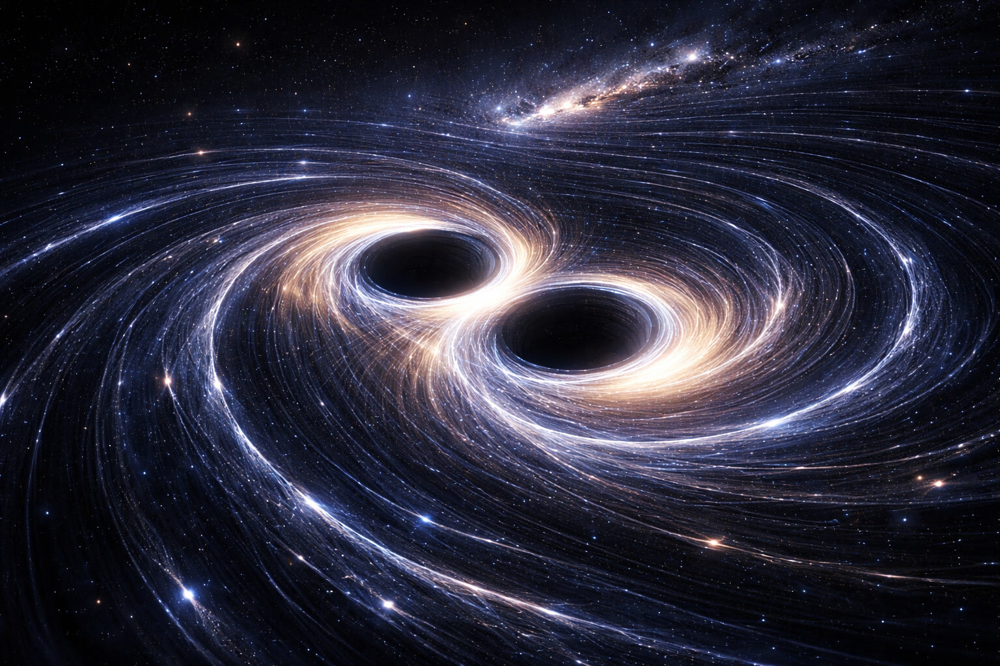
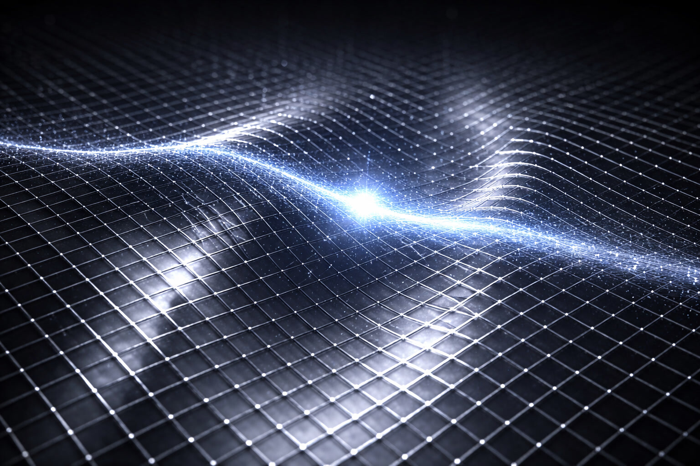
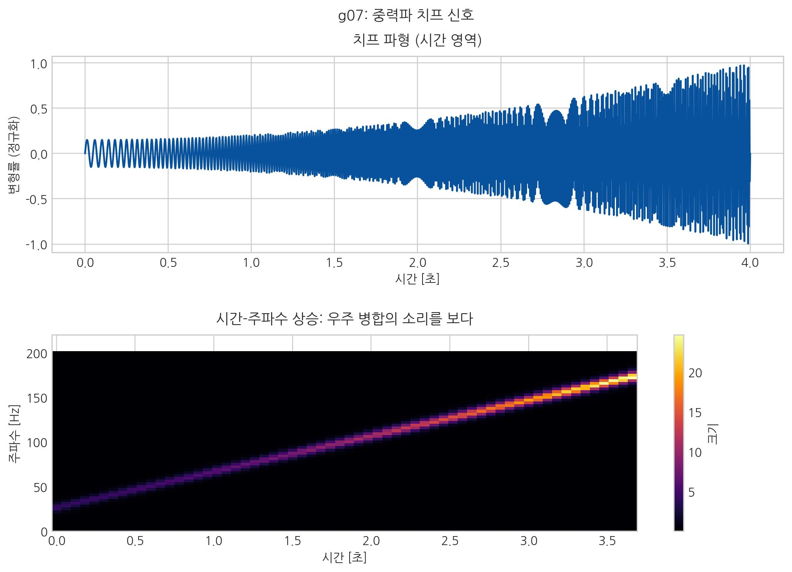
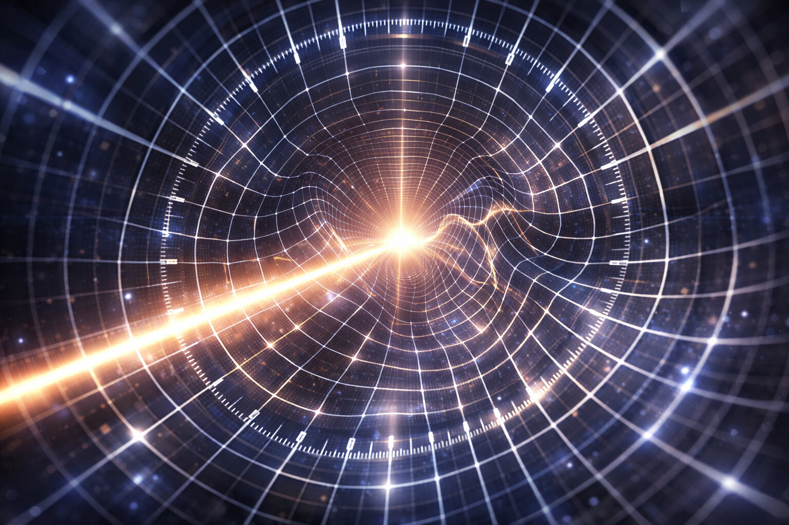
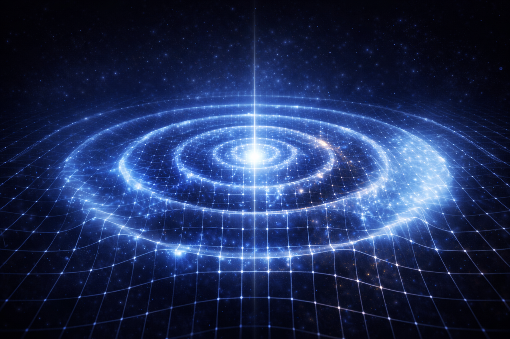

# 05. 공간은 정말로 흔들리는가? (중력파)

## 우주가 지른 비명

앞장에서 확인했듯 우주는 하나의 연결된 장력망이므로, 이 장에서는 그 장력망 자체가 요동할 때 어떤 신호가 나타나는지 추적한다.
즉 04장에서 정리한 "매듭과 유효 경사도의 연결망"이 시간적으로 흔들릴 때, 관측 채널에 어떤 파형으로 남는지를 묻는다.

- **[검증됨]** LIGO/Virgo 검출은 중력파 관측 사실을 확립했다.
- **[가설]** SALT는 이를 공간 매질 요동의 직접 관측으로 해석한다.
- **[예측]** 주파수·파형·지연 채널에서 표준 해석 대비 잔차 구조가 검증 가능해야 한다.

| 구분 | 관측 사실 (검증) | SALT 해석 (가설) |
| :--- | :--- | :--- |
| 사건 | GW150914 신호 검출, 블랙홀 병합 파형 일치 | 공간 매질의 국소 장력 요동이 직접 기록된 사례 |
| 에너지 | 질량 결손(약 태양 3개분) → 파동 에너지 방출 | 결손 에너지가 보셀 격자 변형(밀도 파동)으로 전환 |
| 검증축 | 파형/주파수/도달시간의 다중 검출 정합 | 동일 채널에서 잔차 구조가 나오면 해석력 강화 |

2015년 9월 14일, 인류는 처음으로 중력파 신호를 직접 잡았다. 미국의 두 라이고(LIGO) 검출기가 0.1초 남짓한 미세한 떨림을 기록했다.

이것은 13억 년 전 지구로부터 13억 광년 떨어진 곳에서 두 개의 거대한 블랙홀이 서로를 휘감으며 충돌했을 때 퍼져 나온 **중력파**였다.

 

 

이 발견은 우주 관측 방식 자체를 넓혔다. 우리는 오랫동안 빛(전자기파)으로만 우주를 봤지만, 이제는 중력파 신호까지 읽게 됐다.

::: {.note-theory}
**근거: 중력파 발견의 관측 근거**

- **LIGO 중력파 최초 검측 (2015)**: 두 블랙홀이 충돌하며 발생한 **공간**의 떨림을 지구에서 직접 검출했다. 이는 **공간**이 단순한 수학적 좌표계가 아니라, 에너지를 전달하고 진동할 수 있는 **물리적 실체**임을 증명한 역사적 사건이다.
:::

## 사라진 태양 3개

이 사건(GW150914)의 수치를 자세히 들여다보면 등골이 서늘해진다. 충돌한 두 블랙홀의 질량은 각각 태양의 36배, 29배였다. 상식적으로 이 둘이 합쳐지면 태양 65배 질량의 블랙홀이 되어야 한다.

하지만 합쳐진 최종 블랙홀의 질량은 태양의 62배였다. **태양 3개 분량의 질량이 눈 깜짝할 사이에 증발해버린 것이다.**

이 엄청난 질량은 어디로 갔을까? E=mc²에 따라, 사라진 질량은 순수한 에너지로 변환되었다.

그 에너지는 폭발이나 빛이 아니었다. 그것은 **공간 자체를 뒤흔드는 밀도의 파동**으로 변해 전 우주로 퍼져 나갔다. 태양 3개를 0.1초 만에 태워버릴 만큼의 막대한 에너지가 오직 '공간을 구기고 펴는 데' 쓰인 것이다.

## 공간은 '딱딱한' 젤리다

파동이 있으려면 매질이 필요하다. 소리는 공기, 파도는 물이 필요하다. 그렇다면 중력파는 어떤 매질을 타고 오는가?

아인슈타인은 에테르를 폐기했지만, 역설적으로 일반상대성이론은 공간 그 자체에 **'단단함'과 '탄성'**이라는 물성을 부여했다.

**공간 매질**은 매우 단단하고 탄력적인 매질로 해석할 수 있다. 쉽게 말해 극도로 뻣뻣한 격자에 가깝다.

태양 3개 분량의 에너지가 들어가도 흔들림은 원자핵 지름의 극히 일부 수준이다. 그만큼 공간의 강성이 크다는 뜻이다.

 

 

::: {.note-theory}
**정밀 해설: 왜 중력파는 거대 사건에서만 발생하는가?**
:::
>
> 보셀 매질은 우주에서 가장 '뻣뻣한' 재질로, **높은 임피던스(저항성)**를 가진다.
>
> 1.  **정적 압축**: 질량(매듭)이 보셀 매질의 유효 경사도($-\nabla\mu$, 저차 근사 $-\nabla\rho$)를 형성하여 주변 공간의 흐름을 유도하는 상태. 이것이 우리가 느끼는 **정적인 중력**이다.
> 2.  **동적 진동**: 파동이 생기려면 보셀 압축 상태가 시간에 따라 크게 흔들려야 한다. 보통 사건으로는 이 강한 매질을 거의 흔들지 못한다.
> 3.  **임피던스 문턱**: 거대한 질량이 빛에 가까운 속도로 요동칠 때만, 비로소 보셀 매질은 그 에너지를 다 소화하지 못하고 주변으로 **'상태 전이 에너지의 누출'**을 내보낸다. 이것이 중력파이다.

> **"전자기파가 무대 위 움직임이라면, 중력파는 무대 바닥 자체의 진동에 가깝다."**

::: {.note-theory}
**참고: 중력파와 '중력자' 질문에 대한 SALT 입장**
SALT는 중력을 우선 **공간 밀도·위상의 유효 경사도 상태(흐름)**으로 다룬다.  
중력파는 그 상태가 사건적으로 요동할 때 나타나는 **동적 전파 양식(파동)**이다.  
즉, SALT의 기본 해석 틀은 "중력자 교환"보다 "상태(기울기)와 전파(파동)"의 구분에 있다. 자세한 문답은 18장 질의응답과 13장의 흐름 대 파동 해설을 함께 보라.
:::

### 1. 파동의 해부학: 공간이 흔들리는 두 가지 방식

우리가 자연계에서 관찰하는 파동은 진동 방향과 진행 방향의 관계에 따라 크게 두 가지로 나뉜다.

1.  **종파** : 매질의 진동이 에너지의 진행 방향과 **평행**하다. 앞뒤로 밀고 당기며 동적인 밀도 변화를 만든다. (예: 소리, 지렁이의 움직임)
2.  **횡파** : 매질(혹은 장)의 진동이 진행 방향과 **수직**이다. 전자기파(빛)와 중력파가 여기에 속하지만, 그 흔들림의 '차원'이 다르다.

::: {.note-theory}
**핵심 직관: 세 가지 파동의 정면 모습**
:::

파동이 나에게 다가오는 **정면**에서 바라볼 때, 그 위상학적 차이가 명확해진다.

| 파동 유형 | **종파 (스핀 0)** | **전자기파 (스핀 1)** | **중력파 (스핀 2)** |
| :--- | :--- | :--- | :--- |
| **대표 사례** | 소리, 초음파 | 빛, 라디오파 | 블랙홀 충돌의 여파 |
| **정면 모습** | **알 수 없음** (관측 불가) | **원형 궤적** (화살촉 회전) | **형태 변형** (훌라후프 숨쉬기) |
| **비유** | 지렁이의 꿈틀거림 | LED가 달린 회전 화살 | **모양이 변하는 훌라후프** |
| **속성** | 매질의 밀도 소밀 | **공간 매질 내** 위상 비틀림 | **공간 매질 자체**의 팽창/수축 |

### 훌라후프 비유: 공간 변형 직관
>
> - **스핀 1 (빛)**: 회전하는 화살 끝의 불빛 궤적처럼, 전달되는 것은 주로 위상 회전 정보다.
> - **스핀 2 (중력파)**: 날아오는 훌라후프의 **테두리 자체가 늘었다 줄었다** 하듯, 매질의 길이 척도 자체가 변형된다.

### 왜 중력파는 모든 것을 통과하는가?
> 전자기파(빛)는 보셀의 표면 위상 중심으로 전달되고, 중력파는 보셀의 부피/간격 자체를 흔든다. 그래서 중력파는 큰 에너지를 담고도 물질을 깊게 통과할 수 있다.

### 2. 가장 근원적인 파동: 탄성과 소성의 대화

모든 파동과 입자는 **공간 보셀**의 변형이 전파되는 방식의 차이일 뿐이다.

- **빛 (스핀 1) - 높은 탄성 전달**: 보셀의 꼬임(에너지)이 다음 보셀로 **손실이 매우 작게 전달**된다. 지나간 자리에 영구 변형을 거의 남기지 않기에 질량이 없으며, 우주의 최고 속도($c$)로 달린다.
- **물질 (스핀 1/2) - 소성 결함**: 꼬임 패턴이 복잡해(스핀 1/2) 한 바퀴로 원위치하지 못한다. 전달이 불완전해 보셀에 **탄성 이력**이 남고, 그 잔여 에너지가 소성적으로 고착된다. 양성자 질량의 상당 부분이 글루온 장 에너지라는 관측도 이 해석과 맞닿는다.

**"입자는 공간 탄성이 남긴 '영구 흔적'이며, 매듭이 스스로 조여져 유지되는 저항 상태다."**

::: {.note-theory}
**참고: 왜 입자는 주변 공간을 '당기는가'?**

이는 입자가 능동적으로 힘을 발휘하는 것이 아니다. 열역학 제2법칙(엔트로피 증가)에 의해 우주 전체의 보셀들은 밖으로 팽창하려는 힘을 받는다. 이때 내부에 꼬여있는 **매듭(입자)**은 밖에서 당길수록 그 위상적 특성상 안으로 더 강하게 조여지며 주변 보셀들을 팽팽하게 고정시킨다. 이것이 바로 우리가 '중력적 인력'으로 오해하는 밀도 형성의 본질이다.
:::

**"그렇다면 빛은 유일하게 공간을 흔들지 않고 스쳐 지나가는 존재인가?"**

엄밀히 말하면 빛(광자) 역시 공간 보셀의 요동이지만, 물질과는 핵심적인 차이가 있다. 물질이 공간을 **'비틀어 묶어버린 매듭'**이라면, 빛은 매듭 없이 공간의 결을 따라 흐르는 **'나선형 파동'**이다.

물질 매듭은 공간 밀도를 바꿔 '자의 눈금'을 변형시키지만, 빛은 공간 결을 덜 방해하는 **유선형 구조**를 가진다. 그래서 공간 점성에 거의 걸리지 않고 보셀 매질의 국소 인과 상한인 **광속 \(c\)**으로 진행한다. 빛은 자를 바꾸는 존재가 아니라, 공간 매질이 허용하는 가장 빠른 신호다.

하지만 **중력파는 보셀 부피 자체가 수축·팽창하는 텐서 변형**이다. 전자기파가 보셀의 '표면 꼬임'을 전달하는 것이라면, 중력파는 보셀의 '부피 밀도' 변형을 전달하는 더 근원적인 파동이다.

### 3. 핵심 지표
물질과 파동(중력파)은 서로 뗄 수 없는 관계지만, 핵심적인 차이가 있다.
- **물질**: 공간의 탄성($G$)에 **종속**되어 움직이는 존재다.
- **중력파**: 공간의 탄성($G$) 그 자체를 **뒤틀어** 그 물성을 드러내는 현상이다.

따라서 중력파는 **공간이라는 매질**의 '숨겨진 물성'을 정밀 추정할 수 있는 핵심 창문이다.

## 우주의 악기

> 핵심: 시간축 파형과 시간-주파수 치프를 함께 보면, "우주의 사건"이 어떻게 신호로 읽히는지 직관적으로 보인다.

결국 중력파는 '먼 폭발의 소리'라기보다, 공간 자체가 동적으로 변형된 기록이다. 우리는 그 변형을 신호로 읽는다.

이제 우리는 **공간**이 떨릴 수 있다는 것을 알았다. 그렇다면 이 떨림이 한계를 넘으면 무엇이 될까? 놀랍게도 그 떨림이 **탄성 한계를 초과하여 무늬가 깨지고 서로 엉켜버릴 때**, 그것이 바로 우리 자신, **물질**이다.

## 무엇이 흔들렸는가?

공간은 '좌표'이기 때문에 모든 것의 위치를 파악하는 객관적 기준이 된다. 하지만 SALT는 그 기준이 되는 **'자의 길이' 자체가 줄어들었다 늘어났다 하는 현상**을 다룬다. 그런 상상하기 힘든 상황이 실제로 존재한다는 가정하에서 말이다.

중력파가 지나갈 때 라이고의 두 팔(각 4km) 길이는 서로 반대 방향으로 아주 미세하게 변한다.

중력파가 지나가는 순간 한쪽은 늘고 다른 쪽은 줄어든다. 핵심은 공기나 금속이 먼저 흔들린 게 아니라, **거리 자체의 기준**이 순간적으로 달라진다는 점이다. 자 눈금이 아주 잠깐 늘었다 줄었다고 보면 된다.

 

 

엄밀히 말하면, **같은 밀도 공간 안에 있는 관찰자는 그 변화를 눈치챌 수 없다.** 공간이 줄어들면 그 안의 자도 함께 줄어들기 때문에, 내부에서는 4km가 여전히 4km로 측정된다. 왜냐하면 기준(자)과 실제 거리가 함께 변하기 때문이다.

하지만 **밀도가 다른 외부의 공간에서 바라본다면**, 그 공간은 물리적으로 압축되거나 확장되어 보인다. 우리가 중력파를 검출할 수 있었던 것도, **빛(광속, Speed of Light)**이라는 불변의 기준이 있었기에 찰나의 순간 스쳐 지나가는 공간 와류 에너지의 미세한 밀도 변화를 비교할 수 있었던 것이다.

앞서 우리는 시간을 독립 실체로 늘리는 그림보다, **공간 상태 변화와 전달 지연**으로 해석하는 틀을 채택했다. 중력파는 바로 이 **공간 와류의 동역학적 진동**이다. 중력파가 훑고 지나가는 순간, 우리 몸을 포함한 모든 물질과 공간의 밀도가 아주 미세하게 높아졌다 낮아졌다를 반복한다.

이것은 단순한 위치 이동이 아니라, 공간 매질의 밀도가 눌렸다 풀리는 파동이다.

 

 

우리가 서 있는 이 공간은 텅 빈 허공이 아니라, **공간 밀도**의 미세한 떨림이 정보를 전달하는 매질이다.

## 질문하는 공간: "공간을 박스에 담을 수 없다면, 대체 어떻게 압축하는가?"

우리는 '압축'을 연료탱크에 가스를 넣는 장면으로 떠올리기 쉽다. 하지만 공간은 성질이 다르다. 여기서 핵심 질문이 나온다.

**"공간이 압축된 것이 밀도라면, 우리가 그 공간을 어떤 케이스나 박스에 담을 수 있어야 압축이 가능하지 않은가? 하지만 공간은 그 무엇으로도 가둘 수 없다. 연료탱크가 아무리 고압이라 해도, 그것은 공간 안에서의 위치일 뿐 공간 자체가 풍선처럼 압축되는 건 아니지 않은가?"**

SALT는 이 모순을 해결하기 위해 '배경'으로서의 공간이 아닌 **'기질'**로서의 공간을 제안한다.

### 1. 공간은 박스 안 내용물이 아니라 '기질'이다
연료탱크를 압축한다고 해서 그 안의 공간이 압축되지 않는 이유는, 공간이 연료탱크라는 박스에 담긴 '내용물'이 아니기 때문이다. 공간은 박스와 우리 몸, 그리고 우주 전체를 구성하는 **가장 근원적인 재료(보셀 격자)** 그 자체다.

- **비유**: 바닷속 병의 물을 눌러도 바다 전체 밀도는 바뀌지 않는다. 대신 특정 지점에 큰 소용돌이가 생기면 그 주변은 더 촘촘해진다.
- SALT에서 공간 밀도는 외부 박스가 꾹꾹 눌러 만드는 것이 아니라, 그 지점에 존재하는 **에너지나 질량(보셀의 꼬임 상태)**이 주변 격자를 물리적으로 변형시킴으로써 발생한다.

### 2. 공간 밀도는 무엇이 만드는가?
SALT에서 공간 밀도가 높아지는(압축되는) 원인은 외부의 압력이 아니라 **위상학적 저항**에 있다.

1.  **매듭과 저항**: 아무것도 없는 평평한 공간 격자가 강력한 진동에 의해 **'매듭'**이 지어지면(입자의 탄생), 이 매듭은 스스로 풀리지 않으려는 성질을 갖는다.
2.  **밖에서 당길수록 조여지는 역설**: 열역학 제2법칙에 의해 우주 전체의 보셀들은 외부로 팽창하려는 힘을 받는다. 이때 내부에 꼬여있는 매듭은 **밖에서 당겨질수록 그 위상적 구조상 안쪽으로 더 강하게 조여진다.**
3.  **밀도의 형성**: 매듭이 조여지며 주변 보셀들을 자기 쪽으로 팽팽하게 끌어당길 때, 매듭 근처의 보셀 격자들은 더 촘촘하게 배열된다. 이것이 우리가 관측하는 **'고밀도 공간'**이자 **'중력장'**의 본질이다.

### 3. 인간은 공간 밀도를 통제할 수 있는가?
이것은 SF 영화의 이야기가 아니라, 인류가 이미 발을 내디딘 영역이다.

- 우리가 입자 가속기에서 양성자를 충돌시킬 때, 우리는 사실 공간 격자에 막대한 에너지적 충격을 주어 국소적인 공간 밀도를 극한으로 높이고 있다.
- **미래의 기술**: SALT는 중력과 전자기력을 복소 장($\Psi$)의 진폭($\rho$)과 위상($\theta$)으로 통합한다. 이때 관측 밀도형 상태량은 $n=\rho^2$로 둔다. 우리가 전자기적 **위상**을 정밀하게 조작해 공간 밀도(진폭)에 간섭할 수 있다면, 연료탱크 같은 박스 없이도 **공간 자체의 장력을 제어**하는 방향으로 기술이 발전할 수 있다.

여기서 확보한 것은 하나다. 공간이 실제로 요동할 수 있다면, 그 요동은 현재의 우주만이 아니라 가장 이른 상태 전환의 흔적도 실어올 수 있다. 다음 장에서는 이 관측 채널을 초기 우주 해석으로 확장해, 우리가 들을 수 있는 가장 오래된 흔적을 추적한다.

다음 장, **06. '상태의 전환'을 중력파로 들을 수 있는가?**
