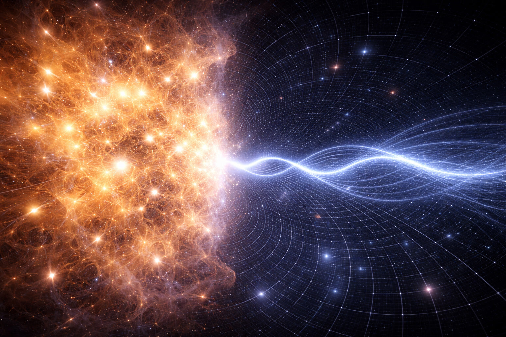
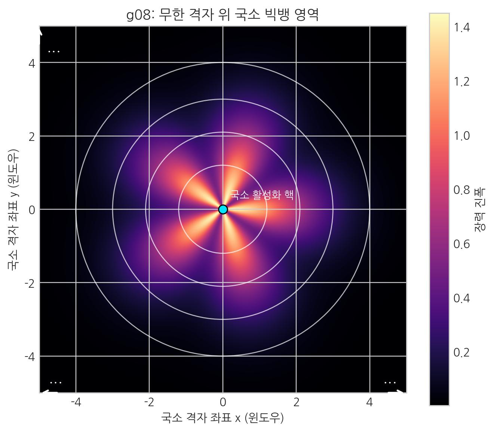
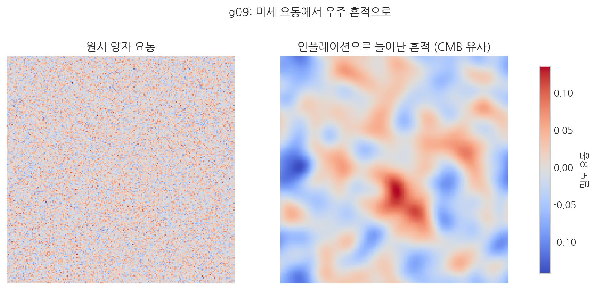
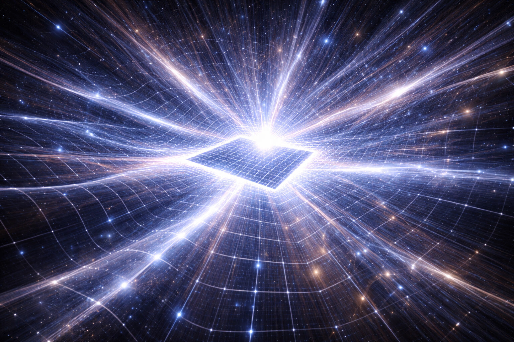
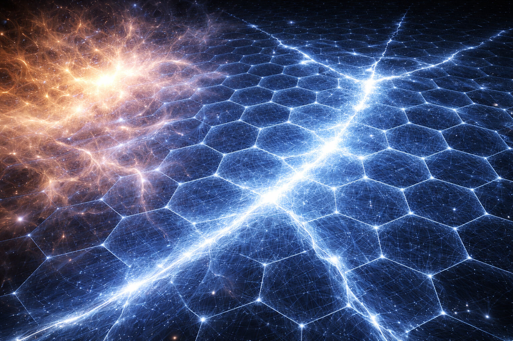

# 06. '상태의 전환'을 중력파로 들을 수 있는가?

## 빛의 장벽, 38만 년의 안개

이 장은 관측 단서를 심화해, 빛으로는 보기 어려운 초기 우주의 흔적을 어떻게 추적할지 묻는다.
05장에서 중력파를 "공간 자체의 진동"으로 정리했다면, 여기서는 그 채널로 무엇을 복원할 수 있는지로 질문을 확장한다.

- **[검증됨]** 우주배경복사 관측과 중력파 탐색 프로그램은 초기 우주 단서의 핵심 축이다.
- **[가설]** SALT는 초기 구간을 공간 상태 전환으로 해석한다.
- **[예측]** 원시 신호 채널에서 상태 전환 흔적(스펙트럼/편광/지연)이 교차 검증되어야 한다.
- **[검증 절차 연결]** 판정 축은 24장 13.2~13.4(편광·스펙트럼·도달지연) 기준을 따른다.

우리는 망원경으로 과거를 볼 수 있다. 먼 곳을 보는 것은 곧 먼 과거를 보는 것이기 때문이다. 하지만 아무리 성능 좋은 망원경이라도 직접 관측이 어려운 경계가 존재한다. 바로 우주의 거대한 상태 변화가 일어난 후 **38만 년** 시점이다.

그 이전의 초기 우주는 너무나 뜨거워서, 전자와 원자핵이 분리된 불투명한 **플라즈마** 상태였다. SALT의 관점에서 플라즈마는 '와류의 독방'이 해제된 상태다. 개별 보셀의 회전 진동(온도)이 너무나 강력한 나머지, 전자라는 보셀 꼬임 단위가 원자핵이라는 거대한 매듭 구조에 귀속되지 못하고 제멋대로 튀어 다니는 것이다.

빛(광자)은 보셀의 꼬임이 옆 보셀로 전달되는 전달 파동이다. 하지만 이렇게 날뛰는 '전자 와류'들은 빛의 전달 경로를 사정없이 뒤흔든다.
38만 년이 지나 우주가 충분히 식고 나서야(보셀 진동이 잦아들고 나서야), 전자가 원자핵 구조에 안정적으로 묶였다. 그제야 안개가 걷히듯 빛이 자유롭게 퍼질 수 있었고, 이것이 우리가 보는 가장 오래된 빛 **우주 배경 복사**다.

 

 

문제는 그 전이다. 상태 전환 직후부터 38만 년 사이, 즉 우주가 가장 격렬하게 요동쳤던 그 '격동의 순간'을 빛만으로는 직접 보기 어렵다. 그러나 우리에게는 다른 눈이 생겼다. 바로 **중력**이다.

### 중력파와 빛의 투과성 차이
>
> 빛은 보셀의 꼬임이 전달되는 파동이기에, 매듭(질량)이 빽빽한 영역에서는 산란되어 전파가 차단된다. 하지만 중력파는 **보셀 부피 자체의 수축·팽창뿐만 아니라 공간 와류들이 만들어내는 근원적인 소용돌이 진동**이기에 동일 조건에서 산란이 상대적으로 작다. 이것이 우리가 눈(빛)이 아닌 귀(중력파)로 우주의 상태 전환 과정을 들어야 하는 이유다.

## 중력은 멈추지 않는다

중력파는 빛 대비 물질과의 상호작용이 매우 약해 관통성이 높다. 물질(매듭)이라는 국소적 구조보다 훨씬 거대한 공간 자체의 파동이기 때문에 산란이 상대적으로 작다. 초기 우주가 뜨거운 플라즈마로 가득 찬 구간에서도, 중력파 채널은 핵심 정보를 더 멀리 운반할 수 있다.

이것은 초기 우주의 대전환 흔적을 직접 추적할 수 있는 핵심 채널이다. 과학자들은 이 신호를 **원시 중력파**라 부른다. SALT에서는 정적 흐름 축은 유효 경사도($-\nabla\mu$, 저차 근사 $-\nabla\rho$), 동적 전파 축은 중력파로 구분한다.

## 관측의 한계: 빅뱅은 시작인가, 지역적 사건인가?

우리는 흔히 빅뱅을 '우주 전체가 무에서 태어난 사건'으로 생각한다. 하지만 SALT에서 **전체 우주는 시작도 끝도 없는 영원한 평평한 보셀 격자**다. 우리가 '빅뱅'이라 부르는 사건은 전체 격자 안에서 일어난 **국소적인 거대 블랙홀의 팽창 순환** 중 하나일 뿐이다.

태초의 '0초'를 절대 시점으로 단정하기는 어렵다. SALT에서는 거대한 블랙홀 내부 상태가 임계점을 넘어 폭발적으로 풀린 **지역적 해방** 사건으로 본다. 더 큰 스케일에서 보면, 바다의 국지 파동 같은 변화일 수 있다.

> 핵심: SALT에서 빅뱅은 우주 전체의 시작이 아니라, 무한 배경 위 국소적 활성화로 해석된다.

## 팽창의 시작: 응축된 에너지의 '언폴딩'

우리가 관측하는 팽창의 시작은 에너지가 창조된 것이 아니라, 팽팽하게 뭉쳐있던 공간의 격자가 국소적 불안정성으로 인해 폭발적으로 **펼쳐지며** 진행된 사건이다.

이 상태 전환은 초고밀도로 압축된 보셀 격자가 급격히 풀리는 해방 순간이다. 강하게 눌린 용수철이 풀리듯, 복원력이 우주 팽창으로 나타났다고 본다.

## 초탄성 팽창과 공간의 비명

> 핵심: 초기의 미세 요동이 인플레이션으로 확대되며, 훗날 관측 가능한 우주 패턴으로 남는다.

상태 전환 직후 무렵, 우리 국소 우주는 급격하게 팽창했다. 이를 **인플레이션**이라 한다. SALT는 이를 기질 자체의 **'초탄성 팽창'**으로 해석한다.

이때는 초고밀도로 압축된 에너지가 급격히 퍼지는 구간이었다. 팽팽한 막이 떨리듯 매질 전체에 큰 진동이 생겼고, 그 미세한 주름이 우주 규모로 확대된 것이 원시 중력파라는 해석이다.

 

 

## 공간의 상전이: 블랙홀의 역류

SALT는 원시 중력파를 **공간의 소성 경화**, 즉 요동하던 기질이 안정 구조로 정착하는 상전이 신호로 해석한다.

고체·액체·기체·플라즈마는 보셀의 **잠금**과 이를 풀려는 **요동** 사이 균형의 결과로 볼 수 있다.

- **초기 팽창**: 거대 블랙홀이 임계점을 넘으면, 내부의 초고압 에너지가 한꺼번에 풀려 나온다. 이는 '무'에서 생긴 것이 아니라, 내부에 응축돼 있던 보셀 격자의 해방으로 본다.
- **소성 고착**: 이 폭발적인 팽창 과정에서, 모든 꼬임이 다 풀리지 못하고 국소적으로 굳어버리는 구간이 생겨났다. 이것이 바로 최초의 **물질(매듭)**이다.
    현대 물리학이 밝혀낸 **"양성자 질량의 98%가 글루온 장의 에너지"**라는 사실은, 바로 이 태초의 팽창기에 풀리지 못하고 '소성적으로 고착된' 막대한 입체 구조적 에너지를 의미한다.

상전이란, 보셀의 진동 에너지가 이 '잠금'을 풀거나(가열), 혹은 비틀림의 장력이 진동을 억제하여 격자를 형성하는(냉각) **임계 상호작용**이 일어나는 지점이다.

우리가 보는 '빅뱅의 잔광'은 급격한 상태 전환이 남긴 충격 흔적으로 읽을 수 있다. SALT는 고에너지 플라즈마가 현재의 안정 구조로 빠르게 **소성 고착**되는 과정이 원시 중력파의 기원 후보라고 본다.

이 '얼어붙음' 과정에서 갇혀버린 위상 회전-잠금들은 훗날 **약력**을 통해 다시 풀려나오며 우주에 변화를 일으키게 된다. 원자력 에너지는 바로 이 갇힌 에너지 중 단 **0.1~0.7%**를 살짝 해제하여 얻는 부산물일 뿐이다. 우리는 이 '해빙' 과정을 16장에서 자세히 다룰 것이다.

 

 

결국 우리가 '태초의 소리'라 부르는 것은 거대한 **공간 매질** 안에서 생긴 **국지적 와류 파동**의 흔적이다. SALT는 에너지가 새로 생겼다기보다 늘 존재해 왔다고 보고, 우리는 그 흐름의 한 구간을 관측한다고 해석한다.

이제 이 출렁거리는 장력의 바다 위에서, 상태 전환의 흔적이 관측자의 시간 감각에 어떻게 다른 속도로 기록되는지 추적해 보자.

다음 장, **07. 시간은 거꾸로 흐르지 않는다 - 밀도의 착시**
