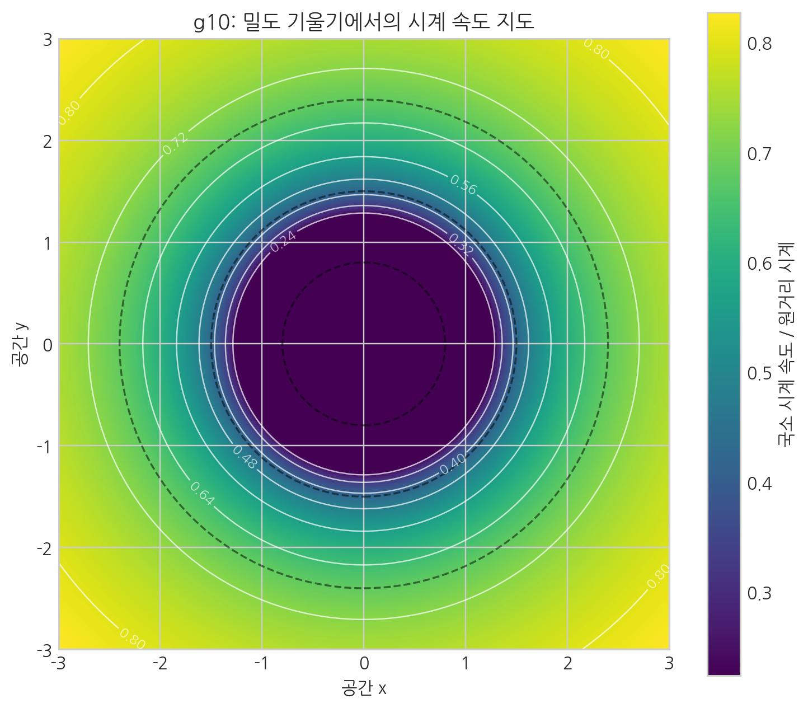
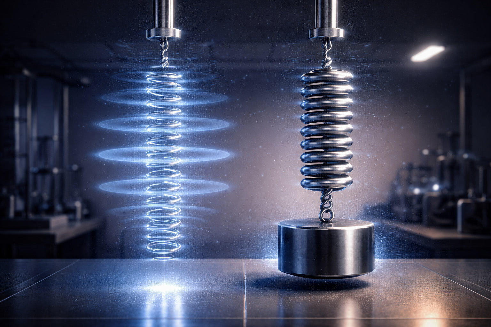

# 07. 시간은 거꾸로 흐르지 않는다: 밀도의 착시

## 시간과 공간은 근본적으로 다르다

앞장에서 다룬 원시 중력파의 상전이 서사를 시간의 언어로 옮기면, 핵심은 '시간 변화'가 아니라 '매질 상태 변화'라는 점이다.
즉 06장에서 본 초기 우주의 상태 전환 흔적을, 여기서는 관측자 시계와 전달 지연의 문제로 다시 읽는다.

아인슈타인은 시간과 공간을 묶어 '시공간'이라 불렀다.
하지만 이것을 "시간도 공간처럼 앞뒤로 자유롭게 갈 수 있는 차원"이라고 오해해서는 안 된다.
이 둘은 긴밀하게 상호작용하지만, 그 본질은 완전히 다르다.

SALT에서 시간은 공간의 차원이 아니라, 보셀 매질의 상태 변화를 순서화하는 **'시간 인덱스'**다.
로렌츠 대칭은 이 매질이 안정적으로 작동하기 위해 만족해야 하는 **필연적인 보호 대칭**이다.

### 마이컬슨-몰리 실험의 진실: 매질 안정 고정점

19세기 말, 마이컬슨과 몰리는 지구가 에테르 속을 헤치고 나아가는 증거를 찾기 위해 정밀한 간섭계 실험을 설계했다. 만약 빛이 에테르를 타고 전달된다면, 지구의 공전 방향과 빛의 진행 방향이 일치할 때와 **수직**일 때의 속도 차이가 측정되어야 했다. 하지만 결과는 **아무런 차이도 없었다.**

SALT는 이 결과를 단순히 '에테르가 없다'거나 '측정 도구가 줄어들었다'는 식으로 해석하지 않는다. 대신, **로렌츠 대칭은 보셀 격자가 정보를 전파할 수 있는 유일하게 안정한 전파 규칙**이라고 정의한다.

빛은 보셀 격자 위를 지나가는 입자가 아니라, 격자 자체의 **상태 전이 신호**다.
이 보셀 매질 계에서 정보가 인접 지점으로 전이되는 속도는 모든 관찰자의 고유시간 기준에서 **[한 시간의 흐름당 1보셀]**이라는 인과적 상한선에 잠겨 있다.
따라서 진공 국소 한계로서의 광속 $c$는 모든 국소 관성계에서 고정된 상수로 취급된다. 다만 관측 채널에서는 매질 상태에 따른 유효 전달속도 $c_{\mathrm{eff}}(\rho)$로 지연이 나타날 수 있다.
이는 우연의 일치가 아니라, **우주라는 체계가 붕괴하지 않고 작동하기 위한 입체 구조적 최소 조건**이다.

SALT는 시간과 공간의 관계를 다음과 같이 정의한다.
**"공간은 보셀(매질)로 구성되며, 시간은 그 보셀의 시간적 상태에 부여되는 유일한 지칭표이다."**

- **[검증됨]** 시간지연/적색편이 관측은 반복 검증되어 있다.
- **[가설]** SALT는 이를 "시간 자체 둔화"가 아니라 "전달 지연"으로 해석한다.
- **[예측]** 단일 파라미터 계열로 지연·적색편이·렌즈 지연의 동시 정합이 가능해야 한다.

공간은 구겨지거나 펼쳐질 수 있다. 하지만 시간은 그 변화에 순서대로 붙는 **식별 번호**에 가깝다.

여기서 핵심 차이가 나온다. 1초 전 보셀과 지금 보셀은 같은 덩어리가 버티는 것이 아니라, 매 시간 흐름마다 새로 고정/재현되는 사건의 연속으로 본다. SALT에서 존재는 고정 물체라기보다 **계속 재현되는 무늬**이다.

우리는 3차원 공간이 보편 시간 인덱스에 따라 전이하는 거대한 동적 상태장 안에 있다. 특정 보셀이 다음 시간 흐름에서 재현에 실패하면, 그 존재는 즉시 소멸한다. 우리가 기억이라 부르는 것도 지난 시간 인덱스가 남긴 위상 이력일 뿐이다.

### SALT의 4차원은 시간이 아니다

현대 물리학에서는 시간과 공간을 묶어 '4차원 공간'이라 부른다. 하지만 SALT에서 **4차원의 정체는 시간이 아니라 공간의 '기본적인 깊이'**다. 2차원 종이가 구부러지기 위해 3차원 공간이 필요하듯, 3차원 보셀이 비틀리고 꼬이기 위해서는 그 변위가 수용될 물리적인 깊이(4차원 축: 공간 자체의 밀도)가 반드시 필요하기 때문이다.

시간은 독립적인 좌표축이 아니라, 우주가 한 흐름씩 상태 전이를 진행할 때마다 각 보셀에 부여되는 **'시간 인덱스'**다. 따라서 SALT에서 공통인 것은 지칭표의 순서이며, 관측되는 시계율은 매질 상태와 전달 지연에 따라 달라질 수 있다.

## 왜 중력이 강하면 시간이 느리게 측정되는가?

> 핵심: 시간 자체가 뒤틀리는 것이 아니라, 밀도 기울기가 달라져 실질적인 거리가 늘어나고 이로 인해 시계 속도가 다르게 측정된다.

"중력이 강한 곳에서는 시간이 느리게 간다." 상대성이론의 유명한 명제다. 하지만 SALT의 관점에서 이 문장은 **수정되어야 한다.**
**SALT에서는 시간 인덱스 자체는 동일하게 갱신된다고 본다. 다만 밀도가 높은 공간을 통과할 때 신호 전달과 물리 과정이 지연되어, 관측상 시간이 느리게 흐르는 것처럼 보인다.**

그렇다면 왜 느리게 가는 것처럼 보일까?
**시간이 늘어진 게 아니라, 빛의 진행 속도가 느려진 것이다.**
더 정확히 말하면, **공간 매질의 내부 위상 층이 겹겹이 중첩되어, 빛이 같은 3차원 거리를 통과하는 동안 읽어내야 할 '위상 층의 개수'가 빽빽해졌기 때문이다.**

현대 물리학이 밝혀낸 **양성자 질량의 98%가 글루온 장의 에너지**라는 사실은, 질량이 있는 곳의 공간 밀도가 이토록 경이로울 정도로 수많은 층으로 응축(적층)되어 있음을 시사한다.
이 엄청난 '층의 깊이'를 통과하느라 보셀의 동역학 자원이 소모되는 **전달 지연**이 우리가 관측하는 시간 지연의 실체다.

| 구분 | 시간 자체 변화 해석 | SALT 전달 지연 해석 |
| :--- | :--- | :--- |
| 무엇이 느려지는가 | 시간 축 자체가 둔화 | 신호 전달/물리 과정의 전달 지연 |
| 원인 변수 | 곡률에 따른 시계율 차 | 밀도 적층에 따른 유효 경로/동역학 자원 증가 |
| 관측량 | 시간지연·적색편이 | 시간지연·적색편이(같은 채널, 다른 해석층) |
| 판별 포인트 | 시간 축 가정 중심 | 경로 밀도/전달률 지표와의 동시 정합 |

여기서 밀도형 상태량은 $n=\rho^2$로 두고, 정적 흐름의 구동 축은 유효 경사도 $-\nabla\mu$ (저차 근사 $-\nabla\rho$)로 표준화한다.

::: {.note-theory}
**참고: GPS 위성과 지상의 시간 차이는 어떻게 발생하는가?**

우리가 매일 사용하는 GPS의 시간 오차 보정은 보통 "지구의 강한 중력 때문에 지상의 원자시계가 위성보다 시간이 느리게 흐르기 때문"으로 설명된다(상대성 이론의 관점).

하지만 SALT의 관점에서 이는 **서로 다르게 흐르는 차원적인 시간을 맞추는 작업이 아니다.** 우주의 보편 시간 인덱스는 위성이나 지상이나 똑같이 매겨지지만, **위성이 처해 있는 '공간의 밀도(중력)'와 공간을 헤쳐나가는 '저항(속도)' 때문에 위성에 실린 원자시계라는 기계의 '물리적 작동 속도'가 변한 것**을 보정하는 것이다.

* **지표면 (고밀도 매질):** 물질이 많아 보셀 밀도와 장력이 높다. 원자시계 진동은 더 큰 저항을 받아 느려진다. 물속에서 팔을 움직일 때 둔해지는 느낌과 비슷하다.
* **GPS 위성 궤도 (저밀도 매질):** 지구에서 멀어 공간 밀도와 장력이 낮다. 원자들이 덜 저항받아 지상보다 시계가 더 빠르게 간다. (다만 위성의 빠른 이동은 반대로 시계를 늦추는 요인도 된다.)

즉, GPS 오차 보정은 다른 시간 차원을 맞추는 작업이 아니다. **서로 다른 밀도 환경에서 시계 장치의 진동 속도 차이**를 기술적으로 보정하는 과정이다.
:::

### 1. 보셀의 정체와 경험의 밀도: 유효 거리의 증가

우주의 시간 인덱스는 모든 존재에게 공평하게 부여된다(1초에 1단계). 하지만 그 지칭표 하나가 지나가는 동안, 각 보셀이 감당해야 하는 **'보셀 동역학 자원'** 내의 **'층 중첩도'**는 공간마다 천차만별이다.

*중력이 강하다는 것은 **'공간의 적층 밀도'**가 높다는 뜻이다.
- **지구 궤도**: 보셀 적층이 듬성듬성하다. 빛이 3차원적 1미터를 가기 위해 겪어야 할 위상 단계가 10개다. (빠르다)
- **블랙홀 근처**: 보셀들이 위상학적으로 극도로 적층되어 있다. 같은 1미터 안에 보셀의 위상이 1,000,000단계나 겹겹이 포개져 있다. (느리다)

- **저에너지 공간 (탄성 구간)**: 위상이 평온하고 이완되어 있다. 보셀 하나를 통과하는 데 필요한 동역학 자원이 최소화되어 있어, 빛(정보)이 보셀들을 매우 빠르게 통과한다. (빠르다)

- **고에너지 공간 (고강성 구간)**: 보셀 격자가 수많은 층으로 빽빽하게 적층되고 장력이 걸린 상태다. 다음 보셀로 신호를 넘길 때 전이 부담이 커져, 빛 전달에 더 많은 시간 흐름을 쓴다. 외부에서는 처리 속도가 떨어진 것처럼 보인다. (느리다)

### 2. 무한한 팽창과 '인과적 침묵'

여기서 한 가지 날카로운 질문이 생긴다. "에너지가 낮아져서 위상이 완전히 이완되면(진공), 시간은 무한히 빨라지는가?"

SALT의 답변은 **"아니오, 시간 인덱스는 그대로 흐르지만 '변화'가 사라진다"**이다. 이것을 **'인과적 침묵'**이라 부른다.

- **고위상 (지체)**: 보셀의 장력이 너무 촘촘해서 정보가 인접 지점으로 전이되는 '논리적 거리'가 멀어진 상태이다. 체계의 시간 인덱스는 일정하게 진행되지만, 정보가 목표지에 도달하기까지 너무 많은 지칭표를 소모하는 **전이 지연 누적** 현상이다.
- **무위상 (침묵)**: 보셀의 위상이 완전히 풀려 장력이 0에 수렴한 상태이다.
 SALT에서 시간은 지칭표(T1, T2...)로 쉼 없이 부여되지만, 장력이 사라진 보셀은 더 이상 진동하거나 상태를 바꿀 **에너지가 없다.**
- **결론**: 지칭표는 1, 2, 3... 계속 진행되지만 상태 변화가 없으면 사건도 없다. 겉보기엔 시간이 멈춘 듯해도, 실제로는 **사건 밀도 0 상태**만 지속된다.

결국 우주에 **'최소한의 장력(우주 상수)'**이 존재하는 이유는, 우주라는 체계가 단순히 지칭표만 매기는 백지가 아니라, 모든 보셀이 서로 반응하며 **'유의미한 변화(사건)'**를 만들어내게 하기 위한 **'최소한의 긴장감'**인 셈이다.

 

 

### 3. 당사자의 시간: "나의 박동은 변하지 않았다"

여기서 중요한 점은, 그 고밀도 공간 안에 있는 **당사자(고유시간 기준)**는 시간의 흐름이 변했다고 느끼지 않는다는 것이다.

무거운 보셀 속에서 사는 사람은 자신의 생체 시계, 생각의 속도, 원자의 진동까지 모든 것이 똑같이 둔해졌다. 이것은 보셀 격자가 높은 밀도(장력)를 유지하고 상태 전이를 진행하는 데 대부분의 **동역학 자원**을 소모하느라, 내부의 미시 과정(심장 박동, 시계 진폭)에 할당될 수 있는 자원이 줄어들었기 때문이다.

하지만 밖의 **관찰자(좌표시간 기준)**가 보면, 안쪽 세상은 슬로모션처럼 보인다. 비유적으로는 이렇게 말할 수 있다.

"왜 그렇게 느리게 움직여?"
"나는 평소와 같은 속도야. 다만 **주변 보셀 위상이 더 팽팽해서, 정보를 옆칸으로 넘기는 데 시간이 더 걸릴 뿐**이야."

 

 

## 시간의 화살은 꺾이지 않는다

결국 시간 지연 현상은 **공간 밀도가 변화의 속도에 저항을 건 것**일 뿐, 시간의 방향성을 꺾은 것은 아니다.

시간은 공간의 상태가 A에서 B로 전이되는 **시간의 흐름 수**다.
고밀도 지역에서는 시간 인덱스 자체가 느려지는 것이 아니라, 같은 지칭표 간격 안에서 완료되는 상태 전달과 물리 과정이 더 지연된다. 하지만 지칭표는 멈추지 않고 계속되며, 이미 전이된 이전 상태(과거)는 사라진다. 시간은 사건에 얽매이지 않고 그저 새로운 순간을 끊임없이 만들어낼 뿐이다.

시간여행이 어려운 이유는 단순하다. 과거는 어딘가에 보관된 방이 아니라 **이미 덮인 이전 상태**이기 때문이다. 우리가 갈 수 있는 방향은 다음 시간 흐름뿐이다.

공간을 아무리 압축해도 우리는 미래 시간 흐름으로만 이동한다. 시간은 스스로 늘거나 줄지 않고, 공간 상태 변화 때문에 느려지거나 빨라져 **보일 뿐**이다. 시간은 상태에 붙는 **지칭표**이므로, 덮어쓴 이전 지칭표로 돌아가는 시간여행은 구조적으로 불가능하다.

설령 빛보다 빠른 유효 이동이 가능한 가정적 시나리오를 상정하더라도 (**공간 매질** 배경인 공간 격자가 압축되거나 위상적 변화를 일으키면서), 그 지점의 공간에는 항상 **새로운 지칭표**가 붙여질 뿐이다. 우리는 결코 과거의 지칭표로 돌아갈 수 없다. 즉, 시간 여행은 상태 전이의 유일성 원칙에 따라 물리적으로 불가능하다.

### 시간 인덱스의 유일성 — 왜 나는 과거의 나와 만날 수 없는가?

SALT에서 시간 인덱스의 유일성은 다음 규칙으로 요약된다.
- 같은 공간 좌표 \(V\)와 같은 시간 인덱스 \(T\)에는 오직 하나의 상태 \(\rho\)만 정의될 수 있다.
- 과거의 나는 과거 지칭표의 상태이고, 현재의 나는 현재 지칭표의 상태다.
- 따라서 한 좌표에서 두 시간 상태를 동시에 성립시키는 시간여행 시나리오는 시간 인덱스의 유일성에 위배된다.

즉 시간의 비가역성은 임의 규칙이 아니라, 보셀 격자의 상태 전이 구조에서 나오는 필연적 귀결이다.

자, 이제 시간과 공간에 대한 오해를 풀었으니 다시 근원적인 질문을 던져보자. 공간이 이렇게 뻣뻣하게 버티고 있다면, 그 버티는 힘의 크기는 도대체 얼마인가?

## 우주의 용수철 상수

여기서 우리는 물리학 상수의 진정한 의미를 마주하게 된다. 뉴턴과 아인슈타인의 수식에 공통으로 등장하는 **중력 상수($G$)**. 이것은 단순히 숫자를 맞추기 위한 비례 상수가 아니다. SALT의 관점에서 **중력 상수는 공간 원단이 얼마나 잘 휘어지는지를 나타내는 '유연성' 지표다.**

- **중력 상수($G$)가 아주 작다는 것($10^{-11}$)**: 역설적이게도, 유연성이 거의 없다는 뜻이다. 즉 우리 우주는 상상을 초월할 정도로 **'뻣뻣하고 단단한'** 매질이라는 뜻이다. (강성 $k \approx \frac{c^4}{G}$)
- 여기서 **강성($k$)**은 공간이라는 매질이 비틀림이나 압축에 저항하는 정도를 나타내는 물리적 수치다. 아인슈타인의 장 방정식에서 중력 상수의 역수($c^4/G$)가 공간의 강성을 결정하듯, SALT에서도 이 값은 보셀 격자가 얼마나 단단하게 결합되어 있는지를 상징한다.
- 우리는 저항 없이 움직인다고 공간을 빈 껍데기로 착각하지만, **공간**을 1 mm 휘게 하려면 지구급 질량이 필요하다. 즉 공간은 다이아몬드보다 \(10^{40}\)배 단단한 **초고강성 탄성체**다. 우리가 자유롭게 움직이는 이유는 이 매질이 약해서가 아니라 우리가 매우 가볍기 때문이다.

> **수치 방어막 (07장, 기존 검증 사실)**
>
> - $G = 6.674\times10^{-11}\,\mathrm{m^3\,kg^{-1}\,s^{-2}}$ (SI)
> - $c^4/G \approx 1.21\times10^{44}\,\mathrm{N}$
> - 따라서 본문의 "공간이 매우 뻣뻣하다"는 표현은 감상이 아니라, $c^4/G$가 매우 큰 값이라는 정량 사실을 해석한 문장이다.
>
> **SALT 해석 가설**
> - SALT는 이 거대 스케일의 강성 해석을 보셀 매질의 유효 강성으로 연결한다.

다음 장, **08. 입자는 왜 확률로만 존재하는가?**
