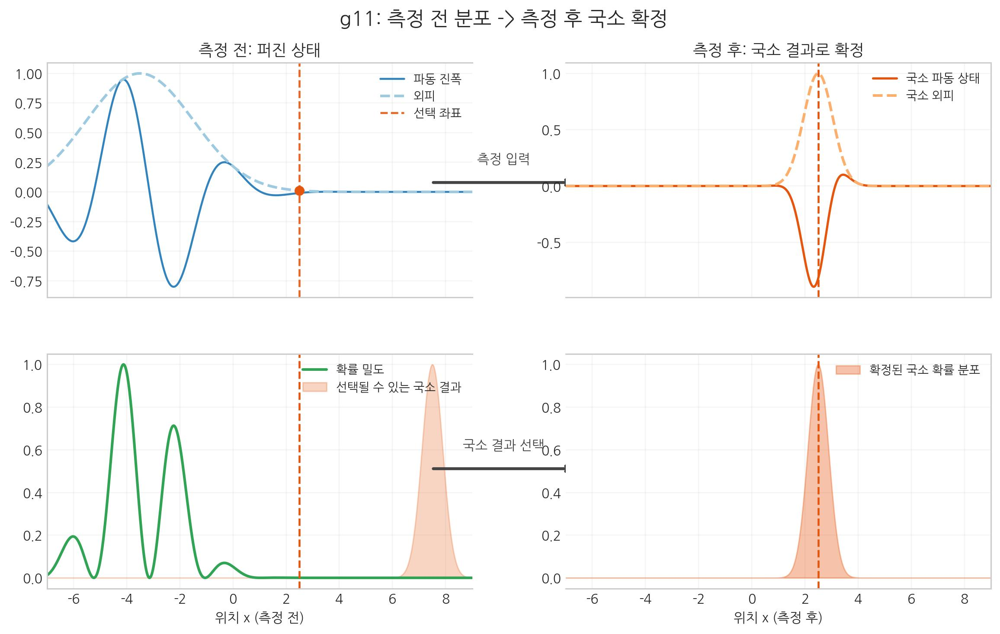
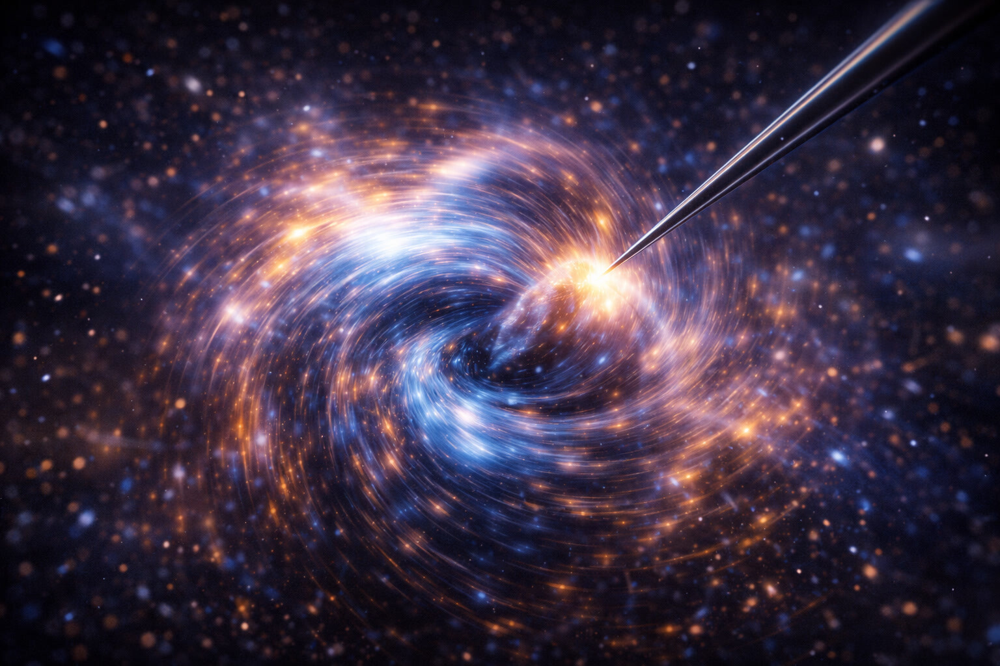

# 08. 입자는 왜 확률로만 존재하는가?

## 신은 주사위 놀이를 하지 않는다, 단지 눈보다 빠를 뿐이다

앞서 우리는 공간을 '탄성 있는 젤리'나 '휘어지는 천'으로 비유했다. 거시 스케일에서는 이 풍경이 매끈하고 연속적으로 보인다.
하지만 현미경의 배율을 극한으로 높여 원자보다 작은 세상으로 들어가면, 이 매끄러운 풍경은 급격히 깨진다.
즉 07장에서 확인한 "공간의 강성"을, 이 장에서는 "공간의 최소 해상도" 문제로 전환해 읽는다.
우주는 아날로그가 아니라 **디지털**이다.

디지털 사진을 확대하면 **픽셀**이 보이듯, 우주에도 더 이상 쪼갤 수 없는 최소 단위가 있다고 본다.
SALT는 이 단위를 **'보셀(Voxel)'**이라 정의한다.

'와류'와 '세포'의 합성어인 보셀은 에너지를 담는 단순한 그릇이 아니라, 스스로 회전하거나 진동하는 역동적인 상태의 최소 단위다.
에너지는 물처럼 연속적으로 흐르지 않고, 보셀들의 이산적 거래 결과인 **'양자'** 단위로 움직인다.

그렇다면 굳이 '보셀'이라는 새 이름이 왜 필요한가? '양자'라고 부르면 안 되는가?

- **양자**: 에너지가 불연속적으로 거래된다는 **'양(量)'의 개념**만을 담은 말이다. "공간이 이 에너지를 *얼마씩* 주고받는가?"에 대한 답이다.
- **보셀(Voxel)**: 그 에너지를 담고 있는 **'공간 단위 자체가 회전하는 구조체'**라는 뜻이다. "공간이 *어떤 입체 구조적 단위로* 이루어져 있는가?"에 대한 답이다.

즉 양자는 에너지의 *크기*를, 보셀은 그 에너지가 담긴 공간의 *단위 구조*를 말한다. SALT는 "공간이 왜 불연속적인가?"에 대해, 공간 자체가 회전하는 최소 단위(보셀)로 이뤄져 있다고 답한다.

::: {.note-theory}
**참고: 현대 물리학에도 보셀에 가까운 개념이 있는가?**

있다. 하지만 **모두 절반씩만 맞다.**

| 이론 | 용어 | 보셀과의 공통점 | 보셀에 없는 부분 |
|:---|:---|:---|:---|
| **루프 양자 중력 (LQG)** | 스핀 네트워크 노드 | 공간이 이산적 최소 단위로 이루어짐 | 단위가 *회전하는 동적 구조체*라고 명시하지 않음 |
| **존 휠러 (J. Wheeler)** | 양자 거품 | 플랑크 스케일에서 공간이 요동침 | 단위의 공간 입체 구조와 종류는 미정 |
| **제라드 토프트** | 세포 자동자 | 플랑크 격자 위의 이산적 셀 | 셀이 와류라는 개념 없음 |

이론들은 공간의 최소 단위가 **"있을 수 있다"**고 말하지만, 그 단위가 **"어떤 구조인가"**에 대해서는 침묵한다. 보셀의 독창성은 여기에 있다:

> **"공간의 최소 단위는 정적인 격자 칸이 아니라, 스스로 회전하는 동적 세포이다."**

이 "회전하는 단위"라는 전제가 있어야 기본 4상호작용과 핵력(잔류 결속)까지 하나의 탄성/소성 변형 구조로 유도할 수 있다. 기존 이론들은 최소 단위의 *존재*는 예측했지만, 그 단위로부터 힘이 *어떻게 파생되는지*까지는 설명하지 못했다.
:::

이 매혹적인 보셀의 규칙을 연구하는 학문이 바로 **양자역학**이다.

- **[검증됨]** 양자역학의 확률적 예측은 실험적으로 매우 정밀하게 검증되어 있다.
- **[가설]** SALT는 확률성을 보셀 상태 갱신과 내부 위상 재배열의 통계적 결과로 해석한다.
- **[예측]** 같은 관측 채널에서 \(\rho\)와 \(n=\rho^2\)의 구분이 측정 해석의 일관성을 높여야 한다.
정의 고정: \(\rho=|\Psi|\)는 진폭, \(n=\rho^2=|\Psi|^2\)는 밀도형 상태량(관측량 연결)이다.
상호작용의 정적 구동 축은 유효 경사도 \(-\nabla\mu\)이며, 저차 근사에서 \(-\nabla\rho\)로 읽는다.

## 먼저 읽기: 핵심 질문 5개

이 장은 아래 5개 질문만 따라가도 핵심 흐름을 잡을 수 있다.

1. 공간의 최소 단위는 왜 필요한가? (`양자`와 `보셀`의 차이)
2. 이중 슬릿에서 관측 전/후 결과가 왜 달라지는가?
3. 파동성과 입자성은 동시 존재인가, 상태 전이인가?
4. 불확정성은 측정 한계인가, 해상도 한계인가?
5. 양자 중첩은 실제 동시 존재인가, 초고속 등록 지연인가?

 

 

### 보셀은 어떤 모양인가요?

우리가 이해를 돕기 위해 '픽셀' 비유를 썼지만, 모니터의 2차원 사각형과는 다르다. 우리가 사는 세상은 3차원이므로 최소 단위도 부피를 가진 입체여야 하며, **정지하지 않고 회전하는 동적 세포**여야 한다. 그래서 SALT는 이를 **보셀(Voxel)**이라 부른다.

보셀에 대해 가장 중요한 입체 구조적 특징은 그것이 **'격자 해상도는 고정되어 있지만, 내부 위상이 가변적인 탄성 구조'**라는 점이다.

1.  **위상 가변**: 우주에는 보셀이 없는 '빈 공간'이란 존재하지 않으며, 보셀 격자는 공간 전체를 빈틈없이 메우고 있다. 우리가 말하는 '공간 밀도'란 보셀의 크기가 변하는 것이 아니라, 고정된 보셀 격자 내부에 축적된 **'위상 에너지(장력)의 강도'**를 의미한다. 에너지 밀도가 낮은 진공 상태에서 보셀은 이완된 '정지 위상'에 가깝다.
2.  **해상도 한계**: 공간 매질이 정보를 처리하는 최소 격자 단위, 즉 보셀 하나의 크기는 **'플랑크 단위(약 $1.6 \times 10^{-35}m$)'**로 물리적으로 고정되어 있다. 이 한계 해상도 때문에 에너지는 뚝뚝 끊어진 **'양자'** 단위로만 존재하게 된다.
3.  **동적 입체**: SALT는 보셀을 특정한 고정된 도형보다는 **'고정된 부피 내에서 회전 에너지를 담는 최소 와류 구조'**로 해석한다. 중요한 것은 모양이 아니라, **"공간이 고정된 해상도를 유지하되, 내부의 에너지 상태(위상)가 가변적이다"**는 사실 그 자체다.

### 와류에 대한 이해: 흐름인가, 구조인가?
>
> SALT에서 말하는 와류는 단순한 수동적 흐름이 아니다. 그것은 스스로 회전하며 주변 공간의 장력을 **입체적으로 재구성하는 결합 구조**에 가깝다. 질량(입자)은 보셀 격자가 특정 지점에서 극한의 장력을 받아 이 회전 구조가 된 상태이며, 이 구조가 유지되는 한 주변 보셀들과의 **공간 위상차**를 유지하며 중력을 만든다.

::: {.note-theory}
**참고: Q. 보셀의 비틀림은 불완전할 수 있는가?**
여기서 매우 중요한 입체 구조적 원칙이 등장한다. **"독립적으로 존재하는 모든 입자는 한 보셀의 비틀림(상태)이 입체 구조적으로 완결되어야 한다고 본다."**
보셀은 상태의 최소 단위다. 따라서 보셀 하나가 가진 복원력을 충분히 상쇄하지 못하는 '불완전한 비틀림'은 독립적으로 유지되기 어렵다.

- **전자**: 보셀 한 단위의 비틀림 상태가 입체 구조적으로 완결되어 있다. (정수 전하 -1) -> **독립 존재 가능**
- **쿼크**: 보셀의 **일부분(특정 축이나 단면)**만 비틀린 불완전한 상태다. (분수 전하 +2/3, -1/3) -> **독립 존재 불가능**

즉, 쿼크가 혼자 존재할 수 없는 이유는, 그것이 **'완결되지 못한 비틀림 무늬'**이기 때문이다. 우주는 입체 구조적으로 어설픈 상태의 보셀을 허용하지 않으므로, 쿼크들은 반드시 서로 뭉쳐서 하나의 **'완결된 비틀림 무늬(양성자)'**을 갖출 때만 비로소 현실 세계에 안정적인 매듭으로 모습을 드러낸다.
:::

 

## 하이젠베르크의 딜레마: 위치와 속도의 거래

이 보셀의 세계에서 우리의 직관은 무너진다. 가장 대표적인 것이 하이젠베르크의 **불확정성 원리**다.

뉴턴의 고전 역학에서는 물체의 '위치'와 '속도'를 동시에 정확히 아는 것이 당연했다. 하지만 양자 세계에서는 입자의 **위치**를 정확히 알려고 할수록 그 **속도**는 모호해지고, 반대로 속도를 정확히 재려고 하면 위치가 안개처럼 흐릿해진다.

이것은 측정 장비의 성능 문제가 아니다. 우주가 정보를 저장하는 방식의 문제다. 입자는 한곳의 점이라기보다 여러 곳에 **확률**적으로 퍼진 상태로 읽힌다. 관측 전 전자는 "여기에도 있고 저기에도 있는" 중첩 상태로 기술된다.

## 이중 슬릿의 수수께끼: 누가 보고 있는가?

더 당혹스러운 것은 입자가 **파동**처럼 행동한다는 사실이다. 물리학 역사상 가장 기이한 실험인 **'이중 슬릿 실험'**을 보자.

벽에 두 개의 틈(슬릿)이 있다.
우리가 그 틈을 향해 전자를 쐈을 때, 결과는 누가 지켜보느냐에 따라 달라진다.

1.  **아무도 보지 않을 때 (파동)**: 전자는 물결처럼 두 틈을 **동시에** 통과한 것 같은 간섭 무늬를 남긴다.
2.  **누가 지켜볼 때 (입자)**: "어느 틈을 지나는지" 관측을 시작하면, 전자는 하나의 틈만 지난 것 같은 입자 패턴을 남긴다.

입자가 마치 누군가 보고 있다는 것을 아는 것처럼 행동을 바꾸는 것이다. 코펜하겐 해석은 이를 "관측하는 순간 파동함수가 붕괴되어 입자가 된다"라고 설명한다. 도대체 관측이 무엇이길래 우주의 상태를 결정하는가?

## SALT의 해석 1: 관측은 '소성 고착'이다

> 핵심: 측정 전에는 분포, 측정 순간에는 국소 사건으로 나타난다는 이중 양상이 한 화면에 정리된다.

즉, 우리가 돌멩이(입자)라고 부르는 것은, 공간의 물결이 외부의 개입(관측)으로 인해 **한 지점에 응축되어 굳어버린 상태**를 말한다.
SALT는 이 '관측자 효과'를 구체적인 **상전이** 기전으로 설명한다.

- **자유 상태 (탄성 구름)**: 관측 전의 전자는 에너지가 넓은 범위의 보셀들에 옅게 퍼져 있는 **'확률 구름'** 상태다. 이때는 입자적 국소화가 약한 **'탄성 전달 양식'**으로 존재한다.
- **관측 시도 (에너지 충돌)**: 전자를 관측하기 위해 빛(광자)을 쏘는 순간, 광자가 가진 에너지가 전자의 파동 장에 충돌한다.
- **소성 항복**: 이 충돌 에너지가 더해지는 순간, 공간은 **탄성 한계**를 초과하게 되고, 그 지점에서 급격히 꼬여버린 **'소성 매듭'**으로 변한다.
- **결과**: 부드러운 안개(파동)가 충격으로 알갱이(입자)처럼 굳는 상황에 가깝다. SALT에서 관측은 이런 **소성 고착**으로 해석된다.

::: {.note-theory}
**참고:** 이를 SALT 임계 조건으로 쓰면 간단하다. 관측 상호작용의 국소 응력이 임계치 미만(\(\tau < \tau_y\))이면 파동 모드가 유지되고, 임계치 이상(\(\tau \ge \tau_y\))이면 소성 전이로 입자 결과가 기록된다. 즉 이중슬릿의 "관측 시 입자화"는 의식 효과가 아니라 **탄성 한계 초과에 따른 국소 상전이**다.
:::

## SALT의 해석 2: 파동성과 이중성의 실체

그렇다면 "관측하기 전의 파동성"이란 무엇을 의미하며, 어떻게 존재의 중첩 없이 이중성을 설명하는가? 여기서 SALT의 독창적인 **'매질-장'** 이론이 등장한다.

### 1. 파동의 본질: 공간 응력의 전달
SALT에서 '파동'은 물질 덩어리가 이동하는 것이 아니라, 보셀 격자의 **위상 응력**이 옆 칸으로 전달되는 현상이다. 호수 물결이 물 자체보다 '출렁임'을 전달하는 것과 비슷하다.

### 2. 이중성의 정체: 매듭과 장의 결합
입자는 '공간의 매듭'이지만, 이 매듭은 허공에 고립되어 있지 않다. 매듭이 지어지는 순간, 그 주변의 공간 보셀들 역시 매듭의 장력에 영향을 받아 미세하게 비틀리게 된다.
- **입자성**: 보셀들이 꽉 묶여 질량을 형성한 **'매듭의 핵'**이다.
- **파동성**: 그 매듭 주변으로 넓게 퍼져나가는 **'위상 회전 응력의 장'**이다.

이것은 **'존재의 중첩'**이 아니라, **'실체(매듭)와 배경(공간 장)의 상호작용'**이다.

핵심 구조만 남기면 다음과 같다.

- **매듭(입자 핵)**은 한 번에 하나의 경로를 지난다.
- **장**은 두 슬릿을 지나 간섭 무늬를 만든다.
- 관측 패턴은 "동시 다중 실체"가 아니라, **매듭 + 장의 결합 동역학**으로 읽을 수 있다.

즉, 파동성은 입자가 여러 곳에 동시에 존재한다는 해석을 곧바로 뜻하기보다, 입자가 공간이라는 매질에 만든 **'물결'이 길을 미리 닦아놓았음**을 보여주는 증거로 읽을 수 있다.

### 3. 실험적 검증: "매듭이 정말 하나의 슬릿만 지나는가?"

SALT의 주장에 대해 반론이 생길 수 있다. *"전자의 매듭이 단 하나의 문으로 향한다면, 전자의 매듭(핵)이 하나의 슬릿만 통과한다는 것을 실험으로 증명하면 되지 않는가?"*

정확한 질문이다. 이 문제와 가까운 방향의 실험은 이미 수행된 바 있다.

**약한 측정 — Steinberg 팀, 2011년**

더 직접적인 실험이 있다. 2011년 캐나다 토론토 대학의 아론 스타인버그(Aephraim Steinberg) 팀은 **'약한 측정'** 기법으로 이중 슬릿 실험의 평균 경로(앙상블)를 통계적으로 재구성했다. 결과:

> **재구성된 평균 경로는 입자적 통과와 파동적 안내가 공존하는 그림과 양립 가능했다.** 특히 드 브로이-봄(de Broglie-Bohm) 파일럿 파동 해석과 가까운 결과로 읽혔다.

드 브로이-봄 이론은 SALT의 "매듭 + 장" 구조와 가장 가까운 현대 물리학 해석 가운데 하나다. 장(물결/파일럿 파동)은 두 슬릿을 동시에 지나며 간섭 무늬를 미리 그리고, 핵(배/입자)은 그 무늬를 따라 하나의 경로로 이동하는 그림을 제공한다.

즉 이 계열 실험은 SALT식 분해와 **양립 가능한 단서**를 준다. 양자역학이 마법처럼 보이는 이유는 파동과 입자를 한 덩어리로 봤기 때문일 수 있다. 반대로 **물결(장)은 파동, 배(매듭)는 입자**로 나누면 해석이 더 선명해진다.

 

 

## SALT의 해석 3: 위치가 흐릿한 이유

그렇다면 왜 입자의 위치는 불확정적인가? 핵심은 간단하다. **입자는 정지된 점이 아니라, 보셀 해상도 안에서 진동하는 매듭 상태**이기 때문이다.  
기존 물리학이 보셀보다 작은 수학적 점을 찾으려 할 때 좌표 모호성이 생긴다. 즉 불확정성은 측정기 성능 문제라기보다, **탄성 진동 + 최소 해상도**가 만든 구조적 한계로 읽을 수 있다.

### 보셀의 위치: 고정된 좌표는 없다

여기서 우리는 가장 깊은 입체 구조적 진실을 마주한다. **우주에는 절대적인 (x,y,z) 배경 좌표가 없다. 위치는 오직 '이웃 보셀과의 연결 관계(위상)'로만 정의된다.**

문제는 이 연결 관계망 자체가 정지해 있지 않고, 플랑크 주파수로 미세하게 떨린다는 점이다.  
따라서 불확정성은 측정 기술의 부족만이 아니라, **좌표계 자체가 동적이라는 조건**에서 발생하는 구조적 결과다.

### 정지된 점은 없는가?

혹시 "그냥 너무 작아서 안 보이는 것" 아닐까? SALT의 답은 다르다.  
미시 스케일에서는 작게 가둘수록 반발 장력이 커지고 진동이 커진다. 그래서 **작아서 안 보임**과 **진동해서 흐림**이 동시에 나타난다.

 

### 관성과 보셀 구조
> 이러한 보셀의 격렬한 진동과 회전은 우리가 거시 세계에서 경험하는 **'관성'**의 기계적 토대가 된다. 와류 구조가 각운동량 보존 법칙에 따라 자신의 회전 상태를 유지하려는 본성이, 외부의 힘에 저항하는 물리적 관성으로 나타나는 것이다. (관성의 구체적인 기계적 원리는 04장 참조)

 

## 질량은 불확정성을 탈출하는가?

여기서 한 걸음 더 나아가 보자. 만약 에너지가 공간의 보셀을 성공적으로 꼬아 '질량(매듭)'이 되었다면, 이제는 얌전하게 멈추어 있는 것일까?

우리는 흔히 "질량은 무겁고 안정적이다"라고 생각하지만, 미시 스케일에서는 질량 상태도 내부 진동과 재배열을 동반한다.

우주 보셀들을 옭아매어 입자라는 형태를 유지시키는 그 강력한 접착제를 현대 물리학에서는 **강력**이라 부르고, 그 접착 입자를 **글루온**이라 부른다.

(SALT는 이 강력의 본질을 보셀 가닥들이 서로 엇갈려 묶이는 **'소성 맞물림'** 상태로 해석하며, 이 맞물림에 **응축된 입체적 장력**이 바로 양성자 질량의 **98%**를 차지하는 글루온 장의 실체다. 자세한 내용은 15장에서 다룬다.)

질량이 된다고 해서 불확정성이 자동으로 사라지지는 않는다.

질량이 되었다는 것은 파동의 자유 확산이 줄어드는 대신, 좁은 영역의 내부 진동 모드가 강조된다는 뜻이다. 전자·쿼크처럼 가벼운 상태는 여러 보셀에 변형이 분산된 채 진동하기 쉬워, 위치가 점처럼 고정되지 않는다.

따라서 질량이 되었다고 해서 불확정성이 사라지는 것은 아니다. 오히려 **좁은 회전 구조 안에서 더 빠르게 진동**하며, 이것이 물질이 0도에서도 완전히 멈추지 않는(제로 포인트 에너지) 이유로 해석된다.

---

## SALT의 해석 4: 양자 중첩은 '동시 존재'가 아니라 '초고속 진동'이다
가장 오해가 많은 개념인 **'양자 중첩'**을 보자. "전자가 여기에도 있고 저기에도 있다"거나, "살아있는 고양이와 죽은 고양이가 동시에 존재한다"는 말은 우리의 직관을 파괴한다.

보셀은 고정 실체라기보다, **시간의 흐름**마다 빠르게 갱신되는 상태다.

### 슈뢰딩거의 고양이: 역설인가, 비유의 실패인가?
>
> 1935년 슈뢰딩거는 "미시 중첩을 거시 세계까지 그대로 확장하면 모순이 생긴다"는 점을 보여주기 위해 이 사고 실험을 제시했다.
>
> **SALT는 이 역설에서 탈출한다.** 고양이가 동시에 살고 죽을 수 없는 이유:
>
> - **원자(양자 수준)**: 아직 주변 입자들과의 연쇄 반응이 일어나지 않은 **임시 상태**. 보셀 전이가 다음 시간 단위에서 아직 확정되지 않은 것이다.
> - **독가스·공기(거시 수준)**: 원자가 붕괴하는 순간, 수억 개의 주변 보셀들이 연쇄적으로 **상태 확정**된다. 이 순간 이후 거시 세계에는 단 하나의 결과만 존재한다.
> - **고양이**: 사람이 상자를 열기 훨씬 전에 이미, 공기/독가스 분자의 연쇄 반응이 결과를 확정했다.
>
> **중첩은 극미세 보셀의 일시적 전이 지연**으로 해석한다. 상태 확정은 관측자 의식이 아니라, 주변 입자와의 실제 상호작용에서 일어난다.

1.  **중첩 (임시 상태)**: 보셀의 상태 전환이 다음 시간으로 넘어가기 직전의 모호한 단계다. 실재가 동시에 존재하는 것이 아니라, **우주의 상태 확정 주기 사이에 끼어있는 미고정 상태**일 뿐이다.
2.  **관측 (상태 확정)**: 외부 입자(광자)가 개입하여 보셀의 상태를 즉시 확정시키는 상호작용이다. 상태가 확정되는 순간, 전자는 파동에서 입자 결과로 국소화된다.

결국 양자 중첩은 초자연적 설명 없이도 읽을 수 있다. 보셀 상태가 초고속으로 확정되는 과정에서 생기는 전이 지연으로 해석할 수 있다.

---

### 거인들의 예감: 신은 주사위 놀이를 하지 않는다

많은 사람들이 "아인슈타인은 양자역학을 이해하지 못해서 반대했다"고 오해한다. 하지만 아인슈타인은 누구보다 양자역학의 확률적 성질을 잘 알고 있었다. 단지 그는 **"확률 뒤에 숨겨진 물리적 기작이 반드시 있을 것"**이라고 확신했을 뿐이다.

아인슈타인 이외에도 **'명확한 실체성'**은 사실 물리학 역사의 위대한 거인들이 끊임없이 제기해온 주장과 맥을 같이 한다.

**①** **데이비드 봄 (David Bohm)**:

    > "입자는 유령이 아니다. 파동을 타고 이동하는 배처럼 명확한 경로를 가진다."

- 그는 **'숨은 변수 이론'**을 통해, 입자가 명확한 위치와 속도를 가지지만 우리가 그것을 측정하기 어렵다고 주장했다. SALT의 '회전하는 동전' 비유는 뵘의 해석과 맞닿아 있다.

**②** **제라드 토프트 (Gerard 't Hooft, 노벨 물리학상 수상자)**:

    > "양자역학은 초고속으로 작동하는 **세포 자동자**의 통계적 결과일 뿐이다."

- 토프트는 우주가 플랑크 크기의 격자 위에서 돌아가는 거대한 결정론적 격자계와 같다고 보았다. 그는 **"너무 빠르게 변하는 결정론적 상태를 우리가 확률로 착각하고 있다"**고 주장했는데, 이는 SALT가 말하는 **'플랑크 시간 단위의 초고속 진동'**과 높은 정합성을 보인다.

---

### 입자의 정체, 에너지의 양인가 패턴인가?

여기서 다음과 같이 정리해 보자.

1.  **보셀 (변형의 단위)**: 보셀 하나는 공간의 **최소 해상도**이자 고정된 동적 단위다. 보셀의 물리적 부피는 물리적으로 고정되어 있지만, 그 내부의 회전과 변형(위상 에너지)의 정도는 가변적이다. 거의 이완된 상태부터(허공) 극심하게 꼬인 상태(블랙홀 중심)까지, 위상 밀도의 범위는 막대하다.

2.  **입자 (패턴)**: 하지만 우리가 '전자'나 '쿼크'라고 부르는 것은 단순한 에너지의 양이 아니다. 그것은 고정된 보셀 격자들이 특정한 위상 상태로 꼬이고 얽힌 **'위상 무늬'**이다.

3.  **블랙홀 (매듭 다발)**: 중심은 '무한 밀도 점'이 아니다. 격자 해상도가 허용하는 극한 장력 상태의 질량 무늬가 겹겹이 쌓인 **매듭 다발**이다. 우리가 '무한'이라 부르는 이유도, 보셀의 **해상도 한계**를 넘어 내부를 더 분해하지 못하기 때문이다.

4.  **결론**:
- 모든 **입자(전자, 쿼크 등)**는 보셀 하나의 변형이 아니라, **'보셀들의 네트워크가 만들어낸 꼬임 패턴'**으로 존재한다.
- **입자의 정체성**은 곧 **패턴**이다. 같은 원자라면 보셀들의 패턴이 동일하고, 다른 원자라면 그 패턴이 다르다.

즉 물질의 본질은 재료(보셀)보다 **배열(패턴)**에 있다. 우리가 보는 만물은 보셀 패턴의 다른 조합으로 볼 수 있다.

---

> *이 장에서 다룬 양자역학의 원리들이 반도체, 양자 컴퓨터 등 첨단 기술에 어떻게 적용되는지는 **17장 — SALT가 첨단기술에 미칠 영향**에서 구체적으로 살펴본다.*

---

## 양자역학은 공간의 보셀 규칙이다

결국 양자역학은 **우주에서 허용되는 최소 눈금**에 대한 이야기다. 우주는 무한히 잘게 나뉘지 않으며, 이 최소 단위의 알갱이성이 플랑크 상수($h$)와 보셀 규칙의 출발점이 된다.

질량이 그 최소 붓 터치라는 사실을 이해한다면, 미시 세계의 혼란은 사라진다. 그것은 마술이 아니라, 우주라는 원단이 가진 **'결'의 한계**이기 때문이다.

이제 우리는 중요한 갈림길에 섰다.
이러한 **'자글자글한 보셀의 우주(양자역학)'**와, 앞서 살펴본 **'매끄러운 중력의 우주(상대성이론)'**는 물과 기름처럼 잘 섞이지 않았다. 이것이 현대 물리학의 큰 위기이자, 100년 논쟁의 출발점이다.

만약 SALT의 예측이 옳다면, 미시와 거시의 충돌지점을 해결하는 열쇠는 이것이다. **'질량은 응축된 보셀 매질의 입체적 텐션이며, 그 공간의 최소 해상도는 플랑크 상수($h$)라는 보셀로 결정된다.'**

이제 남는 질문은 분명하다. 이런 미시 세계의 그림이 왜 상대성 이론의 매끄러운 우주와 충돌했는가? 다음 장에서는 이 충돌을 역사적 논쟁의 언어로 재구성해, 어디서 전제가 갈렸는지 추적한다.

다음 장, **09. 아인슈타인과 보어는 왜 화해하지 못했는가?**
