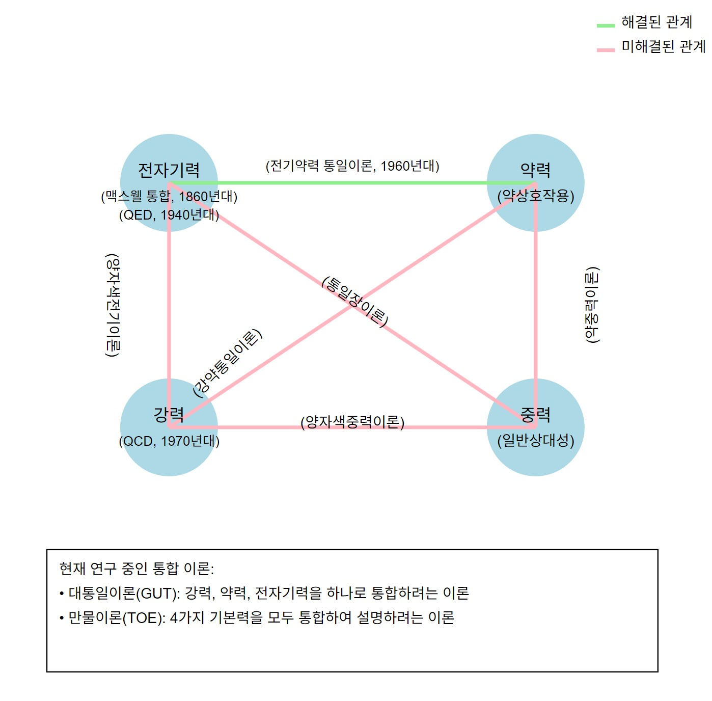
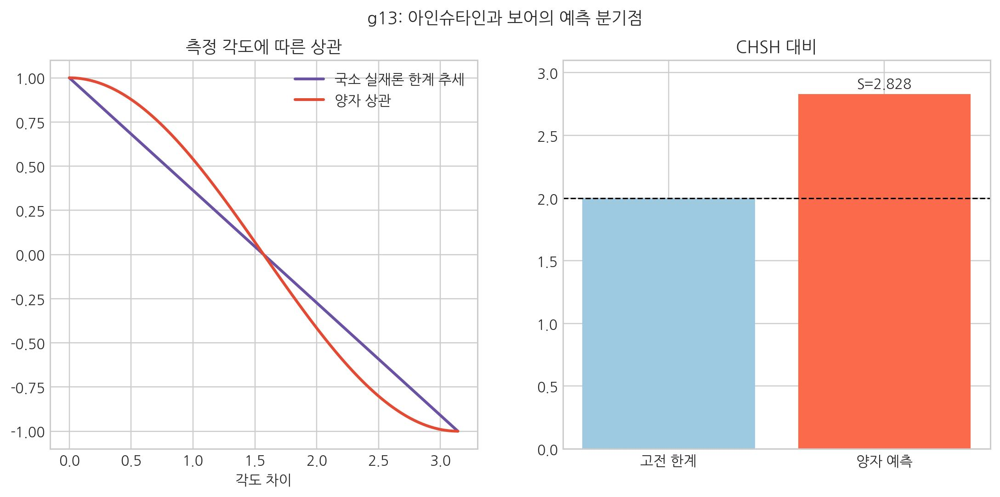
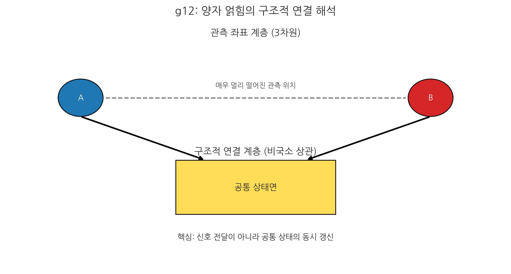
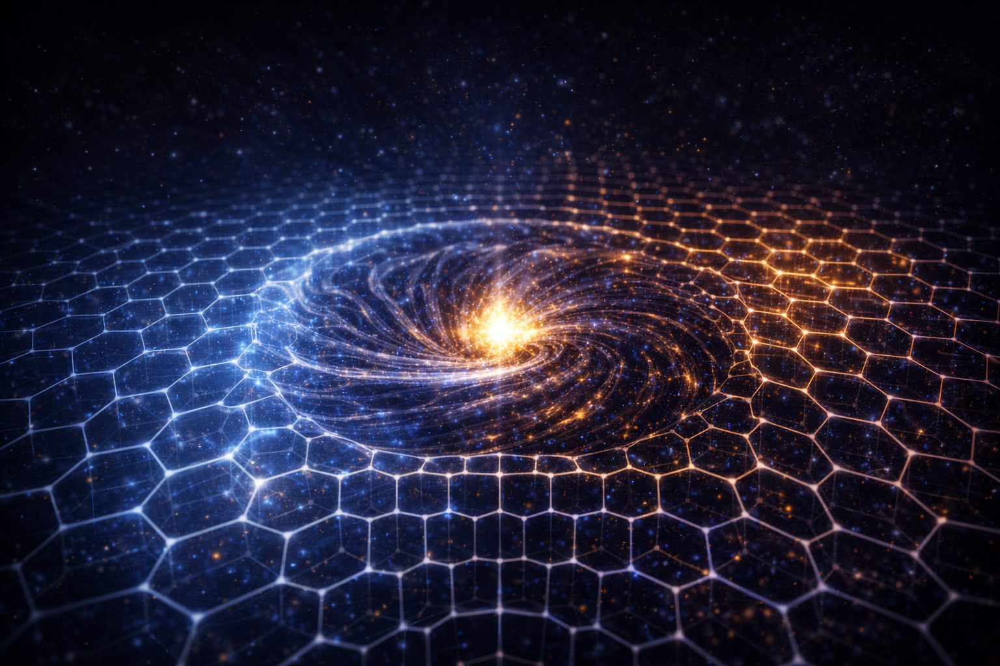

# 09. 아인슈타인과 보어는 왜 화해하지 못했는가?

## 과학의 진보: 우주를 바라보는 관점의 변천

아인슈타인과 보어의 논쟁을 이해하기 위해서는, 인류가 우주의 힘을 이해해 온 역사적 궤적을 살펴볼 필요가 있다. 새로운 관점의 등장은 기존 이론이 설명하지 못하는 한계를 극복하며 더 넓은 세계로 나아가는 과정의 연속이었기 때문이다.
즉 08장에서 드러난 미시-거시 충돌을, 이 장에서는 논쟁의 배경과 전제 차이로 분해해 읽는다.

- **[검증됨]** 역사적 사실과 표준 이론의 핵심 성과는 기존 물리학 서술을 따른다.
- **[가설]** SALT는 거시/미시 간 긴장을 보셀 상태 해석으로 재구성한다.
- **[예측]** 동일 변수 집합으로 상대론/양자 채널의 연결식이 제시되어야 한다.

아인슈타인의 일반 상대성 이론이 발표되기 전까지, 세상의 모든 힘과 작용은 **뉴턴 역학(1642~1727)**으로 설명되었다. 뉴턴은 만유인력과 세 가지 운동 법칙을 통해 고전 물리학의 거대한 토대를 세웠다. 하지만 이후 과학의 발전에 따라 미시 세계의 입자 수준이나 초거대 우주의 상호작용에서 뉴턴 역학만으로는 설명되지 않는 현상들이 발견되기 시작했다.

1865년 맥스웰은 전자기 이론을 정립했다. 이를 잇는 흐름에서 **아인슈타인(1879~1955)**은 거시 중력의 한계를 넘어 **일반 상대성 이론**을, **닐스 보어(1885~1962)**는 미시 상호작용을 설명하는 **양자역학**을 제시했다. 이후 하이젠베르크·슈뢰딩거·디랙의 기여로 전자기력·강력·약력의 이론 틀이 갖춰졌다.

이후 물리학은 거시의 GR과 미시의 3대 힘 이론으로 나뉘어 발전했다. **리처드 파인만(1918~1988)**은 양자역학과 특수상대론을 결합한 QED를 세웠고, 뒤이어 QCD가 정립되며 표준모형이 완성됐다. (상세 연원과 SALT 해석은 부록 21장)

### 6줄 타임라인: 독자의 위치 확인

1. **1687**: 뉴턴, 고전역학과 만유인력 법칙 정식화.
2. **1865**: 맥스웰, 전자기 방정식 체계 확립.
3. **1905~1915**: 아인슈타인, 특수/일반 상대성 이론 완성.
4. **1920~1930년대**: 보어·하이젠베르크·슈뢰딩거·디랙, 양자역학 체계화.
5. **1940~1970년대**: QED 정립, 이어 QCD와 전약 이론 성립.
6. **현재**: GR과 양자이론의 통합 문제(양자중력/통일장) 지속 탐색.

아인슈타인은 말년까지 중력과 전자기를 함께 설명할 **통일장 이론**을 연구했지만 완성하지 못했다. 이후에도 초끈이론, 루프양자중력, 초대칭, M-이론, 트위스터 이론 등이 시도됐으나 아직 확정적 결론은 없다.

거시와 미시를 통합하는 이 간극을 좁히는 날, 비로소 우주의 모든 현상을 단 하나의 원리로 설명하는 **'만물 이론'**이 탄생할 것이다. SALT는 바로 이 통합의 여정에서, 기존 패러다임이 마주한 한계를 명쾌하게 풀어내는 새로운 실마리를 제시하고자 한다.

## 두 거인의 대화가 통하지 않았던 이유

솔베이 회의에서 아인슈타인과 보어는 우주의 본질을 두고 격렬한 토론을 벌였다.

> 아인슈타인: "신은 주사위 놀이를 하지 않는다."
>
> 보어: "아인슈타인, 신에게 명령하지 말게."

이 논쟁은 100년이 지난 지금까지도 물리학계의 가장 큰 딜레마로 남아있다. **결정론**과 **확률론**. 거시 세계의 확실성과 미시 세계의 불확정성. 왜 우주는 두 가지 다른 규칙으로 작동하는 것처럼 보일까?

SALT는 이 질문에 대해 이렇게 정리한다.  
**"둘 다 일부는 맞고, 일부는 틀렸다."**

우주는 주사위를 굴리지 않는다(아인슈타인 승). 하지만 우주의 해상도가 유한하기 때문에, 우리는 결과를 확률로밖에 볼 수 없다(보어 승).

앞 장인 **08장(양자역학)**에서 우리는 입자가 '확률 구름'이 아니라 '고속으로 진동하는 단일 점의 시간 궤적'임을 확인했다. 이제 이 관점이 어떻게 상대성이론과 양자역학의 모순을 해결하는지 살펴보자.

 

 

- **아인슈타인의 믿음 (명확한 실체성)**: "신은 주사위 놀이를 하지 않는다." 그는 확률 뒤에 숨겨진 **'명확한 실체'**가 있다고 믿었다. 달은 우리가 보지 않아도 저기에 떠 있어야 한다고 생각했다.
- **보어의 발견 (확률적 본질)**: "우주는 보셀로 깨져 있다." 그는 에너지가 뚝뚝 끊어진 덩어리(양자)로 거래된다는 사실, 즉 우주에 '최소 해상도'가 있음을 직시했다.

---

::: {.note-theory}
**참고: 얽힘: 빛보다 빠른 유령인가?**

핵심 쟁점은 **양자 얽힘**이었다. 한쪽 상태를 정하면 다른 쪽이 즉시 정해지는 듯 보이기 때문이다.

SALT는 여기서 아인슈타인의 **'입체 구조적 실체론'**에 손을 들어준다.

- 두 입자는 "사후 통신"보다 "초기 쌍 상태 보존"으로 해석할 수 있다.
- 따라서 얽힘 신호는 정보의 초광속 전달이라기보다, 초기 조건의 상관 확인으로 읽는다.
:::

### 벨의 부등식 위배: 같은 데이터, 다른 해석

여기서 독자가 반드시 구분해야 할 점이 있다. **실험 결과는 하나**지만, 그 결과를 해석하는 **해석의 철학**은 하나가 아니다.

1. **실험적 사실 (합의된 결과)**  
1982년 알랭 아스페 실험, 2015년 전후의 주요 허점 없는 벨 검증들, 그리고 2022년 노벨상으로 이어진 흐름은 분명하다.  
**벨의 부등식은 반복적으로 위배되었고**, 단순한 국소적 숨은변수 모형은 유지되기 어렵다는 점이 실험적으로 강화되었다.

2. **주류 물리학의 결론 (표준 해석의 방향)**  
주류는 보통 "국소성 + 실재성 + 측정독립성(이른바 자유의지 가정)"을 동시에 붙잡을 수 없다고 본다.  
그 결과, 해석에 따라 비국소 상관 또는 관측 전 상태 기술의 제한을 받아들이되, **초광속 정보전송은 허용하지 않는다(무신호성 유지)**는 쪽으로 정리한다.

3. **SALT의 해석 (초결정론 + 기계적 실재론)**  
SALT는 벨 위배 결과를 인정하면서도, "관측이 상태를 창조한다"거나 "사후 초광속 통신이 필요하다"는 결론을 채택하지 않는다.  
대신 존 벨의 전제 가운데 **측정독립성(자유의지 가정)**을 내려놓는 초결정론 경로를 택한다. 즉 얽힌 입자쌍의 상태는 생성 순간 이미 입체 구조적으로 결맞게 고정되어 분리되며, 이후 상관은 플랑크 스케일의 초고속 세포 자동자적 규칙 위에서 결정론적으로 전개된다고 본다. 이 해석은 제라르트 't 호프트가 제시한 초결정론적 시도와 문제의식을 공유한다.

핵심은 이것이다. **SALT는 실험을 부정하지 않고, 실험 결과의 해석 프레임을 바꾼다.**  
즉 "벨 위배 = 비국소 초광속 영향"으로 곧장 등치하지 않고, "벨 위배 = 벨의 전제 중 무엇을 포기할 것인가"라는 선택 문제로 다시 배치한다.

> 핵심: 벨 위배는 실험 사실이고, 쟁점은 그 사실을 어떤 전제 완화로 해석할지에 있다.

### SALT 확장 해석: 공유 상태와 논리적 인접성

위 해석(초결정론)은 SALT의 한 경로다. 여기에 더해, SALT 관점에서는 **비국소적 실재론**에 가까운 대안 해석도 가능하다. 핵심 아이디어는 다음과 같다.

1. **논리적 인접성**  
3차원 거리(멀다/가깝다)는 관측 채널에 나타난 결과일 수 있다. 얽힌 두 입자는 공간상으로 멀어 보여도, 상태공간의 공유 상태 지도에서는 같은 참조를 공유하는 하나의 상태로 연결될 수 있다.

2. **전이의 동시성**  
한쪽 측정은 "멀리 있는 다른 입자로 신호를 보낸다"기보다, 상태공간 내부의 공유 상태를 원자적으로 확정하는 입력으로 해석할 수 있다. 이 경우 상관은 초광속 통신이 아니라 **기저 동역학의 단일 상태 확정**으로 읽힌다. 무신호성(신호 전달 금지) 조건은 유지하되, 상관 생성의 구현 레이어를 다르게 보는 것이다.

3. **초결정론과의 차이**  
- 초결정론: 생성 시점의 초기 조건 결맞음(과거 제약)을 강하게 둔다.  
- 공유 상태 해석: 현재 시점에도 구조적 연결(동일 상태 참조)을 허용한다.  
둘 다 벨 위배 결과를 수용하지만, 어떤 전제를 완화하는지(측정독립성 vs 구현 레이어)에 차이가 있다.

요약하면 SALT는 얽힘을 "비상식적 마법"이 아니라, **관측 공간(3D)과 상태공간의 분리**에서 생기는 현상으로 해석한다.

> 핵심: SALT의 해석은 '초광속 통신'이 아니라 '공통 상태의 동시 갱신'을 가정한다.

### 예언은 정보 부족의 결과다
우리가 양자역학을 신비롭게 느끼는 이유는 단순하다. **과정의 내부를 못 봤기 때문**이다.

예를 들어 신발 짝맞춤 과정을 못 보면, 서울의 왼쪽 신발을 보고 뉴욕의 오른쪽 신발을 맞춘 사람을 "예언자"처럼 볼 수 있다. 하지만 제작 과정을 아는 사람에게는 자연스러운 결과다.

결국 **"신은 주사위 놀이를 하지 않는다"**는 말은, 내부 선택 과정을 볼 수 있다면 확률처럼 보이던 것도 인과로 읽을 수 있다는 뜻이었다.

---

## 수학적 재앙: 보셀 내부를 미분하려 한 대가

이 두 이론을 억지로 합치려고 시도하는 순간, 수학적 재앙이 닥친다. 아인슈타인의 **'매끄러운 중력 방정식'**을 보어의 **'보셀 세상'**에 강제로 대입하면, 방정식은 **무한대($\infty$)**라는 괴물을 뱉어내며 폭발한다.

왜 그럴까? 7장에서 정의했듯이 보셀은 우주의 최소 단위다. 하지만 상대성이론의 수학은 공간을 무한히 쪼갤 수 있다고 가정한다. 즉, **"보셀 하나를 억지로 쪼개서 그 내부를 계산하려 한 것"**이다.

존재하지 않는 공간($0$)까지 나눠 계산하면 값이 발산한다. 쉽게 말해 최소 해상도 아래까지 계산하려다 시스템이 멈추는 상황과 비슷하다. 이것이 재규격화 문제의 핵심이다.

- **국소 인과 상한**: 빛의 속도 $c$는 보셀 매질에서 정보가 인접 지점으로 전이될 수 있는 **인과율의 물리적 상한선(한 시간의 흐름당 1보셀)**이다.
- **동역학 자원과 지연**: 중력이 강해 보셀 밀도가 높아진 곳은, 같은 거리를 가는 데 밟아야 할 '물리적 보셀 개수'가 많아진다. 이는 **동역학 자원**이 더 많은 지점에 분산됨을 의미하고, 외부에서 보면 인과적 전이 순서가 더 많은 지점을 거치느라 느려지는 것처럼 보이게 된다.
- **로렌츠 대칭의 보호**: 이 지역의 관찰자가 재는 국소적 광속($c$)이 여전히 일정한 이유는, 관찰자와 측정 도구 역시 동일한 매질의 **국소 인과 상한**에 묶여 있기 때문이다. 이는 체계가 붕괴하지 않도록 고에너지 대칭 위반 잡음을 **방사**하며 스스로를 복원하는 **고정점** 동역학의 결과이다.
- 정리하면, 국소 한계로서의 $c$는 유지되며 관측 채널의 지연은 \(c_{\mathrm{eff}}(\rho)\)로 기술한다.

시간은 신비로운 고무줄이 아니다. 단지 **'보셀의 밀도'가 만들어낸 입체적 경로의 연장**이자, 그에 따른 **전이 부담의 증대**일 뿐이다.

::: {.note-theory}
**핵심 직관: 장 방정식이 말하는 것**
:::
아인슈타인 장 방정식은 한 문장으로 요약하면 다음과 같다.  
**"무대(시공간)의 휘어짐은, 그 위의 내용물(질량·에너지) 배치로 정해진다."**

왼쪽 항들은 무대의 기하학(곡률), 오른쪽 항은 내용물의 상태(에너지-운동량)다.  
즉, 질량과 에너지가 공간의 '기울기 지도'를 만들고, 물체와 빛은 그 지도를 따라 자연스러운 경로(측지선)로 움직인다.  
SALT 언어로 바꾸면, **좌변은 보셀 밀도 지형**, **우변은 보셀 내부 에너지 상태**이며, 중력은 '당기는 힘'이라기보다 **유효 경사도(\(-\nabla\mu\), 저차 근사 \(-\nabla\rho\))를 따라 활강하는 흐름**으로 읽힌다.

::: {.note-theory}
**정밀 해설: 아인슈타인 장 방정식 해석 가이드**
:::
\[
R_{\mu\nu} - \frac{1}{2}R\,g_{\mu\nu} + \Lambda g_{\mu\nu}
= \frac{8\pi G}{c^4}T_{\mu\nu}
\]

- **표기 원칙**: 우주상수는 \(A\)보다 \(\Lambda\) 표기를 기본으로 쓴다. (필요 시 \(A \equiv \Lambda\) 병기)
- **보존 법칙 정합**: \(-\frac{1}{2}R g_{\mu\nu}\) 항은 축약 비안키 항등식과 함께 \(\nabla^\mu G_{\mu\nu}=0\)을 보장하며, 결과적으로 \(\nabla^\mu T_{\mu\nu}=0\)과 일치한다.
- **왜 \(8\pi\)인가**: 결합 계수 \(\frac{8\pi G}{c^4}\)는 약한 장·저속·정적의 뉴턴 극한에서 \(\nabla^2\Phi=4\pi G\rho\)를 정확히 재현하도록 고정된다.
- **SALT 해석의 위치**: "좌변=보셀 밀도 기하, 우변=보셀 내부 에너지 상태"는 GR 수학을 대체하는 식이 아니라, 같은 식에 대한 물리적 해석 레이어다.

## SALT의 중재: 거품과 큐브의 상전이

그렇다면 둘 중 하나는 틀린 것일까?
SALT는 7장의 '탄성 보셀' 개념을 가져와 이 싸움을 중재한다.

**"보셀은 고정된 벽돌이 아니라, '내부 에너지의 양'에 따라 상태가 변하는 가변적 탄성체다."**

이해를 위해 한 가지 전제를 명확히 해야 한다. 보셀은 공간의 최소 단위이며, 보셀과 보셀 사이에 **빈 공간은 존재하지 않는다.**

맥주 거품이 잔을 채우듯, 보셀도 서로 맞물려 공간을 채운다. 차이는 칸 수보다 각 칸의 **변형 정도(꼬임)**다.

**①** **저에너지 상 (이완된 물결 = 상대성이론)**:
- **상황**: 보셀들의 위상이 **이완**된 상태다. 위상 장력이 낮을수록 보셀 간의 에너지 단차가 작아 부드러운 **층류**를 형성한다. 이 상태에서는 보셀 개별의 경계가 무의미할 정도로 정보가 매끄럽게 전달된다.
- **특징**: 멀리서 보면 끊어짐이 없는 **매끄러운 연속체**처럼 보인다. 이것이 아인슈타인의 유체 공간이다.

**②** **고에너지 상 (격렬한 장력 = 양자 역학)**:
- **상황**: 보셀들이 **극도로 비틀리고 장력이 걸린** 상태다. 장력이 집중될수록 보셀 하나의 물리 해상도 범위(플랑크 단위) 내에서 처리해야 할 에너지 밀도가 극대화되며, 이웃 보셀과의 에너지 차이가 극명한 **난류**를 형성한다.
- **특징**: 보셀의 고정된 격자 경계(픽셀)가 선명하게 드러나며 **뚝뚝 끊어진 양자적 행동**이 지배한다. 이것이 보어의 양자 공간이다.

상대성이론과 양자역학은 서로 다른 우주가 아니라, **같은 보셀 격자가 '층류 위상'인지 '난류 위상'인지, 즉 위상 에너지가 얼마나 '강력'한지에 따라 드러나는 두 가지 모습**일 뿐이다.

 

 

::: {.note-theory}
**참고: Q. 보셀의 변형 패턴을 인위적으로 설계할 수 있는가?**

이 질문은 입체 구조적 통찰의 결정판이다. 만약 보셀의 변형 상태(이완/꼬임)가 공간의 물리적 성질을 결정한다면, 반대로 **우리가 에너지로 보셀의 꼬임 패턴을 인위적으로 설계한다면, 우주 자연계에 존재하지 않는 '제5의 물질 상태'를 창조할 수 있다는 뜻인가?**

SALT의 대답은 **"이론적으로 가능성이 있다"**이다.

- **현재의 상태**: 우리는 이완된 보셀(진공)과 강하게 꼬인 보셀(질량) 사이의 자연적 변형만 관찰해왔다.

- **미래의 가능성 (공간 공학)**: 만약 강력한 고에너지 장을 이용해 보셀들을 **자연계에 없는 비대칭 꼬임**이나 **나선형 변형 무늬**로 강제 배열시킨다면, 관측 가능한 전달/결속 특성의 이례적 변화가 나타날 가능성이 있다.

- 이것이 바로 16장에서 다룰 **'공간 공학'**의 핵심 원리이다. 우리는 단순히 입자를 부딪히는 것이 아니라, 입자의 배경이 되는 **무대(보셀의 변형 무늬) 자체를 재설계**할 수 있다.
:::

 

## 블랙홀: 꼬여 들어간 매듭 다발

그렇다면 이 압축이 극한에 달하면 무슨 일이 일어나는가? 뒤틀린 보셀들이 겹겹이 쌓여 한계를 넘어설 때, 우리가 '블랙홀'이라 부르는 존재가 나타난다.

이 관점에서 블랙홀을 다시 보면, '특이점'의 모순이 사라진다.

기존 이론이 블랙홀 중심에서 붕괴하는 이유는, 보셀의 존재를 무시하고 부피가 '0'이 될 때까지 무한히 압축하려 했기 때문이다.
하지만 SALT의 보셀은 **부피가 고정된 최소 단위**다. 보셀보다 더 작은 공간은 존재하지 않는다.

블랙홀은 처음부터 초대형이 아니었다. 작은 질량들이 하나씩 합쳐지는 과정 — 두 개의 와류가 하나로 엉기는 과정 — 이 무수히 반복된 결과다. 따라서 블랙홀의 중심은 '무한 밀도의 점'이 아니다. 그것은 **보셀은 그대로 둔 채 수많은 와류들이 내부 상태 공간에서 겹겹이 꼬여 들어간 '위상적 적층'의 극한**이다.

우리가 이를 '무한 밀도'라 부르는 이유는, 고정 해상도 안에서 위상 복잡도를 더는 분해·기술하지 못하는 **위상적 포화** 때문이다. 보셀 매질의 상태 수용 한계(VIC)를 넘으면 해당 구역 상태 전이가 정지하고, 정보는 사라지지 않은 채 내부 상태 공간에 **적층**되어 동결된다.

 

 

## 진정한 통합을 향하여

우리는 이제 아인슈타인과 보어의 오랜 전쟁을 끝낼 논리를 완성했다.
우주는 **'탄성 보셀들의 네트워크'**다. 이 보셀들은 항상 빈틈없이 공간을 채우고 있지만, 각 보셀의 에너지가 낮으면(이완) 매끄럽게 흐르고(중력), 에너지가 높으면(뒤틀림) 뚝뚝 끊어진다(양자). 이 **'에너지 밀도에 따른 상태 변화'**야말로 두 거인을 화해시킬 열쇠다.

하지만 통합으로 나아가기 전에 우선 짚고 넘어갈 거대한 오해가 하나 있다. 바로 **'력'**과 **'파'**의 구분이다.

### 력과 파의 차이: 상태와 전달

우주를 이해할 때 우리가 가장 흔히 혼동하는 것이 바로 '힘(력)'과 '파동(파)'의 차이다. 보셀 모델은 이를 매우 명쾌하게 구분한다.

**①** **력: 고착된 상태**
- 보셀이 특정 방향으로 변형된 채 **유지**되고 있는 상태다. 이 '변형의 강도'가 주변 보셀에 가하는 지속적인 압박이 바로 힘이다.
- **전자기력**: 보셀이라는 고무공 표면을 손으로 **'위상 회전시켜 잡아둔 상태'**다. 손을 놓으면 바로 풀리려 하지만, 매듭(전하)이 버티고 있어 주변에 팽팽한 장력을 유지한다.
- **강력**: 단순히 비틀린 정도가 아니라, 보셀 가닥들이 서로 엉켜 **'소성 맞물림'** 되어버린 상태다. 자물쇠가 잠기듯 구조 자체가 고정되어 있어, 전자기력과는 비교도 안 되는 극한의 장력을 만든다.

**②** **파: 상태의 전달**
- 보셀의 변형 상태가 제자리에 머물지 않고 옆 보셀로 **전이**되는 과정이다. 보셀 격자라는 매질 위를 타고 에너지가 '바통 터치'되듯 퍼져나가는 현상이다.
- **전자기파**: 고무공들의 위상 회전 응력이 옆 공으로 전달되는 과정이다.
- **중력파**: 고무공들의 부피가 떨리는 진동이 전달되는 과정이다.

우리는 지금까지 습관적으로 **"중력은 왜 이렇게 약한가?"**라고 탄식했다. 보셀들이 만들어내는 강력한 전자기력에 비해 $10^{40}$배나 약해 빠진 이 초라한 힘의 정체를 궁금해했다.

하지만 보셀 관점에서 이것은 **질문에 대한 전제부터가 틀렸다.**

**전자기력**은 보셀들이 비틀린 채 그 자리에 머물며 격자에 가하는 **'정적 응력'**이다.
**중력**은 와류 구조(질량)가 가동되며 공간 매질을 빨아들이는 **'동적 흐름'**일 뿐이다.

우리는 그동안 '스프링 탄성(전자기력)'과 '바닥 경사(중력)'를 같은 척도로 비교해 왔다. 성격이 다른 항목이라 큰 수치 차이가 나는 것이 자연스럽다.

그렇다면 진짜 질문은 이것이어야 한다.
**"우리가 힘이라고 착각할 정도로, 보셀들의 배열 (무대)을 휘어지게 만드는 진짜 원인은 무엇인가?"**

::: {.note-theory}
**최종 정리: 보셀로 본 힘(력)과 파동(파)의 매트릭스**
:::

이 구분을 머릿속에 넣고 아래 표를 보면, 왜 각 상호작용이 힘과 파동이라는 두 얼굴을 **가지는지** 그 기계적 실체가 명확히 보일 것이다.

| 상호작용 | **힘(력) - 고착된 상태** | **파동(파) - 전달되는 전이** |
| :--- | :--- | :--- |
| **중력** | **공간 흡수 흐름** (유효 경사도 \(-\nabla\mu\), 저차 \(-\nabla\rho\)) | **중력파: 부피 진동** (격자의 수축·팽창 전달) |
| **전자기력** | **표면 위상 회전** (보셀 격자의 회전 응력 긴장) | **전자기파(빛): 위상 회전 전달** (옆 보셀로 회전 응력을 전이) |
| **강력** | **소성 맞물림** (보셀 연쇄가 엉킨 물리적 매듭) | **글루온 진동: 잠금의 공명** (강한 결합선 위의 에너지 떨림) |
| **핵력** | **잔류 유효 결속** (강력 결속이 핵자 바깥에 남긴 근접 결속) | **잔류 격자 진동** (결합된 핵 주변의 미세한 떨림 전파) |
| **약력** | **입체 구조적 미끄러짐** (보셀 무늬가 어긋나며 이완) | **붕괴 파동: 무늬의 재배열** (변화된 정보가 옆으로 퍼짐) |

 

## 거대한 통합: 무대와 배우의 화해

결국 아인슈타인과 보어의 논쟁은 '무대와 배우'를 어디에 두느냐의 차이였다. 아인슈타인은 무대(공간)를, 보어는 배우(입자)를 더 앞세웠다.

SALT는 이 둘을 **'보셀의 입체적 상태'**라는 하나의 언어로 통합한다. 고도로 응축된 보셀 매듭은 입자가 되고, 그 매듭이 주변 무대를 기울게 만드는 흐름은 중력이 된다. 이제 우리는 전자기력보다 **$10^{40}$배**나 가냘픈 이 초라한 중력이 어떻게 우주의 거대한 구조를 떠받치고 있는지, 그 '계층의 비밀'을 파헤쳐 볼 준비가 되었다.

### 반증 조건

SALT는 다음 관측에서 명확히 틀릴 수 있다.
1. 강한 중력장에서 공간 밀도 지표와 시간 지연(또는 적색편이)이 통계적으로 상관되지 않을 때.
2. 동일한 유효 경사도(\(-\nabla\mu\), 저차 \(-\nabla\rho\)) 조건에서 예측한 흐름(중력) 경로와 관측 궤적이 체계적으로 불일치할 때.
3. 위상 잠금 기반 강력 해석이 고에너지 충돌 데이터의 결속/분해 패턴을 재현하지 못할 때.

이 논쟁을 지나면 통합의 다음 장애물이 남는다. 왜 같은 우주의 상호작용인데도 중력만 유독 약하게 보이는가? 다음 장에서는 이 위계 문제를 "원거리 희석된 배경 장력"이라는 관점에서 본격적으로 다룬다.

다음 장, **10. 왜 중력만 유독 약한가?**
