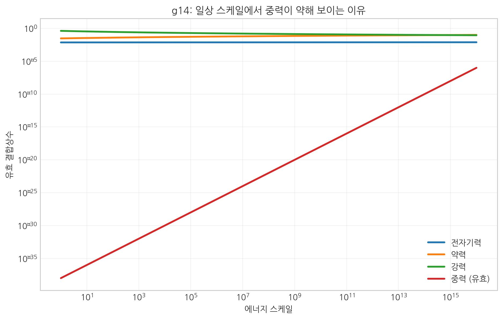
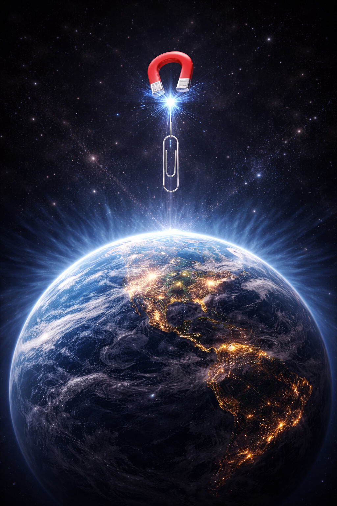
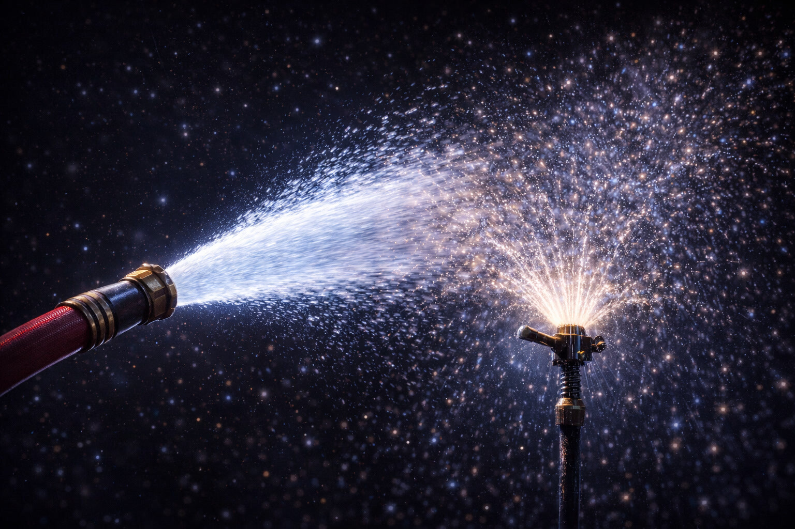
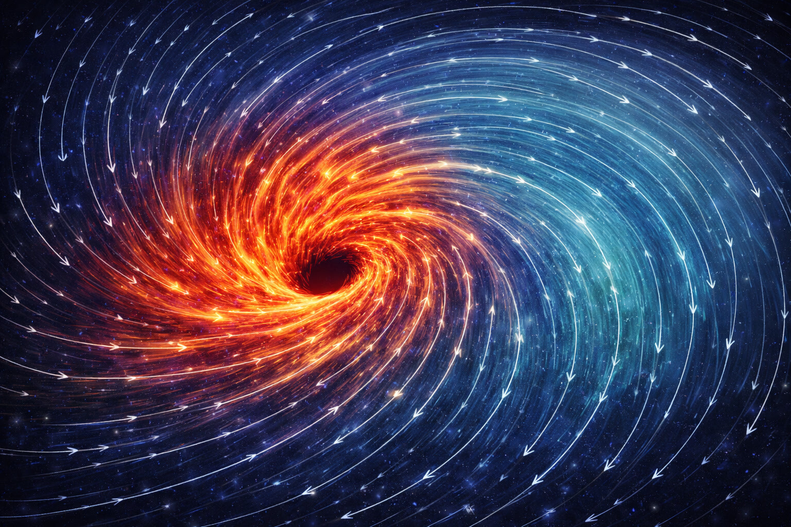

# 10. 왜 중력만 유독 약한가?

## 계층 문제

> 핵심: 상호작용 세기는 스케일에 따라 다르게 보이며, 중력의 "약함"도 관측 스케일의 표현으로 재해석된다.

우주에는 흔히 4가지 기본 힘이 존재한다고 알려져 왔지만, SALT는 공간 매질의 잔류 효과인 핵력을 포함하여 총 **5가지 물리적 발현**을 추적한다.
그런데 이들 사이에는 기이할 정도의 불균형이 존재한다. 바로 **중력이 유독 약하게 보이는 현상**이다.
즉 09장에서 정리한 통합 틀 위에서, 이 장은 그 불균형의 정체를 스케일과 관측 위치의 문제로 재해석한다.

- **[검증됨]** 힘의 위계 수치와 약장 검증(PPN)은 관측적으로 확립되어 있다.
- **[가설]** SALT는 중력 약함을 원거리 희석/배경 장력 투영으로 해석한다.
- **[예측]** 고밀도·강중력·고에너지 채널에서 위계 기원에 대한 구별 신호가 나와야 한다.

전자기력은 중력보다 약 \(10^{40}\)배 강하게 관측된다. 작은 자석이 지구 중력보다 강하게 클립을 들어 올리는 장면이 대표적이다. 강력은 전자기력보다도 더 강하다(약 137배).
왜 중력만 이렇게 약하게 보이는가? 이것이 **계층 문제**다.

초끈이론은 "중력이 다른 차원으로 새어 나가서 약하다"라고 설명하려 했다. 하지만 SALT의 설명은 훨씬 직관적이고 입체 구조적이다.

**"중력이 약한 것이 아니다. 중력은 공간 전체의 '배경 장력'이 만들어내는 기울기 힘이기 때문이다."**

우리는 **07장(시간과 밀도)**에서 공간이 얼마나 **'뻣뻣한'** 매질인지 확인했다. (중력 상수 $G$가 작다는 것은 공간의 강성이 엄청나게 크다는 뜻이다.)

이제 이 '공간의 강성'과 '중력의 약함' 사이의 비밀스러운 관계를 밝혀보자.

 

 

이 숫자의 격차는 상상을 초월한다. 물리학자들은 이 부자연스러운 불균형을 **위계 문제**라고 부른다.

> **수치 방어막 (10장, 기존 검증 사실)**
> - 양성자-양성자 상호작용에서 전자기력/중력 비는 대략 $10^{36}$ 규모다.
> - 중력의 약전장 검증에서 PPN 계수는 GR 예측값(γ=1, β=1)과 높은 정밀도로 일치한다.
>
> **SALT 해석 가설**
> - SALT는 이 "약함"을 별도 힘의 열세가 아니라, 강력 핵심 모드가 원거리에서 잔여 흐름으로 희석된 결과로 해석한다.

## 숨겨진 차원으로 새어나가는가?

현대 물리학, 특히 **끈 이론**은 이 문제를 해결하기 위해 **'여분 차원'**이라는 아이디어를 내놓았다.
"중력은 원래 강한데, 우리가 살고 있는 3차원 공간 밖의 다른 차원으로 힘이 줄줄 새어나가고 있어서 우리에게만 약하게 느껴지는 것이다."

비유하면, 호스 물줄기(전자기력)는 한 방향으로 세고, 스프링클러(중력)는 사방으로 퍼져 약해 보인다는 논리다. 다만 가속기 실험에서 이런 '차원 누수' 신호는 아직 직접 검출되지 않았다.

### 비유-수식/관측 1줄 대응

- **스프링클러 비유 대응**: 힘 희석 해석은 \(1/r^2\) 감쇠와 비교되며, 현재까지는 추가 차원 누수 신호가 직접 검출되지 않았다.
- **회전 배수구 비유 대응**: SALT의 와류 중력 해석은 기울기 구동(\(-\nabla\mu\), 저차 근사 \(-\nabla\rho\))으로 정식화된다.
- **고무줄 뭉치 비유 대응**: 고밀도 구간의 결속은 강력(내부 잠금), 외곽의 완만한 잔류가 중력(외부 흐름)으로 관측된다는 층위 구분과 대응된다.

 

 

### 입체 구조적 희석: 보셀 밀도의 기울기

"그렇다면 그 '기울기'의 물리적 실체는 무엇인가?"
SALT에서 기울기란 추상적인 수학이 아니다. 그것은 **'유효 경사도(\(-\nabla\mu\), 저차 근사 \(-\nabla\rho\))'**로 기술되는 상태량의 변화율이다.

우주를 거대한 **보셀 격자**로 보자.
질량이란 수조 개의 보셀이 한 점으로 구겨져 들어간 **'매듭'**이다. 이 매듭을 중심으로 주변 보셀들의 밀도가 어떻게 변하는지가 곧 **힘의 정체**다.

**①** **강력 - 보셀의 극한 압축**: 매듭 중심부($r \approx 0$)에서는 보셀들이 탄성 한계 근처까지 몰리고, 옆 보셀과 구분이 어려울 정도로 짓눌린다. 그 결과 밀도 변화율(기울기)이 절벽처럼 가파르게 나타나 결속력이 매우 크게 관측된다.

**②** **중력 - 보셀의 미세 변형**: 매듭에서 멀리 떨어진 외곽($r ≫ 0$)에서는 중심 긴장이 퍼지며 보셀이 미세 수축 상태를 이룬다. 보셀 크기는 변하지 않고 내부 위상 적층만 $0.00000000...1\%$ 수준으로 증가하므로 밀도 차이가 작고, 기울기도 평지처럼 완만해 약한 힘으로 관측된다.

**결국 '기울기'란 유효 경사도(\(-\nabla\mu\), 저차 \(-\nabla\rho\))가 거리 따라 얼마나 급격히 변하는가이다.**
- **강력**: 보셀들이 다중 층위로 빽빽하게 **적층**되어 있는 구간 (급격한 위상차).
- **중력**: 보셀들이 아주 살짝 **'포개져'** 있는 구간 (미세한 위상차).

대상은 하나다. 단지 **'보셀이 뭉친 정도'**가 거리(희석)에 따라 달라질 뿐이다.

::: {.note-theory}
**핵심 직관: 왜 직선으로 떨어지지 않고 소용돌이치는가?**
:::
당신은 여기서 아주 날카로운 질문을 던져야 한다.
**"단순한 경사면이면 직선으로 내려가야 하는데, 왜 SALT는 소용돌이를 강조하는가?"**

그 이유는 이 경사를 만든 주인(질량)이 **'가만히 멈춰 있는 돌덩이'**가 아니기 때문이다.

**①** **뉴턴의 언덕 (정적)**: 질량을 멈춰 있는 쇠구슬, 주변 공간을 단순한 깔때기로 본다. 이 관점에서 물체는 직선으로 미끄러져 내려간다.
**②** **SALT의 언덕 (동적)**: 질량(매듭)을 주변 공간을 감아들이는 회전 구조로 본다(스핀이 없는 입자는 없음). 따라서 언덕은 정지 미끄럼틀이 아니라 회전 배수구에 가깝고, 물체는 나선형 경로를 따른다.

우리가 말하는 '기울기'는 고정된 비탈길이 아니라, **회전하는 물살의 기울기**다. 이것이 바로 아인슈타인이 말한 **'틀 끌림'**의 실체이자, SALT가 말하는 **'와류 중력'**의 핵심이다.

::: {.note-theory}
**정밀 해설: 단 하나의 법칙, 두 가지 상태**
:::

쿼크 내부와 외부는 다른 우주가 아니다. 둘 다 **'보셀의 위상 회전'**이라는 단 하나의 입체 구조적 원리로 작동한다.

그렇다면 왜 경계가 생기는가? 그것은 보셀이라는 매질이 버틸 수 있는 **'탄성 한계'**가 존재하기 때문이다.

SALT는 이 경계를 **[소성 변형]**과 **[탄성 변형]**의 차이로 설명한다.

**①** **내부: 포화 상태**: 중심부 꼬임 밀도가 탄성 한계를 넘으면 보셀은 제자리 복원력을 잃고 소성 맞물림으로 고착된다. 이 구간은 기울기 최댓값이 고정된 수직 절벽에 해당하며, 강력으로 관측된다.
**②** **외부: 비포화 상태**: 탄성 한계 이하에서는 꼬임이 풀린 채 보셀이 엉겨 붙지 않고 중심부 꼬임에 의해 당겨진다. 탄성력이 살아 있어 거리 따라 부드럽게 풀리며, 기울기는 대체로 $1/r^2$ 형태를 따른다.
**③** **경계선: 쿼크 표면**: [꼬임 밀도 = 탄성 한계]가 되는 전이 지점이다. 이 경계를 넘으면 보셀은 복원력을 잃고 강력 영역으로 고착된다.

결국 **법칙은 하나(위상 회전)**다. 차이는 그 회전이 **한계치를 넘었는가(강력), 넘지 않았는가(중력)**다. 물이 얼어도 물 분자(H2O)라는 점은 변하지 않는 것과 같다.

::: {.note-theory}
**핵심 직관: 밀도가 높은데 왜 당기는가?**
:::
여기서 당신은 고개를 갸웃거릴 수 있다.
**"보통 밀도가 높으면 터질 듯이 팽창해서 밀어내야(척력) 정상 아닌가? 왜 보셀은 밀도가 높을수록 더 강하게 당기는가(인력)?"**

이는 '기체' 직관으로 '탄성 고체'를 이해하려 할 때 생기는 오해다.

**①** **기체의 직관 (풍선) = 밀어냄**: 풍선 안 공기를 고밀도로 밀어 넣으면 분자 충돌이 커지며 바깥으로 밀어내는 압력이 생긴다.
**②** **보셀의 직관 (비틀린 수건) = 당김**: 보셀은 흩어진 기체가 아니라 연결된 탄성 그물망이다. 비틀림 밀도를 높이면 바깥 폭발보다 중심 조임이 커지고, SALT에서 말하는 밀도는 이 위상적 적층 밀도를 뜻한다.

즉, 강력과 중력이 작용하는 공간은 **[압축된 가스통]**보다 **[겹겹이 포개진 고무줄 뭉치]**에 가깝다. 고밀도일수록 밖으로 터지기보다 내부 상태 공간에서 더 깊게 **적층**된다.

### 중력 시간 지연: 왜 하필 블랙홀 근처에서 시간이 느려지는가?
>
> 07장과 09장에서 우리는 시간 지연을 **시간 자체 둔화보다 경로 연장·전달 지연**으로 해석했다. 이 원리는 중력장에서도 똑같이 적용된다.
>
>
> 중력이 강하다는 것은 **'공간의 적층 밀도'**가 높다는 뜻이다.
> - **지구 궤도**: 보셀 적층이 듬성듬성하다. 빛이 3차원적 1미터를 가기 위해 겪어야 할 위상 단계가 10개다. (빠르다)
> - **블랙홀 근처**: 보셀들이 위상학적으로 극도로 적층되어 있다. 같은 1미터 안에 보셀의 위상이 1,000,000단계나 겹겹이 포개져 있다. (느리다)
>
> 빛은 게으르지 않다. 블랙홀 근처에서는 **넘어야 할 위상 단계**가 너무 높아, 밖에서 느리게 보일 뿐이다. 중력 시간 지연의 실체는 **고밀도 적층 공간에서 경로가 크게 늘어나는 효과**다.

## SALT의 해답: 태풍의 눈과 산들바람

SALT는 차원을 늘리지 않고, **동적 공간 와류 + 자가 응축**으로 이 난제를 해석한다.
핵심은 다음 한 줄이다. **중력은 강력 매듭의 원거리 잔여 흐름이 만든 유효 경사도 효과**다. 양성자 질량의 대부분이 글루온 장 에너지라는 결과는, 이 내부 구조의 고에너지 응축을 뒷받침한다.

03장에서 우리는 질량이 보셀들이 꽉 뭉친 **'매듭'**임을 확인했다.

- **핵심 와류 (강력)**: 보셀 격자들이 서로 엇갈려 묶인 '입체적 잠금'의 핵이다. 이것이 원자핵을 붙드는 무지막지한 **강력**의 실체다.
- **잔여 흐름 (중력)**: 매듭에서 멀어질수록 꼬임의 격렬함은 약해진다. 그래도 공간을 미세하게 감아들이는 **완만한 기울기**는 남는다. 이것이 우리가 느끼는 **중력**이다.

### 공간 매질의 연속성: 장력의 거미줄

여기서 핵심 질문이 하나 더 필요하다. **"강력은 짧은 거리에서만 작용하는데, 왜 중력은 무한히 멀리 가는가?"**

그 해답은 바로 **공간 매질의 연속성**에 있다. 공간 보셀들은 서로 끊어진 조각이 아니라, 태초부터 지금까지 촘촘하게 맞물려 있는 하나의 거대한 격자다.

**①** **에너지는 갇혀도 장력은 흐른다**: 양성자 내부의 '소성 매듭(매칭)'은 그 자리에 고정되어 입자의 형태로 갇혀 있다(유폐). 하지만 이 매듭이 공간이라는 원단에 가하고 있는 **입체 구조적 긴장**은 매듭의 표면에서 뚝 끊어지지 않는다.
**②** **연쇄 반응**: 매듭이 인접 보셀을 당기면, 그 보셀이 다시 옆 보셀을 당긴다. 매질이 연속인 한 이 장력 전달은 멀리 이어진다. 강철 거미줄 한 점을 집으면 전체가 팽팽해지는 모습과 비슷하다.

우리가 느끼는 중력의 약함은, 핵 내부 강력 에너지가 공간 매질을 따라 멀리 퍼지며 아주 완만한 **배경 긴장**으로 나타난 결과로 해석할 수 있다.
우리는 지금껏 같은 현상을 거리에 따라 다른 이름으로 불러왔던 것이다. 초근접 거리의 비틀림은 '강력'이고, 원거리의 완만한 흐름은 '중력'이다.

 

 

## 질문: "작은 쿼크의 힘이 어떻게 거대한 지구의 중력이 되는가?"

### 하나로 연결된 밀도의 스펙트럼
그렇다면 원자 속의 강력과 지구가 달을 당기는 중력이 어떻게 본질적으로 같은가?

**"지구의 핵(강력)과 지표면(중력)은 서로 다른 두 개의 힘이 아니라, 단 하나의 '공간 와류 공식'에 의해 연결된다."**

즉, 거리($r$)가 0에 가까워져 와류의 회전 밀도가 극한으로 치솟으면 **강력(직접 결속)**이 되고, 거리가 멀어져 흐름이 완만하게 퍼지면 **중력(유효 경사도 효과)**으로 수렴한다는 것이다. 단순한 세기 차이가 아니라, **'매듭'이냐 '장'이냐의 입체 구조적 위상 차이**다.

**①** **개별 매듭의 와류**: 쿼크 하나하나가 주변 공간을 강력하게 휘감아 빨아들인다(**강력**).
**②** **원거리 희석**: 이 흡입력은 거리와 함께 급격히 약해지지만, 완전히 '0'이 되지는 않고 아주 미세한 **'잔여 와류'**를 먼 곳까지 뻗는다.
**③** **티끌 모아 태산**: 지구를 구성하는 $10^{50}$개의 원자가 만든 미세한 잔여 와류가 합쳐져 거대한 흐름을 만든다. 작은 물방울이 모여 큰 해류가 되는 것과 비슷하다.
**④** **거시적 중력 탄생**: 이 **통합된 흐름**이 비로소 거시적인 규모가 되어 공간의 결을 따라 달을 이동시킨다. 이것이 바로 **중력**이다.

## 예외: 전자기력은 왜 다른가?

여기서 한 가지 주의할 점이 있다. 전자기력은 이들과 계보가 다르다.
- **중력과 강력 (무대의 흐름)**: 공간 격자가 안쪽으로 말려 들어가는 **'바탕의 흐름'** 그 자체다. 무대(공간)가 통째로 움직이는 거대 입체 구조다.
- **전자기력 (표면의 응력)**: 그 흐름 위에서 보셀 격자가 서로 **비껴가며 위상 회전할 때** 발생하는 '나선형의 변형'이다.

중력과 강력은 욕조 물이 빠지는 **배수구 소용돌이의 세기 차이**(근거리/원거리)에 가깝다. 반면 전자기력은 **보셀 간 위상 회전 응력**에 가깝다. 즉 중력·강력과 전자기력은 발생 층위가 다르다.

## 자연이 보여주는 단서: 중성자별과 블랙홀의 경계

이 대담한 가설은 아직 실험실에서 직접 검증되지는 않았다(아직 우리는 양성자 내부의 중력을 측정할 기술이 없다). 다만 우주는 이미 거대한 실험실처럼 몇 가지 강한 단서를 보여주고 있다. 바로 **중성자별**과 **블랙홀**이다.

**①** **중성자별 (강력의 전시장)**: 태양급 질량이 도시 규모로 응축된 천체다. 이곳에서는 중력(외부 압력)과 강력(내부 반발)이 직접 균형을 이루며 맞선다.
**②** **블랙홀 (격자의 위상 포화)**: 만약 압력이 한계(태양 질량의 약 3배)를 넘으면, 보셀들은 더 이상 버티지 못하고 3차원적 투영을 최소화하며 내부 상태 공간에서 완전히 포개지는 **'적층 포화'** 상태로 전이한다.

이 현상은 무엇을 말해주는가? SALT는 이를 **중력과 강력이 같은 '공간의 와류' 계열에 속하고, 위상이 적층된 밀도(세기)에 따라 체급만 달라진다**는 방향의 단서로 읽는다. 만약 둘이 전혀 다른 계보의 힘이라면, 한 경계 조건 안에서 이렇게 직접 맞물리는 그림을 설명하기가 더 어려워진다.

## 위계 문제는 없다

결국 **위계 문제**는 자연의 오류보다, 범주를 섞어 본 데서 온 해석 문제다. '스프링 탄성(전자기력)'과 '바닥 기울기(중력)'를 같은 저울에 올려 비교하면 혼동이 생긴다.

중력이 본질적으로 약한 것이라기보다, 우리가 **근원(매듭 핵)**에서 멀리 떨어진 결과로 약하게 관측된다는 해석이 가능하다. 오히려 먼 거리에서도 작용이 남는 점이 핵심이다.

이제 우리는 공간이 어떻게 뭉쳐 물질(매듭)이 되고 힘(장력)을 만들어내는지 보았다. 다음 질문은 그 응축량을 어떤 기준으로 계량하느냐이다. 아인슈타인의 방정식 **E=mc²**는 바로 이 계량 규칙을 제공한다.

다음 장, **11. 물질은 어떻게 에너지가 되는가?**
