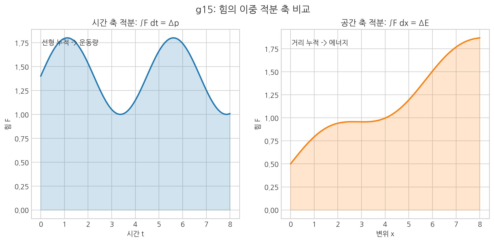
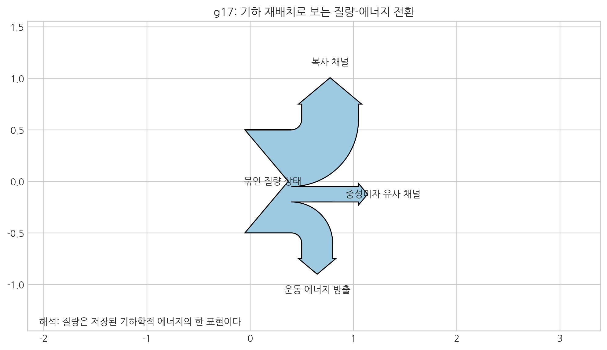
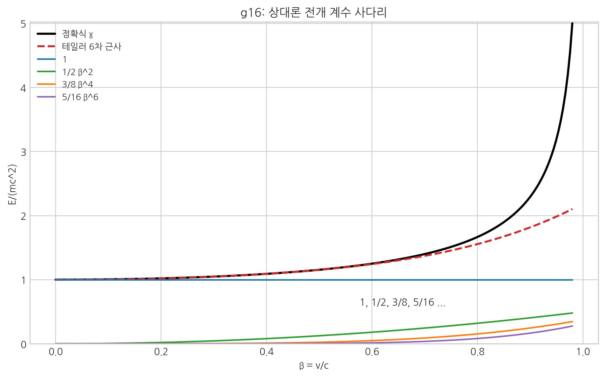
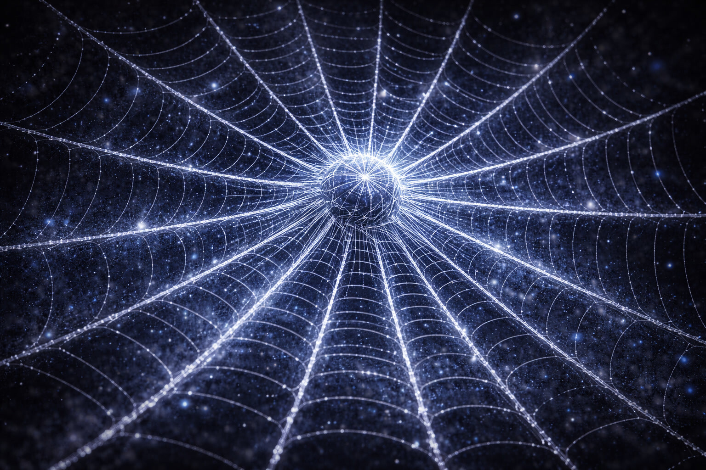
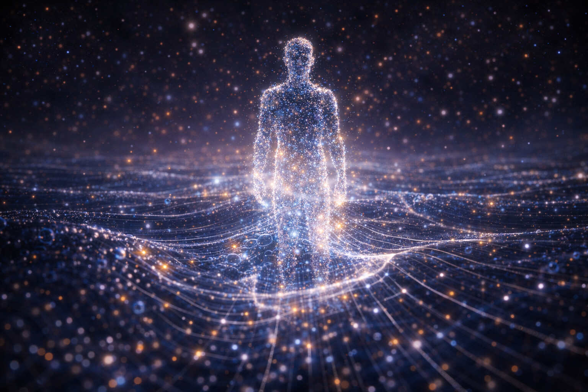

# 11. 물질은 어떻게 에너지가 되는가?

## E = m c^2: 에너지가 굳어서 물질이 되다

아인슈타인의 이 공식은 단순한 변환식이 아니다. **에너지와 질량이 같은 실체의 다른 표현**이라는 선언이다. (표준 기호: $E = m c^2$)
10장에서 본 "응축된 공간 장력"을 여기서 계량 가능한 언어로 바꿔 읽는다.

- **[검증됨]** 질량-에너지 등가는 핵반응/입자물리 관측 결과에서 반복 검증되었다.
- **[가설]** SALT는 질량을 보셀 매질의 고밀도 고착 상태로 해석한다.
- **[예측]** 질량 형성/해방 채널에서 위상·밀도 상태변수의 추적 가능성이 높아야 한다.

SALT는 이 등호를 공간의 최소 단위인 **'보셀(Voxel)'**에 적용한다.

### 우주의 보셀(Voxel)이란?
>
> 여기서 말하는 보셀(Voxel)은 컴퓨터 화면의 '픽셀'이 단순한 수학적 위치 정보인 것과 달리, 스스로 회전하며 에너지를 품는 '공간 세포'를 의미한다. 더 이상 쪼갤 수 없는 **우주 공간의 최소 물리적 단위(플랑크 길이 약 $1.6\times10^{-35}$ m, 보셀 부피는 \(l_P^3\) 규모)**를 의미하는 본질적인 실체다.

우리는 흔히 $E = m c^2$을 "질량이 사라지면 에너지가 된다"라고 해석한다. 하지만 반대로 질문해 본다. **"도대체 에너지가 어떻게 뭉쳐야 질량이 되는가?"**
이 문제가 해결된다면 단순히 우주를 관찰하는 수준을 넘어서 17장에서 다룰 **질량제어**나 새로운 주기율표 생성이 가능해진다.

질량이란 별개의 '입자'가 아니다. **보셀 격자가 탄성 한계를 넘어 위상 회전-잠금으로 저장한 '소성 변형 에너지의 고밀도 집약체'**다.

즉, 질량은 **고밀도 에너지의 고착된 형태**다. 흐르던 에너지가 한 지점에 묶인 상태다. 고무줄을 세게 꼬아 장력이 쌓인 모습과 비슷하다.

> 핵심: 같은 힘이라도 적분 축이 달라지면 물리 장부의 의미가 달라진다.

## 공간의 상전이: 수증기와 물방울

이 과정을 가장 잘 설명하는 비유는 **'물방울'**이다.

- **진공 (수증기)**: 에너지가 넓게 퍼져 있어 밀도가 낮다. 우리 눈에 보이지 않으며 파동처럼 자유롭게 흐른다.
- **물질 (물방울)**: 특정 지점 에너지가 임계점을 넘으면, 공간은 그 에너지를 감당하려고 국소적으로 말려 들어간다. 수증기가 물방울로 모이듯, 에너지가 뭉쳐 **입자**로 등록된다.

SALT에서 소립자의 탄생은 바로 이 **'공간의 상전이'** 과정이며, 그 무게의 실체는 대부분 **'공동 가동되는 보셀들의 회전 관성'**이다.

### 현대 물리학의 증언: 98%의 비밀

> 핵심: 질량-에너지 전환은 무엇이 사라지는 과정이 아니라, 저장 형식이 다른 채널로 재분배되는 과정이다.

이 그림의 채널은 매듭이 풀릴 때 에너지가 어떤 처리를 거치는지를 보여준다.

- **복사 채널**: 위상 텐션이 전달되어 전자기파/빛으로 방출되는 경로이다.

- **운동 에너지 방출**: 풀린 매듭이 주변을 밀어내고 질량을 가진 조각들이 실제로 속도를 얻는 방향이다.

- **중성미자 유사 채널**: 약한 상호작용처럼 아무런 상호작용 없이 빠져나가는 고속, 중성 에너지 흐름이다.

> 주류 물리학(QCD)에 따르면, 양성자를 구성하는 쿼크 자체의 질량은 전체의 **2% 미만**이다. 나머지 98%의 질량은 쿼크 사이를 채우는 **글루온장의 에너지**에서 기인한다.
>
> SALT는 이를 입체 구조적으로 해석한다. 쿼크라는 '매듭의 시발점' 사이를 메우는 글루온장은 사실 **광속에 가깝게 진동하며 얽혀 있는 보셀들의 고밀도 와류 에너지** 그 자체다. 우리가 무게라고 느끼는 것은 입자라고 불리는 '매듭' 그 자체의 무게가 아니라, 그 좁은 공간에 묶여 소용돌이치는 **공간 매질의 거대한 입체적 텐션**인 것이다.

1.  **임계점 도달**: 텅 빈 공간에 에너지가 과도하게 집중된다.
2.  **결정화**: 에너지는 더 이상 흐르지 못하고, 공간 보셀을 꼬아 **'매듭(물질)'**을 형성한다.
3.  **격리**: 이제 입체적 텐션은 매듭과 그 사이의 와류장 안에 응축된다. 이 '응축된 입체적 텐션'의 고밀도 상태가 바로 우리가 말하는 **질량 ($m$)**이다.

 

 

## c²의 비밀: 풀려난 용수철의 탄성 계수

그렇다면 반대로, 물질이 파괴될 때(핵폭발) 왜 그토록 거대한 에너지가 나오는가? 여기서 **c²**(빛의 속도의 제곱)이라는 거대한 숫자의 비밀이 풀린다.

**$E = m c^2$의 실체**: 이 식은 보셀 매질의 탄성 복원 에너지를 계산한다. SALT에서는 \(c^2\)를 보셀 매질의 유효 탄성 스케일로, 질량 \(m\)을 내부에 **응축된 왜곡 총량**으로 본다. 매듭이 풀리면(핵분열) 눌린 용수철처럼 탄성이 방출된다. 실제 핵반응이 질량의 **0.1~0.7%**만 해방해도 큰 에너지가 나오는 점이 이를 뒷받침한다.

> 핵심: \(\frac{1}{2}mv^2\)는 총에너지의 일부 근사 항이며, 고속 영역에서는 고차항 영향이 커진다.

- **물질화 (소성 응축)**: 이 억센 공간 보셀을 위상 회전으로 잠가 풀리지 않는 **'소성 매듭'**으로 고정시킨 행위다.
- **해방 (탄성 복원)**: 매듭이 풀리면서 보셀 매질이 원래의 입체 구조적 형상으로 돌아가려는 에너지가 방사된다.

## 거미줄과 매듭: 중력과 관성의 필연성

거대한 거미줄을 떠올려보자. 그 가닥이 공간의 연결망에 해당한다.

이제 거미줄 한가운데를 비틀어 매듭을 만든다고 보자. 이때 두 가지가 함께 나타난다.

1.  **질량의 탄생 (와류의 핵)**: 꼬인 보셀들이 뭉치는 지점은 회전 밀도가 극도로 높아진다. 이것이 입자 (물질)의 중심부다.
2.  **중력의 탄생 (와류의 흐름)**: 와류가 가동되는 순간, 주변의 공간 보셀들은 중심부로 빨려 들어가는 동적인 흐름을 형성한다. 중력은 독립 입자가 전달하는 정적인 힘이라기보다, 와류 구조가 형성·가동되면서 주변 공간을 필연적으로 흡수해 만들어내는 **능동적인 소용돌이형 유효 경사도 힘(\(-\nabla\mu\), 저차 \(-\nabla\rho\))**이다.
3.  **관성의 탄생 (회전 지속성)**: 이 와류를 다른 상태로 바꾸려 해보자. 단순히 위치를 옮기는 것이 아니라, **강렬하게 회전하는 와류의 축과 주변 흐름 전체를 함께 제어해야 한다.** 주변 공간의 점성과 와류의 회전 관성으로 인해 우리는 질량이 가진 '묵직함', 즉 **관성**을 경험하게 된다.

핵심은 단순하다. 질량은 공간 위 물체가 아니라 공간 자체가 만든 매듭이며, 중력과 관성은 그 매듭이 만든 흐름과 저항이다.

## 원자핵의 자물쇠: 강한 핵력의 정체

원자핵 속 양성자들은 모두 (+)전하를 띠어 서로 밀어내려 하지만, 아주 좁은 거리에서는 **'강한 핵력'**이 이를 압도하여 묶어둔다.

- **강력**: 쿼크 내부 결속을 담당하는 기본 상호작용이다. 표준 이론에서는 글루온 교환으로 기술하고, SALT에서는 내부 층의 위상 잠금(소성 맞물림)으로 해석한다.
- **핵력 (잔류 결속)**: 핵자(양성자·중성자) 사이에 남는 **잔류 유효 결속**이다. 새로운 기본힘이 아니라 강력의 핵자 간 유효 표현으로 다룬다.

정리하면, 핵 결속은 "강력(내부) + 핵력(핵자 간 잔류)"의 이중 층위로 이해하는 것이 가장 명확하다.

 

 

## "무대 자체가 배우다"

우주를 설명하는 재료는 하나다. 배경은 낮은 에너지 보셀 격자, 물질은 그 격자가 매듭으로 고착된 상태, 폭발은 그 매듭이 풀리며 에너지가 방출되는 과정이다. 즉 **배우와 무대가 따로가 아니라 같은 바탕의 다른 상태**로 본다.

 

 

우리는 이제 질량, 에너지, 중력의 연결고리를 확보했다. 다음 장에서는 이 연결을 통합 지도로 확장해, 전자기력·강력·약력·핵력까지 하나의 분류 체계로 정리한다.

다음 장, **12. 통일장 이론의 성배 - 5가지 발현의 기하학**
