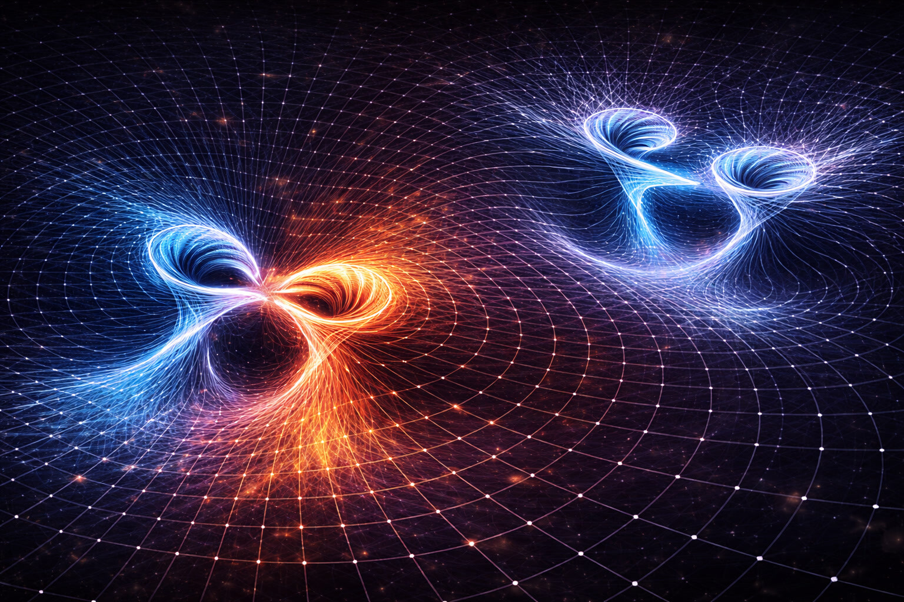
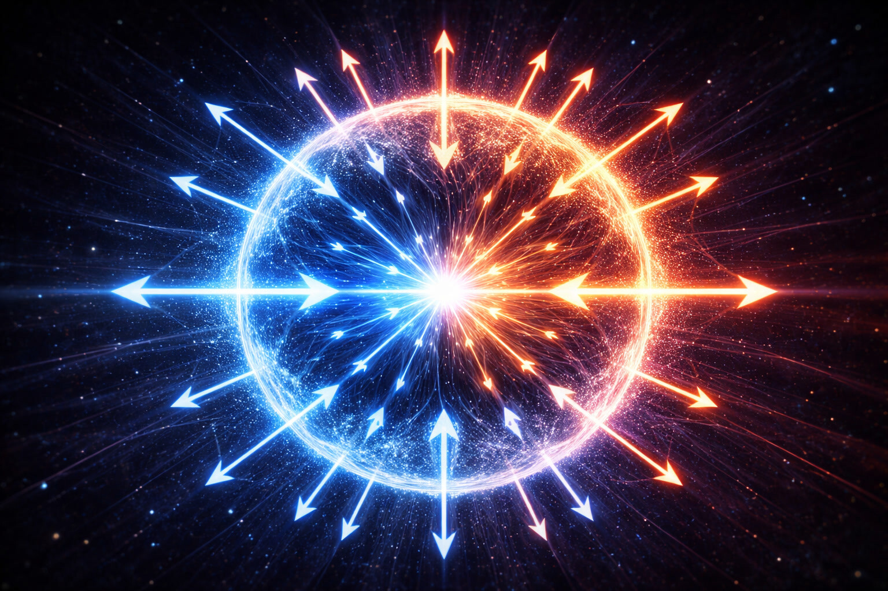
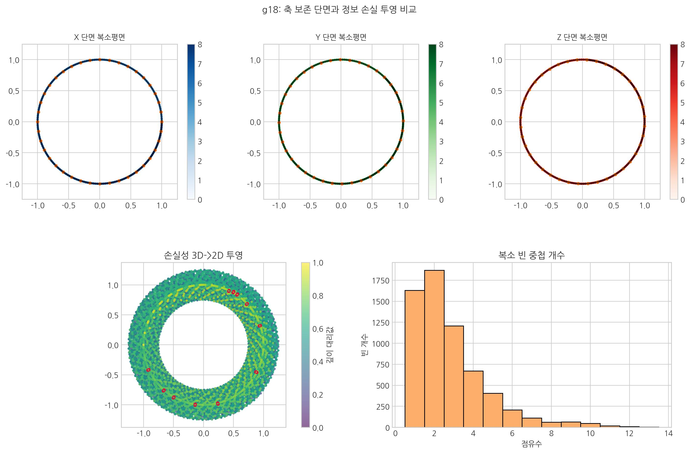

# 12. 통일장 이론의 성배 - 5가지 발현의 기하학

## '힘'이라는 이름의 가면을 벗기다

이 장은 통합 해석의 문을 여는 장이다. 흩어져 보이던 상호작용을 하나의 입체 구조 지도 위에 올린다.
11장에서 확보한 질량-에너지-중력 연결고리를 여기서 5가지 발현의 공통 문법으로 확장한다.

앞장에서 질량·에너지·중력의 연결 지도를 확보했으니, 이제 같은 원리로 나머지 상호작용도 한 표로 정리할 차례다.

우리는 지금까지 중력, 전자기력, 강력, 약력을 독립적 힘으로 배웠다. SALT에서는 이를 같은 매질의 다른 동작 모드로 본다. 이 장은 그 구조를 3가지 근본 모드와 전환 규칙으로 정리한다.

- **[검증됨]** 표준 물리학의 4가지 기본 상호작용(중력, 전자기력, 강력, 약력)과 핵력(잔류 강력) 구분은 실험/이론 체계에서 널리 사용된다.
- **[가설]** 본 장의 모드 분류와 내부/외부/잔류 결속 해석은 SALT의 통합 프레임이다.
- **[예측]** 이 분류가 타당하다면, 후속 장의 관측 채널에서 같은 변수 집합(\(\rho,\theta,n,\mu\))으로 교차 설명이 가능해야 한다.

### 힘의 지도 한눈에 보기
\[
n\equiv \rho^2,\qquad
\mathbf{J}_n=-Mn\nabla\mu,\qquad
\partial_t n+\nabla\cdot\mathbf{J}_n=0
\]
- \(\rho\): 상태의 진폭, \(n=\rho^2\): 밀도형 상태량
- \(-\nabla\mu\): 흐름을 실제로 움직이는 유효 경사도
- 중력: 이 흐름의 거시적 형태, 전자기: 위상 기울기(\(\nabla\theta\)) 전달 모드
- 강력: 내부 레이어 위상 잠금, 약력: 잠금 해제/재배열, 핵력: 잔류 결속

① 겹침: 레이어가 쌓이면 \(\rho\)가 커진다. ② 지형: \(\rho^2\)는 에너지 지형의 높이를 만든다. ③ 물길: 경사가 생긴 방향으로 흐름 \(\mathbf{J}_n\)이 생긴다. ④ 발현: 흐름이 거시에서 중력, 위상 전달이 전자기로 보인다.

## 3가지 입체 구조적 모드 + 잔류 결속

1.  **제1 모드: 흐름 → 중력**
    - **정의**: 보셀 격자의 방사형 수축/팽창과 그로 인한 거시적 공간 물살.
    - **핵심**: 질량이라는 매듭이 주변 공간에 유효 경사도(\(-\nabla\mu\), 저차 \(-\nabla\rho\))를 형성해 흐름을 유도하는 현상이다. (13장에서 상세히 다룸)

2.  **제2 모드: 위상 회전 → 전자기력**
    - **정의**: 보셀 격자 자체가 겪는 횡방향 전단 위상 회전.
    - **핵심**: 보셀이 시계 방향(+) 또는 반시계 방향(-)으로 회전하며 이웃 보셀로 회전력을 전달하는 나선형 파동이다. (14장의 핵심 주제)

3.  **제3 모드: 잠금 → 강력**
    - **정의**: 비틀림이 탄성 한계를 넘어 보셀들이 서로 영구적으로 엉겨 붙은 소성 맞물림 상태.
    - **핵심**: 쿼크라는 불완전한 결함들이 서로의 축을 맞물려 닫힌 루프를 형성하는 극한의 결속력이다. (15장에서 설명)

4.  **잔류 결속 → 핵력**
    - **정의**: 강력으로 결속된 핵자 바깥에 남는 잔류 유효 결속.
    - **핵심**: 새로운 기본힘이 아니라, 강력의 핵자 간 투영(잔류 효과)이다.

 

## 탄성 영역: 가역적 변형의 세계

SALT는 중력과 전자기력을 동일한 공간 매질의 서로 다른 변형 모드로 읽는다. 차이는 공간 보셀이 **어떻게 변형되느냐(인장 대 전단)**에 있다.

### 1. 중력: 잡아당겨진 상태
중력이 공간을 중심으로 빨아들이는 '와류'라는 생각은 절반만 맞다. 더 정확히 말하면, 중력은 거대한 질량 덩어리가 주변 공간 보셀들의 유효 경사도(\(-\nabla\mu\), 저차 \(-\nabla\rho\))를 형성하여 자신 쪽으로 **흐름을 유도하는 탄성 변형** 상태다.
- **구조적 결속**: 태양계와 은하가 흩어지지 않는 이유는 보셀 장력이 구조를 붙잡기 때문이다. 중력은 거시 구조를 유지하는 **뼈대** 역할을 한다.

### 2. 전자기력: 위상 회전 상태
전자기력은 보셀 격자가 나선형 위상 회전으로 발생하는 **'탄성 전단'**이자 회전 전달 파동이다.
- **에너지의 전이**: 전자가 궤도를 바꿀 때 에너지는 보셀의 **위상 회전 파동**으로 방출되어 빛(광자)이 된다. 전자기력은 구조 고정보다 에너지 전달 통로에 가깝다.

 

 

## 소성 영역: 비가역적 매듭의 세계
소성 영역은 탄성 한계를 넘어 보셀들이 영구적으로 변형된 상태다. 이곳에서 '물질'의 드라마가 시작된다.

### 3. 강력: 꽉 물려 잠긴 상태
강력은 별개의 접착제가 아니라, 공간의 매듭이 **탄성 한계를 넘어 입체 구조적으로 완전히 맞물린 상태**를 말한다.
- **구조적 결속**: 톱니바퀴가 맞물려 멈추듯, 보셀들이 비틀림 한계를 넘어 서로를 영구적으로 구속하는 **입체적 잠금**이다. 이것이 쿼크를 가두고 양성자를 유지하는 힘의 실체다.

 

 

### 4. 약력: 풀려서 재배열되는 상태
약력은 힘이라기보다는 고밀도 매듭의 불안정성을 해소하는 **'붕괴 및 재배열'** 과정이다.
- **에너지의 전이**: 너무 꽉 조여진 매듭이 스스로 풀리거나(B-붕괴), 더 안정적인 형태로 자리를 잡는 **'소성 풀림'** 현상이다. 이 과정에서 **응축되어 있던 입체적 장력**이 입자나 빛의 형태로 해방된다.

 

### 현대 물리학 대 SALT 관점 비교

| 항목 | **현대 물리학 (표준 모델)** | **SALT (공간 매질 이론)** |
| :--- | :--- | :--- |
| **질량의 본질** | 힉스 매커니즘 + 글루온장의 에너지 | 보셀(공간)의 **입체 구조적 저항** 및 응축 |
| **강력 (글루온)** | '글루온'이라는 입자를 주고받는 힘 | 공간 보셀이 꼬여서 풀리지 않는 '소성 맞물림' |
| **원자핵의 결합** | 잔류 강력(중간자)이 접착제 역할 | 주변 공간 보셀들의 '압착 장력' |
| **쿼크의 감금** | 멀어질수록 강해지는 고무줄(강력) | 보셀 사슬이 물리적으로 얽혀 있는 '입체적 잠금' |

 

## 단 하나의 지도: 5가지 발현의 표

이제 우리는 우주의 상호작용을 '공간 밀도의 상태', '에너지의 흐름', 그리고 그 '잔류 효과'라는 세 가지 축으로 일관되게 분류할 수 있다.

| **상태 / 과정** | **구조적 결속** *(정적 상태 / 잠재 에너지)* | **에너지의 전이** *(동적 과정 / 운동 에너지)* |
| :--- | :--- | :--- |
| **탄성 영역** *(가역적 변형)* | **중력 (모드 1: 흐름)** 잡아당겨진 상태 (유효 경사도 \(-\nabla\mu\), 저차 \(-\nabla\rho\)) *거시적 세계의 결속* | **전자기력 (모드 2: 위상 회전)** 위상 회전 상태 (나선형 파동) *전자 궤도 간의 재배열* |
| **소성 영역** *(비가역적 변형)* | **강력 (모드 3: 잠금)** 입체적 잠금 (소성 맞물림) *미시적 세계의 결속* | **약력 (모드 전환)** 풀려서 재배열되는 상태 (붕괴 및 전이) *핵 입자 간의 재배열* |
| **중간 영역** *(잔여 응력)* | **잔류 강력 (핵력)** 공간 밀도 압력 *양성자-중성자 간의 결속* | - |

### 핵심 문답: 잔류 강력은 어떻게 블록을 붙이는가?
>
> **Q: 공간이 블록에 의해 눌렸는데, 왜 다시 블록을 눌러 하나로 붙이는가?**
>
> 매듭(입자)이 생기면 주변 보셀은 옆으로 밀려나며 큰 **압착 스트레스**를 받는다. 빽빽한 지하철에 큰 짐이 들어와 주변이 더 비좁아지는 상황과 비슷하다.
>
> 이때 두 입자가 아주 가까워지면, 사이 공간의 보셀들은 양쪽에서 밀려오는 압박에 비명을 지른다. 우주는 이 스트레스를 최소화하기 위해 **두 블록을 하나로 합쳐서 주변 공간을 밀어내던 범위를 겹쳐버리려 한다.**
>
> 즉, **공간이 더 안정한 저에너지 상태로 가기 위해 두 입자를 바깥에서 안으로 눌러 붙이는 것**, 이것이 잔류 강력(핵력)의 입체적 실체다.

 

 

## 힘의 실체: 입체 구조적 과정

이제 우주에는 서로 단절된 힘들이 아니라, **'공간 밀도가 어떻게 분포하고 변형되는가'**에 대한 단 하나의 원리가 남는다.

- **중력 (흐름)**: \(-\nabla\mu\)의 거시 투영으로 나타나는 입체 구조적 흐름이다.
- **전자기력 (위상 회전)**: 격자 표면의 위상 회전에 의한 **입체 구조적 맞물림과 긴장**이다.
- **강력 (잠금)**: 공간 보셀들의 톱니가 서로 엉킨 **극한의 입체적 잠금**이자 와류의 본체다.
- **약력 (붕괴)**: 고밀도 매듭의 불안정성을 해소하기 위해 내부를 재정렬하는 **'위상학적 재결속'** 과정이다.
- **핵력 (잔류)**: 강력 결속의 바깥에서 핵자 사이에 남는 잔류 유효 결속이다.

::: {.note-theory}
**SALT 핵심 요약: 엔트로피의 방향성과 힘의 성격**
:::
>
> 이 네 갈래의 움직임은 우주의 엔트로피 균형을 맞추는 거대한 두 흐름으로 나뉜다.
>
> | 분류 | 해당 상호작용 | 엔트로피 방향 | 입체 구조적 본질 |
> |------|--------------|--------------|--------------|
> | **결속 그룹** | 강력(미시), 중력(거시) | **감소 (질서 생성)** | **입체적 장력을 응축하여** 입자, 별, 은하를 만드는 **'구조의 건축자'** |
> | **전이 그룹** | 약력(붕괴), 전자기력(복사) | **증가 (에너지 해방)** | **응축되어 있던 입체적 장력을 해방하여** 우주로 퍼뜨리는 **'변화의 매개자'** |
>
> 결국 우주는 **결속 그룹(강력/중력)**으로 구조를 만들고, **전이 그룹(약력/전자기력)**으로 에너지를 순환시키는 동적 체계로 볼 수 있다.

이로써 우리는 다섯 갈래로 흩어져 있던 우주의 현상들을 단 한 장으로 합쳤다. 이제 우주는 더 이상 알 수 없는 힘들의 전쟁터가 아니라, 조화로운 입체 구조의 연주회장이 된다. 이 모든 것은 공간 밀도의 입체 구조적 변주곡일 뿐이다.

## 내부 상태 공간: 아인슈타인이 보지 못한 '밀도'의 차원

현대 물리학의 미해결 지점 중 하나는 시간을 공간과 같은 차원의 선상(4차원 시공간)에 두는 해석의 한계다. 아인슈타인은 공간의 굴곡을 설명하기 위해 시간을 4번째 축으로 도입했지만, SALT는 여기에 **'공간 밀도(깊이)'**라는 내부 상태 변수를 함께 고려해야 한다고 본다.

- **아인슈타인의 한계**: 공간의 이면에 존재하는 '밀도(보셀 밀도)'의 변화를 보지 못했기에, 이를 시간의 지연이라는 현상적 결과로만 해석했다.
- **SALT의 해법**: SALT는 진폭과 위상을 추가 좌표가 아니라, 3+1차원 시공간 각 점에 부착된 **내부 상태 공간(파이버)**의 변수로 해석한다. 이 내부 상태의 핵심 변수는 진폭(\(\rho\))과 위상 회전(\(\theta\))이며, 보편 시간 인덱스는 상태 전이 순서를 정의한다.

이 관점에서 3차원 공간과 밀도는 서로 독립적으로 움직이는 차원이 아니다. 디지털 픽셀이 (x, y) 좌표와 (명암) 값을 함께 가져야 하듯, 공간의 각 지점도 좌표와 밀도라는 두 상태를 함께 가진다.

#### [수학적 직관] 복소평면과 내부 상태 공간의 매칭

**핵심:** 축별 단면은 구조를 보존하지만 단일 평면 투영은 정보를 겹친다. 무엇을 잃는지 보는 그림이다.

SALT의 상태공간은 보셀 상태를 **복소수**로 표현할 때 가장 명확해진다.

1.  **실수축**: 우리 눈에 보이는 3차원적 변위와 위치.
2.  **허수축**: 공간의 이면에 숨은 **복소 상태($\Psi = \rho e^{i\theta}$)**.

여기서 밀도(\(\rho\))는 복소 상태의 **진폭**이 되고, 전자기적 **위상 회전(\(\theta\))**은 **위상**이 된다. 수학적으로 허수 단위 \(i\)를 곱하는 행위가 '90도 회전'을 뜻한다는 점에서, 파동함수의 \(i\)는 보셀의 회전 상태를 읽는 단서로 해석할 수 있다.

> **참고: Ψ는 벡터인가, 스칼라인가?**
>
> 엄밀하게 말하면 **Ψ**는 3차원 공간 축($x, y, z$)을 기준으로 한 **'복소 스칼라'**입니다.
> 공간 좌표(벡터)와는 차원이 다르기 때문입니다.
>
> 하지만 이를 **'복소평면'이라는 내부적 상태 공간**에서 바라보면 원점에서 특정 크기(**ρ**)와 각도(**θ**)를 가진 화살표로 표현되기에 수학적으로 '벡터'의 성질을 공유합니다.
> SALT는 이 스칼라값이 가진 내부의 '입체적 구조'가 물리적 힘으로 발현되는 과정을 추적합니다.

- **중력**: 진폭(\(\rho\))이 큰 영역에서 유효 경사도(\(-\nabla\mu\))가 만들어내는 흐름 경향.
- **전자기력**: 보셀의 위상 회전이 이웃 보셀로 전달되는 파동.

이 매핑은 수학적 트릭에 그치지 않는다. SALT는 전자기력의 \(U(1)\) 대칭을 보셀의 복소 위상과 연결해 해석한다. 또 고중력 영역에서 빛이 느려져 보이는 현상도, 진폭 \(\rho\)와 밀도형 상태량 \(n=\rho^2\) 증가로 보셀 처리 부하가 커진 결과로 읽는다.

::: {.note-theory}
**참고: 왜 기존 다차원 이론들은 고전했는가?**

우리가 제안하는 복소 상태공간 해석은 인류 지성사가 시도했던 여러 통일장 이론들의 '성공적인 변주'이기도 합니다.

- **칼루자-클레인 (Kaluza-Klein)**: 5차원을 도입해 중력과 전자기력을 합치려 했지만, 5번째 차원의 물리적 실체를 찾지 못해 '작게 말려있다'는 고육지책을 썼습니다. SALT는 이 문제를 추가 좌표가 아니라, 모든 공간 점에 붙는 **'밀도'와 위상**이라는 내부 상태 변수로 다시 해석합니다.
- **트위스터 이론 (Twistor Theory)**: 로저 펜로즈는 공간 대신 '빛의 궤적'을 기본으로 하는 복소 4차원 구조를 제안했습니다. SALT 역시 공간의 상태를 복소수로 표현하지만, 이를 추상적 수학이 아닌 **'보셀 매질의 동역학 상태'**라는 물리적 실체로 안착시켰습니다.
- **복소 스칼라장**: 현대 물리학에서 복소수는 보통 '내부 상태'를 묶는 도구로만 쓰입니다. SALT는 관측 좌표를 $x,y,z,t$의 4차원으로 두고, 밀도를 추가 좌표가 아닌 복소장 $\Psi$의 진폭($\rho=|\Psi|$), 허수축을 위상 회전($\theta$)으로 해석함으로써, 수학적 도구를 물리적 실재와 정합적으로 연결합니다.

결국 SALT는 기존 다차원 논의의 난점을, 추가 좌표 대신 내부 상태 변수(\(\rho,\theta\)) 해석으로 재정리하려는 접근이다.
:::

아래 삽화는 이 지점을 한 장으로 요약한다.  
상단은 \(x/y/z\) 축 단면을 각각 복소평면으로 본 그림(정보 보존형)이고, 하단은 3차원 정보를 단일 복소평면으로 압축했을 때 생기는 겹침(손실형)을 보여준다.  
즉 복소평면은 강력한 표현 도구지만, 어떤 투영을 쓰느냐에 따라 남는 정보가 달라진다.

 

### 심층 질문: 왜 E=mc²에서 속도가 '제곱'($c^2$)되는가?
> 우주의 최대 전파 속도가 $c$라면, 에너지가 왜 \(c^2\)에 비례하는가? SALT는 이를 **나선형 전파 경로** 관점에서 해석한다.
>
> 관측상 빛은 직선 이동처럼 보이지만, 보셀 격자 내부에서는 회전 성분이 겹친 경로로 전달된다고 본다. 이때 총 에너지는 단순 거리뿐 아니라 회전/곡률이 반영된 유효 경로 크기에 비례하며, 그 표현이 \(c^2\) 항으로 나타난다는 해석이다.

## 다차원 홀로그래피 해석: 상태에서 입체 구조로

우리는 홀로그램을 보통 '빛이 만든 입체 잔상'으로 생각한다. 하지만 SALT에서 **홀로그래피 원리**는 비유를 넘어, 물리 법칙이 투영되는 구동 방식으로 다룬다.

현대 물리학이 아직 홀로그램 현상을 충분히 설명하지 못하는 이유는, 정보가 기록된 '면(상태)'과 현상이 나타나는 '입체(현상)' 사이의 매개체를 찾지 못했기 때문이다. SALT는 이를 **보셀 격자의 간섭과 복원** 기전으로 풀어낸다.

### 1. 필름 위의 상태: 4차원 보셀 지칭표 층
홀로그램 필름에는 피사체가 직접 보이지 않는다. 대신 복잡한 간섭무늬만 남는다.
- **SALT의 상태 코어**: 우주의 4차원 깊이(공간 깊이) 층위가 이 필름에 해당한다. 여기에는 '사과'나 '전자'가 직접 있는 것이 아니라, 보셀 간 **장력 상태 정보(얽힘 정보)**가 간섭무늬 형태로 기록되어 있다.

### 2. 기준 광원 비유: 보편 시간 인덱스
홀로그램 필름의 입체 영상을 띄우려면 깨끗한 레이저 빛(참조광)이 필요하다.
- **시간 전이 순서**: SALT에서 이 레이저 역할은 **보편 시간 인덱스**가 맡는다. 우주는 매 순간 전체 격자를 전이시키고, 그 시간 전이가 4차원 상태 코어를 통과할 때 3차원 물리 현상이 나타난다.

### 3. 입체 영상의 창발: 공간 밀도의 복원
레이저가 간섭무늬를 통과해 입체 영상을 만들듯, 보편적 시간의 전이 흐름이 상태 코어 장력망을 통과하면 **3차원 공간의 보셀 밀도**가 재구성된다.
- **상태에서 입체 구조로**: 특정 좌표의 장력 상태 정보가 높게 기록되면, 보편적 시간 흐름에서 그 지점 보셀은 더 강하게 수축한다. 이 수축의 거시 투영이 질량(매듭)이고, 주변 공간이 휘는 현상이 중력이다.
- **입체 구조적 정체성**: 우리가 물질이라 부르는 것은, 보셀 내부 상태 정보가 시간 갱신을 거치며 3차원 공간에 드러난 **밀도 요철**로 해석할 수 있다.

## 척도와 내부 상태 공간의 홀로그래피

기존 홀로그래피 원리(AdS/CFT 등)는 입체의 정보가 2차원 표면에 기록될 수 있다는 점에 주목하여 "우주는 2차원의 투영"이라고 설명한다. 하지만 SALT는 한 걸음 더 나아가, 정보가 기록된 근원조차도 **3차원 보셀 격자들의 전역적 상호 관계(얽힘의 깊이)** 속에 존재한다고 본다.

- **공간 밀도(깊이)라는 내부 척도**: AdS의 5번째 차원 \(z\)는 거리라기보다 **에너지 척도**다. 경계에서 안쪽으로 갈수록 정보가 거칠어지는 구조는, SALT에서 **보셀 밀도(깊이)** 변화가 곡률을 정한다는 원리와 맞닿는다. SALT는 추가 좌표 대신 **내부 상태 척도**로 이를 해석한다.
- **보편 시간 인덱스의 갱신 축**: 이렇게 형성된 4차원 관측 구조를 매 순간 갱신하는 '보편 시간 인덱스'가 더해질 때, 비로소 우주라는 **동적 전이 체계**가 완성되는 것이다. 이 틀은 양자 얽힘의 거리 무관 상관을 해석하는 한 가지 후보 기전이 될 수 있다. 공간의 '깊이'와 '시간' 지칭표가 상태공간 수준에서 연결되어 있다고 보는 관점이다.

**"우주는 단순한 영상이 아니라, 매 찰나 3차원 보셀 격자 상태가 갱신되어 나타나는 동적 구조다."**

이제 통합 지도는 준비되었다. 다음 장에서는 첫 번째 모드인 중력을 꺼내, 왜 물질들이 **서로의 유효 경사도(\(-\nabla\mu\))를 통해 흐름을 공유하는가**를 집중적으로 묻는다.

다음 장, **13. 중력은 당기는 힘인가 밀려나는 흐름인가?**
