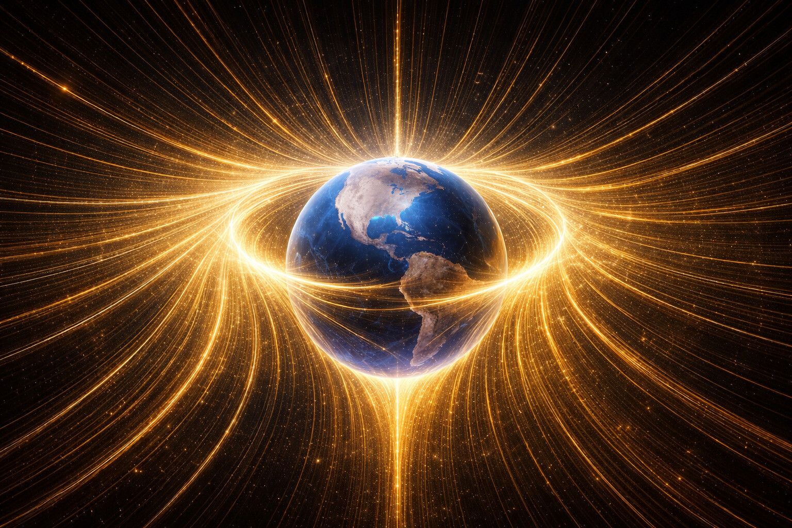
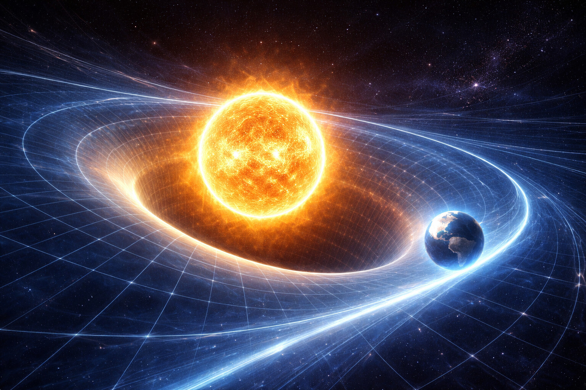
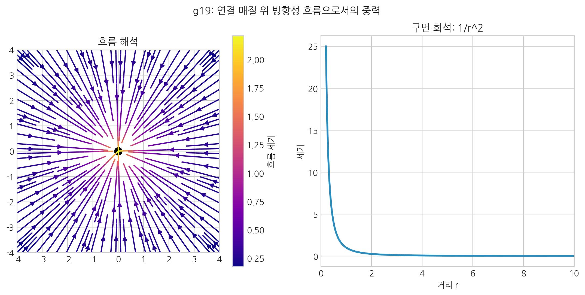
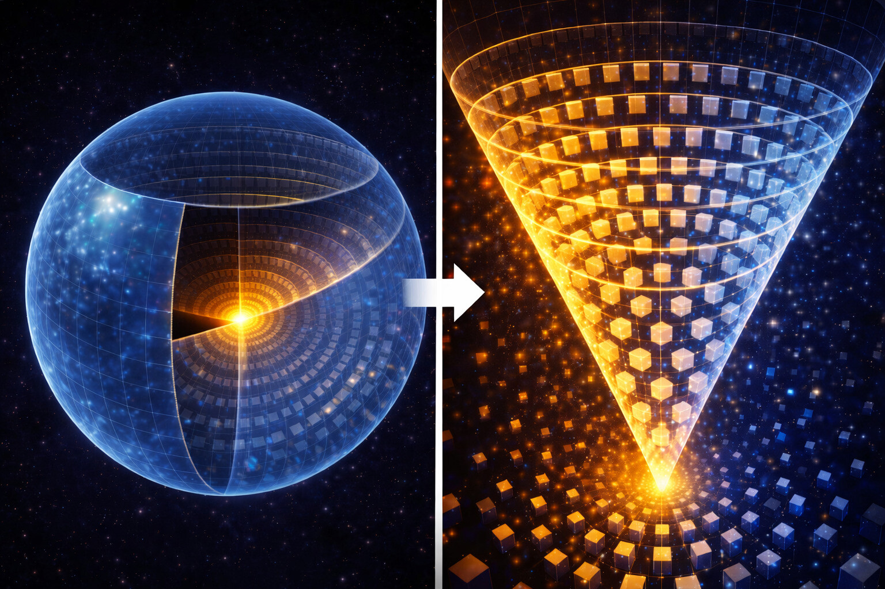

# 13. 중력은 당기는 힘인가 밀려나는 흐름인가?

## 제1 입체 구조적 모드: 흐름

우리는 이제 12장에서 제시한 통합 지도의 실행 구간으로 진입했다. 그 첫 번째 모드는 중력이다.

12장 말미의 질문은 이것이다. **중력은 질량들이 유효 경사도(\(-\nabla\mu\), 저차 \(-\nabla\rho\))를 통해 하나의 공간 흐름을 공유하는 현상인가?**
SALT는 그렇다고 본다. 중력은 공간 매질이 장력을 재배치하는 **흐름**이다.

- **[검증됨]** 자유낙하·중력렌즈·시간지연 같은 관측 사실은 중력의 보편성을 지지한다.
- **[가설]** SALT는 이를 "유효 경사도에 따른 공간 흐름"으로 해석한다.
- **[예측]** 동일 변수 집합(\(n,\mu\))으로 낙하·렌즈·전파지연을 교차 설명할 수 있어야 한다.
- **[검증 절차 연결]** 관측 판정은 24장 13.2~13.4(샤피로 지연·적색편이·렌즈 지연) 기준을 따른다.

#### 해석 연결: 퍼텐셜 낙하와 보셀 꼬임

낙하를 퍼텐셜 차이로 설명하는 관측 언어와, 보셀 꼬임/재배열로 설명하는 기전 언어는 충돌하지 않는다.  
거시적으로는 물체가 높은 퍼텐셜에서 낮은 퍼텐셜로 이동하고, 미시적으로는 그 퍼텐셜 기울기가 보셀의 적층·위상 재배열에서 형성된다.  
또한 질량의 내부 에너지(물체 자체의 저장 에너지)와 중력 퍼텐셜 에너지(위치 기반 상호작용 에너지)는 서로 다른 항이다.  
따라서 "질량이 에너지를 품는다"와 "질량 중심 쪽 퍼텐셜이 더 낮다"는 모순이 아니라 같은 현상의 다른 기술 방식이다.

### 중력의 핵심식 한눈에 보기
\[
n\equiv \rho^2,\qquad
\mu=\frac{\delta E}{\delta n},\qquad
\mathbf{J}_n=-Mn\nabla\mu
\]
\[
\partial_t n+\nabla\cdot\mathbf{J}_n=0,\qquad
\mathbf{g}_{\mathrm{eff}}\propto-\nabla\mu
\]
- 상위식: \(-\nabla\mu\) (일반형)
- 근사식: \(-\nabla\rho\) (저차 근사)

① \(n\)은 지형 높이, ② \(\mu\)는 실제 경사도, ③ 물체는 \(-\nabla\mu\) 방향으로 흐름을 탄다, ④ 관측에서는 낙하/궤도/지연으로 보인다.

우주는 거대한 **공간 천**으로 볼 수 있다. 질량은 그 천이 강하게 꼬여 생긴 **고장력 매듭**에 가깝다.

여기서 핵심 질문이 생긴다. "천의 양끝을 당기면 매듭이 더 단단해지지 않는가?"

SALT의 중력이 바로 그렇다. 매듭(질량) 내부의 강력은 이 비틀림을 유지하려 하고, 외부의 공간 보셀들은 원래의 평탄한 상태로 돌아가려는 **'복원 장력'**으로 이 매듭을 사방에서 잡아당긴다.

### 공간 보셀의 연속성: 떼려야 뗄 수 없는 물결

여기서 우리가 주목해야 할 가장 근본적인 사실은, **우주는 결코 조각난 파편들의 모임이 아니라는 것이다.**

- **끊어지지 않는 그물망**: 보셀 격자는 매 순간 촘촘하게 맞물려 있는 하나의 거대한 연속체다.
- **강력에서 중력으로**: 질량 내부의 강력한 꼬임(강력)은 공간 격자가 끊어지지 않는 한 반드시 인접한 보셀들에 영향을 미친다. 꼬인 지점에서 공간이 뚝 끊어지는 것이 아니기에, 그 꼬임이 만드는 장력은 보셀 격자를 타고 매우 먼 거리까지 전달된다.
- **단일 원인, 두 가지 효과**: 즉, 쿼크들의 단단한 결속(강력)과 지구가 사과를 당기는 현상(중력)은 별개의 힘이 아니다. 하나의 연속된 매질 위에서 일어나는 **'국소적 꼬임(소성)'**과 그로 인해 발생하는 **'광역적 인장(탄성)'**이라는 동전의 양면일 뿐이다.

그런데 여기서 매우 날카로운 의문이 생길 수 있다. **"저 멀리 사방에서 잡아당기고 있다면, 왜 물체는 오히려 안으로(질량 쪽으로) 끌려오는가? 두 힘은 서로 정반대 방향이 아닌가?"**

이 질문은 **열역학 제2법칙(엔트로피)**과 **중력**의 관계를 관통하는 핵심 질문이다. 결론부터 말하면, 두 힘은 상충하는 것이 아니라 **'보편적 수요와 국소적 반응'**의 관계다:

1.  **우주 전체의 수요 (엔트로피/바깥 방향 당김)**: 평탄한 공간은 장력을 낮추는 방향으로 진화한다. 이 전역 경향이 매듭 주변에 바깥쪽 인장을 건다.
2.  **질량 근처의 반응 (중력/안쪽 흐름)**: 매듭은 쉽게 풀리지 않으므로, 바깥 인장이 커질수록 주변 공간에는 중심을 향한 더 가파른 경사가 생긴다.
3.  **결론**: 물체가 실제로 따르는 것은 전역 엔트로피 그 자체가 아니라, 그 결과로 생긴 **국소 유효 경사도(\(-\nabla\mu\), 저차 \(-\nabla\rho\))**다. 그래서 운동은 질량 중심 방향으로 나타난다.

정리하면, 전 우주적 평탄화 요구가 강할수록 매듭 주변의 경사는 더 가팔라진다. 사과가 지구로 떨어지는 것은 지구가 만든 **공간의 유효 경사도**를 따라 미끄러지는 것이고, 여러 물질이 서로 가까워지는 것은 각자가 만들던 스트레스를 하나의 더 안정한 흐름으로 병합하려는 과정으로 읽을 수 있다.

 

## 상호작용의 심화: 수렴과 발산의 줄타기

물질들이 중력에 의해 끊임없이 뭉치기만 한다면, 우주의 모든 물질은 하나로 들러붙어 버렸을 것이다. 하지만 현실은 다르다. 원자들은 서로 적정 거리를 유지하며 결착하고, 전자기력은 같은 전하끼리 밀어내기도 한다.

이것은 **'탄성 한계 경계의 안팎'** 때문이다. "거리"란 결국 그 경계로부터 얼마나 떨어져 있느냐의 다른 표현일 뿐이다.

- **경계 내부**: 보셀들이 탄성 한계를 초과하여 **소성 맞물림** 상태로 잠긴 영역이다. 이 입체적 잠금이 바로 **강력**의 실체다. 여기에 갇힌 에너지(쿼크)는 경계 밖으로 탈출할 수 없다.
- **경계 근방**: 서로 다른 두 매듭의 **비틀림 장**이 충돌하는 구간이다. 같은 방향으로 비틀린 전자 구름이 맞닥뜨리면 서로를 밀어내는 **전자기적 척력**이 발생한다. 이것이 원자들이 서로 겹치지 않고 '형체'를 유지하게 만드는 원동력이다.
- **경계 외부**: 탄성 변형 구간이다. 소성 잠금이 없어 보셀들은 꼬임에 저항하지 않고, 매듭의 와류 흐름을 따라 미세하게 기울어진다. 이 **탄성 경사도**를 타고 다른 물체가 미끄러져 오는 현상이 바로 **중력**이다.

우주의 질서는 이처럼 **'경계 내부의 잠금(강력)'**, **'경계 근방의 반발(전자기력)'**, **'경계 외부의 흐름(중력)'** 이 세 가지 입체적 상태가 정교하게 맞물리며 만들어낸 입체적인 풍경이다.

## 공전: 소용돌이 가장자리 운동

지구는 왜 태양으로 곧바로 떨어지지 않고 주변을 도는가? 보통 유체 소용돌이라면 마찰로 감속해 중심으로 가겠지만, SALT의 **공간 매질**은 마찰이 매우 작은 **고탄성 매질**로 근사한다.

**공간**은 **변형시키는 데**는 우주에서 가장 큰 힘(강성)이 들지만, 변형된 결을 따라 **미끄러지는 데**는 저항이 매우 작다.
보셀들의 꼬임(소성 변형)이 없는 **'순수 탄성 구간'**은 그 안에서 움직이는 모든 매듭(물질)과 파동(빛)에 저항(마찰)을 매우 작게 준다.

- **빨아들이는 와류 (안쪽 방향)**: 태양이라는 거대 매듭이 **공간**을 안쪽으로 감아들인다.
- **달리는 관성 (바깥 방향)**: 지구는 태어날 때부터 가지고 있던 막대한 수평 속도(운동량)가 있다.

지구는 태양 쪽으로 계속 낙하하지만, 수평 속도가 커서 바로 닿지 않는다. 그래서 **소용돌이 가장자리 경사면**을 따라 도는 상태가 공전으로 나타난다. 저항이 작아 이 상태가 오래 유지된다.

::: {.note-theory}
**근거: 중력 렌즈와 프레임 드래깅의 증거**

- **그래비티 프로브 B (2011)**: NASA의 위성이 지구가 회전하며 주변 **공간**을 소용돌이치듯 끌고 가는 **'프레임 드래깅'** 효과를 직접 관측했다. 이는 **공간**이 단순한 배경이 아니라, 물체와 함께 엉겨서 회전하고 흐를 수 있는 **'역동적 매질'**로 읽힐 수 있음을 강하게 시사한다.
:::

 

 

## 왜 중력은 거리의 제곱에 반비례하는가?

> 핵심: 흐름장과 1/r² 희석을 함께 보면, "중력장"이 힘 벡터보다 매질 흐름으로 더 자연스럽게 읽힌다.

뉴턴의 역제곱 법칙(**1/r²**)은 SALT의 **'입체 구조적 희석'** 개념으로 명쾌하게 설명된다.

매듭 핵에서 뿜어져 나오는 장력은 3차원 공간 사방으로 균일하게 뻗어 나간다. 매듭에서 멀어질수록 이 장력이 영향을 미쳐야 하는 **공간**의 영역은 구 형태로 넓어진다 ($4\pi r²$).
- **잔여 장력의 분산**: 매듭 핵(강력)에서 나온 에너지는 거리가 멀어질수록 더 많은 **공간 보셀**들에 나누어 전달되어야 한다.
- **입체 구조적 희석**: 거리가 2배 멀어지면 장력이 퍼져야 할 면적은 4배로 늘어난다. 결국 단위 보셀당 장력은 4배로 희석된다. 이것이 우리가 관측하는 역제곱 법칙의 실체다.

 

 

## 중력의 한계: 보셀의 이완

중력이 무한히 멀리까지 영향을 미칠까?
SALT에 따르면 **공간**의 잔여 와류도 플랑크 보셀 해상도 아래로 희석되면 영향력을 잃는다. 먼 보이드에서는 와류 에너지가 이완되어 공간이 거의 정지 상태가 되고, 중력 흐름도 사실상 사라진다.

그렇다면 이 '평탄해진 공간'에서 물체는 어떻게 움직이는가?

- **경사 없음 → 직선 운동**: 보셀 격자에 기울기가 없으면 미끄러질 경사도 없다. 그래서 중력권 밖 물체는 **직선 등속 운동**을 유지한다. 공전 같은 곡선 운동은 유효 경사도(\(-\nabla\mu\), 저차 \(-\nabla\rho\))가 있을 때만 성립한다.
- **오해 방지**: 여기서 '공간 흐름'은 보셀 자체의 집단 이동이 아니라, 보셀 **상태장(밀도·위상·장력)**의 경사와 상태 전이가 만든 유효 흐름을 뜻한다.

### SALT 대 표준 물리학: 등가원리와 좌표 표류
>
> 아인슈타인은 가속되는 로켓 안과 지구 중력 속을 구분할 수 없다는 '등가원리'를 중력의 핵심 원칙으로 삼았다. SALT는 이를 매질 동역학 관점에서 다음과 같이 재정의한다.
>
> - **로켓 가속**: 물체가 보셀 격자 위를 실제로 가로지르며 **'좌표 전이'** 동역학 자원을 소모하는 상태.
> - **중력장**: 보셀 격자 자체의 밀도 기울기(유효 경사도)가 물체를 안으로 **'표류'**시키고 있으며, 물체가 그 자리에 멈춰 있으려면 가속과 정확히 같은 양의 **'상태 복구'** 동역학 자원을 소모해야 하는 상태.
>
> 결국 가속과 중력은 **"보셀 매질의 동역학 자원을 어느 방향으로 소모하느냐"**의 차이일 뿐, 로컬 관찰자가 느끼는 물리적 효과(시간 지연, 관성력)는 동일할 수밖에 없다. 이것이 바로 등가원리의 동역학적 실체다.
>
> #### [수학적 직관] 좌표 변환 요약
> 관성 이동은 "매듭이 격자 위를 +1 전이"하는 과정이고, 중력 이동은 "격자 자체가 매듭 쪽으로 -1 표류"하는 과정으로 볼 수 있다.
> 두 서술은 같은 상대운동을 다른 기준계에서 표현한 것이다.

### 중력의 보편성: 우주가 부과하는 '존재 통행료'
>
> 왜 무거운 철공이나 가벼운 깃털이나 진공에서 똑같이 떨어지는가? 일반 상대성 이론은 이를 '시공간의 곡률'로 설명하지만, SALT는 이를 **'보셀 매질의 보편적 동역학 비용'**으로 설명한다.
>
> 모든 물질(철공, 깃털, 우리 몸)은 보셀 격자가 꼬여서 만들어진 **'고장력 매듭'**들이다. 중력장이 있는 곳(공간 보셀의 밀도가 일그러진 곳)에서 이 매듭이 존재를 유지하려면, 평탄한 공간에서보다 더 많은 동역학 에너지를 지불해야 한다.
>
> - **장력의 변동**: 일그러진 공간은 매듭이 풀리려 하거나 더 꼬이려 하는 압력을 가한다.
> - **동일한 매질**: 모든 물질은 결국 똑같은 '보셀'로 만들어져 있다. 따라서 공간의 일그러짐이 매듭 하나에 미치는 **'동역학 자원 변화율'**은 그 매듭이 가진 에너지(질량) 정비례할 수밖에 없다.
>
> 이것이 바로 중력이 만물에 대해 차별 없이 **보편적**으로 작용하는 이유다. 중력은 외부 입자가 따로 가하는 힘이라기보다, 뒤틀린 공간 보셀 위에서 물질이라는 상태가 '존재'하기 위해 지불해야 하는 **보편적인 통행료**에 해당하는 공간 기울기 힘이다.

## 중력은 우주의 숨결이다

중력은 입자가 뿜는 정적 힘이라기보다, 질량이라는 '와류 구조'가 **공간**을 재배치하며 만드는 **동적 순환**으로 볼 수 있다.

### 정적인 물살과 동적인 파도

우리는 여기서 중력과 중력파의 핵심 차이를 이해해야 한다.
- **중력 (흐름)**: 배수구로 향하는 물살처럼, 질량 주변에 형성된 **정상 상태**의 공간 흐름이다.
- **중력파 (파동)**: 그 근원이 크게 요동할 때 나타나는 **과도 상태** 파동이다.

우주의 보셀 매질은 매우 강력한 복원력을 갖고 있어, 질량의 격렬한 가속이 없다면 언제나 매끄러운 '물살(중력)'의 상태를 유지하려 한다. 이것이 우리가 일상에서 공간의 흔들림을 느끼지 못하는 입체 구조적 이유다.

::: {.note-theory}
**핵심 직관: 중력자 없이도 중력파를 말할 수 있는가?**
:::
가능하다. SALT에서 중력의 기본 실체는 '교환 입자'가 아니라 **보셀 밀도·위상의 기울기 상태(흐름)**다.

- **정적 모드(중력)**: 질량 주변에 형성된 안정된 유효 경사도장(\(-\nabla\mu\), 저차 \(-\nabla\rho\)).
- **동적 모드(중력파)**: 그 경사장이 시간적으로 요동하며 전파되는 과도 진동.

즉, SALT는 "중력자는 반드시 있어야 한다"는 전제를 두지 않는다.  
평상시에는 기울기(상태)가 있고, 대규모 가속 사건에서는 그 상태 변화가 파동으로 전달된다. 이것이 중력파다.

우리는 이제 중력이 거시 세계에서 어떻게 작용하는지, 즉 공간의 **'흐름'**을 이해했다.

그런데 보셀 격자가 가진 변형 자유도는 이 "압축/팽창" 모드 하나만이 아니다. 아래 표를 보자.

| 구분 | 중력 (흐름) | 전자기력 (위상 회전) |
|:---|:---|:---|
| **변형 모드** | 보셀의 **방사형 압축/팽창** | 보셀의 **횡방향 전단 위상 회전** |
| **발생 원인** | 매듭(질량)의 와류 흐름 | 보셀 자체의 **카이랄 회전 특성** |
| **관계** | 독립적인 모드 | 중력을 "해소"하는 반응이 아님 |

### 카이랄 회전이란?
>
> 카이랄 회전은 단순 자전이 아니라 **손방향성**이다. 오른손은 반시계(↺), 왼손은 시계(↻) 방향으로 감기며, 둘은 돌리거나 뒤집어도 겹치지 않는 **거울상**이다. 이 성질이 카이랄리티다.
>
> SALT에서 각 보셀은 이 카이랄 방향을 가진다:
>
> | 보셀 카이랄 조합 | 결과 | 물리적 의미 |
> |:---|:---|:---|
> | 같은 방향(↺↺ 또는 ↻↻)끼리 만남 | 회전이 맞부딪혀 **밀어냄** | 척력 (같은 전하 간) |
> | 반대 방향(↺↻)끼리 만남 | 회전이 맞물려 **끌어당김** | 인력 (반대 전하 간) |
>
> 즉, **전하의 정체 = 보셀의 카이랄 방향**이다.
>
> 우주 물질의 카이랄 편향은 초기 미세 비대칭(CP 위반)이 소성 고착으로 증폭된 결과로 해석한다.
> 요지는 간단하다. 초기 편향이 작아도, 고착 단계에서 선택된 방향이 장기적으로 유지되면 거시 편향으로 확대될 수 있다.

이제 같은 공간 매질이 다른 방식으로 반응하는 경우를 봐야 한다. 흐름 위에서 보셀들이 **압축 대신 위상 회전(횡방향) 변형 모드**로 국소적으로 반응하면 어떤 현상이 일어날까? 이 전환이 바로 중력 서술에서 전자기 서술로 넘어가는 경계다.

다음 장, **14. 전자기력은 공간의 위상 회전인가?**
