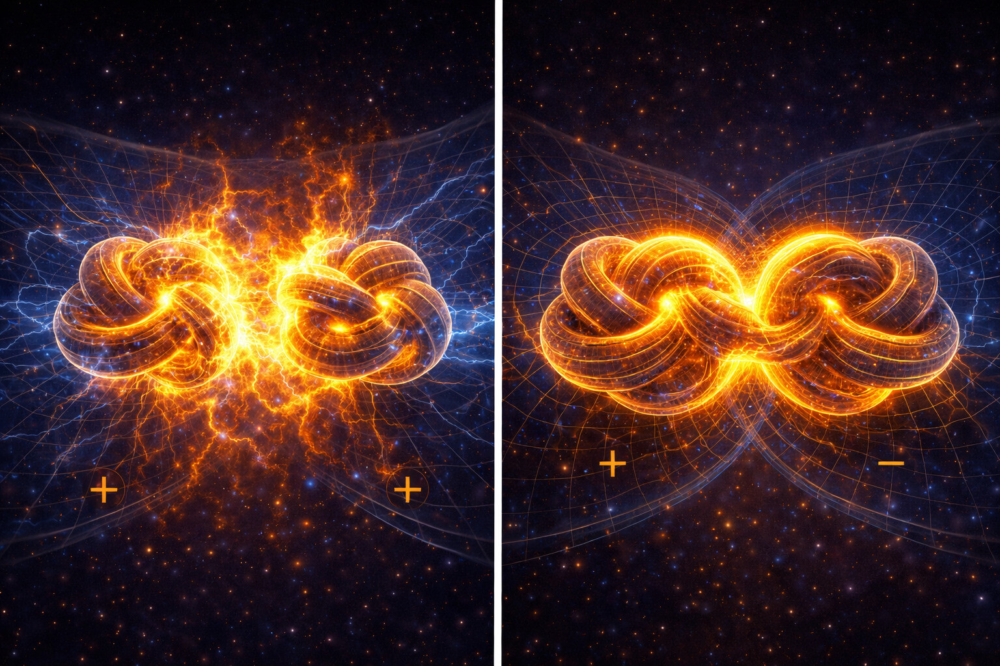
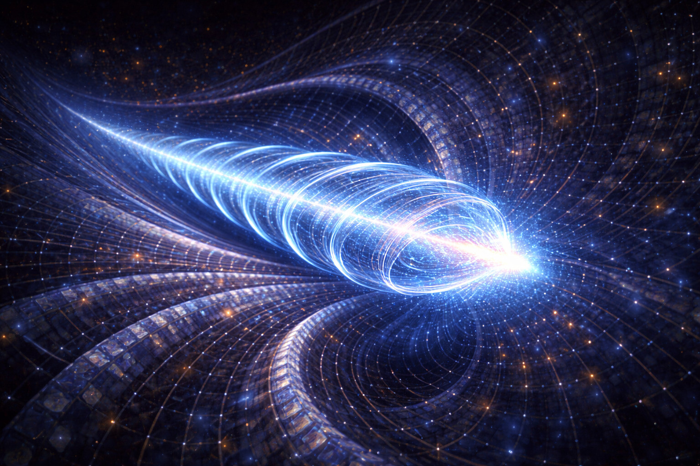
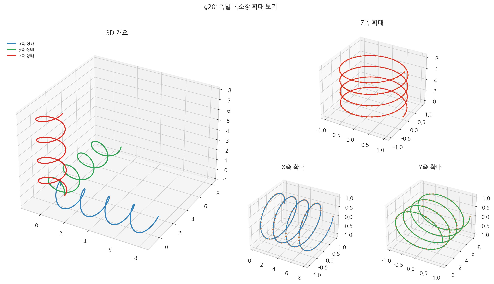

# 14. 전자기력은 공간의 위상 회전인가?

## 제2 입체 구조적 모드: 위상 회전

중력이 공간 전체의 '흐름'이라면, 전자기력은 그 흐름 위에서 나타나는 **'표면 위상 회전'**이다.
13장의 \(-\nabla\mu\) 흐름 모드에 이어, 이 장은 \(\nabla\theta\) 중심의 횡방향 반응 모드를 같은 좌표계에서 읽는다.

- **[검증됨]** 전자기 현상(유도, 복사, 편광)은 맥스웰/QED 체계에서 정밀 검증되어 있다.
- **[가설]** SALT는 전자기를 "위상 기울기 전파/재배열"로 해석한다.
- **[예측]** 위상 변수 \(\theta\) 기반 설명이 유도/복사/편광 채널을 일관되게 설명해야 한다.
- **[검증 절차 연결]** 관측 판정은 24장 13.2~13.4(지연·편광·전파 채널) 기준을 따른다.

### 전자기의 핵심식 한눈에 보기
\[
\Psi=\rho e^{i\theta},\qquad
\text{전자기 반응}\sim \nabla\theta
\]
\[
n\equiv \rho^2,\qquad
\mathbf{g}_{\mathrm{eff}}\propto-\nabla\mu
\]
- 전자기: 위상 기울기 \(\nabla\theta\)가 주도
- 중력: 유효 경사도 \(-\nabla\mu\)가 주도

① 같은 공간이라도 \(\theta\) 배열이 다르면 위상 회전 패턴이 달라진다.
② \(\nabla\theta\)가 커진 곳에서 전자기 반응이 강해진다.
③ 가속/산란 상황에서는 그 재배열 에너지가 복사로 나타난다.

### 용어 기준: 회전과 비틀림

이 장에서 두 용어는 같은 뜻이 아니다.

- **회전(국소)**: 한 점에서 위상이 시간에 따라 바뀌는 상태 \((\omega=\partial_t\theta)\)
- **비틀림(공간 누적)**: 이웃 점 사이 위상 차이가 쌓여 나타나는 공간 변형 \((\nabla\theta)\)

따라서 전자기 설명의 기본 문법은 다음과 같다.
1. 위상 회전이 먼저 생긴다.
2. 회전 불균일이 공간에 누적되면 비틀림(전단) 모드가 나타난다.
3. 그 비틀림 재배열이 유도/복사/편광 같은 관측 신호로 나타난다.

### 전자는 왜 화학결합을 만드는가?

짧게 말하면, **전자 배치를 바꾸면 원자 사이의 위상 기울기/장력 불균형이 줄어들기 때문**이다. 즉 결합은 "붙어라"라는 별도 명령이 아니라, 더 낮은 에너지 상태로 가는 재배열 결과다.

- **공유결합**: 두 원자가 전자 밀도를 함께 공유해, 사이 공간의 장력을 공동으로 낮춘다.
- **이온결합**: 전자가 한쪽으로 이동해 \(+\)/\(-\) 쌍이 형성되고, 그 전위차가 안정 결속을 만든다.
- **금속결합**: 전자가 격자 전체로 퍼져(탈국소화) 장력/전위를 넓게 분산시켜 안정화한다.

SALT는 이를 전자 매듭의 **위상 재배열**로 읽는다. 핵심은 같고, 표현만 다르다: 시스템은 항상 **총 에너지(장력 퍼텐셜)를 낮추는 배치**를 선택한다.

## 맥스웰 방정식이 남긴 질문

현대 물리학의 거대한 두 기둥인 **상대성이론**과 **양자역학**은 모두 '빛'이라는 신비로운 실체에 대한 의문에서 시작되었다. 아인슈타인은 "왜 빛의 속도는 동일한 **매질 위에서** 항상 일정한가?"라는 질문을 던져 공간의 틀을 깨뜨렸고(상대성이론), 맥스웰은 전기와 자기를 하나의 법칙으로 묶으며 우주의 기초 공사가 어떻게 되어 있는지를 알려주는 중요한 단서를 남겼다.

맥스웰이 발견한 **'진공에서 빛의 속도는 항상 일정하다'**는 진리는 당시 뉴턴의 고전역학(속도의 덧셈 법칙)과 정면으로 충돌했다.

고전역학이라면 시속 100km 기차에서 10km/h로 던진 공은 바깥에서 110km/h다. 빛도 그래야 했지만, 맥스웰 방정식은 빛의 속도를 진공 상수 \(\mu_0,\varepsilon_0\)로 정해지는 **관측자 무관 상수**로 제시했다.

이것은 치명적인 모순이었다. "내가 빛을 향해 광속의 절반으로 달려가도 빛은 여전히 $c$로 보이는가?" 뉴턴은 "아니"라고 했고, 맥스웰은 "그렇다"고 답했다. 핵심은 단순한 속도 계산이 아니라, 공간을 고정 배경으로 볼지 반응하는 매질로 볼지의 차이였다.

아인슈타인은 이 모순을 해결하기 위해 빛의 속도를 고정하는 대신, **시간과 공간 자체가 유동적으로 변해야 한다**는 혁명적인 결론을 내렸다. 즉, 맥스웰 방정식은 공간이 단순한 배경이 아니라 역동적으로 반응하는 실체임을 암시하는 진정한 설계도였다.

### 아인슈타인이 16살 때 품었던 질문: "빛을 타고 달리면?"

아인슈타인의 질문은 간단했다. *"빛과 같은 속도로 달리면 빛은 정지해 보이는가?"*

고전역학만 따르면 $c-c=0$이 되어 빛이 정지해 보여야 한다. 하지만 맥스웰 체계는 "정지한 빛"을 허용하지 않는다.

**그렇다면 "시간이 변형된다"는 아인슈타인의 해답은 SALT와 충돌하는가?**

충돌하지 않는다. SALT는 상대론의 실험 결과를 수용하고, 해석 언어만 "국소 인과 상한(c)과 동역학 자원 예산(VPB)"으로 바꾼다.

| 구분 | **중력에 의한 영향** | **속도에 의한 영향** |
|:---|:---|:---|
| **물리적 상태** | 고밀도 구역 = **[굴절률 $n$ 상승]** | 물체(매듭)의 고속 이동 = **[전이 부담 상승]** |
| **메커니즘** | 유효 경로가 길어져 지연이 커짐 | 보셀 격자가 이동 처리에 **동역학 자원 예산(VPB)**을 쓰느라 내부 과정(시계)을 지연시킴 |
| **결론** | **중력렌즈 현상** = 진공의 굴절 현상 | **뮤온 수명 연장** = 내부 시계 지연 |

**왜 우리는 항상 빛의 속도를 c로 측정하는가?**

SALT 해석에서는 로렌츠 대칭을 정보 전송 안정 조건으로 본다. 따라서 국소 관찰 기준의 전파 상한이 유지된다.

게이지 대칭도 같은 맥락에서, 격자 정합성을 유지하기 위한 국소 제약으로 읽는다.

SALT의 초점은 상대론 부정보다, 그 대칭이 성립하는 기계적 조건을 해석하는 데 있다.

### 게이지란 무엇인가?

'게이지'는 원래 **치수**나 **표준**을 의미하는 단어이다. 물리학에서 게이지 대칭이란, 공간의 각 지점마다 측정 기준(예: 전위의 영점, 보셀의 회전 각도)을 내 마음대로 바꿔도 전체 물리 법칙이 변하지 않는 성질을 말한다.

비유하면 보셀들은 서로 맞물린 톱니처럼 연결되어 있다. 여기서 **'게이지 변환'**은 이웃은 그대로인데 한 지점의 기준 각도만 따로 바꾸는 상황에 가깝다.

1.  **정합성 붕괴**: 맞물린 톱니에서 한 부분만 강제로 돌리면 어긋남과 응력이 생긴다.
2.  **게이지 대칭**: 기준을 바꿔도 주변이 함께 보정되면 전체 법칙은 같은 형태를 유지한다.
3.  **게이지 장**: 이 보정을 실제로 전달하는 연결 규칙이 게이지 장(빛, 전자기장)이다.

즉, **전자기 에너지는 정합이 어긋난 구간에 쌓이는 위상 회전 응력**으로 해석할 수 있다. 게이지 대칭이 잘 유지되면 이 응력은 작아지고 전파 손실도 줄어든다.

**[SALT의 결론: 마찰 방지 정합 규칙]**
결국 전자기력은 격자 정합을 유지하려는 **실시간 보정 과정**으로 읽을 수 있다. 전하가 이동하거나 가속할 때 빛이 방출되는 이유도, 급격한 상태 변화에 대한 정합 재조정 비용으로 해석한다.

정합이 맞지 않는 회전 성분은 빠르게 감쇠하고, 동기화된 **계통적 회전** 성분만 멀리 전달된다. 이것이 **광자(빛)**이며, 스핀 1 정합에서 손실이 작다.

### 왜 아인슈타인은 이 문턱에서 멈추었는가?

여기서 우리는 매우 중요한 질문을 던져야 한다. "아인슈타인은 공간이 빛을 위해 변해야 한다는 것을 알았고, 중력이 공간의 굽어짐이라는 것도 알아냈는데, 왜 전자기력과 중력을 하나로 합치지 못했을까?"

한 가지 이유는 당시 틀이 공간의 연속 기하를 설명하는 데 집중되어 있었기 때문이다. 그는 공간을 유연한 계량 구조로 정식화했지만, SALT가 가정하는 보셀 단위의 **동역학 상태**까지는 모델에 포함하지 않았다.

- **아인슈타인의 중력 (곡률)**: "길이 굽어 있으니 그리로 가라." (정적 입체 구조)
- **SALT의 중력 (흐름)**: "공간 매질의 유효 경사도에 따라 경로가 정해진다." (역동적 관점)

아인슈타인 체계에서는 중력과 전자기를 서로 다른 수학적 객체로 다뤘다. 그래서 통합 모델을 만드는 데 구조적 장벽이 컸다.

하지만 **공간**을 '공간 구조적 규칙'이 아닌 **'역동적인 매질'**로 보면 이야기는 완전히 달라진다.
**"중력은 공간의 종단적 흐름이고, 전자기력은 공간의 횡단적 위상 회전이다."**
라는 하나의 설계도가 완성된다. 모든 것은 동적 벡터 상태였다.

비유하면 고무줄을 잡아당길 때 길이 변화와 비틀림이 함께 나타날 수 있다. SALT는 이 결합 가능성을 이용해 중력(종단)과 전자기(횡단)를 한 매질의 다른 모드로 읽는다.

## 중력 배경 위에서 나타나는 위상 회전

전자기력은 별개 실체라기보다 **공간 매질의 위상 회전 모드**로 해석된다.

- **중력 (흐름)**: **공간 보셀(Voxel)**의 밀도/퍼텐셜 구배가 만드는 **종단적 흐름**이다.
- **전자기력 (위상 회전)**: 보셀 위상 회전이 이웃으로 전달되는 **횡단적 요동**이다.

### $c$의 비밀: 매질의 탄성 한계

SALT에서 \(c\)는 추상 공리가 아니라 **보셀 매질의 최대 파동 전달 속도**다. 보셀이 이웃 보셀로 위상 회전을 넘기는 최소 시간이 공간 탄성으로 정해지기 때문이다. 진공 국소 한계 \(c\)는 유지되고, 물질 내부 감속은 \(c_{\mathrm{eff}}(\rho)\)로 기술한다.

과거 미컬슨과 몰리는 '에테르'를 찾으려다 실패했지만, 그것은 매질이 없어서가 아니라 **로렌츠 대칭 자체가 보셀 격자의 공간 위상적 안정 고정점**이었기 때문이다. 매질 속을 움직일 때 나타나는 '로렌츠 변환'은, 사실 보셀 매질이 외부 작용에 대해 인과율의 일관성을 유지하려는 **수학적/입체 구조적 복원 과정**의 결과물이다.

이 입체 구조적 차이는 전자기력이 왜 중력보다 **$10^{40}$배** 수준으로 더 강하게 관측되는지 설명해준다. 중력이 무대 전체의 거시적인 이동 흐름이라면, 전자기력은 **보셀과 보셀이 국소적으로 맞물려 도는 '입체적 접촉 응력'**의 집합체이기 때문이다. '멀리서 당기는 힘'보다 '바로 옆에서 작용하는 힘'이 더 직접적으로 크게 나타날 수 있다.

## 플러스(+)와 마이너스(-): 전하의 회전 방향

중력은 오직 안쪽으로만 당겨지기에 방향이 하나뿐이다(장력 해소). 하지만 보셀을 비트는 동작은 **시계 방향**과 **반시계 방향**이라는 두 가지 선택지가 존재한다. 이것이 우리가 발견한 **전하**의 실체다.

여기서 전자기력의 인력과 척력이 발생하는 구조적 필연성이 드러난다.
1.  **척력 (같은 전하)**: 같은 방향 회전이 만나면 위상 회전 모멘트가 충돌해 **탄성 반발력**이 생긴다.
2.  **수렴 (반대 전하)**: 반대 방향 회전이 만나면 응력이 줄어드는 **응력 완화**가 일어나고 결합이 쉬워진다.

 

 

## 맥스웰 방정식: 보셀 상호작용 해석

맥스웰의 추상적인 수식은 SALT에서 보셀들이 서로를 어떻게 구동하는지에 대한 **'동적인 기어 역학'**으로 명쾌하게 전환된다.

1.  **가우스 법칙 (전기)**: **매듭(전하)**이 주변 **공간**에 만드는 전기장 플럭스의 총량이다.
2.  **가우스 자기 법칙**: 자기장은 시작점/종점이 없는 **닫힌 고리** 형태를 갖는다. (자기 홀극 불가능)
3.  **패러데이 법칙 (전자기 유도)**: 시간에 따라 변하는 자기장이 전기장을 유도한다.
4.  **앙페르-맥스웰 법칙**: 전류와 변위전류가 자기장을 유도한다.

 

 

## 빛(광자): 위상 회전 정보의 전파

그렇다면 빛은 무엇인가? 전자가 보셀들을 단단히 묶어 만든 **'고정된 위상 회전 매듭'**이라면, 빛은 매듭이라는 실체 없이 오직 **'위상 회전 정보'**만이 보셀에서 보셀로 전달되는 **'순수한 요동'**이다.

- **왜 광속($c$)은 일정한가?**: 빛의 속도는 **공간 매질**이 허용하는 **최대 파동 전달 속도**다. 보셀 간 위상 회전 전달 최소 시간이 탄성 한계로 정해진다.
- **게이지 대칭: 입체 구조적 생존 조건**: 맥스웰의 **게이지 대칭**은 추상 수학만이 아니라, 이산 보셀 격자에서 파동이 장거리 전파되기 위한 **정합성 조건**이다. 정합을 잃은 회전 성분은 빠르게 감쇠하고, 대칭을 지키는 광자 모드만 멀리 살아남는다.
- **스핀 1의 의미**: 광자의 스핀 1은 보셀이 진행 방향 축을 중심으로 한 바퀴(360도) 회전하며 위상 회전 정보를 전달하는 '단위 요동'을 의미한다.
- **질량의 부재**: 빛은 고착된 매듭이 아니라 전파 모드이므로 정지질량 항이 없다.

### 빛은 어떻게 중력 구배를 거슬러 전파되는가?

중력이 공간(보셀) 원단 자체가 안쪽으로 빨려 들어가는 '물살'이라면, 왜 빛은 그 반대 방향으로 나아갈 수 있는가? 또한, 빛은 어떻게 보셀의 상태를 바꿀 수 있는가?

1. **매질의 이동 vs 파동의 전파**: 매질 유입이 있어도 파동 전달 속도가 더 크면 반대 방향 전파가 가능하다.
2. **빛의 실제 정체**: 빛은 보셀을 "밖에서 밀어 움직이는 물체"가 아니라, 보셀 상태가 순차 갱신되며 나타나는 전달이다.
3. **전파 모드**: 사인파 형태는 마찰의 흔적이 아니라, 정보 전달 효율이 높은 고유 모드로 본다.
4. **적색편이의 비용**: 고밀도 구역을 거슬러 전파할 때 빛은 진동수(에너지)를 낮추며 전파를 유지한다.
5. **빛/질량 경계**: 에너지가 전달되면 파동(빛), 국소에 고착되면 매듭(질량)으로 관측된다.

요약하면, SALT에서 **중력은 보셀 간 유효 경사도(\(-\nabla\mu\))**, **빛/전자기파는 보셀 간 위상 회전 전달**, **강력은 극한 회전에 따른 위상 잠금(에너지 고착)**으로 구분된다.

### 굴절의 입체 구조: 보셀의 '입체적 저항'과 감속

여기서 우리는 중요한 의문에 직면한다. "빛의 속도가 불변이라면, 왜 프리즘이나 물속에서는 빛이 느려지고 굴절되는가?" SALT는 이를 공간 매질의 **'입체적 저항'**으로 설명한다.

1.  **국소적 감속 ($v < c$)**: 프리즘과 같은 고농축 물질 내부는 무수히 많은 원자핵과 전자가 **공간**을 강하게 붙들고 있는 **'고밀도 매개 지역'**이다. 빛(위상 회전 파동)이 이 지역을 지날 때, 뻣뻣해진 보셀들은 평소보다 파동을 전달하는 데 더 많은 **공간적 부하**를 겪는다.
2.  **매질의 밀도와 저항**: 시간 인덱스는 같아도, 단위 시간에 파동이 지나갈 보셀 수는 매질 저항에 따라 줄어든다. 진공에서 100보셀 진행하던 파동이 프리즘에서는 80보셀만 간다고 보면 된다. 이것이 **굴절률 \(n\)**의 실체다.
3.  **불변의 법칙과 양립**: 광속 $c$는 진공 배경 매질의 상한이고, 물질 내부 감속은 파동 전달 효율 저하에 따른 국소 효과다.

결국 빛이 굴절되는 이유는, 매질 경계에서 전달 속도와 위상 조건이 바뀌기 때문이다. 관측되는 경로는 이 조건에서 전파 시간이 최소가 되는 방향으로 정해진다.

::: {.note-theory}
**참고: 비틀림 포화**

만약 공간의 비틀림이 극한에 달하면 어떻게 될까? 블랙홀의 사건 지평선 근처나 초강력 자기장 구역에서는 보셀 격자가 허용할 수 있는 최대치까지 비틀려 있는 **'비틀림 포화'** 상태가 발생한다.
- **빛의 통과 불가능**: 비틀림이 포화된 공간은 추가 요동(빛)을 수용하거나 전달하기 어렵다.
- **편광의 한계**: 극심한 자기장 근처에서 발생하는 기묘한 광학 현상들은 보셀 격자가 더 이상 뒤틀릴 여유가 없어 발생하는 **'입체 구조적 포화'**의 증거들이다.
:::

 

 

### 질량 상태의 수축과 팽창

우리는 흔히 전자가 빛을 방출하고 흡수한다고 말한다. SALT에서는 이를 **공간 매듭(물질)의 긴장 재분배 과정**으로 본다.

1.  **방출**: 내부 비틀림 긴장이 임계점을 넘으면 잉여 결합력이 광자 형태로 방출된다.
2.  **흡수**: 입사한 파동 에너지가 매듭에 흡수되면 들뜬 상태로 전이한다.

즉, 전자기 상호작용은 물질 사이의 긴장 전달과 재분배 과정이다. 이 과정에서 질량 상태는 고정값이 아니라 에너지 점유에 따라 미세하게 변할 수 있다.

 

### 핵심식 재소환

**핵심:** 축마다 위상 상태를 분해해 보면 전자기 현상이 독립 힘이 아니라 구조적 회전 모드임을 직관화할 수 있다.

\[
\Psi=\rho e^{i\theta},\qquad n\equiv \rho^2
\]
\[
\text{전자기 반응}\sim \nabla\theta,\qquad
\mathbf{g}_{\mathrm{eff}}\propto-\nabla\mu
\]
- 전자기: 위상 기울기 \(\nabla\theta\)의 전파·재배열
- 중력: 유효 경사도 \(-\nabla\mu\)가 만드는 밀도형 흐름

아래 삽화는 "축별 단면에서 본 복소 장 상태"를 동시에 보여준다.  
왼쪽 메인 프레임은 \(x,y,z\) 축에서의 장 상태를 한 좌표계에 겹쳐 보여주고, 오른쪽 확대 패널은 각 축 단면을 따로 분해해 확인하게 해 준다.  
주황 점은 이산 보셀 샘플, 연속 곡선은 그 샘플의 연속 근사이므로, SALT의 이산 격자와 연속장 표현이 어떻게 연결되는지 독자가 바로 확인할 수 있다.

 

## 전자기 유도: 보셀의 입체 구조적 인과 사슬

자석을 움직이면 왜 도선에 전기가 흐르는가? SALT는 이를 '시간 변화 자기장이 공간 격자에 전단을 만들고 전기장을 유도하는 인과 과정'으로 설명한다.

1.  **자기장(소용돌이)**: 자기장은 보셀 회전 패턴이 정렬된 상태로 본다.
2.  **유도된 비틀림**: 회전 소용돌이가 주변 보셀을 지나가면 토크가 전달된다. 주변 보셀은 결속 때문에 완전 회전 대신 **전단 비틀림** 상태가 되고, 이것이 **전기장 \(E\)**다.
3.  **전자(질량 매듭)의 이동**: 주변 보셀이 전기장 \(E\)로 비틀리면 장력 균형이 깨지고, 전자는 **비틀림 압력 기울기**를 따라 이동한다. 이것이 **전류**다.

결론적으로 전자기 유도는 **자기장 변화가 전기장을 만들고**, 그 전기장이 전하를 이동시키는 연쇄 과정이다. SALT는 이를 보셀 정합 재배열의 관점에서 다시 읽는다.

### 중력과 전자기력의 입체 구조적 정의
>
> 중력이 **공간 매질**의 종단적 흐름이라면, 전자기력은 같은 매질에서 나타나는 횡단적 위상 회전이다.

 

### 파인만의 증언: 양자 전기역학(QED)이 SALT를 뒷받침하는 이유
>
> **양자 전기역학(QED)**은 전자-광자 상호작용을 매우 정밀하게 예측하는 표준 이론이다.
>
> SALT는 QED와 충돌하기보다, 같은 현상을 다른 기계적 언어로 읽는다.
>
> - **광자 = 보셀의 회전 전달**: QED에서 광자는 전자기력을 매개하는 입자로 기술되며, SALT에서는 이를 보셀 격자를 타고 흐르는 **회전 파동의 단위 패킷**으로 해석한다. 광자가 지나간 후 보셀 자체는 원상 복귀된다(탄성 영역).
> - **전자 = 고착된 보셀 매듭**: QED에서 전자는 해당 파동을 흡수·방출하는 존재이며, SALT에서는 소성 한계를 넘어 꼬인 **공간 매듭**으로 해석한다.
> - **게이지 대칭 = 격자 정합성 조건**: QED의 핵심인 $U(1)$ 게이지 대칭은 SALT에서 보셀 격자가 물리적 안정성을 유지할 때 따르는 **국소 정합성 규칙**에 해당한다.
>
> 자세한 비교는 부록 21 `주요 과학이론과 SALT`에서 다룬다.

 

그렇다면 이 위상 회전이 탄성 한계를 넘어설 정도로 극심해지면 어떻게 될까? 공간은 버티기 어려운 고착 상태로 전이한다. 이것이 물질(질량)의 탄생과 강력의 시작을 해석하는 SALT의 관점이다.

다음 장, **15. 쿼크는 왜 절대 혼자 존재할 수 없는가?**
