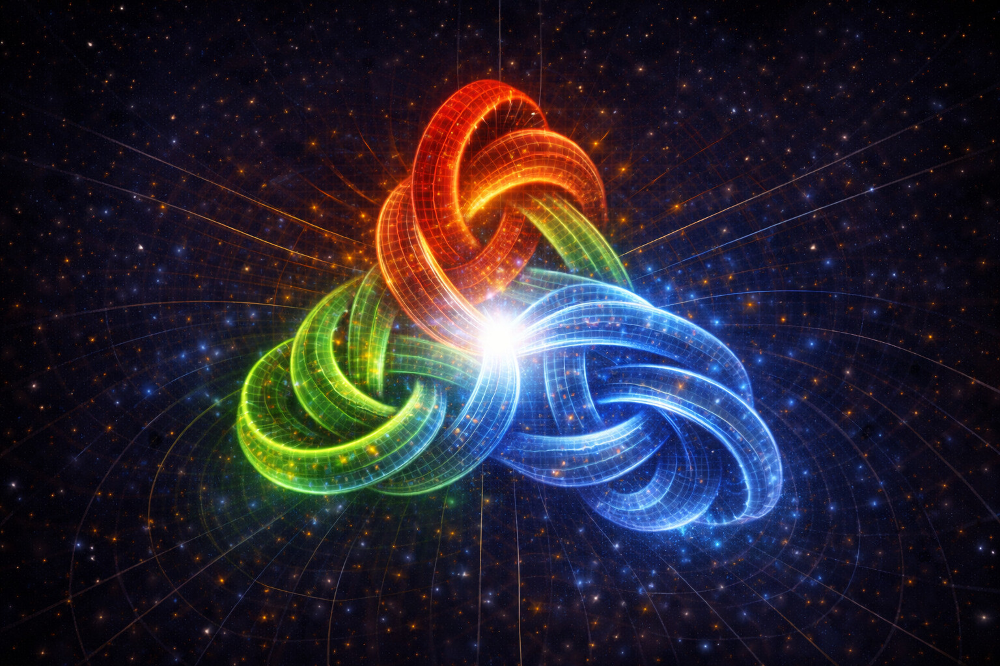
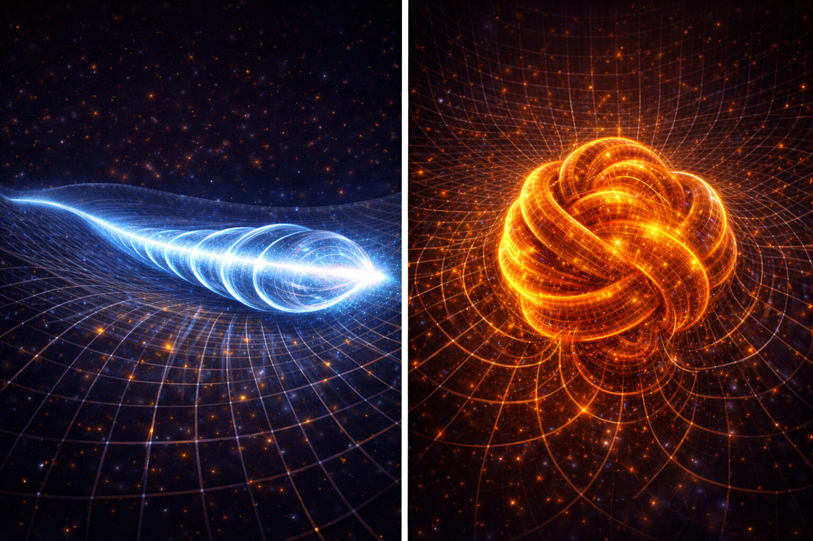
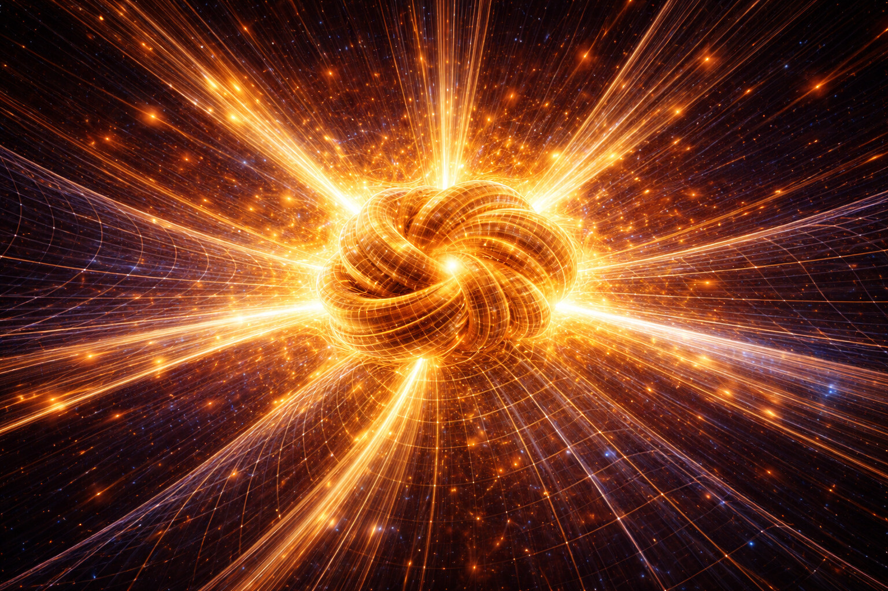
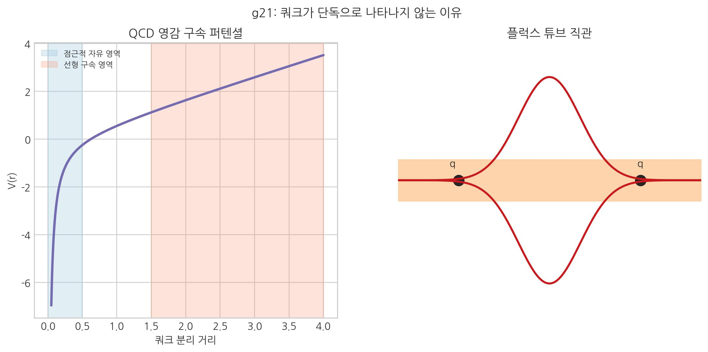

# 15. 쿼크는 왜 절대 혼자 존재할 수 없는가?

## 제3 입체 구조적 모드: 잠금

위상 회전이 한계를 넘으면 공간은 **'영구적 엉킴'** 상태로 진입한다. 이것이 물질의 탄생이자 강력의 본질이다.
14장의 전자기 비틀림은 여기서 임계 초과 구속과 잠금 동역학으로 이어진다.

- **[검증됨]** 쿼크 가둠, 점근적 자유, 핵자 결합은 표준 핵입자 물리에서 검증/정립된 축이다.
- **[가설]** SALT는 강력을 위상 잠금, 핵력을 그 잔류 유효 결속으로 해석한다.
- **[예측]** 강력-핵력 구분이 맞다면, 핵자 내부/핵자 간 관측 채널에서 서로 다른 스케일 법칙이 나와야 한다.
- **[검증 절차 연결]** 관측 판정은 24장 13.2~13.4와 고에너지 충돌의 결속/분해 패턴 비교를 함께 따른다.

### 강력과 핵력 한눈에 보기
| 항목 | 강력 | 핵력 (잔류 결속) |
| :--- | :--- | :--- |
| 층위 | 내부(층/쿼크 결속) | 복합체(핵자 간 결속) |
| 핵심 | 위상 잠금(소성 인터락킹) | 강력의 잔류 유효 결속 |
| 범위 | 핵자 내부 | 핵자 사이 |

- **검증 경계**: 쿼크 가둠, 점근적 자유, 핵자 간 잔류 결속이라는 관측 틀은 표준 핵입자 물리의 확립된 결과다.
- **해석 경계**: 아래 본문에서 사용하는 "위상 잠금/공간 가닥/소성 맞물림"은 SALT의 기계적 해석 언어다.

## 전자와 쿼크: 표면 모드와 심부 모드의 차이
우리는 3장에서 질량을 고장력 매듭으로 보았고, 앞 장에서는 전자기 위상 회전을 다뤘다. 이제 원자핵으로 내려가면, 쿼크가 전자와 다른 이유는 **와류의 심도**와 **위상 회전 구조**에서 드러난다.

다음은 SALT 관점에서 본 우주의 4가지 주요 상태 비교다.

| 구분 | **중력파** | **빛** | **전자** | **쿼크** |
| :--- | :--- | :--- | :--- | :--- |
| **스핀** | **2 (텐서)** | **1 (벡터)** | **1/2 (스피너)** | **1/2 (스피너)** |
| **입체 구조** | 공간 떨림 | 꼬임 전달 | 독립 매듭 | 불완전 매듭 |
| **이동 사이클** | 격자 신축 | 1 사이클(360°) | 1/2 사이클(720°) | 비대칭 사이클 |
| **질량 (저항)** | 0 | 0 | 작음 (\(m_e\)) | 큼 |
| **비유** | **지진** | **나사** | **톱니바퀴** | **닻** |

비유하면 전자는 비교적 쉽게 이동하는 표면 모드이고, 쿼크/양성자는 깊은 층에 고착된 구조다. 이 비대칭이 물질 세계의 안정성을 만든다.

### 보셀 입체 구조학의 완결성: 자유와 구속의 차이

이 단락부터는 검증된 현상을 설명하기 위한 SALT 해석 확장이다.

왜 쿼크는 분수 전하(+2/3, -1/3)를 가지며 절대 혼자 존재할 수 없는가? 그 비밀은 **'보셀의 위상 회전 상태'**에 있다. 이는 **보셀 입체 구조학의 완결성 원칙**으로 설명된다.

이것은 입자가 가진 **'보셀의 구조적 자유도'**의 차이다.

- **전자 (탄성 위상 회전)**: 보셀 한 단위의 위상 회전이 구조적으로 완결되어 있다. 전자는 **탄성 회전** 상태로, 복원력이 작동해 격자 위를 비교적 자유롭게 이동한다.
- **쿼크 (소성 전위 결함)**: 보셀 구조가 탄성 한계를 넘어 영구 뒤틀린 **소성 결함** 상태다. 결정의 **열린 전위**처럼 왜곡장이 거리 \(R\)에 비례해 퍼지므로, 단독 존재에는 사실상 무한한 입체 텐션이 필요하다.

따라서 쿼크는 텐션을 유한하게 만들기 위해 다른 쿼크와 결합해 왜곡장을 상쇄하거나 닫힌 루프(양성자)를 만들어야 한다. 이것이 쿼크 가둠의 실체다. 즉 가둠은 단순 결속력이 아니라, 불완전 소성 결함을 허용하지 않는 공간 결정의 제약에서 나온다.

## 양전자(+)와 양성자(+)의 착각
많은 이들이 전하가 플러스(+)이면 무조건 양성자라고 생각하지만, 이는 두 가지로 엄격히 구분된다. 이것을 이해해야 쿼크의 실체가 보인다.

1.  **양전자 (반물질)**: 전자와 질량은 같고 회전 방향(전하 부호)만 반대인 상태다.
2.  **양성자**: 단순한 부호 반전이 아니라, 쿼크 3개의 결속 구조로 이루어진 복합 입자다.

## 질량의 본질: 공간의 '소성 유동 응력'

그렇다면 쿼크나 전자는 도대체 왜 질량을 가지는가? 질량은 입자 고유의 '무게'가 아니라, 공간 격자(보셀)를 통과할 때 발생하는 **'입체적 저항'**으로 정의된다.

- **빛(스핀 1)**: 공간 격자가 가진 입체 구조적 결(결정 결)과 높은 정합성을 보이는 탄성 파동이다. 마찰 없이 광속으로 미끄러진다.
- **물질(스핀 1/2)**: 공간의 결보다 반 박자 느리게 회전하는 '소성 매듭'이다. 이 매듭을 한 칸 이동시키려면, 매 순간 공간 격자의 **'항복 강도'**를 이겨내며 결함을 전파시켜야 한다.

즉, 질량(관성)은 **소성 변형 매듭(입자)을 격자 안에서 이동시킬 때 드는 소성 유동 저항**으로 해석된다. 무거운 입자일수록 필요한 에너지가 커진다.

### 쿼크: 고착된 심부 모드

쿼크는 이 '긁힘'의 수준을 넘어선다. 쿼크는 공간 격자를 **'색전하'**라는 3차원 축의 비대칭 장력으로 꽉 움켜쥐고 있다.

- **비대칭 와류**: 전자가 공간 보셀을 전 방향으로 매끄럽게 비틀고 있다면, 쿼크는 3차원 축(X, Y, Z) 중 특정 방향으로만 극심한 와류가 쏠려 있는 상태다.
- **완전한 흰색 - 입체 구조적 자가 응축**: 단일 쿼크는 불완전한 와류 패턴 때문에 불안정하다. 따라서 다른 축 장력을 가진 쿼크들과 결합(**자가 응집**)해 전체 균형을 맞춰야 한다.



원자핵 질량의 98%는 쿼크 자체의 질량이 아니다. 쿼크와 쿼크 사이를 공명시키고 연결하는 **'소성 맞물림 에너지'**다.

> **소성 맞물림***: 불안정한 소성 결함(쿼크)들이 서로의 위상 회전 축을 교차시켜 만드는 **입체적 잠금** 상태다. 이는 가둠의 해석적 핵심이다.

### 장력의 가교: 왜 핵자 밖에서도 효과가 남는가?

여기서 중요한 입체 구조적 원리가 펼쳐진다. 쿼크들이 얽힌 소성 인터락킹 구간은 '원자핵'이라는 아주 좁은 공간에 갇혀 있다. 하지만 **공간 보셀 격자는 서로의 팔을 붙잡고 있는 연속체**다.

- **내부의 꼬임, 외부의 당김**: 쿼크 내부 장력은 핵 표면에서 완전히 끊기지 않고 주변 격자에 잔류 효과를 남긴다.
- **연속성의 필연**: 이 **공간 매질의 연속성** 때문에, 미시 세계의 강력한 소성 변형은 그 주변의 평탄한 보셀들에 필연적으로 **밀도 기울기(유효 경사도)를 형성하여 흐름을 유도하며** '장력의 그물'을 형성한다. 이것이 바로 우리가 거시 세계에서 관측하는 **중력**의 탄생 지점이다.
- **핵력**: 기존에는 핵력을 잔류 강력으로 취급했지만, SALT는 이를 **5번째 물리 발현**으로 본다. 두 입자가 매우 가까워지면 사이 공간 압착 응력이 커지고, 이를 줄이는 방향의 결속이 나타난다.

- **공간 가닥**: 쿼크 사이를 연결하는 이 입체적 통로는 보셀들의 위상 회전이 극한으로 중첩되어 우주에서 가장 팽팽한 장력(강력)을 형성한다.
- **글루온**: 그 팽팽한 보셀 가닥 위를 오가며 장력의 균형을 유지하는 '교차 진동'이다.

### 강력과 글루온: 상태와 에너지의 차이

강력과 글루온은 같은 것이 아니다. 이 둘의 차이를 이해하는 것이 SALT를 이해하는 핵심이다.

- **강력 = 얽힌 상태 그 자체**: 쿼크들이 소성 결함(색전하) 잠금으로 이루는 **입체 위상 고착 구조**다.
- **글루온 = 그 얽힘에서 발생하는 진동 에너지**: 극한 장력의 공간 가닥에서 생기는 동적 진동 패턴이다.

글루온은 강력을 설명하는 보조 비유가 아니라, 잠금 상태에서 나타나는 **공간 보셀의 동적 상태**로 해석된다.

**강도 측정**: 쿼크들이 멀어질수록 공간 가닥이 늘어나 장력이 폭발적으로 커지고, 글루온 진동이 격렬해진다. 반대로 쿼크들이 가까울수록 장력이 낮아지고 진동이 안정된다. 이것이 바로 **점근적 자유** — 가까울수록 강력이 약해지는 현상 — 의 입체적 실체다.
- **98%의 진실**: 양성자 질량의 대부분은 보셀 네트워크 꼬임/교차에서 나온 응축 에너지다. 그래서 원자핵은 이동 시 큰 관성(질량)을 가진다.



양성자라는 아주 작은 공간 안에는 공간이 견딜 수 있는 최대한의 **입체적 텐션**이 응축되어 있다. 이것을 인위적으로 깨뜨리는 순간(핵분열), **응축되어 있던 거대한 입체적 텐션**이 해방되며 원래의 평평한 상태로 폭발적으로 돌아가려 한다.

- **E=mc²의 실체**: SALT에서는 질량 상태에 응축된 텐션이 해방될 때, 유효 탄성 스케일(\(c^2\))을 따라 큰 에너지 방출(\(E\))로 나타난다고 해석한다.



강력은 단순 접착 비유보다, 보셀 네트워크 심부에서 나타나는 **입체적 잠금**으로 보는 편이 정확하다.

## 공간 가닥의 파열: 쿼크 가둠의 역설


> 핵심: 거리 증가에 따라 결속 비용이 커지는 퍼텐셜이 "왜 단독 쿼크가 안 나오는가"를 바로 설명한다.

그렇다면 쿼크를 억지로 분리하면 어떤 일이 일어날까? 외부에서 쿼크들을 멀리 잡아당기면, 공간 가닥은 무한히 늘어날 수 없다. 그 과정은 세 단계로 진행된다.

**1단계 — 임계 장력 도달**: 쿼크들이 멀어질수록 공간 가닥이 늘어나며 장력이 기하급수적으로 증가한다. 가까울 때는 장력이 낮고 (점근적 자유), 멀어질수록 폭발적으로 강해진다.

**2단계 — 가닥 파열**: 장력이 임계치를 넘는 순간 가닥이 끊어진다. 이때 응축된 글루온 텐션이 크게 방출된다.

**3단계 — 빠른 재봉합 (강입자화)**: 끊어진 양 끝은 색전하 불완전 결함 상태이므로, 강입자화 시간척도에서 빠르게 **새로운 쿼크-반쿼크 쌍**을 만들고 다시 묶인다.

::: {.diagram-large}
```
[쿼크A] ====공간 가닥==== [쿼크B]
            ↓ (충격 에너지 투입)
[쿼크A]====[파열 지점 → 에너지 방출]====[ 쿼크B]
            ↓ (즉각 재봉합)
[쿼크A─새반쿼크'] + [새쿼크─쿼크B]
        (두 개의 새 메존 탄생)
```
:::

이것이 입자 가속기에서 쿼크 분리 시도마다 새 입자가 생성되는 이유다. **쿼크는 단독으로 드러나기보다, 분리 시도 과정에서 재결합 경로가 즉시 열린다.** SALT에서는 이를 공간 구조가 요구하는 위상 제약으로 읽는다.

### 겔만·윌첵의 증언: 양자 색역학(QCD)이 SALT를 뒷받침하는 이유
>
> **양자 색역학(QCD)**은 쿼크·글루온의 강한 상호작용을 기술하는 표준 이론이다.
>
> SALT는 QCD와 충돌하기보다, 같은 현상을 소성 맞물림 언어로 해석한다.
>
> - **쿼크 가둠 = 보셀 격자의 위상적 완결성 요구**: QCD에서 쿼크는 색전하 중성(흰색) 상태로만 존재할 수 있으며, SALT에서는 불완전한 소성 결함이 다른 결함과 짝을 이뤄 격자의 완결성을 회복해야 하는 **공간의 구조적 강제**로 해석한다.
> - **점근적 자유성 = 보셀 매질의 비선형 복원력**: 쿼크가 가까울 때 힘이 약해지고 멀어질수록 강해지는 이 특성은 SALT에서 보셀 격자 원단이 늘어날수록 **복원 장력이 폭발적으로 증가**하는 비선형 탄성으로 직접 대응한다.
> - **글루온 = 소성 잠금 상태에서 필연적으로 발생하는 진동 에너지**: QCD에서 글루온은 강력을 '전달'하는 매개 입자이지만, SALT에서는 극한 장력을 받는 보셀 공간 가닥이 **필연적으로 발생시키는 에너지 패턴(진동)**으로 해석한다.
>
> 자세한 비교는 부록 21 `주요 과학이론과 SALT`에서 다룬다.

다음 장, **16. 입자는 어떻게 변신하는가?**
