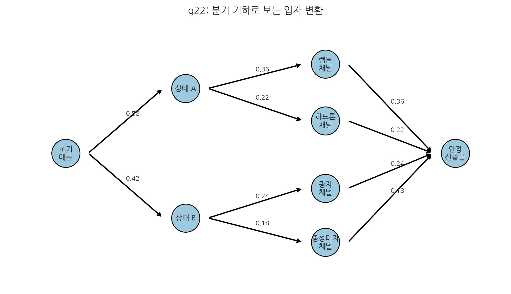
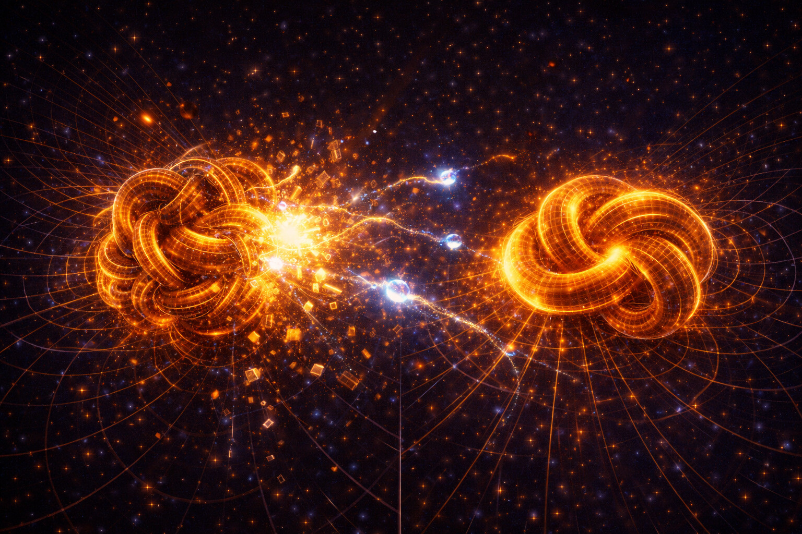

# 16. 입자는 어떻게 변신하는가?

## 위상 회전 잠금의 해제: 모드 전환

우리는 지금까지 공간이 흐르고(중력), 회전하며(전자기력), 잠기는 과정(강력)을 봤다. 마지막 퍼즐은 **"잠긴 매듭이 어떻게 다시 풀리는가?"**이다. 이것이 약력의 역할이다.
15장의 '구속 물리'를 여기서 '전이 물리'로 확장한다.

약력은 밀거나 당기는 물리적 힘이라기보다, 입자의 입체 구조 모드를 바꾸는 **변환** 메커니즘이다. 잠긴 매듭(강력) 일부를 풀어 재배열하는 **입체적 잠금 해제** 과정으로 읽는다.

- **[검증됨]** 베타 붕괴, 중성미자 방출, 종류 전이는 실험적으로 확립되어 있다.
- **[가설]** SALT는 약력을 "잠금 해제/재배열 전이"로 해석한다.
- **[예측]** 재배열 모델이 타당하면, 붕괴 채널의 스펙트럼/편향을 동일 전이 규칙으로 설명할 수 있어야 한다.
- **[검증 절차 연결]** 관측 판정은 24장 13.2~13.4(스펙트럼·편향·지연 채널) 기준을 따른다.

### 미시 검증식 연결 프레임 (구축 중)
본 장의 미시 채널은 아래 3축으로 정리하며, 각 채널은 관측량 단위 예측식으로 잠금한다.

- 뮤온 g-2: \(a_\mu^{\mathrm{measured}}\), \(a_\mu^{\mathrm{SM}}\), \(a_\mu^{\mathrm{SALT}}\)
- 중성미자 진동: \(\theta_{ij}, \Delta m^2_{ij}\)의 measured/SM/SALT 비교
- 충돌기 정밀 잔차: 단면·비율·스펙트럼의 measured/SM/SALT 비교

데이터 판정 필드는 `measured_value`, `uncertainty`, `sm_pred`, `salt_pred`를 기본으로 두고, 채널별 잔차 비교로 판정한다.
미시 검증은 완전 확정식 고정보다, 관측 해상도 한계 하에서 통계 정합과 해석 설명력을 함께 평가한다.

미시 검증의 단계 목표는 아래 순서로 고정한다.
- 1단계(정합): 보른 규칙 수준의 표준 양자 통계와 동등 재현
- 2단계(해석 우위): 기존 해석 난제를 SALT 변수로 일관 설명
- 3단계(차별 예측): 선택 채널에서만 추가 보정항의 실측 개선 여부 검증

여기서 1단계의 의미는 "입자가 본질적으로 확률 구름으로 퍼져 있다"는 존재론을 그대로 채택한다는 뜻이 아니다.
SALT에서는 관측 대상과 관측 도구가 같은 보셀 매질 위에서 함께 영향을 받기 때문에, 플랑크 해상도 아래에서는 위치·속도를 직접 분해해 읽는 관측이 원리적으로 닫힌다.
따라서 보른 규칙은 미시 세계의 최종 실체 진술이라기보다, 현재 관측 가능 해상도에서 재현되어야 하는 통계 규칙으로 취급한다.

### 미시 채널 판정식(통계 정합 + 해석 평가)
채널 범위(고정):
- `muon_g_minus_2`
- `neutrino_oscillation` (\(\theta_{23}\), \(\Delta m^2_{32}\))
- `collider_high_pt_tail` (\(d\sigma/dX,\ X=p_T\) 또는 \(m_{jj}\))

공통 판정식:
\[
res_{SM}=O_{meas}-O_{SM},\quad
res_{SALT}=O_{meas}-O_{SALT},\quad
winner=\arg\min\left(|res_{SM}|,\ |res_{SALT}|\right)
\]

채널별 비교식(작동 형태):
\[
a_\mu^{SALT}=a_\mu^{SM}+\Delta a_\mu^{SALT}(\alpha_\mu,\beta_\mu,\ldots)
\]
\[
\theta_{23}^{SALT}=\theta_{23}^{SM}+\delta\theta_{23}^{SALT},\quad
(\Delta m^2_{32})^{SALT}=(\Delta m^2_{32})^{SM}+\delta(\Delta m^2)_{32}^{SALT}
\]
\[
\left(\frac{d\sigma}{dX}\right)_{SALT}=
\left(\frac{d\sigma}{dX}\right)_{SM}\left[1+\kappa\left(\frac{X}{X_0}\right)^q\right]
\]

통계/반증 기준:
- 채널별 \(\chi^2\), RMSE, AIC/BIC
- 다중비교: Benjamini-Hochberg FDR
- 단일 파라미터 세트로 독립 3개 이상 데이터셋 동시 적합 실패 시 해당 채널 기각
- SALT 우세 판정은 통계 유의성과 효과크기를 동시에 충족할 때만 인정

### 약력의 핵심 정의 한눈에 보기
- 강력: 위상 잠금(고착)
- 약력: 잠금 해제/재배열(전이)
- 전자기: 위상 기울기 전파

① 과긴장 매듭이 임계점에 도달한다. ② 잠금 일부가 풀리며 내부 패턴이 다시 짜인다. ③ 남는 위상 회전 에너지는 전자/중성미자/복사 형태로 방출된다. 이 재배열은 중력축의 \(-\nabla\mu\) 흐름과 병행되는 국소 전이 채널로 읽는다.

중성자가 양성자로 변하며 전자를 방출하는 베타 붕괴는, 공간 구조의 국소 재배열로 해석할 수 있다.

현대 물리학은 이를 W, Z 보손이라는 무거운 매개 입자의 교환으로 설명한다.

### 1. 매개 입자가 아닌 '공간 소성 가공'

하지만 SALT에서 약력은 입자 교환보다, 공간 구조를 재편하는 **소성 가공** 과정에 가깝다. 핵심은 내부 격자 구조의 재배열이다.

- **W, Z 보손의 실체**: 구조가 바뀔 때 필연적으로 발생하는 **'순간적인 소성 유동 응력의 꼭짓값'**이다.

### 2. 왜 그렇게 무거운가? (80 GeV: 보셀의 전단 파쇄 강도)

W, Z 보손이 양성자의 80~90배에 달할 정도로 무거운 이유는, 이것이 **보셀 한 단위가 물리적 구조를 뜯어고칠 때 견뎌야 하는 '전단 파쇄 강도'**를 의미하기 때문이다.
- **임계 에너지 단가**: 공간이라는 단단한 직조물의 매듭을 끊고 다시 연결하려면, 보셀 격자의 탄성 복원력을 일시적으로 압도하는 **'소성 변형 임계 에너지'**가 필요하다.
- **80~90 GeV의 실체**: 이것은 단순 질량값이라기보다, 보셀 구조를 재편하기 위해 필요한 **최소 에너지 문턱**으로 해석한다. 이 문턱 아래에서는 종류 전이가 어렵다.

### 3. 왜 '왼손잡이'인가? (상호작용의 방향성)
약력이 특정 방향(왼손잡이성)으로만 작용하는 이유는 **공간 와류의 회전 관성**으로 해석한다. 재패턴화가 나선 구조를 따라 진행되기 때문에 특정 나선성(헬리시티)이 선택된다.

## 입체 구조적 '소성 이완'

> 핵심: 변환은 임의 사건이 아니라 분기 확률과 채널 구조를 가진 재배열 과정이다.

약력은 입자를 응축시키는 힘이 아니라, **불안정한 고에너지 결함(중성자)이 더 낮은 에너지 상태(양성자)로 전이되면서, 과잉된 '소성 변형 텐션'을 해방하는 과정**이다.

이것은 **소성 이완** 또는 **자가 치유** 메커니즘이다.
약력은 불안정 매듭이 더 안정한 상태로 가는 **위상적 재결속**이며, 이때 전자·중성미자·에너지 파동이 방출된다.

여기서 **입자**는 떠다니는 알갱이가 아니라, 공간 원단이 꼬여 생긴 **매듭 패턴**이다. 과잉 장력이 임계점에 닿으면 매듭은 구조를 풀어 더 안정한 상태로 복원되고, 이것이 우리가 관측하는 약력이다.

### 동위원소: 같은 패턴 속의 미묘한 차이
위상입체 구조적 패턴은 거의 같지만 미묘하게 다른 상태가 존재하는데, 이것이 바로 **동위원소**다.
- **표면의 정체성**: 원소의 이름(원자 번호)은 매듭의 가장 바깥쪽 표면이 보여주는 '위상 회전의 양(전하)'에 의해 결정된다.
- **내부의 밀도 변이**: 같은 표면 위상 회전을 가져도 내부 **응축 밀도(중성자)**는 다를 수 있다.
- **붕괴의 예고**: 이 미묘한 내부 밀도의 차이(과잉 장력)가 임계점을 넘어서는 순간, 약력이 개입하여 매듭의 구조적 전개를 촉발한다.

많은 이들이 베타 붕괴를 입자들이 위치를 바꾸는 현상으로 오해하지만, 이는 **입자 내부의 공간 입체 구조가 바뀌는 사건**이다.
- **꼬임의 실체**: 쿼크는 공간 보셀들이 특정 방향/밀도로 응축된 패턴이다.
- **내부적 재구조화**: 다운 쿼크($d$)는 업 쿼크($u$)보다 내부 장력 구조가 복잡하다. 장력이 한계에 도달하면 위치 이동이 아니라 내부 패턴 전이로 상태가 바뀐다.

- **잔여물의 방출**: 매듭 재구성 과정에서 여분의 위상 회전이 방출되며, 이것이 **전자**와 **중성미자**로 관측된다.

## 원소 변환: 공간 상태 전이의 결과

입체 구조적 위상이 변하면 입자의 정체성이 바뀌고, 이는 **원소 변환(원자 번호 변화)**으로 이어진다.

- **강력 경로 (거시적 재구축)**: 양성자/중성자 클러스터를 합치거나 쪼개며 원자 번호를 바꾼다.
- **약력 경로 (미시적 변형)**: 클러스터는 유지한 채 내부 꼬임 패턴만 재배열해 원자 번호를 1 단위로 바꾼다.

결국 **원자 번호**는 그 지점의 공간이 어떤 입체 구조 위상(매듭 상태)을 갖는지 나타내는 지표다.

### 자연 이완
따라서 약력은 '힘'이라기보다, 공간 와류가 더 안정한 상태를 찾는 **동적 이완** 현상으로 해석할 수 있다.

## W, Z 보손: 공간의 일시적 병목

약력을 매개하는 W, Z 보손이 양성자보다 80배나 무거운 이유는 그들이 독립된 입자가 아니라, **매듭이 풀리는 순간에 일시적으로 형성되는 '초고밀도 병목 구간'**이기 때문이다.

- **응력 집중**: 강한 매듭이 약력 전이로 재배열될 때, 공간 보셀 격자에 위상 회전 응력이 일시적으로 집중된다.
- **짧은 거리, 큰 질량**: 이 병목은 매우 짧게 지속되지만 국소 밀도가 높아 관측상 큰 질량 스케일로 나타난다.

## 왼손잡이 우주: 위상 회전의 고유 방향성

약력의 가장 큰 특징인 '패리티 대칭성 파괴(한쪽 방향으로만 작동)' 역시 공간의 입체 구조로 설명된다.

공간 보셀이 나선 결을 가지면, 매듭이 풀리는 방향에도 편향이 생긴다. 이는 공간이 단순 배경이 아니라 **고유 결**을 가질 수 있음을 시사한다.

## 꼬임의 방향성: 물질과 반물질의 입체 구조

보셀 격자가 꼬이는 방식에는 두 가지 선택지가 있다. 시계 방향과 시계 반대 방향이다. 이 미묘한 '방향의 차이'가 바로 물질과 반물질의 운명을 가른다.

- **물질**: 우리 우주를 구성하는 일반적인 입자들은 시계 반대 방향의 꼬임 패턴을 공유한다.
- **반물질**: 거울에 비친 듯 정확히 반대 방향(시계 방향)으로 꼬인 패턴이다.
- **쌍소멸**: 반대 방향 꼬임이 만나면 입체 구조 상쇄가 일어나고, 응축 텐션이 빛(광자)으로 방출된다.

### 태초의 위상 회전 편향
왜 우리 우주에 물질이 더 많은가? SALT는 우주 초기에 공간 보셀 격자에 미세한 한쪽 방향 위상 편향이 있었다고 가정한다. 이 **초기 편향**이 누적되어 물질 비대칭으로 이어졌을 가능성을 제시한다.

## 모든 작용은 하나다: 공간 상호작용 비교표

핵폭발(강력의 해소)과 입자 붕괴(약력의 해소)는 근원적으로 **'공간 매듭의 재배열'**이라는 동일한 현상이다.

| 구분 | 중력 | 전자기력 | 강력 | 약력 |
| :--- | :--- | :--- | :--- | :--- |
| **입체 구조적 작용** | **유효 경사도에 의한 흐름 유도** | 표면의 위상 회전 | 심부의 위상 잠금 | 위상의 재배열 |
| **비유** | 거시적 뼈대 / 탄성 인장 | 연못 위 물결 | 압축 스프링 | 엉킨 실의 해소 |
| **에너지 특징** | 입체 구조적 장력 유지 (정적) | 빛(광자)으로 전달 | E=mc² (질량 결손) | 정체성 변화(입자 변환) |
| **SALT식 해석** | **보셀 유효 경사도(\(-\nabla\mu\))에 의한 흐름 유도** | 보셀 간의 회전 전달 | 매듭의 '개수'나 '크기'가 변함 | 매듭 내부의 '위상 회전 방향'이 바뀜 |

- **강력의 해소(핵폭발)**: 응축 텐션이 크게 방출되는 거시적 사건이다.
- **약력의 해소(베타 붕괴)**: 질량 변화는 작지만 내부 위상 회전 형태가 바뀌는 미시적 변환이다.

결국 우주의 변화는 공간이라는 하나의 재료가 어떤 깊이와 방향으로 위상 회전·잠금되는지에 따라 결정되는 연속 과정이다.

## 공간 설계자를 향한 첫걸음

우리는 공간의 밀도/위상 재배열로 입자 변환을 읽는 관점을 살펴보았다. 입자가 공간의 매듭이라면 다음 질문이 열린다.

**"우리가 공간의 매듭을 직접 설계하고 묶을 수 있다면 어떨까?"**

이 질문은 관찰을 넘어 설계 가능성으로 연결된다. 다음 장에서는 이를 실험 언어로 번역해, 어떤 예측이 관측으로 지지되거나 반증될지 점검한다.

다음 장, **17. SALT의 미래예측과 첨단기술**
