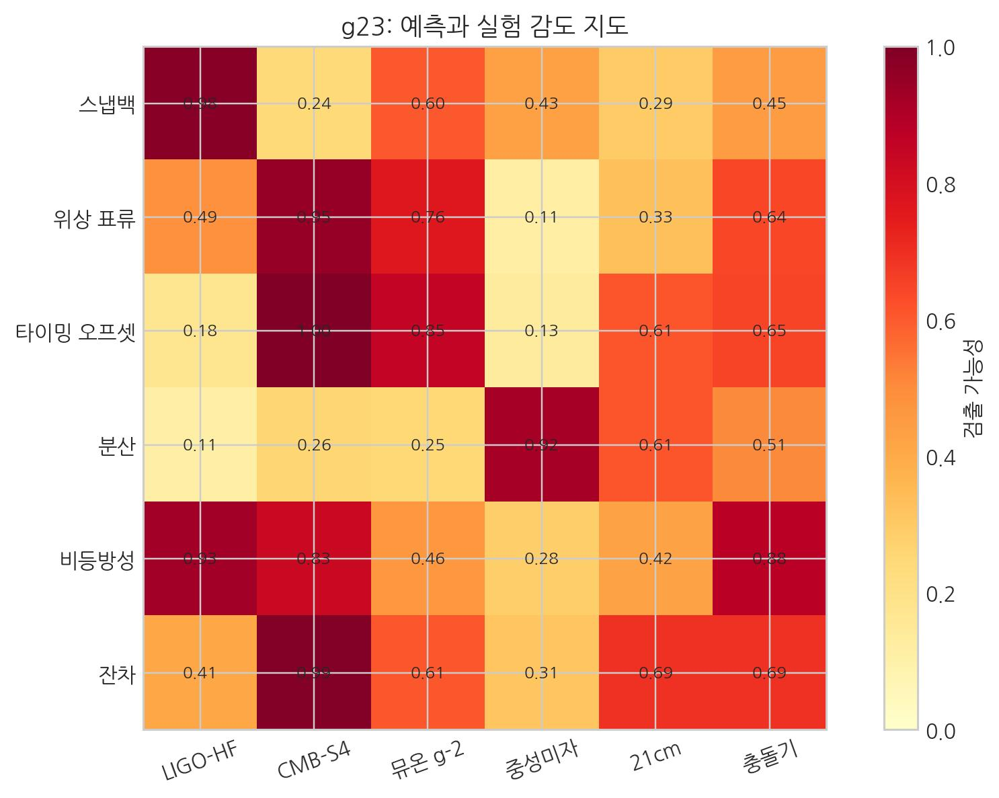

# 17. SALT의 미래예측과 첨단기술

## 대통합 관점: 검증 가능한 해석

이 장은 검증 단계의 첫 관문이다. 통합 해석이 어떤 예측을 내고 어디서 반증되는지 제시한다.
앞 장의 질문(공간 매듭 설계 가능성)을 관측 지표와 실험 채널로 바꿔 다룬다.

- **[검증됨]** 현재 관측 정밀도 범위에서 GR 기반 기술(지연/렌즈/궤도)은 높은 정합을 보인다.
- **[가설]** SALT는 이를 보셀 매질의 상태변수(\(\rho,\theta,n,\mu\)) 기반으로 재해석한다.
- **[예측]** 동일 변수 집합으로 여러 관측 채널을 교차 설명할 수 있어야 한다.
- **[검증 절차 연결]** 예측 판정은 24장 13.2~13.4(지연·렌즈·편광/전파) 기준을 따른다.

### 검증 규격 연결(범위 고정)
본서의 현행 검증 규격은 거시(우주론)·미시(입자물리) 채널을 함께 다루며, **거시 비교 문맥에서만** `Standard`를 **표준우주론(ΛCDM)**으로 사용한다.

- 이벤트 비교 구조: `actual_value`, `standard_fit`, `salt_fit`
- 판정/통계의 상세 정의: 24장 13.4A 규격을 따른다.

미시(입자물리, SM) 채널은 별도 검증 트랙으로 분리하며, 관측량별 예측식 잠금 후 동일 규격으로 통합한다. 미시 문맥의 기준 이론 표기는 `SM`을 사용한다.

SALT 관점에서 우주는 '공간(배경)'과 '입자(객체)'의 분리보다, **동적인 공간 와류의 순환**으로 기술된다.

- **중력**: 공간 밀도 차이가 만든 **유효 경사도(\(-\nabla\mu\), 저차 \(-\nabla\rho\))** 흐름이자 잔여 와류.
- **전자기력**: 매듭(질량) 주변 보셀들의 비대칭 **위상 회전**이자 **입체적 마찰과 맞물림**.
- **강력**: 공간이 극한으로 말려 들어가 형성된 **위상 잠금**이자 와류의 핵.
- **약력**: **응축되어 있던 와류 텐션**이 해방되며 내부 구조를 재배열하는 **잠금 해제-재패턴화** 과정.

여기서 핵심은 '힘'을 독립 실체로 보기보다, **입체 구조적 상호작용**으로 재해석하는 관점이다.

## 검증 가능한 예측들: SALT의 성적표

> 핵심: 이론의 강점은 설명력이 아니라 검증 가능성이다. 어느 실험이 어떤 예측을 잡는지 한눈에 본다.  
> 노란색일수록 검출 민감도가 낮고, 갈색(빨간)에 가까울수록 해당 실험이 SALT 신호를 포착할 가능성이 높다.

| 신호 | 설명 |
| --- | --- |
| 스냅백 | 급격한 밀도 변화 시 보셀 매질이 순간적으로 복원되며 생기는 고주파 탄성 충격(중력파/압력파). |
| 위상 표류 | 보셀 위상의 느린 어긋남이 만드는 지속적 시간 오프셋/편동. |
| 타이밍 오프셋 | 신호가 도달하는 데 필요한 시간의 흐름 단위가 많아져 생기는 국소 시계 간 시간 차. |
| 분산 | 보셀 경로에서 주파수별 속도 차(빛의 색깔별 시간 지연). |
| 비등방성 | 방향마다 다른 보셀 밀도/위상 배열이 만드는 외부에서 보이는 불균형. |
| 잔차 | 표준 모델/GR로 설명되지 않는 미세한 비정상 값, SALT 신호의 흔적일 수 있음. |

| 실험(기구) | 설명 |
| --- | --- |
| LIGO-HF | 고주파 중력파를 타깃으로 하는 레이저 간섭계: 스냅백·타이밍 오프셋에 민감. |
| CMB-S4 | 우주배경복사의 편광/온도 맵을 정밀히 측정해 비등방성과 분산을 찾는 최대급 전파망원경. |
| 뮤온 g-2 | 뮤온 자기 모멘트의 미세 편차로 위상 표류·잔차 신호를 포착. |
| 중성미자 | 지구를 통과하는 고에너지 중성미자의 지연과 스냅백 흔적을 추적. |
| 21cm | 초기 우주 21cm 선을 통해 분산·비등방성·시간 지연을 민감하게 측정. |
| 충돌기 | LHC 등에서 운동 에너지 방출, 잔차, 위상 정렬 변화를 분석하는 고에너지 사건 검사. |

모든 이론은 검증 가능해야 한다. SALT는 현재의 관측 정밀도($\gamma, \beta$ 값의 $10^{-5}$ 오차 범위)에서 일반상대론과의 정합을 전제로, 다음과 같은 예측을 제시한다.

### 핵심 예측 5 (먼저 읽기)

1. 중력장과 공간 흡입률의 상관관계
2. 고밀도 영역의 추가 굴절 편차
3. 시간 지연과 적색편이의 동일 원인
4. 초고에너지 로렌츠 대칭 위반 잔차(LIV)
5. 초고주파 중력파(탄성 스냅백)

아래는 핵심 5의 상세와 확장 예측(6~9)이다.

### 1) 중력장과 공간 흡입률의 상관관계
- **[SALT의 예측]**: 중력가속도 $g(r)$은 단순히 거리에 따른 힘이 아니라, 해당 지점의 **공간 흡입률(적층률)**과 비례한다. 이 경우 블랙홀 강착원반 거동에서 GR과 미세 차이가 생길 수 있다.
- **[검증 방법]**: 초거대 블랙홀 주변의 가스 궤도를 초정밀 관측하여, 뉴턴/아인슈타인 수식에서 벗어난 미세한 '흡입 가속도' 성분이 존재하는지 확인한다.

### 2) 고밀도 영역의 추가 굴절 편차
- **[SALT의 예측]**: 일반상대론의 공간 곡률에 의한 굴절 외에도, 극고밀도 영역(중성자별 등)에서는 보셀의 전이 지연으로 인한 **'기하학적 굴절'** 항이 미세하게 추가된다.
- **[검증 방법]**: 고밀도 천체 뒤를 지나는 광원(퀘이사 등)의 중력 렌즈 효과를 분석하여, 곡률 모델로 설명되지 않는 추가 굴절각 편차를 포착한다.

### 3) 시간 지연과 적색편이의 동일 원인
- **[SALT의 예측]**: 전이 속도 저하($\Delta t$)가 클수록 주파수 저하($\Delta f$)가 발생하는데, 이 둘은 동일한 **'보셀 자원 배분식'**에 의해 수학적으로 묶여 있다. 이는 시계가 느려지는 것과 빛이 붉게 변하는 것이 각각 다른 현상이 아니라, 보셀 동역학 자원 부족이라는 단 하나의 원인에서 기인함을 뜻한다.
- **[검증 방법]**: 중력 적색편이와 시간 지연 값을 원자시계로 동시 측정할 때, 기하학적으로 높은 일치도를 보이는 상관계수가 나타나는지 검증한다.

### 4) 초고에너지 로렌츠 대칭 위반 잔차(LIV)

- **[SALT의 예측]**: 시공간이 이산적 보셀로 이루어져 있다면, 에너지가 컷오프 스케일($M \approx 10^{16}$ GeV)에 근접할 때 미세한 오차가 발생한다. $E > 10^{15}$ eV 영역의 초고에너지 광자에서는 광속($c$) 한계 대비 미세한 감쇄 또는 전파 잔차가 나타날 수 있다.
- **[검증 방법]**: LHAASO와 같은 차세대 우주선 관측소에서 날아오는 PeV(페타전자볼트)급 광자의 생존 여부와 도달 시간을 정밀 분석한다. SALT 검증의 핵심 채널이다.

### 5) 초고주파 중력파: 탄성 스냅백

- **[SALT의 예측]**: 기존 물리학은 중력파를 주로 거대 천체 충돌의 산물로 본다. SALT는 강력과 중력의 공통 뿌리를 가정해, **핵분열/핵융합** 순간에도 주변 공간의 빠른 복원으로 **초고주파 탄성 충격파(탄성 스냅백)**가 생길 수 있다고 본다. (MHz~GHz)
- **[검증 방법]**: 기존 LIGO로는 감지 불가능하다. 원자력 발전소나 입자 가속기 옆에 **'탁상형 공명 탐지기'**나 **'초전도 공동'** 센서를 설치하여, 핵반응 순간에 발생하는 동기화된 공간 떨림을 측정한다.

### 확장 예측 (심화)

### 6) 중성미자의 질량: 소성 가공 부산물

- **[SALT의 예측]**: 표준 모형은 중성미자 질량 기원을 완전히 설명하지 못한다. SALT에서 중성미자는 붕괴 과정의 **미세 구조 부산물(소성 부산물)**이며, 질량이 작은 이유는 공간 격자와의 **탄성 저항**이 매우 작기 때문으로 본다.
- **[검증 방법]**: 중성미자의 진동 변환이 **주변 공간의 밀도(장력)**에 따라 달라지는지 측정한다. 지구 지표면, 태양 중심부, 원자로 근처 등 **배경 밀도가 다른 환경**에서 중성미자의 변환 확률에 미세한 편차가 발생하는지 확인한다.

### 7) 암흑 물질의 실체
- **[SALT의 예측]**: 암흑 물질은 입자(WIMP)보다, 은하 중심 질량이 만든 주변 공간 밀도 변화 효과로 해석한다. 공간 점성이 높아지면 별들의 고속 회전이 더 쉽게 유지된다.
- **[검증 방법]**: **암흑 물질이 없는 은하(NGC 1052-DF2 등)**와 일반 은하를 비교한다. 단순히 '질량 부족'이 아니라 **'은하 중심부의 밀도 집중도'**가 회전 속도 곡선의 기울기를 결정하는 핵심 변수임을 입증한다.

### 8) 우주 팽창의 수수께끼 해결 (허블 긴장)
- **[SALT의 예측]**: 초기 우주와 후기 우주의 팽창 속도가 다른 것은 미지의 암흑 에너지 때문이 아니다. 빛이 거쳐온 우주 공간의 **'보셀 경로 밀도'** 역사가 다르기 때문이다. 일반상대론의 **샤피로 지연** 현상을 보셀 밀도에 의한 '실질적 입체 경로 증가'로 해석하면 우주론적 불일치가 자연스럽게 해결된다.  
  고밀도 영역에서 신호가 늦게 도착하는 것을 "거기 시간이 느려졌다"고 해석하면 관측 프레임 간 불일치가 생기지만, SALT에서는 그것을 밀도·위상 경로의 복잡성이 더 많은 플랑크 클럭을 소비한 결과로 본다.
- **[검증 방법]**: **우주 거대 공동**을 통과해 온 빛과 **초은하단**을 통과해 온 빛의 적색편이($z$) 값을 정밀 비교한다. SALT가 맞다면, 빛이 통과한 경로의 평균 공간 밀도에 따라 겉보기 거리가 미세하게 다르게 측정될 것이다.

### 9) 중력과 강력의 연결 고리
- **[SALT의 예측]**: 중력($1/r^2$)과 강력은 서로 다른 힘이 아니라, 거리(밀도)에 따라 **위상 층의 적층 깊이와 결합 구조가 달라지는** **단일 와류 과정**의 양극단으로 해석될 수 있다.
- **[검증 방법]**: 펨토미터($10^{-15}$ m) 이하의 초미세 영역에서 인력을 측정했을 때, **중력 세기 상승과 강력 스케일 사이의 연속적 연결 경향**이 발견되는지 본다. 입자 가속기의 초고밀도 충돌 파편이 **'단거리 중력'**과 유사한 인력 패턴을 보인다면, 이는 두 힘의 연결 가설을 지지하는 단서가 된다.

### 핵심 예측 요약표 (검증/반증)
| 예측 | 필요한 관측 | 기대 시그널 | 반증 기준 |
| --- | --- | --- | --- |
| 밀도 기울기와 시간 지연의 공통 원인 | 중력장별 원자시계·적색편이 동시 관측 | 동일 밀도 지표에서 지연·편이 동조 | 두 값이 체계적으로 분리됨 |
| 중력-강력 연속 스펙트럼 | 초고에너지 충돌/단거리 인력 데이터 | 스케일 변화에 따른 연속 결합 곡선 | 불연속/단절형 분리만 관측 |
| 초고주파 중력파 잔차 | 차세대 중력파 검출기 대역 확장 | 표준 GR 외 고주파 꼬리 신호 | 예측 대역에서 일관 무신호 |
| 암흑 성분의 밀도장 재해석 | 렌즈/회전곡선/밀도맵 결합 분석 | 추가 입자 없이 패턴 재현 | 추가 물질 가정 없이는 재현 실패 |

## 양자역학과 첨단기술의 접점

양자역학은 추상 이론을 넘어 스마트폰·메모리·양자컴퓨터 기술에 직접 연결된다. SALT는 이를 소성 매듭/위상 응력 언어로 다시 해석한다.

### 1. 에너지 띠 이론의 재해석
반도체가 전기를 통하게 하거나 막는 원리는 전자가 특정한 '에너지 띠'에만 존재할 수 있다는 사실에서 출발한다.

- **기존 해석**: 전자는 원자핵 주변의 불연속적인 궤도(에너지 준위)에 확률적으로 분포한다.
- **SALT 해석**: 전자는 '소성 매듭'이고, 원자핵(양성자 덩어리) 역시 더 크고 빽빽한 '매듭 다발'이다. 두 매듭이 가까이 있을 때, 주변의 공간 보셀들은 이 둘 사이에서 강력한 **장력** 채널을 형성한다.
    전자는 보셀 격자와 **공명**하는 특정 텐션 상태(거리·속도)에서만 안정하다. 이 공명 궤도 집합이 밴드, 공명 불가 구간이 밴드갭이다.

### 2. 양자 터널링: 장벽 통과의 재해석
최신 3나노 반도체에서는 전자가 얇은 절연막을 통과해 오작동을 일으키는 양자 터널링 억제가 핵심 과제다.

- **기존 해석**: 입자의 위치 확률 파동이 장벽 너머까지 존재하기 때문에, 벽을 넘어갈 확률이 0이 아니다.
- **SALT 해석**: 벽(절연막) 역시 조밀한 보셀들의 장력 장벽이다. 전자의 매듭이 이 장벽과 충돌할 때, 매듭 자체가 부서져 물리적으로 벽을 뚫는 것이 아니다.
    전자가 장벽에 닿으면 **응축 텐션 에너지**가 응력 전달로 장벽 보셀에 전달된다. 장벽이 충분히 얇으면 에너지가 반대편 보셀을 다시 **소성 항복**시켜 새 전자 매듭을 만든다. 즉 관통이라기보다, 이쪽에서 풀리고(파동화) 저쪽에서 다시 묶이는(입자화) 재구성이다.

### 3. 플래시 메모리: 강제 고장력 상태의 저장
스마트폰에 사진을 저장하는 낸드 플래시 메모리는 이 터널링 현상을 역이용한다.

- **SALT 해석**: 플래시 메모리에 상태를 '기록한다'는 것은 강한 전압(에너지)을 가해 전자 매듭들을 절연막 너머의 빈 공간(플로팅 게이트)으로 강제로 밀어 넣는 행위다. 밀려 들어간 전자들은 그 좁은 공간의 보셀들을 극도로 비틀어 놓는다.
    이 억지로 구겨진 **'고장력 상태'**가 바로 상태(1 또는 0)가 저장된 물리적 실체다. 두꺼운 절연막(보셀의 장력 벽) 덕분에 이 억지 매듭들은 쉽게 풀리지 않고 수년 동안 갇혀있게 된다. 우리가 사진을 지울 때는 다시 반대 방향의 강한 에너지를 가해 이 매듭들을 원래의 낮은 장력 상태로 풀어준다.

요약하면 스마트폰 메모리 동작은 보셀 격자의 장력 관점에서 보면 '매듭의 형성-해제' 과정으로 재해석할 수 있다.

### 4. HBM(고대역폭 메모리): 적층 구조의 비교
최근 AI 핵심 기술인 **HBM(고대역폭 메모리)**은 SALT의 '위상적 적층'과 비교 가능한 구조를 가진다.

- **한정된 면적의 한계**: 반도체 칩의 바닥 면적(3차원 바닥 면적)은 물리적으로 제한되어 있다. 데이터를 더 많이, 더 빠르게 처리하기 위해 칩을 옆으로 넓히면 신호 전송 경로가 길어져 속도가 느려지고 전력 소모가 커진다.

- **TSV(관통 실리콘 비아)를 통한 수직 적층**: HBM은 이 문제를 칩을 위로 겹겹이 쌓아 올리는 방식으로 해결한다. 수천 개의 구멍(TSV)을 뚫어 칩 사이를 수직으로 연결함으로써, **면적은 그대로 유지한 채 데이터의 밀도와 대역폭을 비약적으로 높인 것이다.**

- **SALT적 해석**: HBM의 수직 적층은 SALT의 **공간 내부 위상 중첩**을 3차원 세계에서 흉내 낸 구조와 비슷하다. 다만 차이가 있다. HBM은 칩을 쌓을수록 높이가 늘지만, SALT 보셀은 **투영 면적과 부피를 유지한 채** 내부 상태 공간에서만 에너지를 중첩시킨다.

  진정한 보셀형 적층은 부피 증가 없이 내부 상태만 겹치는 형태다. 이 차이가 HBM과 SALT 적층의 본질적 경계다.

### 5. 메모리 리프레시: 상태 유지의 반복 재확정
우리가 컴퓨터 메모리(DRAM)에 데이터를 저장할 때, 그 데이터는 한 번 써놓으면 영원히 유지되는 정적인 상태가 아니다.

- **주기적 충전**: DRAM 커패시터는 전하 누설이 있어 주기적 리프레시가 필요하다. 이 과정이 멈추면 저장 정보가 사라진다.
- **SALT적 해석**: 이는 SALT의 **'찰나적 등록'** 공리를 기술적으로 높은 충실도로 재현한 것이다.
  우주 시스템에서 보셀과 입자(매듭)는 한 번 만들어졌다고 자동 유지되지 않는다.
  매 보편 시간 인덱스마다 시스템 시간의 흐름에 맞춰 상태를 **재확정(재등록)**해야 존재가 유지된다.
  우리가 보는 견고한 세상은 플랑크 시간 단위의 초고속 리프레시 출력으로 해석할 수 있다.

### 6. 양자 컴퓨터 계산력: 큐비트의 SALT 해석

#### 큐비트란 무엇인가?

**큐비트 = 양자 비트.** 고전 컴퓨터의 비트가 0 또는 1이라는 확정된 상태만 가질 수 있다면, 큐비트는 측정 전까지 두 상태가 확률적으로 혼재한 **'중첩'** 상태를 유지한다.

수학적으로는: |ψ⟩ = α|0⟩ + β|1⟩ (단, |α|² + |β|² = 1)

이를 SALT로 번역하면:

| 양자역학 용어 | SALT 해석 |
|:---|:---|
| **큐비트 = 중첩 상태** | 보셀이 아직 상태 확정되지 않아 두 회전 방향 사이에서 초고속으로 진동하는 **임시 중첩 상태** |
| **α, β (확률 진폭)** | 각 방향으로 확정될 통계적 확률 — '동시 존재'가 아니라 **'확정 전 진동의 편향 비율'** |
| **측정 = 파동함수 붕괴** | 외부 입자가 개입하여 보셀 상태를 강제로 **확정**시키는 행위. 이 순간 진동이 멈추고 0 또는 1이 확정된다 |
| **얽힘** | 두 보셀이 생성 시 하나의 공동 결맞음으로 서로 반대 방향을 배정받아 **이력을 공유**하는 상태. 둘 중 하나가 확정되는 순간 나머지도 자동으로 확정된다 |
| **간섭** | 확정되지 않은 상태들의 확률 진폭이 서로 더해지거나(증폭) 상쇄되는 현상. 올바른 경로의 확률을 높이고 나머지를 지우는 **확률 경로 선택** |

**2큐비트 예시:**
α₀₀|00⟩ + α₀₁|01⟩ + α₁₀|10⟩ + α₁₁|11⟩

SALT 해석: 두 보셀이 각각 확정되지 않은 상태에서 가능한 4가지 조합이 동시에 임시 중첩 상태로 공존하는 것. 측정(확정) 전까지 4개 경로 모두에 계산이 적용될 수 있으며, 최후 확정 시 오직 하나의 결과가 정해진다.

---

양자 컴퓨터의 계산 이득에 대해서도 기존 양자역학과 SALT는 해석 관점이 다르다.

- **기존 양자역학 해석**: 중첩과 간섭을 수학적으로 사용해 병렬적 계산 이득을 얻는다고 본다.
- **SALT 해석**: 계산 이득의 근원을 "평행 우주"보다, 보셀 상태의 초고속 전이(확정 전 진동) 활용으로 해석한다.
  SALT에서 중첩은 동시 실체라기보다, 0/1 사이를 빠르게 오가는 전이 지연 상태다.

### 왜 양자 컴퓨터는 빠른가 — SALT의 핵심 통찰
> **"고전 컴퓨터는 확정된 결과로 계산하고, 양자 컴퓨터는 확정 직전 과정까지 계산에 쓴다."**

이를 연산 단계로 줄이면 다음과 같다.

| | **고전 컴퓨터** | **양자 컴퓨터** |
|:---|:---|:---|
| **방식** | 0/1 상태를 순차 스위칭하며 계산 | 확정 전 진동 상태를 계산 경로로 사용 |
| **자연과의 관계** | 자연의 흐름을 **거슬러** 제어 | 자연의 흐름을 **그대로** 이용 |
| **속도 한계** | 트랜지스터 스위칭 속도 (GHz 수준) | 보셀의 플랑크 주파수 (우주적 인과 상한) |

고전 컴퓨터는 확정된 비트를 순차 갱신하고,
양자 컴퓨터는 확정 전 진동(진폭/위상)의 간섭을 계산 자원으로 사용한다.
핵심은 결과만 계산하느냐, 과정까지 계산하느냐의 차이다.

### 7. 스핀 통제 방법: 큐비트 유형별 비교

그렇다면 인간은 이 보셀 매듭의 나선 방향을 어떻게 조작하여 양자 컴퓨터를 만드는가? 현재 4가지 주요 방식이 경쟁 중이다.

| 방식 | 큐비트 실체 | SALT 해석 | 장점 | 단점 |
|:---|:---|:---|:---|:---|
| **초전도** (IBM·Google) | 쿠퍼 쌍 (반대 스핀 전자 2개 결합) | 반대 방향 나선 매듭이 격자 진동(포논)으로 결합 → 스핀 0 보손 | 가장 발달, 긴 코히어런스 시간 | 극저온(0.01K) 필요 |
| **스핀** | 전자 스핀 ↑↓ | 보셀 매듭의 나선 감김 방향 (반시계/시계) | 소형화 가능, 반도체 공정 활용 | 코히어런스 시간 짧음 |
| **이온트랩** | 원자의 전자 에너지 준위 | 전자 매듭의 공명 껍질 상태 | 최고 연산 정확도 | 처리 속도 느림, 확장 어려움 |
| **광자** | 빛의 편광 방향 | 보셀 격자를 타는 회전 전달의 감김 방향 | 상온 작동, 광속 전송 | 광자 손실, 광자 간 상호작용 어려움 |

방식이 다르더라도, **인간이 스핀(나선 방향)을 통제하는 원리는 동일하다.** SALT로 표현하면 4단계다:

1.  **격리**: 열 노이즈(환경 보셀들의 무작위 진동)가 큐비트를 강제 확정시키지 않도록 차단한다. → 극저온, 진공, 전자기 차폐
2.  **정렬**: 자기장·레이저·마이크로파 펄스로 보셀 매듭의 나선 방향을 원하는 반시계/시계로 유도한다. → 불완전 읽기 상태의 확률 편향(α, β)을 조작하는 행위
3.  **얽힘**: 결합 펄스로 두 매듭을 하나의 공동 결맞음으로 묶어 이력을 공유시킨다. → 한쪽 확정 시 나머지 자동 확정
4.  **측정 (확정)**: 원하는 순간에만 외부 개입을 허용해, 반시계 또는 시계 중 하나의 결과를 확정한다. → 이것이 계산 결과의 '읽기'

> **양자 컴퓨터 제어의 핵심은, 환경 잡음으로 무작위 확정되기 전에 원하는 방향으로 편향시키는 것이다.**

---

::: {.note-theory}
**최종 정리: 표준 양자역학은 무엇을 회피했는가 — SALT와의 근본적 차이**
:::

양자역학의 핵심 개념들에 대해, 표준 양자역학과 SALT 해석을 비교하면 다음과 같다.

| 주제 | 표준 양자역학 | SALT |
|:---|:---|:---|
| **전자의 스핀** | 추상적 상태값(±½). 점 입자이므로 "실제 회전이 아님" | 보셀 매듭이 격자를 나선형으로 전진하는 방향 — **실제 꼬임** |
| **파동함수** | 확률을 계산하는 수학 도구. 물리적 실체 불명 | 보셀 격자의 응력 전달 — **물리적 실체** |
| **관측자 효과** | "관측이 파동함수를 붕괴시킨다" (메커니즘 불명) | 외부 에너지가 탄성 한계를 초과시키는 **소성 고착** |
| **양자 중첩** | 여러 상태가 "동시에 존재" (마법적) | 플랑크 시간 단위 초고속 진동의 **등록 지연(불완전 읽기)** |
| **자기 모멘트** | "회전하지 않는데 자기 모멘트가 있다" (설명 회피) | 나선 꼬임이 주변 보셀에 만드는 **회전 장력의 직접적 결과** |
| **불확정성** | 측정의 근본적 한계 | 보셀이라는 최소 해상도 + 좌표계 자체의 플랑크 진동 |
| **양자 컴퓨터 원리** | 평행 우주에서 동시에 계산 (다세계 해석) | 자연의 확정 전 진동 상태를 **직접 계산 자원으로 활용** |

요약하면, 표준 양자역학은 "무엇"을 정밀 계산하고 SALT는 "왜"를 보셀 기전으로 해석하려는 접근이다.

### 8. 홀로그래피 디스플레이: 공간 매질 구현

오늘날 '홀로그램'이라 부르는 기술 대부분은 2차원 빛을 굴절·반사해 입체처럼 보이게 하는 착시에 가깝다. 하지만 SALT에서는 홀로그래피를 단순 영상 기술이 아니라, 우주가 현실을 구성하는 방식을 모사하려는 시도로 본다.

#### 현재 기술의 한계: 허상 중심 렌더링
현재의 홀로그램 기술은 크게 세 가지 방식으로 나뉜다:
- **유사 홀로그램**: 반사막/투명 스크린으로 2D 영상을 반사하는 방식. 공연에서 흔하지만 옆에서 보면 입체감이 약해진다.
- **체적 디스플레이**: 공기 중 플라즈마나 미세 입자에 빛을 맺히게 하는 방식. 실제 공간에 점을 찍지만 장비가 복잡하고 고해상도가 어렵다.
- **컴퓨터 생성 홀로그래피**: 회절 패턴을 실시간 역계산해 공간에 맺히게 하는 기술. 디지털 3D에 가장 가깝지만 연산 자원이 많이 든다.

#### SALT의 확장 가설: 상태 등록에서 물리적 실체까지
SALT는 홀로그래피를 '빛의 간섭 기반 영상'에서 '공간 상태(밀도·위상) 제어'로 확장할 가능성을 제안한다. 아래 내용은 검증 전 기술 가설이며, 현재 단계에서는 예측적 설계안으로 취급한다.

1.  **보편 시간 인덱스와 시스템 주사율(재생 빈도)**: 
    현재 디스플레이가 초당 60~120번 갱신되듯, SALT의 우주는 보편 시간 인덱스(UTI)에 맞춰 플랑크 시간 단위로 보셀 상태를 갱신한다고 본다. 미래 홀로그래피는 단순 투광이 아니라, 보셀 업데이트 주기에 동기화해 특정 공간의 **등록 상태**를 조절하는 방향을 가정한다.
2.  **빛의 간섭에서 공간 밀도 제어로**: 
    현재 홀로그램이 빛 간섭으로 허상을 만든다면, SALT 기반 기술은 특정 지점 보셀의 **밀도와 위상**을 국소 보정하는 방향을 가정한다. 장기적으로 매질 의존성이 낮은 3차원 상 구현 가능성을 제시하지만, 아직 실험적으로 확정된 결론은 아니다.
3.  **촉각적 실체의 구현 (물리적 홀로그램)**: 
    SALT에서 질량은 보셀 밀도와 텐션 패턴이다. 홀로그래피 장치가 빛 주파수뿐 아니라 보셀 **장력 분포**까지 모사할 수 있다면, 시각을 넘어 촉각 피드백 인터페이스로 확장될 가능성이 있다. 다만 이는 장기 예측이다.

::: {.note-theory}
**참고:** "현대 홀로그램이 빛 밀도를 조작하는 기술이라면, SALT 홀로그램은 공간 상태(밀도·위상) 재구성을 지향하는 가설적 청사진이다."
:::

---

## 고도화된 공간 공학

물질이 공간의 매듭이라면, 핵심 과제는 원자 조작을 넘어 **공간 상태 자체를 제어하는 공학**으로 이동한다.

앞선 장들에서 우리는 보셀의 변형 패턴을 인위적으로 설계해 '제5의 물질 상태'를 만들 가능성을 엿보았다. 이를 가능케 하는 핵심 기술이 바로 **ADM(절대 밀도 매핑)**이다. 공간의 보셀 밀도 분포를 실시간으로 스캔하고 그 '기울기'를 직접 조절하는 기술이다.

이 관점에서 SALT는 원자만이 아니라, 원자가 놓인 배경(공간 보셀)을 공학적으로 다루는 방향을 제안한다.

### 공간 야금학
핵심 기술인 **ADM(절대 밀도 매핑)**은 단순 밀도 측정을 넘어, 공간의 국소 **위상 불변량(감김수)** 판별을 목표로 한다.
- **실질 질량**: 보셀 격자가 위상적으로 꼬여서 '풀 수 없는 매듭'이 된 상태. ADM 스캔 시 0이 아닌 위상 정밀도(감김수 ≠ 0)가 감지된다.
- **가상 질량**: 에너지는 높지만 위상적으로는 평평한(감김수 = 0) 단순한 '인장력의 집중'. 이는 적절한 공간 공학적 간섭으로 해소 가능하다.

- **질량 제어**: 국소 공간의 항복 강도를 인위적으로 낮추는 **'연림(풀림 처리)'** 공정을 통해, 물체의 관성 질량을 0에 가깝게 조절한다. 이것이 우리가 꿈꾸던 **중력 제어 비행체**의 입체 구조적 원리다.
- **에너지 수확**: 매듭이 풀릴 때 나오는 에너지를 제어하여, 태양보다 효율적인 **'응력 완화'** 발전을 구현한다. 진공 자체가 가진 막대한 탄성 포텐셜을 **해방하여** 쓰는 것이다.
- **초광속 통신(가설)**: 공간의 결을 따라 정보를 보내는 경로 공학이 가능하다면, 유효 전달 지연을 줄이는 우회 경로(웜홀 유사 효과)를 설계할 가능성이 있다. 다만 국소 광속 한계 \(c\) 자체를 위반한다는 뜻은 아니다.
- **새로운 주기율표(안정성 섬)**: 위상수학적 **매듭 이론**으로 고안정 와류 구조를 계산해, 새로운 인공 물질 설계를 시도한다.

### 와류 엔진
SALT에서 이동은 **동적 와류의 흐름**으로 해석된다. 우주선 전후방의 **와류 세기**를 조절할 수 있다면, 행성급 질량 없이도 공간 경사를 만들어 유효 이동 성능을 높일 가능성이 있다.

- **동기화 원리**: 물질은 보셀의 꼬임 패턴이므로, 공간이 변형될 때 몸을 구성하는 매듭들도 동일한 비율로 동기화되어 변한다. 따라서 격렬한 공간 항해 중에도 원자 구조의 붕괴 없이 안전하게 '공간의 물살'을 탈 수 있다.
- **공간 거품**: 엔진은 우주선 내부를 상대적으로 평탄한 공간으로 유지하고, 외부에만 급격한 와류를 형성하는 구성을 가정한다.

## 통합 관점의 정리

이제 중력(흐름), 전자기력(위상 회전 전달), 강력(와류 핵), 약력(와류 이완)을 하나의 공간 동역학에서 읽을 수 있다.

결국 원자는 **쿼크 조합이 만든 위상입체 구조**다. 물질은 공간 상태의 조직화된 결과이며, 주기율표는 공간이 허용하는 안정 구조의 목록으로 읽을 수 있다.

수소부터 우라늄까지 모든 원소는 공간 상태 패턴에 따라 성질이 정해진다. 강력으로 응축된 텐션이 약력으로 이완되고, 전자기 전달과 중력 흐름이 함께 작동한다는 점이 SALT의 통합 틀이다.

SALT는 완성 이론이라기보다, 검증과 수정을 거쳐야 할 초안에 가깝다. 다음 장에서는 이 초안을 독자 질문으로 다시 점검해 주장과 근거의 강약을 본다.

다음 장, **18. SALT에 대한 31가지 질문**
