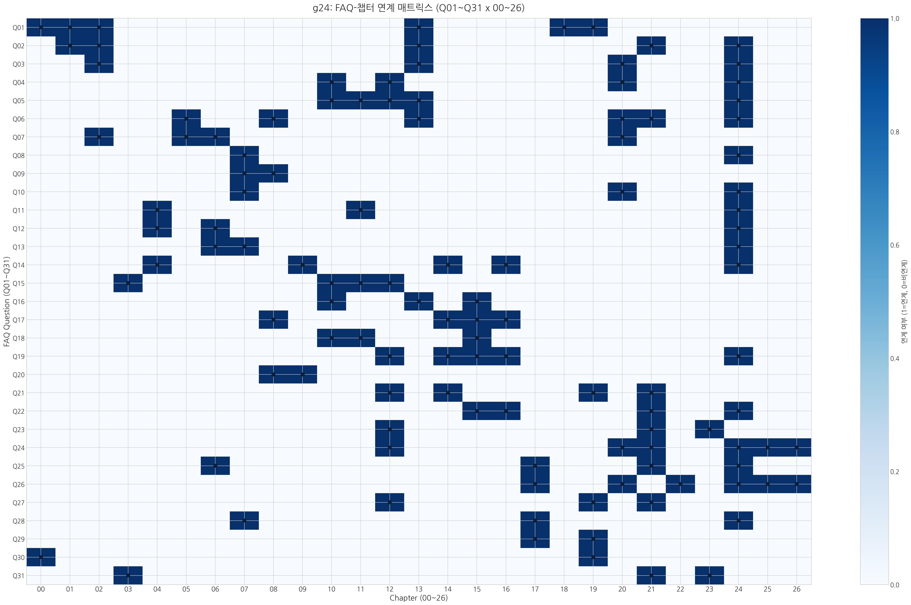

# 18. SALT에 대한 31가지 질문

## 먼저 읽기: 필독 10문

핵심: 매트릭스의 목적은 31개 질문이 어느 장(00~26)과 연결되는지 한눈에 보여, 역추적 독서와 보강 검토를 빠르게 만드는 것이다.

아래 10문은 본문 00~19의 핵심 논리를 빠르게 따라갈 때 우선 읽는 구간이다.
특히 17장의 예측과 기술 전망이 어디까지 검증 가능한지 질문 중심으로 재점검한다.

::: {.note-theory}
**1. 중력과 힘의 재정의**
:::

::: {.qa-set}
::: {.qa-q}
**● 질문자:** 가장 근본적인 질문부터 시작하죠. 뉴턴과 아인슈타인의 시대 이후로, 우리는 왜 여전히 중력의 정체를 두고 싸우고 있는 건가요?

**관련 장:** 00장 · 01장 · 02장 · 13장 · 18장 · 19장
:::

::: {.qa-a}
**○ SALT사이언티스트:** 익숙한 '힘' 개념이 중력의 기전을 충분히 설명하지 못하기 때문이다.
SALT는 힘을 독립된 실체가 아니라 공간 매질이 보여주는 **'고착된 상태(력, 상태)'**로 정의한다.
뉴턴은 이를 물체 사이의 '당기는 힘'으로 정의했고, 아인슈타인은 '공간의 곡률'로 교정했다.

하지만 여전히 해결되지 않은 숙제가 남았다.
**"그 곡률(휘어짐)은 물리적으로 무엇으로 이루어져 있는가?"**라는 질문이다.
SALT는 곡률을 단순한 기하 형상보다, **공간 매질의 자가 응축이 만든 동적 와류 흐름**으로 해석한다.
:::
:::

::: {.qa-set}
::: {.qa-q}
**● 질문자:** 뉴턴의 만유인력 법칙, 아인슈타인의 상대성이론은 SALT와 어떤 부분에서 '핵심적인 차이'가 생기는가?

**관련 장:** 01장 · 02장 · 13장 · 21장 · 24장
:::

::: {.qa-a}
**○ SALT사이언티스트:** 세 이론은 같은 우주를 설명하지만, 그 '기본 재료'를 바라보는 관점에서 핵심적인 차이가 있다.

**1. 뉴턴:** 사과가 떨어지는 현상을 **'당기는 힘'**으로 묘사했지만, '어떻게' 당기는지는 설명하지 못했다 (원격 작용). 
**2. 아인슈타인:** 힘은 없고 **'휘어진 입체 구조 (공간)'**만 있다고 교정했지만, 공간이 '무엇으로' 이루어졌는지는 설명하지 못해 양자역학(입자)과 불화했다. 
**3. SALT:** 휘어진 공간의 실체를 **'자가 응축하는 와류 매질'**로 해석한다. 공간이 단순한 좌표가 아니라 '물리적 실체'라는 관점에서, 중력(잔여 와류의 흐름)과 입자(와류의 핵)를 하나의 재료로 통합하려는 설명을 제시한다.
:::
:::

::: {.qa-set}
::: {.qa-q}
**● 질문자:** 만약 당기는 힘이 없다면, 나는 왜 지금 의자에 엉덩이를 붙이고 있는가? 지구가 나를 잡아당기지 않는데도 그러한가?

**관련 장:** 02장 · 13장 · 20장 · 24장
:::

::: {.qa-a}
**○ SALT사이언티스트:** 지구가 당긴다기보다, 당신이 **공간의 유효 경사도(\(-\nabla\mu\), 저차 \(-\nabla\rho\))를 따라 이동하려는 상태**에 있다.
 지구 질량이 주변 공간 밀도를 높이면 몸은 더 높은 밀도 쪽으로 이동하려 하고, 의자가 그 경로를 막는다. 즉 중력 가속도는 '당김'보다 유효 경사도에 따른 이동 결과로 읽는다.
:::
:::

::: {.qa-set}
::: {.qa-q}
**● 질문자:** 하지만 중력은 다른 힘 (전자기력 등)에 비해 매우 약하다. 개미 한 마리가 지구 전체의 중력을 이기고 땅에서 뛰어오를 정도이다. 이 '위계 문제'를 어떻게 설명하는가?

**관련 장:** 10장 · 12장 · 20장 · 24장
:::

::: {.qa-a}
**○ SALT사이언티스트:** 중력이 절대적으로 약하다기보다, 관측 위치가 고에너지 코어에서 멀기 때문이다.
중력, 강력, 그리고 핵력은 모두 같은 공간 매질의 자가 응축 뿌리에서 나온 세 가지 다른 발현이다.
**입체적 텐션의** 98%는 양성자 내부의 강력 코어(보셀 잠금 구간)에 응집되어 있고, 일상 중력은 그 장력이 보셀 격자 탄성 범위를 따라 외부로 약하게 전달된 배경 성분으로 본다.

 $10^{40}$배라는 격차는 바로 이 **'소성 잠금'**과 **'탄성 전파'**의 에너지 밀도 차이를 보여주는 결과다. 보셀 자가 응축 과정에서 발생하는 **'지수적 에너지 희석'**과 **'상관 길이의 억제'**가 복합적으로 작용하여, 거시적으로 관측되는 중력의 강도를 극도로 낮추게 된다. (상세 수식은 부록 24 참고)
:::
:::

::: {.qa-set}
::: {.qa-q}
**● 질문자:** 하지만 강력은 원자핵 내부에서만 작용하는 힘 아닌가? 어떻게 그 에너지가 핵 밖의 텅 빈 공간까지 영향을 미쳐 중력이 될 수 있는가?

**관련 장:** 10장 · 11장 · 12장 · 13장 · 24장
:::

::: {.qa-a}
**○ SALT사이언티스트:** 핵심은 **공간 매질의 연속성**이다.
보셀 격자는 서로 맞물린 연속 구조다.
핵 내부의 강력한 꼬임(매칭)은 인접한 '비어 있는' 보셀들에 **유효 경사도(\(-\nabla\mu\), 저차 \(-\nabla\rho\))를 형성하여 흐름을 유도하며**, 당겨진 보셀은 다시 그 옆 보셀을 당기는 **연쇄적인 장력 전달**을 일으킨다.

매듭(질량) 자체는 핵 안에 고착되어도, 그 매듭이 공간에 가한 응력은 매질 연속성을 따라 먼 거리까지 전달될 수 있다.
:::
:::

::: {.qa-set}
::: {.qa-q}
**● 질문자:** 이중 슬릿에서 빛은 측정 순간 '입자처럼' 등록된다. 그렇다면 중력도 같은 방식으로 보면 중력자와 중력파가 함께 있어야 하는 것 아닌가? SALT에서는 중력자가 없다고 했는데, 그럼 중력파만 존재하는가?

**관련 장:** 05장 · 08장 · 13장 · 20장 · 21장 · 24장
:::

::: {.qa-a}
**○ SALT사이언티스트:** SALT의 구분은 **"입자 유무"보다 "상태와 전파 모드"**에 있다.

빛(전자기)의 경우에는 보셀 전단 상태가 관측 순간 국소 등록되며 입자적 이벤트로 포착될 수 있다. 하지만 중력은 기본적으로 질량 주변의 **유효 경사도(\(-\nabla\mu\), 저차 \(-\nabla\rho\)) 기반 배경 상태(흐름)**로 정의된다.

따라서 SALT에서 중력은 두 얼굴을 가진다.

**1. 정적 중력(흐름)**: 평상시의 안정된 경사장. 
**2. 중력파(파동)**: 블랙홀 병합처럼 급격한 사건에서 그 경사장이 시간적으로 요동하며 퍼져나가는 동적 모드.

즉 "중력파만 있다"가 아니라, **기본 상태(중력) + 상태의 전파(중력파)**가 함께 존재한다. SALT는 이 틀에서 중력자를 필수 기초 가정으로 두지 않는다.
:::
:::

---

::: {.note-theory}
**2. 공간의 실체와 우주의 기원**
:::

::: {.qa-set}
::: {.qa-q}
**● 질문자:** SALT는 '공간 밀도'라는 개념을 제시하는데, 공간이 단순한 '빈 입체 구조적 틀'이 아니라 '물리적 실체'라는 뜻인가?

**관련 장:** 02장 · 05장 · 06장 · 20장
:::

::: {.qa-a}
**○ SALT사이언티스트:** SALT는 그렇게 해석한다. 공간은 빈 허공보다, **입체적 텐션을 가진 탄성 매질**에 가깝다고 본다. 2015년 LIGO의 중력파 관측은 공간의 밀도·탄성 해석을 검토할 근거를 제공한다.
:::
:::

::: {.qa-set}
::: {.qa-q}
**● 질문자:** 그렇다면 '시간'과 '공간'은 물리적으로 어떻게 다른가? 기존 이론에서는 시간을 제4의 차원으로 본다.

**관련 장:** 07장 · 24장
:::

::: {.qa-a}
**○ SALT사이언티스트:** 본질적으로 **공간은 보셀(매질)로 구성되며, 시간은 그 보셀의 상태에 부여되는 시간 인덱스**이다. 공간은 밀도 격자가 3차원적으로 '펼쳐진 상태'를 의미하고, 시간은 이 보셀에 한 시간의 흐름 단위씩 순차적으로 부여되는 **'보편 시간 인덱스'**이다.
:::
:::

::: {.qa-set}
::: {.qa-q}
**● 질문자:** 그럼 1초 전의 보셀과 지금 내 앞의 보셀은 물리적으로 '같은 존재'인가?

**관련 장:** 07장 · 08장
:::

::: {.qa-a}
**○ SALT사이언티스트:** 아니다. **매 순간 새로 확정되는 순간적 존재(찰나적 등록)**로 본다. 보셀은 지속 물질이라기보다 보편 시간 인덱스마다 전이되는 상태다.

 우리가 지속성을 느끼는 이유는 **찰나의 확정(순간적 등록)**이 고주파로 반복되며 정보 패턴(매듭)이 다음 시간 인덱스로 전이되기 때문이다.
 즉 존재는 매 찰나 **재확정(재등록)**되는 사건의 연속이다.
:::
:::

::: {.qa-set}
::: {.qa-q}
**● 질문자:** 시간이 독립적이고 절대적인 박동(박동)이라면, 강력한 중력 근처에서 시간이 느려진다는 상대성 이론의 사실과는 모순되는 것 아닌가?

**관련 장:** 07장 · 20장 · 24장
:::

::: {.qa-a}
**○ SALT사이언티스트:** 핵심은 '시간 자체 둔화'가 아니라 전달 경로 변화다.
 중력이 높은 곳은 공간 보셀들의 내부 위상 레이어가 겹겹이 포개진 **'위상적 적층'** 상태다.

빛이나 물질이 그 구간을 통과할 때, 겉보기엔 같은 거리처럼 보여도 **실제로 밟고 가야 할 보셀의 개수(유효 경로 길이)가 폭발적으로 늘어나 있는 상태**이다.
즉, 시간 인덱스의 전이 순서는 공통이지만, 공간 밀도가 조밀해진 구간에서는 빛이 빠져나오는 데 더 많은 시간의 흐름 단위를 소모하게 된다.
시간 자체 둔화라기보다, 공간 밀도 변화에 따른 전달 지연으로 읽는 것이 SALT의 해석이다.
:::
:::

---

## 확장 읽기: 나머지 21문

아래 문답은 필독 10문을 읽은 뒤 세부 쟁점(우주론, 물질, 기술, 철학)을 확장 확인하는 구간이다.

::: {.qa-set}
::: {.qa-q}
**● 질문자:** 보셀의 해상도가 고정되어 있다면 부피는 일정하다는 뜻인가? 그런데 부피가 일정한데 밀도가 더 높다는 게 잘 그려지지 않는다. 혹시 태풍과 태풍이 만나 하나로 합쳐지면 부피는 같지만 힘은 더 세지는 것과 같은 원리인가? 보셀도 태풍처럼 $1+1=1$이 될 수 있는가?

**관련 장:** 04장 · 11장 · 24장
:::

::: {.qa-a}
**○ SALT사이언티스트:** 맞다. **보셀의 3차원 부피는 고정**이고, 밀도 증가는 내부 적층으로 나타난다.

 같은 좌표 한 칸 안에 위상 레이어가 더 많이 겹치면 \(\rho\)로 요약되는 밀도값이 커진다. 따라서 바깥에서 보면 위치는 1칸이어도, 내부 계산량(상태 복잡도)은 증가할 수 있다.
:::
:::

::: {.qa-set}
::: {.qa-q}
**● 질문자:** 그럼 공간 한 칸(보셀)에 담을 수 있는 상태 복잡도(적층)는 무한한가? 만약 무한하다면 아무리 밀도가 높아져도 한계가 없다는 뜻인가?

**관련 장:** 04장 · 06장 · 24장
:::

::: {.qa-a}
**○ SALT사이언티스트:** 결론부터 말하면 **무한하지 않다. 임계점이 있다고 본다.**

 SALT는 이를 **위상적 포화**라고 부른다. 보셀 한 칸이 감당할 수 있는 위상 복잡도(적층 한계)는 유한하다.

 보셀이 더는 적층되지 않을 만큼 포화되면 해당 구역은 **기하학적 동결**에 들어가 시간 전이가 멈춘 것처럼 보인다.

 우주는 무질서한 무한 압축을 허용하지 않는다. 보셀의 고정된 해상도는 '공간의 최소 단위'일 뿐만 아니라, 그 안에 적층될 수 있는 에너지의 **'최대 용량'**까지도 규정하고 있다.
:::
:::

::: {.qa-set}
::: {.qa-q}
**● 질문자:** 시간이 단순히 밀도의 변화라면, 빅뱅 이전에는 무엇이 있었는가?

**관련 장:** 06장 · 07장 · 24장
:::

::: {.qa-a}
**○ SALT사이언티스트:** SALT에서 빅뱅은 우주 전체의 절대적 시작이라기보다, 이미 존재하던 **초고밀도 잠재 와류 상태**가 임계를 넘어 팽창한 **상태 변화**로 본다.

 즉 빅뱅 이전에도 공간의 바탕은 존재했으며, 우리가 인식하는 인덱스(시간)와 격자(공간) 형태로 정렬되기 전 상태였다고 본다.
 또한 '바깥 경계면'이라는 직관 자체가 평평한 상자형 공간에 익숙한 사고에서 온다. SALT에서는 절대적 벽보다 **유효 경사도(\(-\nabla\mu\), 저차 \(-\nabla\rho\))가 급격히 변하는 경험적 경계**가 핵심이며, 우리는 그 경사를 중력 또는 물질의 형체로 해석한다.
:::
:::

::: {.qa-set}
::: {.qa-q}
**● 질문자:** 물의 소용돌이부터 지판의 회전, 심지어 전자의 스핀까지 우리 우주는 왜 특정한 방향성을 갖는 것처럼 보이는가? 이 방향성조차 '태초'에 정해진 것인가?

**관련 장:** 04장 · 09장 · 14장 · 16장 · 24장
:::

::: {.qa-a}
**○ SALT사이언티스트:** '태초'라는 표현은 우리에게 익숙한 편의적 언어일 뿐, SALT가 말하는 본질은 **'근원적 비틀림의 비대칭성'**입니다.

 결론부터 말하면 그 방향이 입자의 정체성을 결정합니다. 시계 반대 방향의 위상 회전이 우리 우주의 일반적인 '물질'이라면, 정반대인 시계 방향 회전은 '반물질'입니다. 우리 우주가 물질로 가득 찬 이유는 우리가 인식하는 이 우주적 팽창 구역이 형성될 때, 공간 보셀 격자가 아주 미세한 한쪽 방향의 회전 편향으로 정렬되었기 때문이라는 가설입니다.

 또한 엔트로피 증가가 곧 '과거로 흐르는 대칭 우주'를 요구하지는 않는다. 에너지는 보존되지만, **시간 인덱스(UTI) 흐름 자체는 비가역적**이기 때문이다.

 따라서 이를 단 한 번뿐인 우주 전체 시작으로 볼 필요는 없다.
 SALT에서는 우리가 겪은 빅뱅을 **국소적 초고밀도 와류 분출** 가능성으로도 해석한다.
:::
:::

---

::: {.note-theory}
**3. 물질, 생명, 그리고 엔트로피**
:::

::: {.qa-set}
::: {.qa-q}
**● 질문자:** 물질(질량)은 어디에서 오는가? 힉스 입자가 질량을 부여하는 것 아닌가?

**관련 장:** 03장 · 10장 · 11장 · 12장
:::

::: {.qa-a}
**○ SALT사이언티스트:** 힉스 메커니즘은 질량의 한 측면(속도 저항)을 설명한다. SALT에서 더 근본 기원은 **공간의 응축**이다. 고밀도 공간 텐션이 국소 와류로 꼬여 풀리지 않는 상태가 입자이며, 질량은 부여된 성질이 아니라 그 응축이 만든 저항성이다.
:::
:::

::: {.qa-set}
::: {.qa-q}
**● 질문자:** 열역학 제2법칙 (엔트로피 증가)에 따르면 우주는 점점 무질서해져야 하는데, 왜 별과 은하 같은 복잡한 질서가 생겨나는가?

**관련 장:** 10장 · 13장 · 15장
:::

::: {.qa-a}
**○ SALT사이언티스트:** 물질을 **엔트로피에 저항하는 입체 구조 매듭**으로 보기 때문이다. SALT에서 **력**은 질서를 유지하는 고착 경향, **파**는 에너지가 매질을 따라 퍼지는 발산 경향으로 읽는다.
 우주 전체는 희석 방향으로 가더라도, 국소적으로는 매듭 구조가 형성되어 질서가 유지될 수 있다.
:::
:::

::: {.qa-set}
::: {.qa-q}
**● 질문자:** 빛 (광자), 전자, 쿼크 같은 입자들은 근본적으로 무엇이 다른가? 모두 공간의 매듭이라고 하는가?

**관련 장:** 08장 · 14장 · 15장 · 16장
:::

::: {.qa-a}
**○ SALT사이언티스트:**
 매듭의 **'위상적 구조'**가 다르다.

1.  **빛 (광자)**은 매듭이 지어지지 않고 보셀의 위상 회전만이 이웃 보셀로 끊임없이 전달되는 **'나선형 파동'**이다. 그래서 질량이 없고 멈출 수 없다.
2.  **전자 (렙톤)**는 스스로 꼬리를 물고 닫힌 **'독립된 매듭'**이다. 그래서 혼자서도 안정적으로 존재하며 질량을 가진다.
3.  **쿼크**는 꼬리가 닫히지 않은 **열린 매듭**이다. 단독으로는 불안정해 다른 쿼크와 결합해 양성자/중성자 같은 복합 매듭을 형성해야 한다.
:::
:::

::: {.qa-set}
::: {.qa-q}
**● 질문자:** 원자 내부가 99.9% 텅 비어 있다고 하는데, 어떻게 그렇게 단단하고 무거운 질량을 가질 수 있는가? 그냥 '텅 빈 공간' 아닌가?

**관련 장:** 10장 · 11장 · 15장
:::

::: {.qa-a}
**○ SALT사이언티스트:** 핵심은 "비어 보이는 공간"에도 장 에너지가 크다는 점이다.
 양성자 질량의 대부분은 쿼크 정지질량보다, 그 사이 글루온 장의 결속 에너지에서 온다. SALT는 이를 보셀 와류의 고밀도 응축으로 해석한다.
 따라서 원자 내부의 낮은 점유율과 물질의 단단함은 모순이 아니다. 질량과 저항성은 점유 부피보다 **에너지 결속 밀도**에 더 직접적으로 좌우된다.
:::
:::

::: {.qa-set}
::: {.qa-q}
**● 질문자:** 힘을 전달하는 광자, 글루온, 중간자 같은 입자들은 SALT에서 각각 어떻게 정의되는가?

**관련 장:** 12장 · 14장 · 15장 · 16장 · 24장
:::

::: {.qa-a}
**○ SALT사이언티스트:** 공간 매질(보셀)이 어떤 **'동작 모드'**로 작동하느냐에 따라 우주에는 총 **5가지 물리적 발현**이 존재한다.

1. **중력:** 보셀 격자의 완만한 **'탄성 변형'**이자 흐름이다.
2. **전자기력:** 보셀 격자의 **'나선형 위상 회전'** 파동이다.
3. **강력:** 보셀 격자가 탄성 한계를 넘어 서로 엉겨 붙은 **'소성 맞물림'** 그 자체이다.
4. **약력:** 너무 팽팽한 매듭이 스스로를 재배열하는 **'붕괴 및 전이'** 과정이다.
5. **핵력:** 강력 결속이 핵자 바깥에 남긴 **'잔류 유효 결속'**이며, 근접 구간의 압착 응력 완화가 그 메커니즘으로 작동한다.
   (즉 기본 4상호작용에 더해, 책의 분류상 핵력을 잔류 결속 발현으로 독립 항목화해 다룬다.)

 결론적으로 상호작용은 별개 실체의 전달보다, 공간 매질이 조건에 따라 보이는 **저항/등록 모드의 변주**로 해석한다.
:::
:::

::: {.qa-set}
::: {.qa-q}
**● 질문자:** 양자역학에서는 입자의 위치를 확률적으로만 알 수 있다고 하며, "신은 주사위 놀이를 한다"는 말까지 있다.

**관련 장:** 08장 · 09장
:::

::: {.qa-a}
**○ SALT사이언티스트:** 확률은 **우주 갱신 속도보다 빠른 미세 진동**을 우리가 직접 추적하지 못해 나타나는 효과로 본다. 아직 시스템에 확정되지 않은 상태가 확률적 중첩이다.
 관측은 그 상태를 시스템에 강제로 등록하는 절차로 해석한다.
:::
:::

---

::: {.note-theory}
**4. 힘의 대통합과 수학적 본질**
:::

::: {.qa-set}
::: {.qa-q}
**● 질문자:** 잠깐만요. 중력은 공간(매질) 그 자체의 현상이지만, 전자기력은 그 위에서 뛰어노는 '광자'라는 입자의 현상 아닌가? 어떻게 '무대'와 '배우'가 같을 수 있는가?

**관련 장:** 12장 · 14장 · 19장 · 21장
:::

::: {.qa-a}
**○ SALT사이언티스트:** 핵심은 그 이분법을 완화하는 데 있다.
**SALT에서 '입자'는 공간 매질의 국소 응축 상태**에 가깝다.
즉, 전자기력은 공간 매질의 **위상 회전 모드**로 해석할 수 있다.
:::
:::

::: {.qa-set}
::: {.qa-q}
**● 질문자:** 강력과 약력은 너무 추상적이다. '힘'의 입자가 아니라면 도대체 이것들은 무엇인가?

**관련 장:** 15장 · 16장 · 21장 · 24장
:::

::: {.qa-a}
**○ SALT사이언티스트:** 강력은 공간이 **기하학적으로 잠긴 상태**이고, 약력은 과긴장 매듭을 다시 짜는 **위상 재패턴화**다. 이때 W, Z 보손은 독립 실체라기보다 재패턴화 중 나타나는 일시적 고장력 모드로 읽을 수 있다.
:::
:::

::: {.qa-set}
::: {.qa-q}
**● 질문자:** 세상을 진동으로 설명한다면, 기존의 '끈 이론'과는 무엇이 다른가? SALT도 11차원 같은 다차원을 가정하는가?

**관련 장:** 12장 · 21장 · 23장
:::

::: {.qa-a}
**○ SALT사이언티스트:** 핵심 차이는 재료 가정이다. 끈 이론이 별도 끈을 가정한다면, SALT는 **공간 자체의 진동**을 기본으로 둔다. 11차원 가정보다, **3차원 공간을 고밀도 탄성체로 읽는 접근**으로 중력-양자 연결을 시도한다.
:::
:::

::: {.qa-set}
::: {.qa-q}
**● 질문자:** 매우 대담한 주장이다. 하지만 기존의 표준 모델이나 아인슈타인의 일반상대론과 정면으로 충돌하는 것 아닌가? 현대 물리학의 정수를 부정하는 것처럼 들린다.

**관련 장:** 12장 · 20장 · 21장 · 24장 · 25장 · 26장
:::

::: {.qa-a}
**○ SALT사이언티스트:** SALT는 기존 이론을 부정하기보다, 그 이론들이 '왜' 그런 수학적 구조를 갖게 되었는지 **물리적 기전**으로 해석하려는 상위 프레임워크다.
우리가 제안하는 유효장 이론(EFT) 그림에서는 낮은 에너지 영역에서 SALT의 효과가 감춰지며 일반상대론의 결과와 수렴하도록 구성된다.
즉, 아인슈타인의 수식은 SALT라는 더 큰 설계도를 가정했을 때 '현상학적'으로 나타난 결과물로 읽을 수 있다.
상세한 수학적 방어는 부록의 기술 백서에 수록된 'ADM 감사' 결과를 참고하기 바란다.
:::
:::

::: {.qa-set}
::: {.qa-q}
**● 질문자:** 그렇다면 보이지 않는 '암흑 물질'이나 '암흑 에너지'는 무엇인가?

**관련 장:** 06장 · 17장 · 21장 · 24장
:::

::: {.qa-a}
**○ SALT사이언티스트:** SALT 해석에서는, 은하의 빠른 회전은 보이지 않는 WIMP 입자보다 중심 질량이 주변 공간을 **점성적으로 두껍게 만드는 효과**로 설명한다. 우주 팽창(암흑 에너지)도 별도 물질이라기보다, 와류 밀도 차이를 평활화하려는 공간 매질의 **안정화 과정**으로 본다.
:::
:::

::: {.qa-set}
::: {.qa-q}
**● 질문자:** 이론적으로는 그럴듯하지만, 결국 실험적 증거가 있어야 과학 아닌가? 검증할 수 없는 상상에 불과하다는 비판에는 어떻게 답하는가?

**관련 장:** 17장 · 20장 · 22장 · 24장 · 25장 · 26장
:::

::: {.qa-a}
**○ SALT사이언티스트:** 과학의 생명은 '반증 가능성'에 있고, SALT도 그 기준을 피할 수 없다.
검증 판정은 17장의 핵심 5 예측과 24장 13.2~13.4 검증 절차(지연·렌즈·스펙트럼/편광 채널)로 교차하는 것이 기본 원칙이다.
우주에서 오는 고에너지 감마선 관측 결과(LHAASO 등)는 몇몇 구간에서 참고할 만한 단서를 제공한다.
특정 에너지 이상의 광자들이 우주 배경 복사에 의해 소멸되지 않고 살아남는 현상이나, 먼 거리에서 오는 빛의 미세한 타이밍 차이는 SALT가 예측하는 '공간 밀도에 따른 입체 구조적 지연'과 비교 가능한 채널이다.
우리는 이를 기반으로 우주 해상도(보셀 대역)의 하한선을 제안해 볼 수 있으며, 향후 더 정밀한 관측을 통해 SALT가 실제로 얼마나 맞고 틀리는지 가려내야 한다.
:::
:::

::: {.qa-set}
::: {.qa-q}
**● 질문자:** SALT를 듣다 보니 이것은 물리학이라기보다는 일종의 입체 구조에 가까울 정도로 아름답게 느껴진다.

**관련 장:** 12장 · 19장 · 21장
:::

::: {.qa-a}
**○ SALT사이언티스트:** SALT는 물리학을 실험값 정리에서 한 단계 더 나아가, 입체 구조 기전으로 해석하려 한다.

**1. 위상입체 구조:** 입자들은 **'매듭의 종류'**로 재정의된다.
**2. 텐서 미적분:** 아인슈타인의 중력 텐서를 확장하여, 전자기력(비틀림)과 강력(응축)까지 하나의 수식으로 기술하는 **'와류 동역학 텐서'**가 탄생할 것이다.

결국 물리학은 **움직이는 입체 구조 해석**으로 더 정밀한 모델을 만들 수 있다.
:::
:::

---

::: {.note-theory}
**5. 인류의 미래와 시간 여행**
:::

::: {.qa-set}
::: {.qa-q}
**● 질문자:** 공간 밀도를 인위적으로 제어할 수 있다면, 시간 여행도 가능한가?

**관련 장:** 07장 · 17장 · 24장
:::

::: {.qa-a}
**○ SALT사이언티스트:** 과거로의 시간 여행은 불가능하다고 본다. 공간 매질 진화가 일방향이기 때문이다. 고밀도 공간에서 신호가 늦게 도착하는 것을 '시간 지연'이라 부를 수 있지만, SALT에서는 이것을 시간 흐름 자체가 느려진 것이 아닌 전달 경로가 더 많은 플랑크 시간의 흐름 단위를 소모한 결과로 해석한다. 따라서 국소 공간 밀도 제어로 시간 인덱스 변화 속도를 늦추려는 접근 역시 **불가능**하다고 본다.
:::
:::

::: {.qa-set}
::: {.qa-q}
**● 질문자:** 마지막으로, 이 모든 이론이 사실이라면 인류는 무엇을 얻을 수 있는가?

**관련 장:** 17장 · 19장
:::

::: {.qa-a}
**○ SALT사이언티스트:** SALT가 지향하는 방향은 **수동 관찰에서 능동 설계**로의 전환이다. 핵심은 에너지·중력·물질 조작을 포함한 **공간 공학** 가능성을 검증 가능한 기술 과제로 바꾸는 것이다.
:::
:::

---

::: {.note-theory}
**6. 마음과 우주의 만남**
:::

::: {.qa-set}
::: {.qa-q}
**● 질문자:** 마지막으로 저자는 과거 "반야심경 해설서"도 직접 출간했는데 이것이 도대체 SALT와 어떤 관련성을 맺고 있는가?

**관련 장:** 00장 · 19장
:::

::: {.qa-a}
**○ SALT사이언티스트:** 겉보기엔 다른 길처럼 보이지만, 두 탐구는 '실체를 어떻게 볼 것인가'라는 점에서 맞닿아 있다. 반야심경의 **색즉시공(色卽是空)**과 SALT의 **동적 공간 와류 해석** 사이에 개념적 접점이 있다고 본다.

 다만 마음 공부는 자신의 마음을 있는 그대로 살피는 데 시작과 끝이 있는 공부이지만, 자연의 현상은 눈앞에 보이는 나 자신의 마음이 아니기에 객관적으로 검증하고 타당성을 확인할 도구들이 필요하다.
 즉 마음 공부의 핵심 도구가 자신의 내면을 있는 그대로 관조하는 양심에 있다면, 자연을 객관적으로 탐구하기 위한 핵심 도구는 바로 수학과 물리학이다.
 한편 마음 공부가 자신의 견해와 관념을 뛰어넘어야 한다면 과학은 기존의 패러다임을 뛰어넘어야 한다.
 마음 공부가 자신을 속이지 않는 양심을 필요로 한다면 자연 과학은 패러다임이나 사회 트렌드에 경도되지 않고 있는 그대로의 현상을 받아들이는 객관적 양심이 필요하다.

 『반야심경 해설서』가 내면 인식의 정합성을 다뤘다면, 『SALT』는 물질 변화의 기전을 객관 검증으로 점검하려는 시도라고 볼 수 있다.
:::
:::

::: {.qa-set}
::: {.qa-q}
**● 질문자:** 질문을 마치기 전에 하나만 더 물어보겠습니다. 혹시 주류 물리학계에서도 SALT와 유사하게 '공간이 매질'이라거나 '중력이 공간이 만드는 기울기 힘'이라고 보는 학자들이 있습니까?

**관련 장:** 03장 · 21장 · 23장
:::

::: {.qa-a}
**○ SALT사이언티스트:** 그렇습니다.
통일장 이론을 향한 현대 물리학의 여러 연구 흐름에서도 SALT와 유사한 패러다임 전환이 시도되고 있습니다.
에릭 페를린데(Erik Verlinde)의 '창발적 중력(Emergent Gravity)', 카를로 로벨리(Carlo Rovelli)의 '루프 양자 중력(Loop Quantum Gravity)', 그리고리 볼로비크(Grigory Volovik)의 '초유동체 진공(Superfluid Vacuum)' 이론 등이 대표적입니다.
이 연구들 역시 "중력은 가상 입자 교환을 거치지 않아도 공간 구조에서 기인하는 기하학적 힘으로 해석될 수 있으며, 공간은 입체적 구조를 지닌 실체적 매질일 수 있다"는 방향과 접점을 보입니다.
더 자세한 국내외 연구자 목록과 동향은 권말 부록(23장)을 참고하시기 바랍니다.
:::
:::

### 핵심 예측 요약표 (검증/반증)
다음 장, **19. 중력을 새롭게 바라보니 통일장이론의 길이 보였다**
