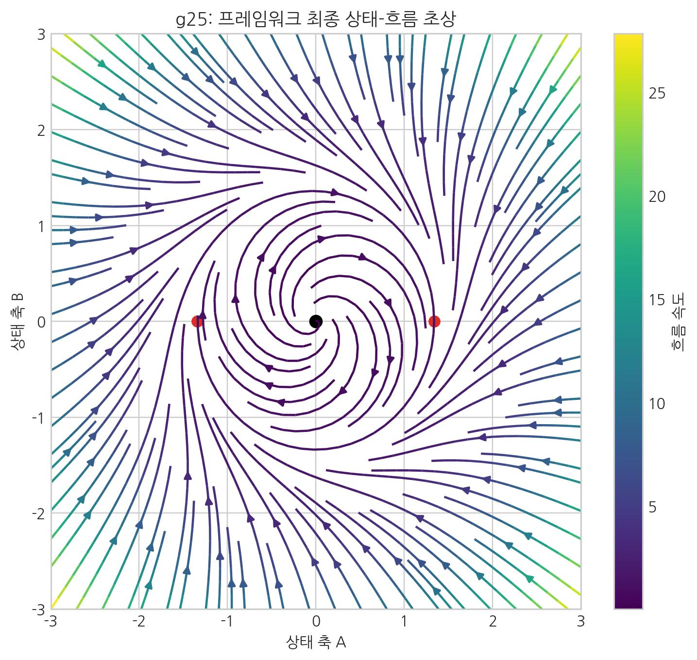

# 19. 중력을 새롭게 바라보니 통일장이론의 길이 보였다

이 책이 과학적으로 얼마나 실증될 수 있을지는 앞으로의 과제다. 그럼에도 통일장이론을 고민하는 독자에게 새로운 관점과 질문을 남기고자 한다. 이 원고는 오래 품어 온 물질에 대한 호기심을 AI를 보조 도구로 정리한 기록이다. 핵심은 기술 자체가 아니라, **중력을 입체 구조적 매질의 흐름으로 다시 읽어보려는 시도**에 있다.

마지막으로 이 책에서 다룬 우주의 5가지 물리적 발현(기본 4상호작용 + 핵력의 잔류 결속)을 다시 정리해 보자.

| 상호작용 | 기계적 기전 | 핵심 개념 및 SALT 정의 | 관련 장 |
|:---:|:---:|:---|:---:|
| **중력** | **기하학적 흐름** | 유효 경사도(\(-\nabla\mu\))가 만든 '탄성 변형장'의 **흐름 유도** | 01, 02, 09, 11, 13, 20 |
| **전자기력** | **탄성 전단** | 위상 기울기 전파/재배열로 나타나는 '탄성 전단 및 위상 회전' | 11, 14, 15, 20 |
| **강력** | **소성 맞물림** | 공간 매듭이 영구적으로 엉겨 붙은 '소성 맞물림' | 11, 15, 20 |
| **약력** | **소성 이완** | 불안정한 매듭이 더 안정한 상태로 재결속되는 '위상학적 재패턴화' 및 이완 과정 | 11, 16, 20 |
| **핵력** | **잔류 결속** | 강력 결속이 핵자 바깥에 남긴 잔류 유효 결속 | 12, 15, 20 |

### SALT가 제안하는 우주 그림: 국소 사이클 가설

이 장을 마치기 전에 더 큰 가설 하나를 제안한다.

우리가 '빅뱅'이라 부르는 사건은 더 큰 우주 관점에서 **하나의 국소적 사건**일 수 있다.

전체 우주의 에너지가 보존된다고 보면, 한 지점의 압축(블랙홀)과 다른 지점의 희석/팽창은 함께 나타날 수 있다. 블랙홀 압축이 임계를 넘는 사건은 국소 급팽창으로 이어질 수 있고, **그 내부 관측자에게는 이것이 '빅뱅'처럼 보일 수 있다.**

우리가 관측하는 '팽창 우주'는 보셀 격자 전체에서 일어나는 블랙홀-팽창 사이클 중 하나의 내부일 수 있다. 이 경우 전체 우주에서는 국소 팽창과 수축이 공존하는 **동적 평형 상태**를 가정할 수 있다.

이 관점이 맞다면 우주에는 단일한 '처음'과 '끝'이 없을 수 있다. 우리가 경험하는 빅뱅은 **보셀 격자에서 반복되는 국소 사이클 중 하나**일 수 있다.

이는 아직 검증되지 않은 가설이다. 다만 SALT의 입체 구조적 프레임워크는 이 거대한 물음을 사고할 하나의 언어를 제공한다.

### 주류 물리학과의 결정적 분기점

이 책 전반에 걸쳐 설명했듯, SALT가 주류 물리학(특히 코펜하겐 해석)과 궤를 달리하는 가장 결정적인 지점은 바로 **'실험 결과'와 '철학적 해석'의 분리**에 있다.

- **주류 물리학의 결론:** 벨의 부등식 위배(알랭 아스페의 실험 등)를 근거로, **국소성 + 실재성 + 측정독립성**을 동시에 유지하기 어렵다고 본다. 해석에 따라 비국소 상관 또는 관측 전 상태 기술의 제한을 받아들이되, **초광속 정보전송은 허용하지 않는다(무신호성 유지).**
- **SALT의 반격:** 실험 결과는 전적으로 수용하되 기전을 다르게 읽는다. SALT는 **'결정론적 기계적 실재론'**을 취하며, 얽힘 현상을 빛보다 빠른 사후 통신이 아닌 **'초기 쌍 상태의 구조적 보존'**으로 해석한다. 즉 벨의 전제 가운데 **측정독립성(자유의지 가정)**을 내려놓는 초결정론 경로를 택하며, 질량과 공간의 상호작용 역시 보셀(Voxel)이라는 최소 구조 단위의 **초고속 상태 갱신(세포 자동자)** 결과로 읽는다.

즉, SALT는 우주를 확률과 입자의 요동이 지배하는 모호한 무대로만 보지 않고, **빈틈없이 맞물려 스스로를 갱신하는 결정론적 보셀 네트워크**로 읽는 해석을 제안한다.

### 맺으며: 통합 해석의 의미

분리된 힘 관점을 완화하면, 우주는 공간 매질의 **장력** 재배열 과정으로 읽을 수 있다. 중력은 **유효 경사도(\(-\nabla\mu\)) 기반 흐름**, 질량은 와류가 매질을 통과할 때 나타나는 **입체적 저항(관성)**으로 해석된다.

우주의 상호작용은 공간과 보편적 시간 위에서 전개되는 와류·응축 모드로 읽을 수 있다. 전자기력은 위상 회전, 강력은 잠금, 약력은 재패턴화다. 즉 분리된 힘처럼 보인 현상은 단일 매질의 다른 동작 모드로 해석된다.

우리는 우주와 분리된 관찰자가 아니라, 그 안에서 상태 변화를 측정하고 기술하는 존재다. SALT 언어로 보면 존재는 지속 고정물보다, 매 순간 등록·갱신되는 과정에 가깝다.

우리는 앞으로 공간 상태를 직접 다루는 공학 단계로 갈 수 있는지 검토하게 된다. SALT는 그 가능성을 탐색하기 위한 해석 프레임을 제시한다.

---

이 책의 결론은 다음 한 문장으로 요약된다. **분리된 힘처럼 보이는 현상들은 보셀 매질의 상태 변화라는 공통 문법으로 통합 해석될 수 있다.** 다만 이 명제의 성패는 해석의 매력에 있지 않고, 관측 채널에서의 재현성과 반증 가능성에 달려 있다.

독자의 세계관을 흔드는 통찰은 출발점일 뿐이며, 최종 가치는 관측 결과 앞에서 얼마나 정확히 맞고 또 틀릴 수 있는지를 분명히 밝히는 데서 결정된다. 판정의 실무 기준은 부록 24장의 13.2~13.4 검증 절차(지연·렌즈·편광/전파 채널)을 따른다.

SALT의 통찰이 유효하더라도, 과학 지식의 사회적 영향에 대한 경계는 필요하다. 강력한 이론은 응용의 방향에 따라 인류에게 이익이 될 수도, 위험이 될 수도 있다. 따라서 과학적 진보는 기술적 성취뿐 아니라 윤리적 성찰과 함께 가야 한다.

**끝.**

---
다음 장, **20. 부록: 주요 용어 및 참고 자료**
