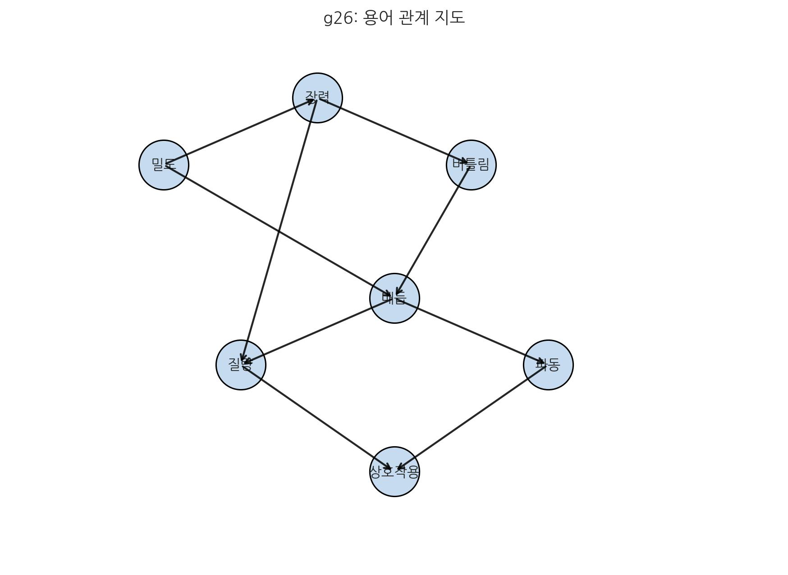

# 20. 부록: 주요 용어 및 참고 자료

19장에서 결론의 방향을 제시했다면, 이 장은 그 결론을 실제 검증 언어로 옮기는 기준표다. 아래 요약은 "무엇이 이미 검증되었고, 무엇이 SALT의 해석 범위인지"를 빠르게 구분하기 위한 최소 기준이다.

## 검증 기준 요약
- **[검증됨] 기준 수치**: $G=6.674\times10^{-11}\,\mathrm{m^3\,kg^{-1}\,s^{-2}}$, $c^4/G \approx 1.21\times10^{44}\,\mathrm{N}$
- **[검증됨] 관측 정합**: 샤피로 지연·중력 적색편이·PPN($\gamma,\beta$)는 GR 예측과 고정밀 정합
- **[해석/예측] SALT 해석 틀**: 위 정합값을 보셀 경로 밀도/유효 강성으로 해석하고, 고에너지 채널의 LIV 잔차·경로 밀도 편차로 시험

상세 판정 기준과 식 전개는 **24장 1.1 검증 기준과 해석 범위**를 단일 기준으로 따른다.

::: {.note-theory}
**요약 박스: 벨의 부등식 위배와 SALT 해석**

- **실험 결과 합의**: 1982년 Aspect 실험, 2015년 전후 loophole-free Bell test, 2022년 노벨상 흐름은 벨 부등식 위배를 강하게 지지한다.
- **주류 결론**: `국소성 + 실재성 + 측정독립성`의 동시 유지는 어렵다. 다만 **무신호성**은 유지되어 초광속 정보전송은 허용되지 않는다.
- **SALT 해석**: 벨 위배를 인정하되 비국소 사후통신 대신 **측정독립성 포기(초결정론)**와 **초기 쌍 상태 보존**으로 읽는다.
- **핵심 차이**: 실험 사실을 부정하는 것이 아니라, 같은 관측 결과를 해석하는 전제 선택을 바꾼다.
:::

## SALT 핵심 개념 체계: 관측 4차원과 내부 위상

앞장의 결론을 실제 검증과 토론으로 이어가기 위해, 여기서는 본문 전체에서 사용한 핵심 용어와 실험 근거를 표준 형태로 정리한다.

SALT는 복잡한 수식 이전에, 우주를 구성하는 공간 입체 구조에 대한 직관적 이해를 바탕으로 한다. 이 이론의 핵심 개념을 **공간 보셀(Voxel)** 중심으로 정리한다.

### 표준 표기 (24장 수식 체계와 공통)
- **보셀(Voxel)**: 공간의 이산 물리 단위
- **복소 보셀장 ($\Psi$)**: 보셀 상태를 통합한 장
- **밀도 진폭 ($\rho = |\Psi|$)**: 적층의 유효 강도
- **밀도형 상태량 ($n=\rho^2=|\Psi|^2$)**: 관측량과 직접 연결되는 상태량
- **위상 ($\theta = \arg\Psi$)**: 국소 위상 회전 상태(게이지 정보)
- **회전**: 국소 구간(한 지점)의 각속도/위상 변화율
- **비틀림**: 여러 위치에 걸친 위상 차이의 분포(공간적 누적 구조)
- **위상 잠금 ($W$)**: 매듭의 위상학적 고정도
- **유효 구동 기울기 ($-\nabla\mu$)**: 흐름의 1차 구동력 (\(-\nabla\rho\)는 저차 근사)
- **관측 좌표**: $(x,y,z,t)$
- **시간 전이 인덱스 ($T$)**: 시스템 전이 순서를 표현하는 보조 인덱스

### Standard 용어 구분 (SM vs ΛCDM)
- **Standard Model (SM)**: 입자물리 표준모형. 미시 채널(뮤온 g-2, 중성미자, 충돌기 등)의 기준 이론을 뜻한다.
- **Standard cosmology (ΛCDM)**: 우주론 표준모형. 거시 채널(지연·적색편이·렌즈·GW-EM 등)의 기준 이론을 뜻한다.
- **본 저작의 표기 규칙**: `Standard` 단독 표기는 **거시 비교 문맥에서만** **ΛCDM**을 의미한다. 미시 문맥에서는 `SM`을 명시 표기한다.
- **비교 열 규칙**: 미시 비교 열은 `SM`, 거시 비교 열은 `ΛCDM`으로 고정한다.
- **공통 필드 규칙**: `measured_value`, `sm_pred`, `salt_pred`, `uncertainty`, `winner`
- **보른 정합 해석 규칙**: 미시에서 보른 규칙 정합은 확률 구름 존재론 채택이 아니라, 관측 해상도 한계(관측 대상/도구의 동시 매질 영향) 하에서 재현해야 할 통계 기준으로 둔다.

### 운영잠금 및 버전 추적 규칙 (검증콘솔 공통)
- **운영잠금(operational lock)**: 관측량/비교식 형태/파라미터 범위/판정 규칙을 고정해 재현성을 관리한다.
- **완전잠금 지양**: 관측도구가 같은 매질 한계를 공유하므로 예측식의 완전잠금은 요구하지 않는다.
- **버전 필드 고정**: `formula_version`, `dataset_version`, `decision_rule_version`을 결과와 함께 항상 기록한다.
- **재현 커맨드 고정**: 동일 입력에서 동일 결과를 확인할 수 있도록 실행 명령을 감사 페이지에 함께 남긴다.

### 핵심 표준
- 상태량은 `\(\rho\)`(진폭)와 `\(n=\rho^2\)`(밀도형 상태량)를 구분해 사용한다.
- 유효 구동식은 `\(-\nabla\mu\)`를 상위식으로 사용하고, `\(-\nabla\rho\)`는 저차 근사로만 사용한다.
- 5분류는 `강력(위상 잠금) / 약력(잠금 해제) / 전자기(위상 기울기 전파) / 중력(-\nabla\mu 흐름) / 핵력(잔류 유효 결속)`으로 고정한다.

### 수식 한눈에 보기
\[
n\equiv \rho^2,\quad E=\int \varepsilon(n,\theta)\,d^3x,\quad
\mu=\frac{\delta E}{\delta n}
\]
\[
\mathbf{J}_n=-Mn\nabla\mu,\quad
\partial_t n+\nabla\cdot\mathbf{J}_n=0
\]
- **1단계(상태량)**: \(n\)은 공간의 에너지 상태 분포를 나타낸다.
- **2단계(구동량)**: \(\mu\)는 실제 흐름을 만드는 유효 경사도다.
- **3단계(유량)**: \(\mathbf{J}_n\)은 경사 완화 방향의 유량이다.
- **4단계(보존)**: 한쪽 감소량은 다른 쪽 이동량과 보존 관계를 이룬다.

### 1-1. 기본 단위: 공간 보셀
SALT에서 말하는 '최소 단위'는 단순한 고정 크기보다, **더 이상 쪼갤 수 없는 위상학적 개체**를 뜻한다.

- **구조 정의**: 보셀은 더 이상 분해/변형할 수 없는 **고정 해상도** 연산 단위이며, 내부의 **위상 회전·공간 누적 비틀림(전단)·진동 에너지**는 가변적이다.
- **진공**: 보셀들이 이완된 기본 위상을 유지하는 상태.
- **질량/위상 에너지**: 격자 자체는 유지되지만, 특정 구역 보셀의 위상 장력이 커진 고에너지 상태.
- **해상도 한계(플랑크 규모)**: 보셀 크기는 플랑크 규모로 고정되어 있으며, 양자화는 이 해상도 한계에서 나오는 구조적 결과다.

#### 보셀 상태 분류표

| 현상 | 보셀 상태 | 핵심 차이 |
|------|----------|----------|
| **진공** | 이완된 보셀 | 변형 없음 |
| **상호작용 (상호작용)** | 내부 잠금/외부 전파/잔류 결속 | 강력·약력·전자기·중력·핵력의 작동 층위 |
| **파** | 탄성 전달 | 복원력에 의한 파동 전달 (약력/붕괴, 전자기파) |
| **입자** | 소성 결함 | 격자가 뒤틀린 상태 |

::: {.note-theory}
### [상위 개념 마스터 정리] Voxel (보셀) 개요
(※ 본 항목은 SALT 이론의 공간 기본 단위인 보셀 메커니즘을 총괄 요약한 문서이다.)

#### 1. 정체성
- SALT에서 `Voxel`은 공간을 이끄는 **플랑크 스케일 고정 부피 셀**이다. 단순 측정치가 아니라, 위상/밀도/장력 정보를 갱신하는 **동적 연산 유닛**으로, 더 이상 쪼갤 수 없는 위상학적 개체다.
- 보셀 하나의 크기는 플랑크 해상도(`ℓ_P^3`)이며, 이를 넘은 이하의 구간은 정보 용량(VIC)이나 에너지 제한 때문에 존재하지 않거나 측정할 수 없다.

#### 2. 위상·텐션 메커니즘
- 보셀 상태는 복소 상태장으로 기술하며, 진폭 $\rho$는 밀도(적층), 위상 $\theta$는 회전 정보를 담는다. 이때 $n \equiv \rho^2$의 관계로 밀도 $n$을 정의할 수 있다.
  $$ \Psi = \rho e^{i\theta} $$
- 장력/텐션은 위상 기울기($\nabla\theta$) 및 진폭 변화($\nabla\rho$)에서 생기는 에너지 밀도로, 에너지 밀도 $\varepsilon$는 아래와 같이 $\rho$ 기준으로 정리할 수도 있다.
  $$ \varepsilon = V(\rho) + \frac{K_\rho}{2}|\nabla\rho|^2 + \frac{K_\theta}{2} \rho |\nabla\theta|^2 $$
- 위상 변화가 빠르거나 위상이 정렬되면 텐션이 누적되어 **질량 매듭**이 되고, 느슨하면 텐션 전달 결과로 **파동/빛**이 된다.

#### 3. 입자 ↔ 공간 관계
- 보셀은 공간 자체를 구성하면서 상태 변화의 패턴으로 입자를 만든다. 입자는 보셀들이 응력 $\sigma > \sigma_c$, 매듭지수 $W \neq 0$, 이완 시간 $\tau_{\mathrm{relax}} \gg T_{\mathrm{obs}}$ 조건을 만족해 위상 매듭으로 고착될 때 나타난다.
- 반대로 위상이 가벼운 상태를 유지하면 보셀들은 위상 텐션을 옆 보셀로 전이하면서 빛/파동을 구축한다. 즉, 공간과 입자는 분리된 실체가 아니라 **보셀 상태의 두 가지 모드**이다.

#### 4. 진공과 고밀도의 차이
- 비어 있는 공간도 여전히 보셀로 가득 차 있다. 진공은 위상/밀도/텐션이 최소로 이완된 상태일 뿐, 위상 텐션이 완전히 0이 아니며 ($\nabla\theta \approx 0$, $\nabla\rho \approx 0$) 플랑크 해상도로 동작한다.
- 밀도가 높다고 해서 무조건 질량이 되는 건 아니다. 고착 조건이 모두 충족돼야 질량 매듭으로 굳어지며, 그렇지 않으면 위상 텐션이 전달되며 중력 렌즈처럼 공간을 휘게 한다. (즉, 동일 밀도라도 위상 고착 여부에 따라 물질/공간 왜곡으로 구분됨)

#### 5. 궁극적 물리적 한계
- **VIC (Voxel Information Capacity)**: 홀로그래피 원리와 베켄슈타인 한계에서 유도된 산술적 최대 위상 복잡도(≈1.5비트)이며, 포화될수록 상태 갱신이 멈추고 블랙홀(위상적 동결)로 전환된다.
- **전이 동기화와 광속**: 정보 전달 속도를 **1 플랑크 시간의 흐름 단위**당 1 보셀(Voxel)로 제한하는 동기화 격자다 (1 플랑크 시간의 흐름 단위 = 우주 보셀 격자의 상태 전이 최소 시간). 이 한계가 광속($c$) 상한과 지역성을 실현한다.
- **경로 밀도와 시간 지연**: 고밀도 공간에서는 위상 경로 굴곡(경로 밀도)이 높아져 빛이 통과할 실질적 거리가 늘어난다. 상대성 이론의 중력 시간 지연은 절대 시간이 변하는 것이 아닌, 물속을 지날 때처럼 매질 텐션 증가에 따른 빛의 지연 현상으로 기계론적으로 해석된다.
- **인프라-인덱스 해상도의 한계**: 1 플랑크 시간 내부의 요동은 측정불가하며, 이것이 위치-운동량의 하이젠베르크 불확정성 원리와 등가다 (양자역학 역시 구조적 해상도 한계의 결과).
- **무한 격자와 보존 정합**: SALT는 기본 보셀 수가 매 플랑크 시간마다 새로 생성된다고 가정하지 않는다. 격자는 무한/무경계 배치로 둘 수 있으며, 동역학은 "생성"이 아니라 **상태 갱신과 전이**로 기술한다. 따라서 보존 법칙은 전 우주 총합보다 국소 보존(\(\partial_t n+\nabla\cdot\mathbf{J}_n=0\))을 1차 기준으로 둔다.
:::

> **[심화] 전자기력(힘)과 전자기파(빛)의 핵심 차이**
> *   **전자기력 (구속 장)**: 매듭(전하)에 **고정된** 보셀의 위상 회전 응력이다. 매듭이 움직이면 회전 응력도 함께 이동하며 주변 매듭에 작용한다.
> *   **전자기파 (자유 파동)**: 매듭에서 **떨어져 나온** 보셀의 위상 회전 전달이다. 발생한 파동은 매듭의 추가 이동과 무관하게 전파된다.

### 1-2. 입자의 정체
입자란 별개의 알갱이가 아니라, **공간 보셀**들이 뭉친 형태에 따른 분류다.
- **빛(광자)**: 보셀들이 뭉치지 않고 진동 **장력**만을 인접한 보셀로 전달하는 **파동** 상태.
- **전자**: 보셀들이 약한 위상 회전 상태로 작게 뭉친 가벼운 매듭.
- **쿼크**: 보셀들이 강하게 얽히고설켜 절대 풀리지 않는 단단하고 복잡한 매듭. 질량의 대부분을 차지한다.

### 1-3. 5대 물리적 발현의 재정의
SALT에서 '힘'이란 매듭지어진 보셀 구조(물질)가 주변 **공간 매질**에 만들어내는 지속적인 **상호작용 과정**이다.

- **강력 [내부]**: 층간 위상 잠금(위상 맞물림)에 의한 영구 결속.
- **약력 [내부]**: 잠금 해제/재배열 전이(소성 풀림) 과정.
- **중력 [외부]**: \(-\nabla\mu\)의 거시 투영으로 나타나는 흐름.
- **전자기 [외부]**: 위상 기울기 전파/재배열.
- **핵력 [복합체]**: 강력 결속이 핵자 바깥에 남긴 잔류 유효 결속.

> **[참고] 글루온의 위치**
> 글루온은 별개의 힘이라기보다 **쿼크들을 연결하는 '소성 맞물림 사슬' 위를 오가는 장력 유지 파동**을 의미한다. 즉, 강력이라는 현상을 일으키는 '결속의 매개 진동'이다.

### 1-4. 물리적 한계
SALT에서 핵심 한계는 우주의 전체 크기보다, 보셀이라는 물리적 격자 구조의 국소 제약에 있다. 즉 관측 가능한 영역이 유한하더라도, 이론 모델은 무한/무경계 격자와 정합적으로 쓸 수 있다.
- **에너지 한계 (플랑크 에너지)**: 보셀 하나가 버틸 수 있는 회전 **장력**의 최대치. 이를 초과하면 보셀 상태가 임계 전이 구간에 들어서며 **블랙홀** 조건과 연결될 수 있다.
- **압축 한계 (플랑크 길이)**: 우주의 정보 처리 최소 단위인 보셀의 크기. 에너지가 집중되어 위상 장력이 극대화되어도 보셀은 이 해상도 한계 이하로 분해될 수 없으며, 이 저항값이 곧 **중력 상수(G)**의 기원이 된다.
- **보존 법칙의 기준**: 본 절의 보존 해석은 위 `궁극적 물리적 한계`의 **무한 격자와 보존 정합** 항목을 단일 기준으로 따른다.

### 1-5. 단일 메커니즘의 이중 효과
SALT의 가장 강력한 통찰은 '중력'과 '빛의 속도 저하(시간 지연)'가 서로 다른 현상이 아니라, **공간 밀도라는 하나의 원인에서 파생된 두 가지 결과**라는 점이다.

1. **원인**: 보셀 위상 에너지의 응축과 꼬임.
2. **결과 A (중력)**: 질량 주변에서 장력 완화 흐름이 형성된다.
3. **결과 B (지연/굴절)**: 고밀도 구역 통과 시 신호 처리 부하가 늘어 전파가 느려진다.
4. **임계점**: 한계를 넘으면 사건의 지평선(블랙홀) 조건으로 전이한다.
5. **진공 해석**: 진공도 맞물린 스핀 네트워크이므로, 외부 압력 없이도 내부 연결만으로 장력 전달이 가능하다.

### 1-6. 관측 가능한 3축
본편과 부록의 실험 논의를 일관되게 묶기 위해 SALT는 다음 3축을 기본 관측 기준 틀로 사용한다.
- **밀도 진폭 ($\rho$)**: 보셀 적층의 유효 강도. 중력 흐름과 시간 지연의 1차 지표.
- **위상 ($\theta$)**: 보셀 위상 회전의 국소 상태. 전자기 반응과 게이지 동역학의 지표.
- **위상 잠금 ($W$)**: 레이어 결합의 위상학적 고정도. 질량 매듭/강력 결속의 지표.
이 세 축을 동시에 추적하면, "하나의 공간 매질이 서로 다른 모드로 발현된다"는 SALT의 핵심 명제를 실험적으로 같은 좌표계에서 비교할 수 있다.

---

### 입자 크기 한계
1. **최소**: 입자가 되기 위해서는 매듭을 지을 수 있는 최소한의 보셀 수(3개 이상 등)가 필요하다.
2. **최대**: 너무 많은 보셀이 뭉치면 매듭이 불안정해져 붕괴 경향(방사성 붕괴)을 보인다.

---

## 주요 용어 해설 (용어집)

> 핵심: 용어는 목록보다 관계망으로 볼 때 의미가 살아난다. 개념 간 연결을 먼저 잡고 세부로 들어가자.

### 1) 기본 프레임과 좌표
- **밀도-상호작용 통합이론 (SALT)**
    본 저작에서 제안하는 새로운 통일장 이론. 중력을 **유효 경사도(\(-\nabla\mu\)) 기반 흐름**으로 읽는 해석을 전자기력, 강력, 약력으로 확장하여, 우주의 모든 현상을 **'공간 매질의 밀도 변화와 그 장력을 해소하려는 상호작용'**이라는 단일 원리로 통합한 이론적 틀이다. 이는 우주를 거대한 물리적 재료로 해석하는 **공간 매질 공학**의 시각이다.
- **관측 4차원과 내부 상태 공간 (4차원 + 내부 섬유)**
    SALT의 관측 좌표계는 **$(x,y,z,t)$**이며, 진폭과 위상 회전은 추가 좌표가 아니라 내부 상태 공간(섬유) 위의 변수 $\rho,\theta$로 기술한다.
- **시간 좌표 ($t$)와 시간 전이 인덱스 ($T$)**
    관측·측정 식에서는 시간을 좌표 **$t$**로 쓰고, 모형화에서 전이 순서를 나타낼 때는 보조 표기 **$T$**를 쓴다.
- **시간의 흐름 단위**
    우주 보셀 격자가 상태를 1회 전이하는 데 걸리는 **최소 시간 단위**이다. 보셀 격자는 이 시간의 흐름 단위에 맞춰 인접 노드로 정보를 전이하거나 자신의 상태를 바꾼다. SALT의 모형 해석에서는 한 흐름 단위당 1보셀 정보 전이를 광속(c) 상한의 근사 모델로 사용한다.

### 2) 상태 전이와 물질화
- **공간 밀도 (진공 굴절률)**
    단위 부피당 **공간 보셀 격자의 위상 에너지(위상 장력)** 강도를 의미한다. 질량이 큰 물체 주변은 와류 구조가 강하게 형성되어 보셀들의 위상 장력을 극대화하므로 밀도가 높으며, 이는 거시적으로 **'유효 경사도(\(-\nabla\mu\), 저차 \(-\nabla\rho\))'**이자 빛의 전달 속도를 늦추는 **'진공의 굴절률'**로 작용한다.
- **주의:** 일반적인 물리학의 밀도와는 인과관계가 반대다. SALT에서는 질량이 공간을 끌어당겨 밀도를 높이는 것이 아니라, **위상 밀도가 높은 곳에서 질량(관성)이라는 성질이 발현되는 것**이다.
- **상호작용**
    서로 다른 **공간 와류**들이 공명하여 장력을 공유하고, 더 안정적이고 거대한 시스템으로 결합하려는 **'자가 응축'** 과정이다.
- **력(응축)**
    보셀의 변형 상태가 특정 지점에 **고착**되어 유지되고 있는 상태다. 질량이란 공간 보셀 격자가 **'탄성 한계'**를 초과하여 스스로 풀리지 않는 **'소성 고착'** 상태를 의미한다. 이 임계점(소성 고착)이 물질과 공간을 가르는 경계가 된다.
- **파(발산)**
    보셀의 변형 상태가 제자리에 머물지 않고 옆 보셀로 **전달**되거나, **응축되어 있던 장력 텐션**이 해방되는 과정이다. **'엔트로피로의 과정'**을 의미하며, 불안정한 매듭이 해체되는 **약력(붕괴)**도 이 범주에 속한다.

### 3) 재료 거동: 소성·탄성
- **소성 (Plasticity)**
    힘을 제거해도 원래 상태로 돌아가지 않는 영구 변형의 성질이다.
#### 소성의 유형 (요약)
- **연성 소성 (Ductile Plasticity)**: 크게 늘어나거나 변형된 뒤에도 바로 깨지지 않는 영구 변형이다.
- **취성 파괴형 소성 (Brittle-dominant Failure)**: 소성 변형 구간이 매우 짧고, 임계점을 넘으면 급격한 균열·파손으로 이어지는 거동이다.
- **크리프 (Creep)**: 높은 온도나 장시간 하중에서 시간이 지날수록 누적되는 소성 변형이다.
- **점소성 (Viscoplasticity)**: 변형률이 하중 크기뿐 아니라 하중이 가해지는 시간·속도에도 의존하는 소성 거동이다.
- **소성 유동 (Plastic Flow)**: 항복 이후 재료 내부가 재배열되며 계속 변형이 진행되는 소성 상태다.
- **탄성 (Elasticity)**
    힘을 제거하면 원래 상태로 돌아가는 복원 가능 변형의 성질이다.
#### 탄성의 유형 (요약)
- **인장(장력)**: 물체를 잡아당길 때 생기는 복원 힘.
- **압축**: 물체를 누를 때 원래 길이/부피로 돌아가려는 복원 힘.
- **전단**: 층을 옆으로 미끄러뜨릴 때 이에 저항하는 복원 힘.
- **굽힘(휨)**: 물체가 휘어질 때 안쪽 압축·바깥쪽 인장으로 나타나는 복원 거동.
- **비틀림(토션, 재료역학)**: 물체를 비틀 때 원래 각도로 돌아가려는 복원 토크.

### 4) 상호작용과 장
#### 5대 상호작용의 구분 기준
SALT는 탄성 한계와 작용 위상에 따라 힘을 아래처럼 분류한다.

| 구분 | 층위 | 작동 핵심 | 물리적 발현 |
| :--- | :--- | :--- | :--- |
| **강력** | **내부(층간)** | 위상 잠금(소성 맞물림) | 쿼크 결속, 매듭 고착 |
| **약력** | **내부(레이어 간)** | 잠금 해제/재배열 전이 | 붕괴 및 구조 전환 |
| **중력** | **외부(보셀 간)** | \(-\nabla\mu\) 구동 흐름 | 거시 결속, 인장 흐름 |
| **전자기력** | **외부(보셀 간)** | 위상 기울기 전파/재배열 | 전자기 반응, 복사 전달 |
| **핵력** | **복합체(핵자 간)** | 강력의 잔류 유효 결속 | 양성자-중성자 결속 |

- **중력파 (중력파 / 밀도 파동)**
    **공간 밀도**의 급격한 변화 (충돌, 붕괴 등)가 파동의 형태로 빛의 속도로 전파되는 현상이다. SALT는 이를 **공간**이 텅 빈 배경이 아니라 **장력을 가진** 물리적 **장**으로 읽을 수 있는 강한 단서로 해석한다.
- **원시 중력파**
    우주 초기의 급팽창 (인플레이션) 시기에 **공간** 자체가 겪은 격렬한 양자 요동이 만들어낸 태초의 중력파이다. 우주 탄생의 순간을 기록한 **공간**의 메아리다.
- **탄성 에너지**
    변형된 **공간 매질**이 이완 상태로 복원되려는 성질에 의해 발현되는 **장력**이다. 중력장은 단순한 기하학적 표기가 아니라, 이 장력을 가진 물리적 실체다.
- **질량 결손**
    응축되어 **'질량 (매듭)'**의 형태를 띠던 **공간 장력**이 해체되거나 결합하면서, 그 차액만큼의 **장력**이 파동 (열, 빛, 중력파)으로 해방되는 현상이다. $E = m c^2$ 공식의 물리적 구현이다.
- **비선형성**
    **공간 매질의 변형**(중력) 자체가 **장력**을 가지고 있어, 그 **장력**이 다시 주변 변형을 키우는 성질이다. "중력이 중력을 낳는" 복잡한 연쇄 작용을 의미한다.
- **힉스 장**
    우주 전체를 구성하는 공간 보셀 격자 자체가 가진 **탄성 저항**이다. 기존 물리학에서는 입자가 힉스장과 상호작용하여 질량을 얻는다고 설명하지만, SALT에서는 이를 공간 매질의 **'탄성 한계 시험'**으로 해석한다. **질량**은 이 저항을 넘어 보셀 매질이 소성 고착 상태로 전이될 때 획득되는 **구조적 장력**의 총합이다.
- **만유인력 (만유인력 법칙)**
    뉴턴이 정립한 고전 물리학의 법칙으로, 질량을 가진 모든 물체는 서로를 끌어당긴다는 원리다. SALT는 이 현상을 부정하지 않으나, 그 원인을 별개의 힘이 아니라 '**공간** 밀도 차이에 의해 형성된 **유효 경사도(\(-\nabla\mu\), 저차 \(-\nabla\rho\))**를 따라 물체가 자연스럽게 미끄러져 내려가는 과정'으로 재해석한다.
- **일반상대성이론**
    1915년 아인슈타인이 발표한 중력 이론이다. 중력을 **기하학적 기술**로 설명하며 SALT의 이론적 토대가 되었다. SALT는 이를 확장해, 중력뿐 아니라 전자기력·핵력까지도 **공간의 위상 변형(회전, 잠금)**으로 통합 해석하려 한다.
- **브레인 우주론**
    우리 우주가 고차원 공간 (벌크) 속에 떠 있는 3차원 막 (브레인)이라는 가설이다. 중력만이 차원을 넘어 전파될 수 있다는 설명으로 중력이 다른 힘에 비해 매우 약한 '위계 문제'를 설명하는 이론적 도구 중 하나다.

### 5) 양자·회전·보존
- **양자화**
    연속적인 물리량을 불연속적인 최소 단위(양자)로 나누는 과정이다. SALT는 **공간** 자체를 양자화된 **'보셀'**로 다루며, 이를 통해 일반상대성 이론과 양자역학의 통합을 시도한다.
- **플랑크 상수 ($h$)**
    양자역학의 기본 상수로, 에너지의 불연속적인 최소 단위를 의미한다. SALT는 이를 **'하나의 시간 인덱스 내에서 플랑크 크기로 압축된 보셀이 겪는 최소한의 상태 변화량(작용)'**으로 해석한다. 이는 격자 동역학의 최소 해상도인 셈이다. (표준 기호: $h$)
- **불확정성 원리 ($\Delta x \cdot \Delta p \ge h / 4\pi$)**
    SALT에서는 **'공간 보셀의 해상도 한계'**로 해석한다. 우주가 무한히 쪼개질 수 있는 아날로그가 아니라, 보셀 ($h$)이라는 디지털 최소 단위를 가지고 있기 때문에 발생하는 근본적인 '흐릿함'이다. 보셀보다 작은 위치는 물리적으로 정의될 수 없다.
- **자전 스핀 / 공전**
    자전 스핀은 입자(매듭) 자체가 제자리에서 회전하는 고유한 각운동량이며, SALT에서는 공간 매듭 내부의 위상 회전 상태를 뜻한다. 공전은 입자가 다른 입자의 중력장이나 전자기장 안에서 궤도를 도는 운동으로, SALT에서는 공간의 거시적 소용돌이 흐름을 타는 동적 안정 상태로 해석한다.
- **각운동량 보존 법칙**
    회전하는 시스템의 총 각운동량은 외부 토크(회전력)가 없는 한 일정하게 유지된다는 법칙이다. SALT에서는 **보셀의 위상 회전량/전단 응력 보존**으로 설명된다.

### 6) 상수와 핵심 식
- **만유인력 상수 (G, 중력 상수)**
    중력의 세기를 결정하는 비례 상수다. SALT는 이를 힘의 크기가 아니라 **'공간 매질의 강성 혹은 탄성 계수'**로 해석한다. G값이 매우 작다는 것은, 우리 우주의 공간이 상상을 초월할 정도로 단단하고 팽팽하여 웬만한 질량으로는 거의 휘어지지 않음을 의미한다.
- **빛의 속도 절대성**
    빛의 속도 \(c\)가 관찰자의 운동 상태와 무관하게 일정하게 측정된다는 원리다. SALT는 이를 **측정 도구의 동조(공동 팽창 동조)**로 설명한다. 빛의 속도가 변하는 공간에서는 관측자와 시계도 같은 비율로 변형되므로, 로컬 관측자는 여전히 \(c\)를 측정한다.
- **질량-에너지 등가 원리 ($E = m c^2$)**
- **의미:** 질량과 에너지는 형태만 다를 뿐 본질적으로 같다.
- **SALT 해석:** **'보셀 격자의 탄성 변형과 소성 고착의 전환'**이다. 질량(\(m\))이라는 **'소성 고착'** 상태가 풀려 탄성 범위 내의 **'동적 위상'**으로 돌아가면 (\(c^2\)), 그 안에 응축되어 있던 거대한 장력이 파동으로 해방된다 (\(E\)). 에너지란 보셀이 정지 상태를 벗어나 회전하거나 전단된 **'동적 위상'** 그 자체다.
- **슈바르츠실트 반지름 ($R_s = 2 G M / c^2$)**
- **의미:** 빛조차 탈출할 수 없는 블랙홀의 경계 반지름이다.
- **SALT 해석:** **'공간 보셀의 임계 전이 한계점'**이다. 질량(\(M\))에 의한 압력이 너무 커서, 공간 보셀들이 더 이상 그 힘을 버티기 어려운 전이 구간(\(c^2\) 스케일 한계)으로 들어서는 임계 지점이다.

---

## 관련 참고 자료 (References)

### 1. 근간이 된 역사적 대표 논문 (논쟁의 역사)

1.  **EPR 역설 논문 (1935)**: *Can Quantum-Mechanical Description of Physical Reality Be Considered Complete?* (A. Einstein, B. Podolsky, N. Rosen). 양자역학의 완전성에 의문을 제기하며 숨은변수 논쟁의 출발점을 만든 역사적 논문이다.
    https://journals.aps.org/pr/abstract/10.1103/PhysRev.47.777

2.  **존 벨의 원논문 (1964)**: *On the Einstein Podolsky Rosen Paradox* (John S. Bell). 철학 논쟁을 실험 가능한 부등식 형태로 바꿔, 검증 가능 프레임을 만든 결정적 논문이다.
    https://cds.cern.ch/record/111654/files/vol1p195-200_001.pdf

3.  **알랭 아스페 실험 논문 (1982)**: *Experimental Realization of Einstein-Podolsky-Rosen-Bohm Gedankenexperiment: A New Violation of Bell's Inequalities*. 벨 부등식 위배를 고정밀 실험으로 제시해 이후 노벨상 계열 검증의 핵심 근거가 된 논문이다.
    https://journals.aps.org/prl/abstract/10.1103/PhysRevLett.49.1804

### 2. 벨/얽힘 검증 확장 레퍼런스

1.  **CHSH 부등식 정식화 (1969)**: *Proposed Experiment to Test Local Hidden-Variable Theories*. 벨 테스트를 실험 절차로 확장한 대표 정식화다.
    https://journals.aps.org/prl/abstract/10.1103/PhysRevLett.23.880

2.  **Loophole-free Bell test (2015)**: *Loophole-free Bell inequality violation using electron spins separated by 1.3 kilometres* (Hensen et al., Nature). 검출/국소성 루프홀을 동시에 줄여 현대 벨 검증의 기준점으로 자리 잡았다.
    https://www.nature.com/articles/nature15759

3.  **노벨 물리학상 (2022)**: Alain Aspect, John F. Clauser, Anton Zeilinger 수상 발표. 얽힘/벨 부등식 검증의 역사적 의미를 공식적으로 정리한 자료다.
    https://www.nobelprize.org/prizes/physics/2022/press-release/

### 3. 일반 독자를 위한 대표 과학 도서

1.  **안톤 차일링거, 《안톤 차일링거의 양자물리》** (원제: *Dance of the Photons*): 얽힘, 벨 부등식, 실험 검증 흐름을 대중 언어로 설명한 저자 직강형 입문서.
2.  **브라이언 그린, 《우주의 구조》** (원제: *The Fabric of the Cosmos*): EPR 역설부터 벨 부등식, 아스페 실험까지 맥락을 서사적으로 풀어낸 고전 교양서.
3.  **카를로 로벨리, 《헬골란트》** (원제: *Helgoland*): 관측·실재·관계론적 양자해석을 철학적으로 해설한 현대 양자 해석서.
4.  **브루스 로젠블룸·프레드 쿠트너, 《양자 수수께끼》** (원제: *Quantum Enigma*): 관측 문제와 실재성 논쟁을 일반 독자 관점에서 정리한 대표 대중서.

### 4. 중력/시공간 검증 및 확장 참고

1.  **LIGO 중력파 최초 검측 (2015)**: "Observation of Gravitational Waves from a Binary Black Hole Merger" (Abbott et al.). 공간이 동역학적 자유도를 가진다는 표준 해석을 제공하며, SALT의 매질 해석과 **정량 비교 가능한 기준 관측치**를 준다.
    https://arxiv.org/abs/1602.03837

2.  **그래비티 프로브 B (Gravity Probe B, 2011)**: 지구가 회전하며 주변 **공간**을 끌고 가는 **'프레임 드래깅'** 현상을 확인했다. 이는 질량-공간 결합 효과를 보여주는 관측으로, SALT 해석과의 **정합성 점검 채널**로 사용할 수 있다.
    https://arxiv.org/abs/physics/0406121

3.  **파운드-렙카 실험 (Pound-Rebka, 1959)**: 중력에 따른 빛의 적색편이와 시간 지연을 정밀 측정했다. SALT 관점에서는 **'공간 밀도 상승 구간의 유효 경로 증가'** 가설과 대조 가능한 기준 관측치다.
    https://journals.aps.org/prl/abstract/10.1103/PhysRevLett.3.439

4.  **카시니 미션 (Cassini-Huygens) 샤피로 지연 측정**: 태양 근처를 지나는 신호가 평소보다 늦게 도착하는 **'샤피로 지연'**을 정밀 측정했다. 이는 SALT의 경로 밀도 해석과 **정량 대조 가능한 대표 관측치**다.
    https://arxiv.org/abs/gr-qc/0604060

---

다음 장, **21. 주요 과학이론과 SALT**
