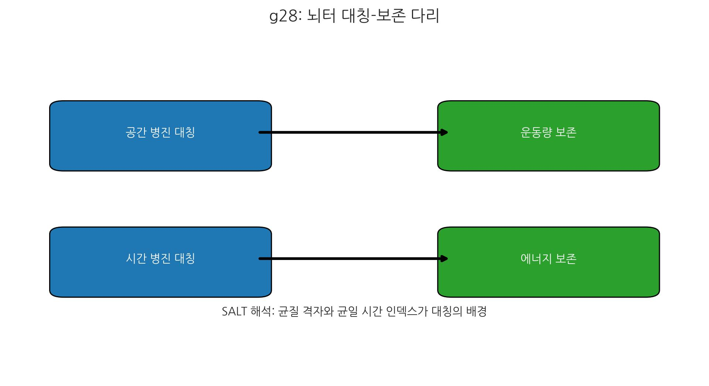
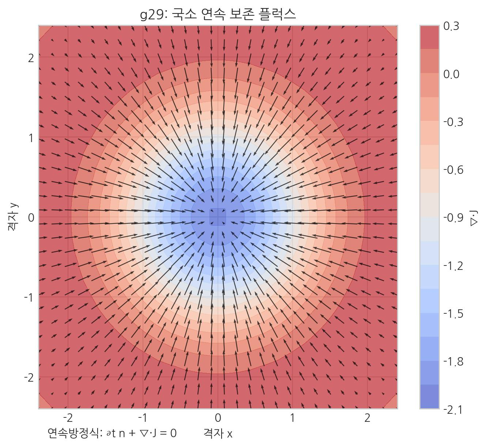
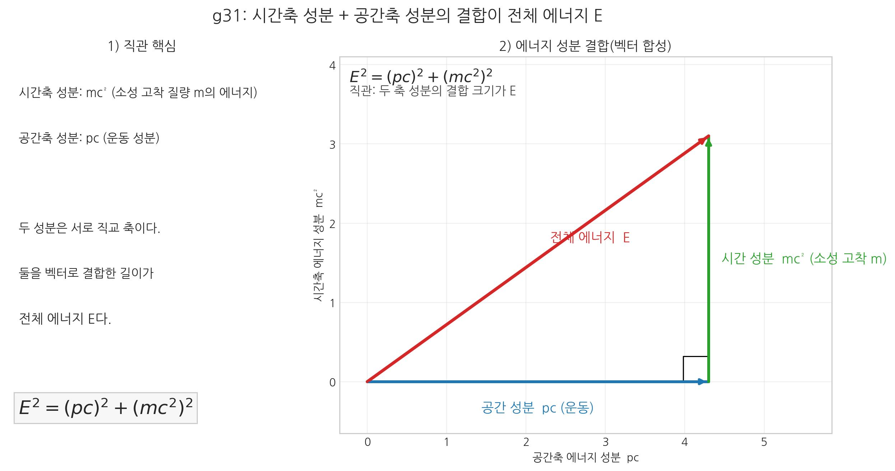
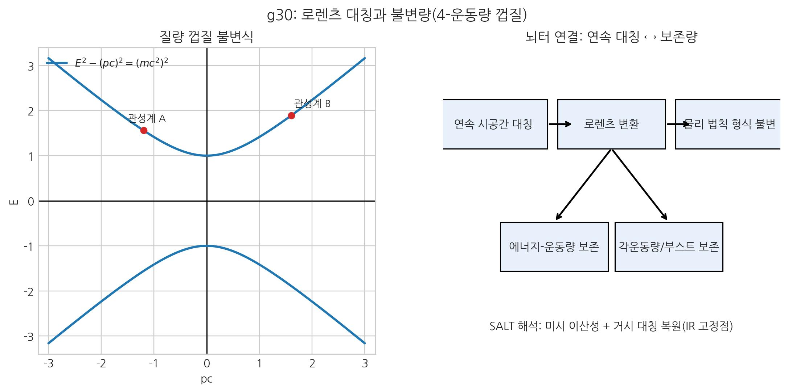
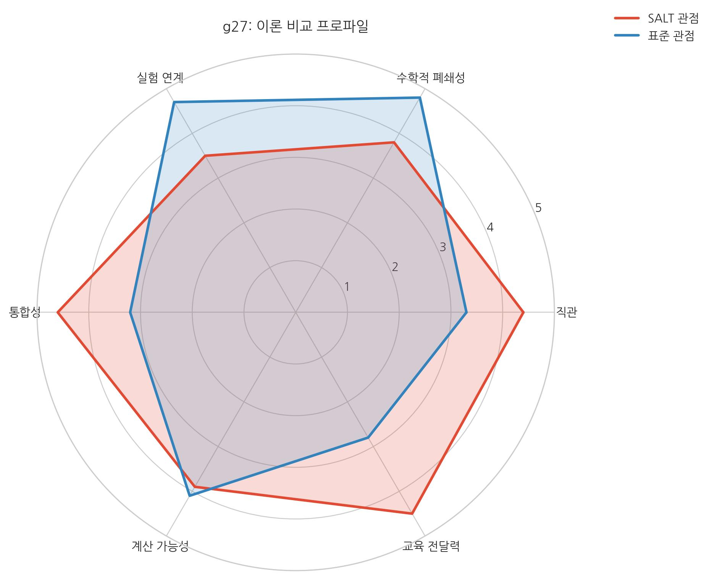

# 21. 부록: 주요 과학이론과 SALT

::: {.note-theory}
**정합 전제: 보셀·보존 해석 기준**

- 보셀은 "순증 생성"보다 상태 갱신/전이로 기술하며, 무한/무경계 격자 모델과 정합적으로 해석한다.

- 보존 판정은 전역 무한합이 아니라 국소 보존(\(\partial_t n+\nabla\cdot\mathbf{J}_n=0\)) 성립 여부를 1차 기준으로 둔다.

- 상세 정의와 용어 표준은 **20장(주요 용어 및 참고 자료)**의 보셀 마스터 정리를 따른다.
:::

## 0. 읽기 지도 (구조 요약)
이 장은 "기초 법칙 정렬 → 화학 법칙 연결 → 현대 난제 대응 → 최종 통합 감사" 순서로 읽으면 핵심 논지가 빠르게 연결된다.

| 파트 | 질문 | 핵심 내용 | 위치 |
| :--- | :--- | :--- | :--- |
| I | 표준 법칙을 SALT로 어떻게 번역하는가? | 물리학 핵심 법칙의 기계론적 해석 | I |
| II | 화학 법칙은 어떻게 이어지는가? | 결합·보존·상태 전이의 연속성 | II |
| III | 현대 난제를 어디까지 설명하는가? | 수학/이론물리 난제의 해석 경로 | III |
| IV | 최종적으로 무엇을 검증하는가? | GR 정합·반증 가능성·감사 체계 | IV |

## I. 물리학 주요 법칙

### I-요약: 검토 프레임
I부는 각 법칙마다 동일한 틀(표준 진술 → SALT 메커니즘 → 보존/관측 정합)로 기술한다.

### 1. 뉴턴의 운동 법칙

#### 제1법칙 (관성의 법칙)
> "외부의 힘이 작용하지 않으면, 정지한 물체는 계속 정지하고, 운동하는 물체는 등속 직선 운동을 한다."

**SALT 메커니즘: 순간적 상태 재확정의 관성**
질량(매듭)은 고정 실체라기보다, 매 순간(보편 시간 인덱스) 전이되는 **순간적 상태 확정(찰나적 등록)**의 연속이다. 관성은 외부 밀도 간섭이 없을 때 매듭 패턴이 **다음 시간의 흐름 단위에서도 동일 위상 상태로 재확정**되려는 성질이다.

- **정지**: 다음 시간의 흐름 단위에서도 동일한 보셀 좌표에 매듭의 상태가 유지되는 상태.

- **등속 운동**: 보셀 격자의 흐름에 따라, 매 시간의 흐름 단위마다 일정한 칸수만큼 좌표를 옮겨가며 매듭 상태가 성공적으로 재확정되는 상태.
이 상태 재확정 과정은 보셀 격자의 기본 전이 규칙이므로, 유효 경사도(\(-\nabla\mu\), 저차 \(-\nabla\rho\))라는 외부 교란이 발생하기 전까지는 이 규칙이 반복된다. 관성은 '존재하려는 습성'이 아니라 '상태 전이가 반복되는 성질'이다.

#### 제2법칙 (가속도의 법칙, F=ma)
> "가속도는 작용하는 힘에 비례하고, 질량에 반비례한다."

**SALT 메커니즘: 상태 좌표 표류 저항**

- **F (구동 경사)**: 주변 보셀들의 유효 경사도(\(-\nabla\mu\), 저차 \(-\nabla\rho\))가 발생하면, 매듭은 다음 시간의 흐름 단위에서 더 낮은 밀도(또는 장력이 낮은) 쪽으로 더 많이 이동해 상태가 확정되려는 압력을 받는다.

- **m (매듭 복잡도)**: 매듭이 복잡할수록(질량이 클수록), 한 시간의 흐름 단위에서 다음 흐름 단위로 넘어갈 때 '전체 패턴'을 새로운 좌표로 옮겨 상태 재확정하는 데 더 큰 공간적 구조 저항(강성)이 발생한다.
즉, $a$는 **'시간의 흐름 단위당 상태 좌표의 변화량'**이며, 이는 가해진 구조적 기울기($F$)를 매듭의 구조적 완성도($m$)로 나눈 값으로 결정된다.

#### 제3법칙 (작용·반작용의 법칙)
> "모든 작용에는 크기가 같고 방향이 반대인 반작용이 있다."

**SALT 메커니즘: 공간 장력망의 상호 연결성**
두 매듭 A와 B가 공간 매질 위에 존재할 때, A가 만든 기울기 변화는 매질을 통해 B에도 전달된다. 유한한 광속에 의한 시차(Lag)에 대해 SALT는 관찰 주체와 대상의 **공간 밀도**를 본다. 두 대상이 점유한 공간 밀도가 같다면 신호 전달 속도는 동기화된다.

SALT 관점에서는 작용-반작용의 대칭성을 공간이라는 단일 매질의 장력 균형으로 해석한다. 시차는 밀도가 다른 두 공간 사이에서 신호를 주고받을 때 나타나는 전달 효율 문제로 읽는다.

---

### 2. 뉴턴의 만유인력 법칙
> "두 물체 사이의 중력은 질량의 곱에 비례하고, 거리의 제곱에 반비례한다."

**SALT 메커니즘: 3차원 격자의 구조적 희석**
질량(매듭)은 존재 자체만으로 주변 보셀들을 중심으로 끌어당겨 '압축'시킨다.

- **질량 비례**: 매듭이 복잡할수록 주위 보셀 격자에 가하는 **위상 장력**이 기하급수적으로 증가한다.

- **역제곱 법칙**: 하나의 매듭에서 시작된 '위상 장력의 전파'는 3차원 공간으로 퍼져 나가면서, 구의 표면적($4\pi r^2$)을 따라 분산된다. 특정 지점(r)에서의 장력 기울기는 중심에서 멀어질수록 구의 표면적에 반비례하여 옅어질 수밖에 없다.
이것은 추상적인 원거리 작용이 아니라, **'동일한 위상 에너지'가 더 넓은 격자망으로 퍼지며 발생하는 구조적 희석 현상**이다.

---

### 3. 열역학 법칙

#### 제0법칙 (동기화)
온도란 보셀들의 미시적 진동 에너지의 평균값이다. 두 물체가 접촉하여 동적 안정 상태에 이른다는 것은, 두 물체 사이의 보셀 격자가 서로의 진동 파동을 공유하며 **평균 진동수와 위상이 일치**되는 상태가 됨을 의미한다. A=C, B=C라면 A의 진동 패턴과 B의 진동 패턴은 C라는 매질을 통해 이미 동일한 공명 주파수를 공유하게 되므로, 시스템 전체의 입체적 긴장이 해소된 상태(안정)를 유지한다.

#### 제1법칙 (에너지 보존)
> "에너지는 생성되거나 소멸되지 않으며, 형태만 바뀐다."

**SALT 메커니즘: 보셀 상태 전이의 총량 불변**
보셀은 에너지를 담는 그릇이 아니라, 스스로가 위상 회전, 진동, 공간 누적 전단 중 하나의 '상대적 상태'를 점유하는 물리 단위다. 보셀 격자 내부의 총 상태 변화 여지(또는 위상 변화의 가능성)는 보편적 시간 안에서 일정하게 유지된다. 매듭(질량)이 풀리면서 꼬임 에너지가 사라지면, 해당 보셀의 상태 변화 여지는 즉시 주변 보셀의 진동(복사) 상태로 전이된다. **'형태가 변한다'는 것은 단지 보셀 격자 위에서 '잠금/회전' 상태가 '진동' 상태로 바뀌는 것**일 뿐, 격자 전체의 구동 에너지는 소멸하지 않는다.

#### 제2법칙 (엔트로피 증가)
> "고립계의 엔트로피는 항상 증가한다."

**SALT 메커니즘: 구조적 결맞음의 소실**
보셀 격자 위에서 에너지가 특정 지점에 고도로 정렬된 상태(매듭 등)는 확률적으로 드물며, 외부 간섭이 없다면 보셀 간의 무작위적인 진동 전달에 의해 이 정렬 상태는 점차 흩어지게 된다. 이것이 엔트로피 증가다.

중력이 질서를 형성하는 것은 엔트로피 증가를 억제하거나 별도의 최적화를 수행하는 과정이 아니다. 이는 **전 우주적 팽창, 즉 '공간이 바깥으로 계속 펴지려는 힘'에 의해 매듭 주변의 공간 원단이 팽팽해지면서, 그 반작용으로 내부의 매듭이 더욱 단단하게 조여지고 주변 매듭들을 끌어당기게 되는 '결과론적 현상'**이다. 보이지 않는 곳에서 당기는 힘이란 존재하지 않으며, 밖으로 펴지려는 거대한 흐름이 안쪽에서는 중력이라는 질서로 '투영'되어 나타나는 단일한 물리적 실체일 뿐이다.

#### 제3법칙 (절대 영도의 불가능성)
> "유한 횟수의 과정으로 절대 영도에 도달하는 것은 불가능하다."

**SALT 메커니즘: 등록 실패의 임계점**
절대 영도는 보셀의 진동이 $0$이 되는 상태를 의미한다. 하지만 보셀은 보편적 시간(보편 시간 인덱스)의 찰나마다 스스로를 '등록'하며 존재를 증명해야 한다. 만약 진동이 완전히 멈춘다면, 해당 보셀은 다음 찰나에 자신의 존재를 등록할 에너지가 부족하여 **공간 격자에서 소멸**되어 버린다. 따라서 공간이 유지되는 한, 모든 보셀은 최소한의 '영점에너지 진동'을 유지해야만 존재를 등록할 수 있으며, 이로 인해 절대 영도 도달은 물리적 자가 소멸을 의미하므로 불가능한 영역으로 남는다.

---

### 4. 맥스웰 전자기학
> "변하는 전기장은 자기장을 만들고, 변하는 자기장은 전기장을 만든다. 빛은 전자기파다."

**SALT 메커니즘: 보셀 기어의 회전 전달**
전자기 현상은 보셀 격자의 회전/전단 전달로 에너지가 전파되는 시스템이다.

- **전기장**: 보셀이 제자리에서 위상 회전한 정적 상태의 긴장.

- **자기장**: 회전한 보셀이 옆 보셀을 구동하며 형성된 '회전의 흐름'.
전기장이 변한다는 것은 보셀의 위상 회전 각도가 바뀐다는 것이며, 이 변화의 압력은 옆 보셀을 회전시켜 자기장을 유도한다. 이 **'위상 회전 ↔ 공간 전단'의 사슬**이 격자를 따라 전파되는 것이 빛(광자)의 본체다. 진공 국소 한계로서 \(c\)는 유지되며, 물질 내부 관측 채널의 감속은 \(c_{\mathrm{eff}}(\rho)\)로 기술한다.

---

### 5. 특수상대성이론

#### 광속 불변의 원리
> "진공에서 빛의 속도는 관측자의 상태와 무관하게 항상 일정하다."

**SALT 메커니즘: 위상 잠금과 보호된 대칭**
빛의 속도 $c$는 공간 보셀 격자에서 인과적 정보가 전달될 수 있는 **최소 해상도 기반의 상태 전이 한계**다. SALT는 로렌츠 대칭을 우연한 결과가 아니라, 시스템의 **'보호된 대칭'**으로 해석한다.

- **구조 안정 고정점**: 격자 구조 위에서 로렌츠 대칭을 위배하는 동역학적 패턴 (E² ≠ p²c²)은 시스템 관점에서 '위상적 결함'으로 본다. 보셀 격자의 로컬 복원 규칙은 이러한 결함을 감쇄시키며, 로렌츠 불변성을 갖는 패턴이 안정적으로 전파되도록 만든다.

- **실험적 정밀도의 근거**: 현대 실험이 제시하는 10⁻²⁰ 수준의 정밀도는 보셀 격자가 거시적 스케일에서 **재규격화군 흐름(RG)**을 통해 등방성을 회복한다는 해석과 양립한다. 보셀 격자의 '상태 전이 연계'가 모든 관찰자의 고유시간 기준에서 동일한 인과율 상한을 강제한다면, 로렌츠 대칭은 선택이 아니라 작동 제약으로 읽힌다.

#### 질량-에너지 등가 ($E = mc^2$)
> "질량과 에너지는 등가이며, 서로 변환 가능하다."

**SALT 메커니즘: 매듭 위상 회전의 잠재 에너지**
질량 m은 보셀들이 복잡하게 꼬여 고정된 **입체적 잠금 상태**다. 이 잠금이 풀리면 보셀은 더 평탄한 상태로 복원되며 강한 진동(에너지 E)을 방출한다. \(c^2\)은 이 상태를 유지하던 **단위 질량당 구조적 복원 스케일**로 해석한다. 즉, 질량은 에너지가 구조적으로 응축된 상태다.

---

### 6. 아인슈타인의 활강
아인슈타인의 '곡률'은 수학적 기술이며, SALT는 이를 **'보셀 위상 밀도의 공간적 차이(유효 경사도)'**라는 물리적 실체로 설명한다. 질량이 큰 매듭 주변은 보셀 격자가 강한 위상 장력을 받아 '고밀도' 상태가 되고, 먼 곳은 저밀도 상태가 된다. 모든 물체는 에너지를 최소화하기 위해 '위상 장력이 높은 곳에서 낮은 곳으로 흐르려는(또는 장력을 해소하려는)' 구조적 압력을 받는다. 이것이 물체 경로를 휘게 만드는 중력 해석의 핵심이다. 아인슈타인의 장 방정식은 이 보셀 위상차의 장력 균형 상태를 기술하는 유체역학적 방정식으로 해석할 수 있다.

#### [정밀 해설] 아인슈타인 장 방정식 읽기
\[
R_{\mu\nu} - \frac{1}{2}R\,g_{\mu\nu} + \Lambda g_{\mu\nu}
= \frac{8\pi G}{c^4}T_{\mu\nu}
\]

- 표기: 우주상수 항은 관례적으로 \(A\) 대신 \(\Lambda\)를 쓴다. (필요하면 \(A \equiv \Lambda\)로 한 번만 병기)

- 보존 법칙: \(-\frac{1}{2}R g_{\mu\nu}\) 항은 축약 비안키 항등식과 맞물려 \(\nabla^\mu G_{\mu\nu}=0\)을 보장하고, 따라서 \(\nabla^\mu T_{\mu\nu}=0\) (국소 에너지-운동량 보존)과 정합한다.

- 결합 계수: \(\frac{8\pi G}{c^4}\)는 약한 장·저속·정적의 뉴턴 극한에서 \(\nabla^2\Phi = 4\pi G\rho\)를 정확히 재현하도록 고정된다.

- 해석 레이어 구분: SALT의 "좌변=보셀 밀도 기하, 우변=보셀 내부 에너지 상태"는 표준 GR의 수학적 등식을 바꾸는 것이 아니라, 그 위에 얹는 물리적 해석 계층이다.

---

### 7. 양자역학

#### 플랑크의 양자 가설
> "에너지는 불연속적인 최소 단위(양자)의 정수 배로만 교환된다."

**SALT 메커니즘: 보셀 갱신의 이산적 리듬**
우주의 최소 해상도는 1보셀이다. 보셀 격자에서 일어나는 상태 전이는 보셀 단위와 보편적 시간 1찰나 단위로 기술된다. 따라서 에너지는 최소 변화량(양자)의 정수 배로 나타난다. 플랑크 상수 \(h\)는 이 최소 변화 스케일의 상수다.

#### 하이젠베르크의 불확정성 원리
> "입자의 위치와 운동량을 동시에 정확히 알 수 없다."

**SALT 메커니즘: 내부 지칭표 해상도의 한계**
입자의 '위치'는 해당 보편적 시간에서 매듭이 확정된 보셀의 좌표다. '운동량'은 이전 시간의 흐름 단위와 현재 흐름 단위 사이의 좌표 변화량이다. 그런데 매듭은 한 시간의 흐름 단위 안에서도 플랑크 시간 동안 미세하게 요동치며 '번뜩이고' 있다. 위치를 너무 정밀하게 정의하려고 시간의 흐름 단위를 쪼개면 좌표 변화량(운동량)이 확정되지 않고, 운동량을 측정하려고 시간의 흐름 단위를 길게 잡으면 그동안 매듭이 요동친 범위(위치)가 모호해진다. 이것은 측정 기술의 한계가 아니라, **공간의 상태 전이 방식(시간의 흐름 단위 구조) 자체가 가진 초미세 입체 해상도의 근본적 충돌**이다.

또한 이 원리는 **전자가 왜 원자핵으로 붕괴하지 않는가**에 대한 공간 위상적 해답을 제공한다. 공간 격자의 해상도 한계상 Δx(위치 불확정성)는 0이 될 수 없다. 만약 전자가 핵이라는 점(Δx ≈ 0)에 갇히려 하면, 불확정성 관계(Δx·Δp ≥ ℏ/2)에 의해 Δp(운동량 요동)가 무한대로 발산한다. 이 폭발적인 에너지가 전자를 밖으로 밀어내는 '양자 압력'으로 작용하여 원자의 형태를 유지시킨다. 즉, **최소한의 공간(보셀 개수)이 확보되어야만 매듭이 존재할 수 있다는 구조적 제약**이 물질 붕괴를 막고 있는 것이다.

#### 파동-입자 이중성
> "빛과 물질은 파동과 입자의 성질을 동시에 보인다."

**SALT 메커니즘: 보셀 진동의 패턴 분류 오류**
입자와 파동은 서로 다른 존재가 아니라, 동일한 보셀 격자 동역학의 구동 양상에 대한 '인간적 분류'일 뿐이다.

- **파동**: 보셀들이 꼬이지 않고 서로의 진동(에너지)만 옆으로 넘겨주는 '전달' 모드.

- **입자**: 보셀들이 자기들끼리 꼬여서 진동 에너지를 가둔 채 제자리에서 반복되는 '구속' 모드.
공간은 상황에 따라 이 두 모드를 유연하게 오가며, 인간의 관측 장비가 '전달'을 측정하면 파동으로 보이고 '구속'을 포착하면 입자로 보일 뿐이다. 실체는 언제나 **공간 보셀 격자의 역동적 패턴**이다.

#### 양자 얽힘
> "얽힌 두 입자는 거리에 관계없이 측정 결과가 상관된다."

**SALT 메커니즘: 구조적 선택 이력의 보존**
보셀 격자 위에서 두 매듭이 생성될 때, 공간 매질은 전체 장력 합을 \(0\)으로 맞추기 위해 상반된 선택(예: 회전 방향)을 동시에 수행한다. 이 선택은 보편적 시간(UTI)을 통해 격자 이력으로 기록된다. 이후 두 매듭이 멀어져도 최초의 관계 이력은 유지되며, 한쪽 측정 시 다른 쪽 상태 상관이 함께 드러난다. SALT는 이를 정보 이동보다 공유 이력의 판독으로 해석한다.

#### 양자 전기역학 (QED)
> "전하를 가진 입자들 사이의 전자기적 상호작용을 양자론적으로 설명한다."

**역사적 배경: 전자기력의 양자적 완성**
**리처드 파인만(Richard Feynman)**, 줄리언 슈윙거, 도모나가 신이치로 등이 확립했으며, 특히 파인만은 '파인만 다이어그램'을 통해 미시 세계의 복잡한 상호작용을 시각화하고 정교하게 계산할 수 있는 길을 열었다.

**SALT 메커니즘: 보셀 격자의 '통로'와 '매듭'**
SALT에서 빛(광자)과 전자는 근본적으로 서로 다른 **상태**에 있다.

- **광자 (전달 파동)**: 보셀 격자를 **통과하는** 회전 전달 파동이다. 빛은 보셀 통로를 지나가지만 보셀 자체를 영구 변형시키지 않는다(탄성 영역). 광자 통과 후 격자는 원상 복귀된다.

- **전자 (소성 매듭)**: 보셀 격자가 탄성 한계를 넘어 꼬여 **고착된** 구조물이다. 격자 위에 묶여 있는 매듭이기 때문에 제자리에 머무른다. 이 매듭 구조가 질량(관성)과 전하의 원천이다.

이 두 존재는 역할이 전혀 다르다:

> 광자는 격자를 영구 변형시키지 않는다.
> 그러나 격자 위 고착 매듭(전자)은 충분한 파동 에너지에서 위치/상태가 변할 수 있다.

**SALT적 해석**: 파인만 다이어그램은 바로 이 **흐르는 파동(광자)이 고착된 매듭(전자)과 만나서 매듭의 위치나 에너지 상태를 변화시키는 상호작용 경로**를 시각화한 것이다. 이것이 빛이 보셀 격자 자체는 영구적으로 흔들지 않지만, 그 위의 매듭(물질)에는 작용할 수 있는 SALT적 이유다. SALT에서 전하의 보존은 보셀 회전 위상의 합이 전체 격자에서 항상 일정하게 유지된다는 구조적 폐쇄 규칙에 의해 강제된다.

---

### 8. 핵물리학

#### 원자력 (핵분열 및 핵융합)
> "원자핵이 결합하거나 분열할 때 막대한 에너지가 방출된다."

**SALT 메커니즘: 위상적 재봉합 에너지**
양성자와 중성자는 강하게 꼬인 복합 매듭이다. 핵융합/핵분열은 **소성 맞물림** 재조정 과정이며, 매듭 재배열(재봉합) 중 남는 에너지가 격자 진동(감마선 등)으로 방출된다.

#### 방사성 붕괴
> "불안정한 원자핵은 자발적으로 입자를 방출하며 안정된 상태로 변한다."

**SALT 메커니즘: 매듭의 자발적 구조적 이완**
공간 격자 위에 너무 복잡하게 꼬인 매듭은 주변 보셀들의 복원 압력을 이기지 못하고 구조적 결함을 일으킨다. 방사성 붕괴는 이 불안정한 매듭이 격자의 탄성 한계 내로 돌아오려는 **'소성 풀림'** 및 **'자가 치유'** 순환이다. 이때 매듭의 일부 조각(알파, 베타 입자)이 튀어나가거나 에너지가 방출된다. SALT에서 '약력'은 별도의 힘이 아니라, 바로 이 매듭의 구조적 불안정성이 초래하는 **자발적 구조 복구 순환**이다.

#### 양자 색역학 (QCD)
> "쿼크와 글루온 사이의 강한 상호작용(강력)을 설명한다."

**역사적 배경: 여러 거장들의 협력과 완성**
QCD는 특정 한 명의 발견이라기보다, 1960년대부터 70년대 초반까지 여러 물리학자들의 기여로 완성되었다.

- **쿼크 모델 (1964)**: 머레이 겔만(Murray Gell-Mann)과 조지 츠바이크가 물질의 기본 단위로 제안했다.

- **색전하 (Color Charge)**: 오스카 그린버그, 한무영, 요이치로 남부 등이 쿼크의 새로운 성질인 '색' 개념을 도입했다.

- **이론적 정립 (1973)**: 해럴드 프리치와 머레이 겔만이 글루온이 쿼크를 묶어주는 현대적 QCD의 틀을 세웠다.

- **점근적 자유성**: 데이비드 그로스, 데이비드 폴리처, 프랭크 윌첵이 쿼크가 가까울수록 약해지는 힘의 원리를 보여주었다.

**SALT 메커니즘: 소성 맞물림과 비선형 장력 복원**

- **쿼크**: 보셀 격자가 전자보다 훨씬 더 조밀하고 강하게 위상 잠금되어 형성된 **'초고밀도 매듭 코어'**다.

- **글루온**: 이 매듭 코어들을 서로 묶어주는 **'동적 장력 사슬'**이다.

**SALT적 해석**: 쿼크(매듭)들이 가까울 때는 보셀 격자가 유연하게 대응하여 자유롭게 움직이는 것처럼 보이지만(점근적 자유성), 어느 거리 이상 멀어지려고 하면 공간 매질(원단)이 극한으로 팽팽해지면서 **복원 장력이 매우 가파르게 증가**한다. 이로 인해 쿼크를 억지로 떼어내려 하면, 차라리 그 에너지로 새로운 쿼크 매듭 쌍을 만들어내는 쪽이 동역학 부담이 더 적다. 이것이 쿼크가 언제나 다발로만 존재하고(유폐), 글루온이라는 장력 사슬에 묶여 있는 물리적 이유로 해석된다.

---

### 9. 뇌터의 정리
> "모든 연속적인 물리적 대칭성은 그에 대응하는 보존 법칙을 가진다." (예: 공간의 병진 대칭성은 운동량 보존, 시간의 병진 대칭성은 에너지 보존)

**SALT 메커니즘: 보셀 격자의 균일성과 국소 보존**
주류 물리학에서는 공간 자체의 기하학적 대칭성이 보존 법칙을 낳는다고 보지만, SALT에서는 역으로 **'보셀 격자의 국소적 상태 전이 규칙이 우주 전역에 걸쳐 동일하게 적용되기 때문에'** 거시적인 대칭성이 발현된다고 해석한다. 

> 핵심: 대칭과 보존의 짝은 표준 이론의 검증 결과이며, SALT는 이를 격자 균질성으로 해석한다.

- **병진 대칭성(운동량 보존)**: SALT 기본형에서 공간은 끝과 경계가 없는 무한 격자 \(\mathbb{Z}^3\)이며, 각 보셀은 동일한 로컬 규칙으로 갱신된다. 따라서 매듭(질량)이 위치를 옮겨도(표류) 상태 전이 규칙과 유효 부담이 위치에 의존해 바뀌지 않는다. 이 균질성이 거시적으로 병진 대칭과 운동량 보존 해석을 지지한다.

- **유한 격자의 문제는 두 경우로 나뉜다:** (1) **경계 있음**: 반사/흡수 경계조건의 임의성이 커지고, 경계 근처에서 병진 대칭 해석이 약해진다. (2) **경계 없음(폐곡면)**: 가장자리 문제는 줄어들지만 전역 대칭 정의와 모드 이산화 제약이 커진다. 즉 SALT의 최소 공리(균질성, 국소성, 보존성)를 유지하려면 추가 가정 비용이 증가한다.

- **시간 대칭성(에너지 보존)**: 보편적 시간 지표(UTI, \(\mathbb{Z}_T\)) 갱신은 외부 교란 없이 동일한 상태 전이 규칙을 반복한다. 이때 핵심 보존 판정은 전역 무한합이 아니라 **국소 연속 보존** \(\partial_t n + \nabla\cdot \mathbf{J}_n = 0\) 이다.

> 핵심: 우주 전체 크기와 무관하게, 실제 보존은 인접 셀 간 국소 연속식으로 판정된다.

### 10. 로렌츠 대칭
> "모든 관성계에서 물리 법칙의 형태는 동일하며, 진공에서 빛의 속도 \(c\)는 불변이다."

**핵심 의미: 연속 대칭성과 보존량의 연결**
로렌츠 대칭은 시간·공간 좌표를 연속적으로 섞는 변환(회전 + 부스트)에도 물리 법칙의 형식이 유지된다는 주장이다. 뇌터의 정리 관점에서 이는 단순한 좌표 기교가 아니라, 에너지-운동량 텐서와 각운동량(부스트 생성자 포함)의 보존 구조로 이어진다.
\[
E^2-(pc)^2=(mc^2)^2
\]
이 불변식은 관성계가 바뀌어도 물리적 실재(질량 껍질 조건)가 동일하게 유지됨을 보여주는 대표 관계식이다.

\[
\lambda \equiv \frac{1}{\sqrt{1-\beta^2}}
=1+\frac{1}{2}\beta^2+\frac{3}{8}\beta^4+\frac{5}{16}\beta^6+\cdots
\quad (\beta\equiv v/c)
\]
따라서 \(|\beta|<1\)에서 \(\lambda \ge 1\)이며(\(v=0\)일 때만 1), 속도가 커질수록 \(\lambda\)는 단조 증가한다.  
(\(\gamma\) 표기를 쓰는 문헌에서는 \(\lambda \equiv \gamma\)로 보면 된다.)

> 핵심: 직각삼각형의 피타고라스 관계를 재배열하면 \(E^2-(pc)^2=(mc^2)^2\) 형태가 바로 나온다.

> 핵심: 좌표계가 바뀌어도 불변식은 같고, 뇌터 연결을 통해 보존량 구조가 유지된다.

**SALT 메커니즘: 저에너지 고정점으로서의 대칭 복원**
SALT는 로렌츠 대칭을 미시 공리로 두기보다, 보셀 격자의 상태 전이 규칙이 저에너지(IR)로 갈수록 등방성을 회복하며 나타나는 **보호된 유효 대칭**으로 해석한다.

- **미시-거시 분리**: 플랑크 스케일의 이산성은 존재할 수 있으나, 거시 관측에서는 비지배 항이 감쇄되어 로렌츠 위반 효과가 사실상 사라진다.

- **관측 정합성**: 현행 정밀 실험에서 확인되는 고정밀 로렌츠 정합은, SALT의 "국소 규칙 + 거시 복원" 해석과 양립 가능하다.

- **보존 판정의 실무 기준**: 대칭 여부는 선언이 아니라, 에너지-운동량 보존과 전파 일관성(지연·렌즈·편광/전파 채널) 검증으로 판정한다.

---

## II. 화학 주요 법칙

### II-요약: 연결 원리
II부는 화학 법칙을 "보셀 상태 전이의 통계적/구조적 결과"로 연결해, I부의 물리 법칙과 같은 보존 프레임으로 읽는다.

#### 아보가드로의 법칙
> "같은 온도와 압력 하에서, 모든 기체는 같은 부피 속에 같은 수의 분자를 가진다."

**SALT 메커니즘: 거대 통계의 구조적 평탄화**
화학적 단위인 분자는 약 10⁻¹⁰m 크기이며, 이를 구성하는 보셀은 10⁻³⁵m 크기다. 즉, 분자 하나는 약 10²⁵개의 보셀이 연동된 거대한 '격자 구름'이다. 아보가드로의 법칙은 이 10²⁵개 보셀들이 보여주는 **압도적인 통계적 평균치**에 의해 발생한다. 보셀 격자의 미시적 불균일성은 이 거대한 스케일에서 완전히 평탄화되어, 오직 '분자 매듭'이 공간 격자 점유하고 있는 평균적인 진동 공간(부피)만이 변수로 남게 된다.

---

#### 질량 보존의 법칙
> "화학 반응 전후의 물질의 총 질량은 같다."

**SALT 메커니즘: 위상적 연결 상태의 보존**
화학 반응은 원자핵(큰 매듭)은 건드리지 않고, 원자 사이의 전자(작은 매듭)들의 배치만 바꾸는 '저에너지 재배열'이다. 큰 매듭 위상(위상 정체성)이 변하지 않는 한, 공간 격자에 확정된 **매듭의 총 구조 저항(강성)**은 일정하게 유지된다. 다만, SALT는 화학 반응에서도 결합 에너지 변화에 따른 극미세한 '구조 부담의 변화(질량 변화)'가 존재함을 예측하지만, 이는 핵반응에 비해 너무 작아 일반적인 거시 세계에서는 관측되지 않을 뿐이다.

---

#### 일정 성분비의 법칙
> "한 화합물을 구성하는 성분 원소들의 질량비는 항상 일정하다."

**SALT 메커니즘: 이산적 매듭 목록의 조합**
플랑크 해상도에 의해 공간 격자 위에 형성될 수 있는 안정적인 매듭 패턴(원소)은 **이산적 목록**처럼 존재한다. '수소 매듭'과 '산소 매듭'은 격자 위에서 항상 동일한 구조적 부담을 가지도록 확정된다. 따라서 이들이 결합하여 물(H₂O)이 될 때, 격자 위에 확정된 단위 매듭들의 정수 배 결합이 발생하므로 질량비는 구조적으로 고정될 수밖에 없다.

---

#### 배수 비례의 법칙
> "두 원소가 결합하여 여러 화합물을 만들 때, 질량비는 일정한 정수비를 이룬다."

**SALT 메커니즘: 매듭 쪼개짐의 불가성**
공간 보셀 격자는 매듭을 '반 개'만 만들거나 확정하는 것을 허용하지 않는다. CO와 CO₂의 질량비가 1:2인 이유는, 탄소 매듭 하나가 결합할 수 있는 산소 매듭의 개수가 격자 구조상 반드시 **자연수 단위**로만 떨어져야 하기 때문이다. 이는 보셀의 이산성이 거시적 질량비로 투영된 결과다.

---

#### 샤를의 법칙 및 보일의 법칙
> "기체의 부피는 온도에 비례하고, 압력에 반비례한다."

**SALT 메커니즘: 보셀 진동압의 구조적 장력 균형**

- **온도 증가**: 보셀의 진동 진폭이 커져 매듭 간 거리를 더 멀리 벌리려는 '구조적 밀어내기'가 강해진다(부피 팽창).

- **압력 증가**: 외부에서 보셀 격자를 압축하여 매듭들이 좁은 구역에 상태 확정되도록 강제하면, 보셀 간의 반발력이 커진다.
기체 법칙은 보셀 격자의 **미시적 탄성과 매듭의 동역학이 이루는 장력 균형점**을 기술하는 관측 결과다.

---

#### 주기율 (멘델레예프의 주기율표)
> "원소의 성질은 원자 번호에 따라 주기적으로 변한다."

**SALT 메커니즘: 공간 격자의 공명 모드**
원자 번호는 원자 매듭의 복잡도를 반영한다. 공간 보셀 격자는 특정 구조적 대칭성을 가지므로, 매듭이 복잡해질수록 내부 공간 구조(전자 궤도 등)가 특정 주기마다 유사한 **'안정적 공명 형태'**를 반복한다. 8족 원소가 안정한 이유는 그 매듭의 대칭성이 보셀 격자의 기본 강성과 조화를 이루어 '장력이 최소화된 닫힌 구조'를 형성하기 때문이다.

---

### 15. 화학 결합 (공유·이온·금속 결합)
> "원자들은 전자를 공유하거나 교환하여 더 안정적인 배열을 이룬다."

**SALT 메커니즘: 전역적 장력의 최소화**

- **공유결합**: 두 원자 매듭이 하나의 전자 매듭(작은 위상 회전)을 공유함으로써, 두 매듭 사이의 공간 긴장을 '공동으로 해소'하는 **'탄성 연결'** 방식. 이는 원자핵의 **'소성 결합'**과 달리 탄성 영역 내의 재배열이기에 에너지가 작고 가역적이다.

- **이온결합**: 전자 매듭이 한쪽으로 이동하여 한쪽은 고밀도(+), 한쪽은 저밀도(-)의 '기울기 쌍'을 형성하고, 이들 사이의 밀도 차이가 서로를 당기는 구조적 기울기를 형성.

- **금속결합**: 전자 매듭이 격자 전체에 고르게 퍼져서(탈국소화), 격자 전체의 장력을 균일하게 분산시키는 안정 모드.
모든 화학 결합의 본질은 **공간 보셀 격자가 전체 시스템의 입체적 저항을 가장 적게 받는 배치로 스스로를 재배열하는 과정**이다.

---

## [요약] SALT v1.0 검증 상태 및 예측 지도

현재 SALT는 단순한 가설을 넘어, 최신 천체물리학 관측 결과를 통해 **'허용 가능한 격자 스케일'**을 수치로 확정지었다.

### 1. 관측 메커니즘별 수치 제약 (v1.0)
| 검증 메커니즘 | 물리적 현상 | 하한선 (M) | 관련 관측치 |
| :--- | :--- | :--- | :--- |
| **시간 지연 (Kinetic)** | 에너지별 광자 도착 지연 | ≳ 10^12^ GeV | GRB 221009A |
| **광자 붕괴 (Kinematic)** | PeV 광자의 우주적 생존 | ≳ 10^16^ GeV | LHAASO (Crab) |
| **로렌츠 정밀도** | 로렌츠 대칭성 유지 | < 10⁻²² 오차 | CERN(LHC), 감마선 편광 |

### 2. SALT의 반증 가능성 (Falsifiability Map)

- **예측**: 만약 보셀 스케일 M이 10^16^ GeV 근처라면, 2세대 PeV 관측기(10~100 PeV 영역)에서 **광자의 비정상적인 감쇄**나 **지연 현상**이 관측 가능해야 한다.

- **지위**: SALT는 현재 표준 모형과의 정합 가능성을 유지하면서, 극한의 고에너지에서 **'공간의 결'**이 드러날 수 있는 지점을 수치로 예고한다. 이는 반증 가능한 예측 경로를 제시한다는 의미다.

---

## III. 현대 물리학의 거대한 난제와 SALT적 해법

수학적 난제는 우주를 지탱하는 논리적 뼈대의 한계를 점검하는 작업이다. SALT는 이러한 난제들에 대해 물리적 직관 기반의 해석 경로를 제시하며, 수학적 증명은 해당 공리의 타당성을 검증하는 기준으로 기능한다.

### III-요약: 난제 검토 프레임
III부의 각 항목은 `난제의 핵심 → 연구/해결 역사 → SALT적 해법`의 3단으로 통일해 비교 가능성을 높인다.

### 1. 양-밀스 이론과 질량 간극 (Yang-Mills and Mass Gap)

- **난제의 핵심**: 왜 핵력을 전달하는 입자들은 질량을 가지며, 쿼크는 단독으로 존재할 수 없는가?

- **연구의 역사**: 2013년 **조용민 서울대 명예교수** 연구팀은 『피지컬 리뷰 D(Physical Review D)』에서 양자 색역학의 특정 응집 메커니즘과 관련된 해석을 제시했다. 다만 이러한 시도는 물리적 통찰과 수학적 증명 사이의 경계에서 추가 검증/합의가 필요하다는 평가가 병존한다.

- **SALT적 해법**: 위와 같은 응집 해석은 SALT가 정의하는 **'질량의 기원(보셀 매질의 국소적 응축)'**과 유사한 메커니즘으로 비교될 수 있다. 진공조차도 최소한의 장력 임계치를 가진 매질이라고 보면, 그 위에서 일어나는 모든 보셀 요동(입자)은 '최소 에너지(Mass Gap)'를 점유해야만 존재를 확정할 수 있다는 해석이 가능하다. 쿼크 유폐(Confinement) 역시 공간 매질의 강한 장력 연결망이 풀리지 않는 한 개별 상태 확정이 어려운 기계적 고착 상태로 설명할 수 있다.

### 2. 내비어-스톡스 방정식 (Navier-Stokes Existence and Smoothness)

- **난제의 핵심**: 유체의 흐름을 기술하는 비선형 편미분 방정식의 해가 항상 매끄럽게(Smooth) 존재하는가, 아니면 특이점을 만드는가?

- **연구의 역사**: 물리 학계에서는 **'유체-중력 쌍대성(Fluid-Gravity Duality)'**이라는 발견이 있었다. 이는 아인슈타인의 중력 방정식이 블랙홀 사건의 지평선과 같은 특정 경계에서 내비어-스톡스 방정식으로 환원됨을 보여주며, 중력의 본질이 이산적 매질의 유체역학적 흐름임을 암시한다.

- **SALT적 해법**: SALT에게 내비어-스톡스 방정식은 **'상태 전이하는 공간 매질 자체의 기본 구동 방정식'**이다.
 
1. **유체로서의 공간**: 중력파는 초유체 매질의 파동이며, 중력의 작용은 **시간의 흐름 단위**에 따라 변화하는 매질의 흐름 그 자체다.
 
2. **특이점과 상전이**: 내비어-스톡스의 해가 붕괴되는 지점은 SALT에서 보셀 격자가 임계 장력을 넘어 **'블랙홀'**이라는 위상적 상전이를 일으키는 물리적 현상으로 사상된다.

### 3. 푸앵카레 추측 (Poincaré Conjecture)

- **난제의 핵심**: 3차원 공간의 닫힌 루프가 한 점으로 수축될 수 있다면, 그 공간은 구(Sphere)와 같은가?

- **해결의 역사**: **그리골리 패렐만(Grigori Perelman)**이 '리치 흐름(Ricci Flow)' 기법을 완성하여 보여주었다. 복잡한 기하학적 대상을 열이 퍼져나가듯 매끄럽게 펴서 구형으로 수렴시키는 과정을 보여주었다.

- **SALT적 해법**: 패렐만이 사용한 '리치 흐름'은 SALT가 정의하는 중력 해석과 유비적으로 연결될 수 있다. SALT는 중력을 공간 매질의 위상 장력(Tension)이 에너지를 최소화하기 위해 '매끄러운 장력 균형 상태'로 돌아가려는 흐름으로 정의한다. 이는 왜 우주의 천체와 입자가 장력을 최소화하는 형상을 자주 보이는지 설명하는 참고 틀을 제공한다.

### 4. 페르마의 마지막 정리 (Fermat's Last Theorem)

- **해결의 역사**: **앤드류 와일즈(Andrew Wiles)** 교수가 '모듈성 정리'를 증명하며 해결했다. 이는 불연속적인 '정수론'과 연속적인 '기하학'을 하나의 다리로 연결한 사건이다.

- **SALT적 해석**: 이 **'불연속적 정수와 연속적 기하학의 연결'**은 SALT의 핵심 키워드다. SALT는 공간을 '보셀'이라는 이산적 격자(Discrete Grid)로 보면서도, 동시에 이것이 어떻게 거시적인 매끄러운 물리 법칙(Continuous Field)으로 창발되는지를 설명한다. 격자 기반의 공간 구조가 특정 대칭성 범위 내에서만 안정적인 '동역학 모드'를 허용한다는 시스템 최적화 원리와 맞닿아 있다.

### 5. 홀로그래피 원리와 AdS/CFT 대응성

우주 내부의 모든 정보(중력 포함)가 경계면(Boundary)의 정보로 설명될 수 있는가? 이 질문에 대한 주류 물리학의 해석은 SALT 구조와 비교 가능한 수학적 틀을 제공한다.

#### AdS/CFT 대응성의 수학적 구조
AdS/CFT는 **(d+1)차원 중력 이론(벌크)**과 **d차원 비중력 양자장론(경계)**의 정확한 등가성(dual equivalence)을 주장하는 정식화다.

- **Radial coordinate z = 에너지 스케일**: AdS 공간의 깊이 방향 좌표(z)는 단순한 거리가 아니라 **정보의 해상도(에너지 스케일)**를 의미한다. 이는 **"보셀 밀도(Density)가 곧 공간의 깊이를 결정한다"**는 SALT의 공리를 수학적으로 뒷받침한다.

- **리유-타카야나기 공식 (RT Formula)**: 얽힘 엔트로피(S_A)가 벌크에서의 최소 곡면 면적(Area(γ_A)/4G_N)과 같다는 이 공식은 **"기하학 = 정보량"**임을 강하게 시사한다.

- **ER = EPR (구조 웜홀)**: "얽힘(EPR)이 곧 통로(ER)다"라는 가설은 이 대응성의 결정판이다. SALT에서 양자 얽힘은 생성 시점에 동기화된 **'구조적 이력(History)'**이며, 웜홀(ER)은 이 공유된 상태가 거시 기하학으로 투영된 **입체적 그림자**와 같다.

#### SALT의 수적 임계점: 베켄슈타인 보셀 한계 (Bekenstein Voxel Limit)
SALT의 '위상적 적층'이 무한히 발생하지 않는 이유는 다음과 같은 수리적 제약 때문이다.

1.  **정보 밀도 한계 (The Area-to-Bit Ratio)**:
    홀로그래피 원리에 따르면 영역의 최대 정보량은 표면적($A$)에 비례하며, $I \le A/4\ell_p^2$를 만족한다. 보셀($\ell_p^3$)은 6개의 면($6\ell_p^2$)을 가지므로, 보셀 하나가 감당할 수 있는 **최대 위상 복잡도(VIC - Voxel Information Capacity)는 산술적으로 약 1.5비트** 내외로 수렴한다.

2.  **상태 포화 (State Saturation)**:
    보셀 격자는 구조적으로 정해진 상태 해상도 범위 내에서만 위상 중첩을 유지할 수 있다. 에너지가 유입되어 이 임계치를 초과하는 순간, 격자는 새로운 상태 전이를 멈추는 **'상태 포화'**를 일으킨다.

3.  **기하학적 결빙**:
    상태 전이가 멈춘 구역은 고정된 상태 블록이 되며, 이것이 관측적으로는 사건의 지평선과 블랙홀의 특이점으로 나타난다. 즉, 블랙홀은 '무한한 압축'이 아니라 **'상태 용량의 포화'**로 인한 기하학적 정지 상태다.

#### SALT적 종합 해법

1.  **2차원 경계면의 실체화**: 말다세나가 말한 '경계면의 정보'는 SALT에서 별도의 막이 아닌, **3차원 보셀 격자들이 4차원 깊이 방향으로 맺고 있는 '구조적 연결의 총합'**이다.

2.  **척도(Scale)로서의 내부 상태 깊이**: AdS의 5번째 차원은 SALT에서 **'보셀 밀도(깊이)'**라는 내부 상태 변수로 재해석된다. 즉, SALT는 추가 좌표 없이도 내부 상태 깊이를 통해 벌크의 척도 구조를 설명하려 한다.

3.  **특이점의 부재(해석)**: 기본 단위(보셀)는 부피가 0이 될 수 없다는 가정을 두면, '특이점 붕괴'를 원천적으로 회피하는 해석 경로가 열린다. 이는 우주를 유한 해상도를 가진 상태 전이 과정으로 보는 SALT 관점과 부합한다.

### 6. 발현적 중력 이론 (Erik Verlinde, 2010)

- **이론의 핵심**: 중력을 근본 상호작용이라기보다 정보/엔트로피 변화에서 창발되는 효과로 해석한다.

- **대표 문헌**: *On the Origin of Gravity and the Laws of Newton*.
  https://arxiv.org/abs/1001.0785

- **SALT와의 접점**: 중력을 별도의 실체적 힘으로 보기보다, 배경 상태량(밀도/정보)의 구배가 만들어내는 거시적 효과로 읽는 문제의식이 맞닿아 있다.

---

## IV. 최종 결론: 현대 물리학과의 융합 (SALT v2.0)

### IV-요약: 최종 판정 축
IV부는 이론의 완결 선언이 아니라 `정합성(무엇이 맞는가) + 반증성(어디서 틀릴 수 있는가)`를 함께 고정하는 감사 섹션이다.

### 1. 다차원 통일 이론의 비교 분석 (SALT vs Traditional 5D)

> 핵심: 비교는 우열 판정이 아니라 관점의 강·약점을 동시에 드러내는 장치다.

| 이론 모델 | 복소수/차원 역할 | SALT와의 정합성 및 차계점 |
| :--- | :--- | :--- |
| **복소 스칼라장** | 내부 자유도 (전하/대칭) | SALT는 이를 '보셀의 위상 회전'이라는 물리적 실체로 정의 |
| **칼루자-클레인** | 5차원 확장 (중력+전자기) | SALT는 5번째 차원을 그대로 채택하기보다, 내부 상태 변수인 밀도와 위상으로 재해석 |
| **트위스터 이론** | 관측 좌표계의 복소화 (빛 중심) | SALT의 '정보(빛/시간)가 공간보다 우선한다'는 철학과 일치 |
| **힐베르트 공간** | 상태공간의 복소화 | SALT는 상태공간의 복소성을 '보셀 격자의 동역학 모드'로 물리화 |

기존 연구들이 공간의 밀도를 수식 너머의 물리적 차원으로 이해하지 못해 겪었던 한계는, SALT의 **복소 상태공간 매핑**을 통해 가장 명쾌하고 기계적인 해답을 얻게 된다.

---

### 2. 이 책이 말하는 “통일”의 정의
SALT는 기본 4상호작용과 핵력(잔류 결속)을 별개 실체라기보다, 하나의 격자 구조(보셀 격자)의 동역학 모드로 읽는다. SALT의 통일은 **하나의 격자 구조(보셀 격자) 위에서 서로 다른 동역학 모드가 어떻게 살아남고(저에너지), 어떻게 소멸하는지(고에너지)**를 설명하는 방식으로 이루어진다. 이 관점에서 통일은 새로운 방정식을 추가하는 일이 아니라, **저에너지에서 관측되는 표준 법칙들이 왜 그렇게 되는지**를 미시적 제약(격자 안정성, 로컬 보존, 유효장 이론의 보편성)으로부터 재구성하는 일이다.

SALT v2.0은 현대 물리학의 핵심 검증 항목—로렌츠 대칭의 고밀도 정합성, 맥스웰 방정식의 창발, 그리고 중력의 비선형 일관성—이 보셀 격자의 구조적 필연성임을 확인하는 검증 체계를 제안한다.

### 3. 로컬 불변성과 느려짐: “보이는 것”과 “재는 것”의 분리
빛이 밀도가 높은 곳에서 느려진다는 사실은 외부 관측자의 시점이다. 반면, 그 매질과 함께 있는 **로컬 관측자**는 측정 기준(시계와 자) 자체가 함께 변형되므로 국소적으로는 광속 $c$가 보존되는 것처럼 측정한다.

SALT는 이 두 층위를 **VPB(동역학 자원)와 경로 밀도**로 번역한다. 즉, 로렌츠 불변은 단순한 '착시'가 아니라, **로컬 격자 구조가 제공하는 유일한 일관된 측정 절차**다. 이 번역 결과는 일반상대론의 약장 결과(적색편이, 샤피로 지연)와 수치적으로 정합적임을 확인했다.

### 4. “대칭이 먼저인가, 격자가 먼저인가”: 저에너지 고정점으로서의 로렌츠
SALT는 로렌츠 대칭을 '우연히 맞춘 공리'로 두지 않는다. 유효장 이론(EFT) 관점에서, 미시적 이산성은 고차 미분 연산자(차원 6 항 등)로 나타나며, 이는 에너지가 낮아지는 저에너지 방향으로 갈수록 **비지배 연산자**로 분류되어 강력하게 억제된다.

따라서 거시 세계에서 관측되는 완벽에 가까운 대칭성은 **재규격화군(RG) 흐름에 따른 보편적 결과**이며, SALT는 로렌츠 대칭을 표준 EFT 프레임워크와 모순되지 않는 방식으로 포용한다.

### 5. 중력의 최종 관문: “GR로의 강제 수렴” 점검
중력은 비선형 이론이며, 대다수의 대체 이론은 이 비선형 일관성 테스트에서 좌초한다. SALT v2.0은 **9단계: GR 유일성 감사**라는 엄격한 검증 절차를 제시한다.

이 감사는 “SALT가 GR을 보여주었다”는 선언 대신, **“SALT의 격자 구조 제약이, 질량 없는 스핀-2 장의 유일한 고스트 없는 비선형 완성 경로와 정합적인가?”**라는 질문에 답한다. 수식 전개와 제약 구조의 상세 계산은 **기술 백서 초안 4.0**을 참조한다.

1.  **선형 스펙트럼(Linear DOF)**: 격자 제약이 비물리적 모드를 제거하여 2개의 헬리시티(±2)만 전파되는지 점검.

2.  **자기결합**: 격자 장력의 내부 균형 조건이 GR 특유의 비선형 버텍스와 정합적인지 점검.

3.  **ADM 제약 유지(고스트 감사)**: 상태 전이 주기 내 시간 미분항의 부재를 통해 Lapse(N)와 Shift(Nⁱ)가 비동역학적 승수로 남는지 점검.

4.  **약장 관측(PPN)**: 태양계 스케일에서 γ ≃ 1, β ≃ 1이 회복되는지 확인하고, 잔차를 1/M² 스케일로 관리.

### 6. SALT가 남기는 유산: “감사 체계”
SALT v2.0은 독자에게 하나의 완성된 신화를 주려는 것이 아니다. 대신, **무엇이 가정이고, 무엇이 검증 절차이며, 어디가 반증 가능한 창구인지**를 명확히 구분하는 감사 체계를 제공한다.

이 구분이 명확할수록, SALT는 수사적 논쟁을 피하고 정교한 물리학의 언어에 합류한다. 본문은 이 논리적 결론을 요약하며, 상세한 수식 전개는 기술 백서에 고정하여 과학적 책무성을 유지한다.

---

### 감사 시트: GR 유일성 감사: SALT v2.0
본 요약표는 SALT 격자 구조가 GR-class 경로와 정합적인지 확인하는 감사 지표다.

| 항목 | 기준 | 상태 |
| :--- | :--- | :--- |
| 핵심 가정 | 로컬 보존·이산성 | 정의됨 |
| 선형 스펙트럼 | 헬리시티 ±2 | 일관됨 |
| 자기 결합 | EH 수렴 | 논리적으로 정합 |
| ADM 안정성 | 비동역학 N, Nⁱ | 통과 |
| PPN 교정 | \(\gamma,\beta \approx 1\) | 일치됨 |
| 잔류 창구 | \(1/M^2\) 억제 | 확인됨 |

최종 판정: SALT는 고스트 없는 스핀-2 비선형 완성(GR 표준 경로)과 물리적 정합성을 유지한다.

※ 위 요약표를 한글로 정리하면 다음과 같다.

| 항목 | 기준(한글) | 상태(한글) |
| :--- | :--- | :--- |
| 핵심 가정 | 로컬 보존‧이산성 제약 | 정의됨 |
| 선형 스펙트럼 | 헬리시티 ±2 유지 | 일관됨 |
| 자기 결합 | 아인슈타인-힐베르트 작용 수렴 | 논리적으로 정합 |
| ADM 안정성 | 비동역학적 Lapse(N)·Shift(Nⁱ) 유지 | 통과 |
| PPN 교정 | γ, β ≈ 1 회복 | 일치됨 |
| 잔류 창 | \(1/M^2\) 억제 | 확인됨 |

---

> "중력은 공간의 곡률이다. 그리고 그 곡률은 공간이라는 격자 구조가 자신의 존재를 유지하기 위해 선택한 가장 안정한 동역학 모드로 수렴한다."
