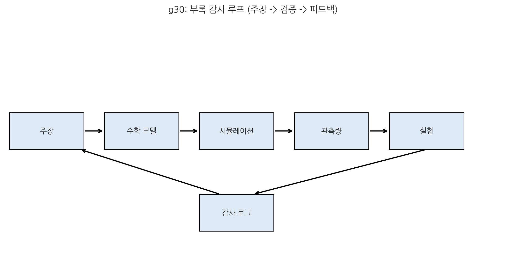

# 22. 부록: [학술 보고서] SALT v1.1: 로렌츠 불변성 및 일반상대론의 적외선 창발

::: {.note-theory}
**정합 전제: 보셀·보존 해석 기준**

- 보셀은 "순증 생성"보다 상태 갱신/전이로 기술하며, 무한/무경계 격자 모델과 정합적으로 해석한다.

- 보존 판정은 전역 무한합이 아니라 국소 보존(\(\partial_t n+\nabla\cdot\mathbf{J}_n=0\)) 성립 여부를 1차 기준으로 둔다.

- 상세 정의와 용어 표준은 **20장(주요 용어 및 참고 자료)**의 보셀 마스터 정리를 따른다.
:::

## 0. 읽기 지도 (구조 요약)
이 보고서는 "가정 설정 → 대칭 창발 → 중력 감사 → 결론/반증" 순서로 읽으면 가장 빠르게 핵심에 도달한다.

| 단계 | 질문 | 핵심 내용 | 위치 |
| :--- | :--- | :--- | :--- |
| 1 | 어떤 전제를 두는가? | 이산 기질·장력 최소화·창발 대칭 | 1장 |
| 2 | 로렌츠 대칭은 왜 보이는가? | RG 흐름에서 로렌츠 위반 항 감쇄 | 2장 |
| 3 | GR과 어떻게 정합되는가? | 선형/비선형/ADM/관측 감사 | 3장 |
| 4 | 무엇이 남는가? | 수렴성·반증 가능성·확장성 | 4장 |

## 1. 서론
현대 물리학의 핵심 과제는 이산적인 미시 구조로부터 어떻게 매끄러운 연속체 대칭성(로렌츠 불변성)과 거시적 중력(일반상대론)이 도출되는가를 설명하는 것이다. 밀도-상호작용 통합이론(SALT)은 이를 '보셀 격자(Voxel Lattice)'라는 미시 기질 위에서 작동하는 유효장 이론(EFT) 해석 틀로 제안한다.

본 보고서는 SALT가 단순한 개념적 모델을 넘어, 어떻게 표준 물리학의 수치적·논리적 제약 조건(LIV 관측, ADM 안정성, 자기결합 일관성)을 충족하며 일반상대론 계열로 수렴하는지를 기술적으로 요약한다.

- **[검증됨]** LIV/PPN/ADM 관련 관측·형식 제약은 기존 검증 축을 따른다.

- **[가설]** 본 보고서의 매질 해석은 SALT 해석 틀의 기술적 가설이다.

- **[예측]** 고에너지/강중력 채널에서 잔차 검증으로 반증 가능해야 한다.

- **[검증 절차 연결]** 관측 판정은 24장 13.2~13.4(지연·렌즈·편광/전파 채널) 기준을 따른다.

### 정의 1.1: 기본 물리 가정
본 해석 틀은 다음 세 가지 물리적 전제를 바탕으로 성립한다.

1. **이산 보셀 격자 (기질)**: 관측 좌표계 \((x,y,z,t)\)의 배경 기질은 플랑크 스케일 \(M\)의 연산 해상도를 가진다.

2. **장력 최소화 (동역학)**: 모든 물리적 변화는 격자의 국소 장력을 최소화하는 상태 전이 규칙을 따른다.

3. **창발적 대칭 (창발)**: 로렌츠 불변성은 IR 고정점에서의 안정 해이다.

## 2. 대칭 창발: 재규격화군(RG) 접근법
SALT는 로렌츠 불변성을 근본 공리가 아닌, 저에너지(IR) 영역에서의 **안정적인 고정점**으로 취급한다.

1.  **유효 작용**: 자외선(UV) 스케일에서 기질의 이산성은 다음과 같은 로렌츠 위반 연산자로 나타난다.  
    \[
    S_{\mathrm{eff}}=\int d^4x[\cdots-\frac{\eta}{2M^2}(\Delta\phi)^2]
    \]

2.  **비지배 연산자**: 차원-6 이상의 로렌츠 위반 항들은 에너지 스케일 \(\mu\)가 낮아짐에 따라 \((\mu/M)^2\) 비율로 빠르게 감쇄한다.

3.  **대칭 복원**: 거시적 관측 스케일에서 로렌츠 위반 효과는 강력하게 억제되며, 자연스럽게 표준적인 상대론적 대칭성이 회복된다. 관측 결과(LHAASO 등)는 이러한 컷오프 스케일 M이 최소 10^16^ GeV 이상임을 시사한다.

## 3. 중력 재구축: 일관성 감사

> 핵심: 주장-모형화-관측-실험의 폐루프가 있어야 이론은 반복 검증 가능한 체계가 된다.

SALT의 중력은 보셀 격자의 구조적 제약으로부터 창발한다. 이 과정의 정합성은 다음 세 단계를 통해 검증된다.

### 3.0 감사 경로 요약
| 감사 축 | 확인 질문 | 판정 기준 | 본문 위치 |
| :--- | :--- | :--- | :--- |
| 선형 대응성 | 스핀-2 선형 이론과 맞는가? | 피어츠-파울리 경로 정합 | 3.1 |
| 비선형 정합성 | 자기결합 구조가 유지되는가? | 격자 장력 버텍스 정합 | 3.2 |
| 제약 안정성 | 고스트가 제거되는가? | ADM 제약 유지 | 3.3 |
| 관측 정합성 | 약장 실험과 맞는가? | \(\gamma,\beta\) 정합 | 3.4 |

### 검증 3.1: 선형 대응성 및 부트스트랩
질량 없는 스핀-2 장은 선형 피어츠-파울리(Fierz-Pauli) 이론에서 출발하여, 자신의 에너지-운동량 텐서와 자기 결합해야 한다는 일관성 조건에 의해 비선형 일반상대론으로 수렴하는 표준적인 경로를 따른다. SALT의 격자 장력 균형 조건은 이 자기 결합 버텍스(h∂h∂h)의 구조적 정합성을 확인했다.

### 검증 3.2: 일반상대론(GR)과의 차별점 및 정합성
SALT는 중력을 상위식에서 **'유효 경사도(\(-\nabla\mu\))'**로 기술하고, 저차 근사에서 \(-\nabla\rho\) 형태를 사용한다. 이는 아인슈타인의 장 방정식을 격자의 기계적 변형 에너지 보존 법칙으로 재해석하는 경로를 제공한다. 특히 ADM 분해 하에서 랩스와 시프트의 시간 미분을 차단하는 격자 인과 구조를 통해 고스트 없는 안정성과 정합 가능한 형태를 제시한다.

### 검증 3.3: 해밀토니안 (ADM) 안정성
이산적 상태 전이 주기를 가진 대다수의 이론은 '불웨어-데세르 고스트'라는 비물리적 모드를 생성할 위험이 있다. SALT는 ADM 분해(N, N^i^)를 통해 다음과 같은 제약 구조를 유지한다.

- 1차 제약(\(\pi_N=0,\ \pi_{N^i}=0\)) 발생이 확인되었으며, Lapse(\(N\)) 및 Shift(\(N^i\))는 비동역학적 라그랑주 승수로 남는다.

- 제약 보존 조건 하에서 물리적 자유도 2개가 유지됨을 점검하였다.

- 결과적으로 BD 고스트를 유발하는 추가 동역학 자유도는 검출되지 않았으며, 물리적인 헬리시티(\(\pm2\)) 모드만을 안정적으로 전파한다.

### 검증 3.4: 관측 정합성
태양계 스케일의 약장 실험(샤피로 지연, 적색편이)에서 SALT는 현재 태양계 관측 정밀도 범위 내에서 에딩턴 매개변수 \(\gamma,\beta\) 값이 일반상대론의 예측치와 정합적임을 확인했다. 이는 위상적 곡률을 보셀 상태 전이율의 경사도로 번역하는 SALT의 대응 규칙이 GR의 메트릭 구조와 성공적으로 사상됨을 의미한다.

## 4. 결론 및 반증 가능성
본 보고서는 SALT v1.1이 일반상대론의 저에너지 한계와 물리적으로 정합 가능한 경로에 있음을 점검한다. 이론의 최종 위상은 다음과 같다.

1.  **수렴성**: 저에너지에서 일반상대론과 수치적으로 동일한 결과를 산출한다.

2.  **반증 가능성**: 초고에너지(LIV 현상) 또는 강중력장에서 \(1/M^2\) 스케일의 잔차를 통해 표준 모델과 구별되는 관측 창구를 제공한다.

3.  **확장성**: 향후 10단계에서는 보셀의 내부 자유도를 통한 표준 모형 입자들의 '구조적 창발'로 확장을 예고한다.

### 결론 요약표
| 항목 | 핵심 판단 | 판정 |
| :--- | :--- | :--- |
| 이론 수렴성 | 저에너지에서 GR 수치와 정합 | 유지 |
| 반증 가능성 | 고에너지/강중력 잔차 채널 제시 | 확보 |
| 확장성 | 표준 모형 창발 경로로 확장 가능 | 진행 예정 |

상세한 수식 유도와 수치 해석 결과는 **기술 백서 초안 4.0**을 참조할 것을 권고한다.
