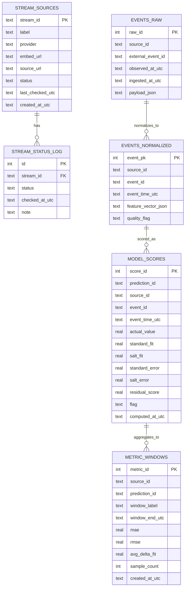
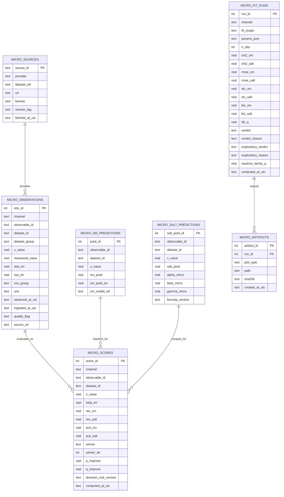

# SALT Verification Console Architecture + ERD

최종 업데이트: `2026-03-13`

## 1) 목적
이 문서는 데이터 수집부터 웹 시각화까지 전체 구조를 한눈에 보여주고, 왜 현재 스택이 적합한지 근거를 고정한다.

---

## 2) End-to-End 구조

```mermaid
flowchart LR
  subgraph External[External Data Sources]
    A1[GWOSC / GraceDB / GCN / ZTF / HEASARC]
    A2[HEPData / PDG / NuFIT]
  end

  subgraph Ingest[Ingestion & Normalize (Python)]
    B1[run_model_eval.py]
    B2[run_cosmic_predictors.py\nrun_micro_predictors.py]
    B3[run_micro_stats.py\nverify_* checks]
  end

  subgraph Store[Data Store]
    C1[(SQLite: svc_realtime.db)]
    C2[(JSON artifacts:\nlive_snapshot.json,\nresults_*.json)]
  end

  subgraph API[Serving Layer]
    D1[Next.js Route Handlers\n/api/live/snapshot]
    D2[Server-side JSON loaders\nfrozen + processed]
  end

  subgraph Web[Web UI]
    E1[Evaluation\n검증 결과 보고]
    E2[Predictions\n검증 대기 / 예측]
    E3[Book Excerpts\n도서 발췌]
    E4[Audit / Reproduce]
    E5[Cosmic + Micro detail views]
  end

  A1 --> B1
  A2 --> B1
  B1 --> B2 --> B3
  B3 --> C1
  B3 --> C2
  C1 --> D1
  C1 --> D2
  C2 --> D1
  C2 --> D2
  D1 --> E1
  D1 --> E2
  C2 --> E3
  D1 --> E4
  D1 --> E5
  D2 --> E5
```

---

## 2.1) 도서 본문(00~29) -> 웹 반영 구조

현재 웹은 `docs/book/00~29*.md`를 장별 URL로 직접 렌더링하지 않는다. 원고 장을 웹 목적에 맞게 재분류한 뒤, 일부는 Markdown 입력 파일로, 일부는 TSX 정적 섹션으로 압축 반영한다.

```mermaid
flowchart LR
  subgraph Book[Book Manuscript]
    B00[docs/book/00~29*.md]
  end

  subgraph Curate[Manual Curation / Compression]
    C1[핵심 결과 서사 추출]
    C2[도해/발췌 추출]
    C3[재현 절차 추출]
    C4[운영 설명/한계/이벤트 의미 재서술]
    C5[검증 대기 항목과 공학 시나리오 분리]
  end

  subgraph WebSources[Web Content Sources]
    W1[web/content/pages/00_결론_보고.md]
    W2[web/content/pages/01_도서_발췌.md]
    W3[web/content/pages/02_재현_방법.md]
    W4[web/content/routes/method.md]
    W5[web/content/routes/events.md]
    W6[web/content/routes/limits.md]
    W7[web/content/routes/engineering.md]
    W8[web/content/routes/notice.md]
    W9[web/src/app/*.tsx 정적 섹션]
  end

  subgraph Render[Next.js Rendering]
    R1[loadPageMarkdown -> markdownToHtml]
    R2[loadRouteMarkdownHtml -> markdownToHtml]
    R3[직접 TSX 렌더]
  end

  subgraph Routes[Published Routes]
    P1[/evaluation]
    P2[/book/excerpts]
    P3[/audit/reproduce]
    P4[/method /events /limits /notice /engineering]
    P5[/predictions]
  end

  B00 --> C1 --> W1 --> R1 --> P1
  B00 --> C2 --> W2 --> R1 --> P2
  B00 --> C3 --> W3 --> R1 --> P3
  B00 --> C4 --> W4 --> R2 --> P4
  B00 --> C4 --> W5 --> R2 --> P4
  B00 --> C4 --> W6 --> R2 --> P4
  B00 --> C5 --> W7 --> R2 --> P4
  B00 --> C4 --> W8 --> R2 --> P4
  B00 --> C5 --> W9 --> R3 --> P5
```

### 본문 장 -> 현재 웹 반영 책임 (v2)

| Book segment | Web destination | Purpose |
| :--- | :--- | :--- |
| `00` Intro orientation | `/evaluation`, `web/content/pages/00_결론_보고.md` | Narrative anchor + datasets-backed conclusion and reading cues |
| Part 1 `01~05` Problem thrust | `/book/excerpts`, hero cards in `/book/excerpts`, `/notice` | Frame why new logic is needed and tie early clues to g00~g05 visuals |
| Part 2 `06~11` Clue/Concept bridge | `/book/excerpts`, `/notice` | Illustrate clue-to-axiom transitions with curated text + graphs (g06~g11) |
| Part 3 `12~16` Unified solution | `/book/excerpts`, `/engineering` references | Surface unified map (g12), force-mode spreads (g13~g16), and technical uses |
| Theory Core `17` | `/book/excerpts` (Theory Core block) + `/engineering` | Emphasize quantum/GR bridge before predictions; can cue `/predictions` for readiness |
| Prediction & Closure `18~20` | `/predictions`, `web/content/routes/notice.md` | Publish hypothesis status, FAQ linkages (g24~g26), and closing statements for verification context |
| Appendix `21~28` | `/audit/reproduce`, `/audit/sources`, `/audit/formulas`, `web/content/routes/method.md` | Provide formal defense, provenance, prediction protocol, ADM audits, scholar references |

### 구현상 주의

- 원고 장 파일은 현재 `web/src/lib/markdown.ts`가 직접 읽지 않는다.
- 페이지 본문 Markdown 입력은 `web/content/pages/*.md`와 `web/content/routes/*.md` 두 계층으로 분리된다.
- 결과 수치 페이지는 원고만으로 생성되지 않고, `data/frozen/current/*`, `data/processed/*`를 읽는 TSX 컴포넌트가 함께 결합된다.
- 즉 현재 웹 반영 구조는 `원고 장 -> 웹용 재편집 -> Markdown/TSX -> Next route`의 수동 큐레이션 파이프라인이다.

---

## 3) Cosmic ERD (현재 운영)



---

## 4) Micro ERD (현재 frozen snapshot 기준)

기준:
- 아래 ERD는 `docs/method/micro_db_schema.sql`의 정적 스키마와
- `tools/micro/_micro_common.py`가 런타임에 보강하는 컬럼을 함께 반영한 운영 기준도다.
- 즉 `exploratory_*`, `neutrino_family_q`는 초기 스키마 파일이 아니라 실행 시점 보강 컬럼이다.



---

## 5) 시각화 매핑 규칙
- `/evaluation`: frozen 데이터 기준 자동 집계, 실제 채점 결과, 보조 해석 표
- `/predictions`: 검증 대기 가설, 데이터 공백, 변수/판정식 미연결 항목 공개
- `/book/excerpts`: 도해/코드/발췌 카탈로그 (`web/public/book-graphs`)
- `/audit/reproduce`: source, dataset_version, formula_version, rerun command, 해시 검증
- `Cosmic / Micro detail views`: evidence, events, method, limits 세부 탐색

### 현재 운영 입력 경로
- 거시 실행: `tools/evaluation/run_cosmic_predictors.py`
- 미시 실행: `tools/micro/run_micro_predictors.py`
- 미시 통계 집계: `tools/micro/run_micro_stats.py`
- 통합 실행: `tools/evaluation/run_model_eval.py`
- 재현 검증: `tools/evaluation/verify_prediction_lock.py`, `tools/evaluation/verify_frozen_manifest.py`

### 스키마 해석 주의
- `docs/method/realtime_db_schema.sql`, `docs/method/micro_db_schema.sql`는 기본 생성 스키마다.
- 일부 운영 컬럼은 실행 코드가 `ALTER TABLE`로 보강한다.
- 현재 기준 런타임 보강 컬럼:
  - `micro_fit_runs.verdict_reason`
  - `micro_fit_runs.exploratory_verdict`
  - `micro_fit_runs.exploratory_reason`
  - `micro_fit_runs.neutrino_family_q`
  - `micro_observations.dataset_group`

---

## 6) 스택 선정안 (가장 적합한 조합)

### 6.1 현재 단계 (MVP-운영)
- Front/API: `Next.js + React + TypeScript`
- Data jobs: `Python 3.x` 스크립트 + GitHub Actions/cron
- DB: `SQLite`
- Artifact store: `data/frozen/current/*.json` + `data/processed/*.json` + `web/public/book-graphs/*`
- 이유:
  - 단일 리포에서 구현/배포/문서 동기화가 빠름
  - read-heavy 검증 콘솔에 SQLite가 충분히 안정적
  - Python ingest + Next.js UI 조합이 개발 속도 대비 유지보수성이 좋음

### 6.2 확장 단계 (Micro 대량 데이터)
- DB: `PostgreSQL` 전환
- 선택 옵션:
  - API 분리 필요 시 `FastAPI` (집계/피팅 엔드포인트)
  - 백그라운드 큐 필요 시 `Celery/RQ` 또는 GitHub Actions + batch runner
- 이유:
  - 동시 쓰기/대용량 인덱싱/분석 쿼리 안정성
  - 미시 채널의 다중 데이터셋/다중 통계 런 관리에 유리

---

## 7) 현재 UI/데이터 책임 분리

| 레이어 | 현재 역할 | 주요 파일 |
| :--- | :--- | :--- |
| Frozen results | 최종 채점용 고정 스냅샷 | `data/frozen/current/*` |
| Processed results | 중간 산출물 / 보조 JSON | `data/processed/*` |
| Web data loader | JSON/manifest 로딩 | `web/src/lib/data.ts` |
| Evaluation page | 이미 채점된 결과만 공개 | `web/src/app/evaluation/page.tsx` |
| Predictions page | 아직 검증 불가한 가설 공개 | `web/src/app/predictions/page.tsx` |
| Reproduce page | 재현 절차/해시/명령 공개 | `web/src/app/audit/reproduce/page.tsx` |
| Book excerpts | 도해/발췌 카탈로그 | `web/src/app/book/excerpts/page.tsx` |
| Top nav | 상위 구조 맵 | `web/src/components/site-structure-map.tsx` |

---

## 8) 기술 결정 기준 (의사결정 체크)
1. 재현성: 같은 입력에 같은 결과가 재생성되는가
2. 추적성: source/dataset/formula 버전 추적이 가능한가
3. 확장성: micro 채널 추가 시 스키마 재사용이 가능한가
4. 운영성: 배치 실패/지연을 UI와 로그에서 즉시 확인 가능한가
5. 비용: MVP 단계에서 과도한 인프라를 요구하지 않는가

---

## 9) 다음 구현 우선순위
1. `/audit` 페이지 구축 (버전/출처/식 추적)
2. `micro_*` 스키마 SQL 파일 추가
3. HEPData/PDG/NuFIT ingest 스크립트 추가
4. `/micro/overview` 우선 오픈
