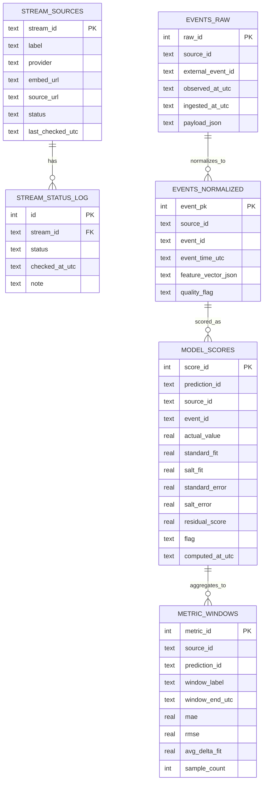
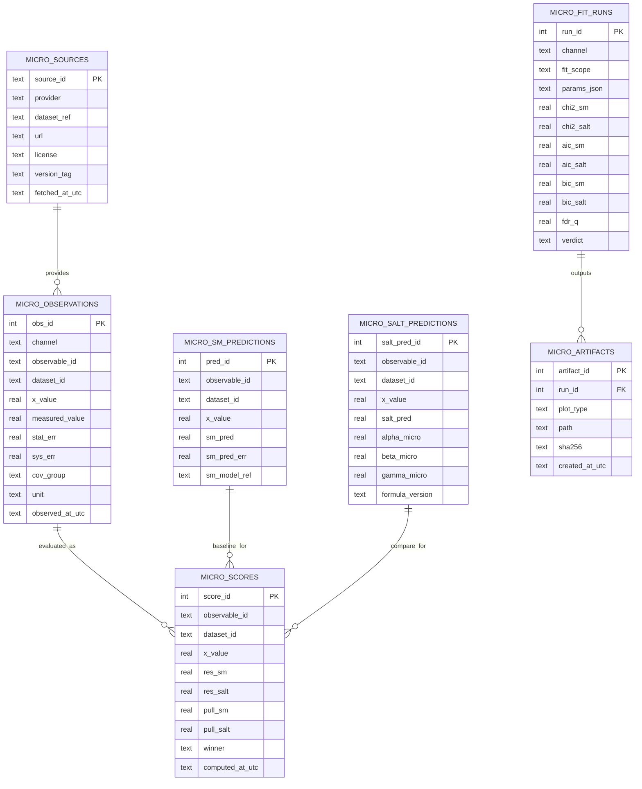

# SALT Verification Console Architecture + ERD

최종 업데이트: `2026-03-07`

## 1) 목적
이 문서는 데이터 수집부터 웹 시각화까지 전체 구조를 한눈에 보여주고, 왜 현재 스택이 적합한지 근거를 고정한다.

---

## 2) End-to-End 구조

```mermaid
flowchart LR
  subgraph External[External Data Sources]
    A1[GWOSC / GraceDB / GCN / ZTF / HEASARC]
    A2[HEPData / PDG / NuFIT]
  end

  subgraph Ingest[Ingestion & Normalize (Python)]
    B1[collect_* scripts]
    B2[normalize + quality flag]
    B3[prediction calc\nStandard vs SALT]
  end

  subgraph Store[Data Store]
    C1[(SQLite: svc_realtime.db)]
    C2[(JSON artifacts:\nlive_snapshot.json,\nresults_*.json)]
  end

  subgraph API[Serving Layer]
    D1[Next.js Route Handlers\n/api/live/snapshot]
    D2[Future: /api/micro/*]
  end

  subgraph Web[Web UI]
    E1[Cosmic: Evidence / Events / Method / Limits]
    E2[Micro: Evidence / Events / Method / Limits]
    E3[Audit]
  end

  A1 --> B1
  A2 --> B1
  B1 --> B2 --> B3
  B3 --> C1
  B3 --> C2
  C1 --> D1
  C1 --> D2
  C2 --> D1
  D1 --> E1
  D2 --> E2
  D1 --> E3
  D2 --> E3
```

---

## 3) Cosmic ERD (현재 운영)



---

## 4) Micro ERD (계획 확장)



---

## 5) 시각화 매핑 규칙
- `Evidence`: measured vs standard vs SALT + residual distribution + win rate
- `Events`: 이벤트/관측치 단위 raw + normalized + score 테이블
- `Method`: 예측식/파라미터/통계기준/반증조건
- `Limits`: standard 우세/동률/실패 케이스 공개
- `Audit`: source, dataset_version, formula_version, rerun command

---

## 6) 스택 선정안 (가장 적합한 조합)

### 6.1 현재 단계 (MVP-운영)
- Front/API: `Next.js + React + TypeScript`
- Data jobs: `Python 3.x` 스크립트 + GitHub Actions/cron
- DB: `SQLite`
- 이유:
  - 단일 리포에서 구현/배포/문서 동기화가 빠름
  - read-heavy 검증 콘솔에 SQLite가 충분히 안정적
  - Python ingest + Next.js UI 조합이 개발 속도 대비 유지보수성이 좋음

### 6.2 확장 단계 (Micro 대량 데이터)
- DB: `PostgreSQL` 전환
- 선택 옵션:
  - API 분리 필요 시 `FastAPI` (집계/피팅 엔드포인트)
  - 백그라운드 큐 필요 시 `Celery/RQ` 또는 GitHub Actions + batch runner
- 이유:
  - 동시 쓰기/대용량 인덱싱/분석 쿼리 안정성
  - 미시 채널의 다중 데이터셋/다중 통계 런 관리에 유리

---

## 7) 기술 결정 기준 (의사결정 체크)
1. 재현성: 같은 입력에 같은 결과가 재생성되는가
2. 추적성: source/dataset/formula 버전 추적이 가능한가
3. 확장성: micro 채널 추가 시 스키마 재사용이 가능한가
4. 운영성: 배치 실패/지연을 UI와 로그에서 즉시 확인 가능한가
5. 비용: MVP 단계에서 과도한 인프라를 요구하지 않는가

---

## 8) 다음 구현 우선순위
1. `/audit` 페이지 구축 (버전/출처/식 추적)
2. `micro_*` 스키마 SQL 파일 추가
3. HEPData/PDG/NuFIT ingest 스크립트 추가
4. `/micro/overview` 우선 오픈
