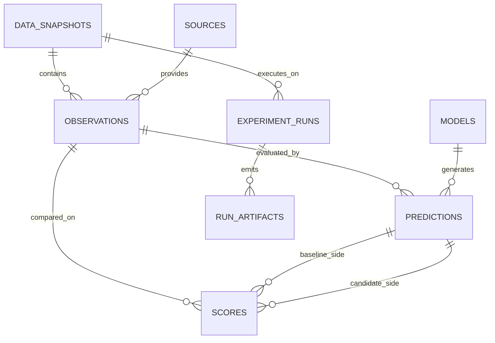

# SVC v2 ERD + Web IA 개선 제안

최종 업데이트: `2026-03-11`

## 1) 목적

현재 SVC는 검증 콘솔로서 충분히 작동하지만, 데이터 버전 추적, 비교 모델 확장, 실행 이력 감사 측면에서 구조적 한계가 보이기 시작했다.

이 문서는 다음 3가지를 한 번에 개선하는 v2 방향을 제안한다.

- ERD를 `snapshot / model / run` 중심으로 재정렬
- 웹 IA를 `결과 표시`에서 `검증 추적` 중심으로 강화
- 책/웹/데이터/감사 문서의 정합성을 유지하기 쉬운 구조로 이동

---

## 2) 현재 구조의 핵심 한계

### 2.1 모델 확장성 한계
- 현재는 `micro_sm_predictions`, `micro_salt_predictions`처럼 모델별 테이블을 따로 둔다.
- 이 방식은 `baseline vs salt` 비교에는 단순하지만, `salt-v2`, `alt-model`, `ablation`이 추가되면 테이블이 계속 늘어난다.

### 2.2 snapshot 개념이 일급 객체가 아님
- 실제 운영은 `frozen-20260308` 같은 snapshot 기준으로 돌아간다.
- 하지만 DB ERD 안에서는 snapshot이 테이블 축으로 강하게 드러나지 않고, JSON manifest와 페이지 문맥에서 보조적으로만 관리된다.

### 2.3 run provenance가 분산됨
- 결과 검증에는 `run_model_eval.py`, `verify_prediction_lock.py`, `verify_frozen_manifest.py`, frozen manifest, JSON artifacts를 함께 봐야 한다.
- 즉 “이 결과가 어떤 입력/코드/규칙/실행에서 나왔는가”가 단일 실험 단위로 묶여 있지 않다.

### 2.4 웹 설명력이 데이터 구조를 앞지름
- 현재 웹은 결과를 설명하는 데는 성공했지만,
- “왜 이 숫자가 이렇게 나왔는가”, “어느 버전과 어느 실행의 결과인가”, “이전 snapshot과 무엇이 달라졌는가”를 페이지 차원에서 직접 보여주기 어렵다.

---

## 3) v2 핵심 설계 원칙

### 3.1 Snapshot First
- 모든 공개 결과는 반드시 하나의 `snapshot`에 귀속된다.
- 데이터셋 버전, manifest hash, 생성 시각, 공개 상태를 DB 레벨에서 갖는다.

### 3.2 Model Agnostic
- `SM`, `ΛCDM`, `SALT`, `SALT-v2`, `ablation`을 같은 구조에서 관리한다.
- 모델별 테이블을 추가하지 않고, `models` + `predictions`로 일반화한다.

### 3.3 Run as First-Class Object
- 예측, 점수 계산, fit, 검증을 모두 `experiment_runs`로 기록한다.
- 웹은 페이지에서 run 단위 provenance를 직접 노출할 수 있어야 한다.

### 3.4 UI = Audit-Friendly
- 웹은 단순히 예쁜 결과판이 아니라, 독자가 “결과 -> 근거 -> 실행 -> 아티팩트”를 끝까지 따라갈 수 있는 구조를 목표로 한다.

---

## 4) 제안 ERD (v2)



### 4.1 `data_snapshots`

| 컬럼 | 의미 |
| :--- | :--- |
| `snapshot_id` | 내부 snapshot 식별자 |
| `dataset_version` | 공개 버전명 (`frozen-20260308` 등) |
| `created_at_utc` | 생성 시각 |
| `manifest_sha256` | snapshot manifest hash |
| `status` | `draft`, `candidate`, `published`, `archived` |
| `notes` | 운영 메모 |

역할:
- 공개 결과의 기준 축
- 웹 필터의 최상위 기준
- diff/회귀 비교의 기본 단위

### 4.2 `sources`

| 컬럼 | 의미 |
| :--- | :--- |
| `source_id` | 소스 식별자 |
| `provider` | 제공자 |
| `dataset_ref` | 데이터셋 분류 |
| `url` | 출처 URL |
| `license` | 라이선스/이용 조건 |
| `version_tag` | 소스 버전 태그 |
| `fetched_at_utc` | 수집 시각 |

역할:
- 관측값 provenance 단일화
- `/audit/sources`의 정규 데이터 원천

### 4.3 `observations`

| 컬럼 | 의미 |
| :--- | :--- |
| `observation_id` | 관측값 PK |
| `snapshot_id` | 소속 snapshot |
| `source_id` | 소스 FK |
| `domain` | `cosmic`, `micro` |
| `channel` | 세부 채널 |
| `observable_id` | 관측량 ID |
| `dataset_id` | 데이터셋 ID |
| `x_value` | 축값/빈 좌표 |
| `measured_value` | 실측값 |
| `stat_err`, `sys_err`, `total_err` | 오차 |
| `quality_flag` | 품질 상태 |
| `observed_at_utc` | 관측 시각 |

역할:
- 거시/미시를 같은 관측 단위로 정렬
- 웹의 evidence/events 뷰를 통합적으로 구성 가능

### 4.4 `models`

| 컬럼 | 의미 |
| :--- | :--- |
| `model_id` | 모델 PK |
| `family` | `baseline`, `salt`, `candidate` |
| `name` | `SM`, `ΛCDM`, `SALT`, `SALT-v2` |
| `domain` | `cosmic`, `micro`, `shared` |
| `formula_version` | 수식 버전 |
| `decision_rule_version` | 판정 규칙 버전 |
| `active` | 활성 상태 |

역할:
- 모델 일반화
- 향후 다중 비교 실험 수용

### 4.5 `predictions`

| 컬럼 | 의미 |
| :--- | :--- |
| `prediction_id` | 예측 PK |
| `observation_id` | 관측값 FK |
| `model_id` | 모델 FK |
| `predicted_value` | 예측값 |
| `predicted_error` | 예측 오차 |
| `params_json` | 사용 파라미터 |
| `computed_at_utc` | 계산 시각 |

역할:
- “같은 관측값에 대해 여러 모델이 낸 예측”을 같은 구조로 저장

### 4.6 `scores`

| 컬럼 | 의미 |
| :--- | :--- |
| `score_id` | 점수 PK |
| `observation_id` | 관측값 FK |
| `baseline_prediction_id` | 기준측 예측 FK |
| `candidate_prediction_id` | 비교측 예측 FK |
| `residual_baseline` | 기준측 잔차 |
| `residual_candidate` | 비교측 잔차 |
| `winner` | `baseline`, `candidate`, `tie` |
| `p_improve`, `q_improve` | 개선 유의도 |
| `computed_at_utc` | 계산 시각 |

역할:
- 비교 결과를 prediction과 직접 연결
- 독자가 웹에서 “무엇과 무엇을 비교했는지” 바로 추적 가능

### 4.7 `experiment_runs`

| 컬럼 | 의미 |
| :--- | :--- |
| `run_id` | 실행 PK |
| `snapshot_id` | 대상 snapshot |
| `domain` | `cosmic`, `micro`, `shared` |
| `run_type` | `predict`, `score`, `fit`, `verify`, `publish` |
| `command` | 실행 명령 |
| `code_ref` | 스크립트/커밋 참조 |
| `status` | `running`, `passed`, `failed` |
| `verdict` | run-level 요약 판정 |
| `verdict_reason` | 판정 이유 |
| `started_at_utc`, `completed_at_utc` | 실행 시각 |

역할:
- 감사/재현 페이지의 핵심 축
- 현재 분산된 실행 provenance를 일원화

### 4.8 `run_artifacts`

| 컬럼 | 의미 |
| :--- | :--- |
| `artifact_id` | artifact PK |
| `run_id` | 실행 FK |
| `artifact_type` | `json`, `plot`, `manifest`, `report` |
| `path` | 파일 경로 |
| `sha256` | 해시 |
| `created_at_utc` | 생성 시각 |

역할:
- 결과 파일과 실행 이력을 연결
- `/audit/reproduce`에서 직접 활용 가능

---

## 5) v2 ERD의 장점

### 5.1 모델 증가에 강함
- `SM vs SALT` 전용 구조가 아니다.
- `ΛCDM vs SALT`, `SM vs SALT-v2`, `baseline vs ablation` 모두 같은 스키마에서 처리 가능하다.

### 5.2 snapshot 비교가 쉬워짐
- 예: `frozen-20260308`과 `frozen-20260315`의 승률 차이, 채널별 변화, formula_version 변경 효과를 직접 비교 가능하다.

### 5.3 웹이 훨씬 정직해짐
- 현재는 “이 수치는 이 페이지가 해석해서 보여주는 것”에 가깝다.
- v2에서는 “이 수치는 snapshot X, run Y, model Z의 직접 산출물”로 보여줄 수 있다.

### 5.4 감사 가능성이 올라감
- 현재는 JSON, DB, 문서, 코드 경로를 함께 봐야 한다.
- v2에서는 run provenance가 DB 축으로 정리된다.

---

## 6) 웹 IA 개선안

### 6.1 현재 IA의 한계
- 현재 사이트는 설명력은 좋아졌지만, 결과 provenance 탐색은 깊이가 부족하다.
- `/evaluation`, `/audit/reproduce`, `/micro/*`, `/cosmic/*` 사이를 사용자가 스스로 조합해야 한다.

### 6.2 제안 IA

```text
/
├─ /evaluation
│  ├─ snapshot selector
│  ├─ domain filter
│  ├─ model comparison filter
│  └─ channel drilldown
├─ /runs
│  ├─ /runs/[runId]
│  └─ /runs?snapshot=frozen-20260308
├─ /snapshots
│  ├─ /snapshots/[snapshotId]
│  └─ /snapshots/compare/[left]...[right]
├─ /models
│  ├─ /models/[modelId]
│  └─ /models/compare/[a]...[b]
├─ /cosmic
│  ├─ /cosmic/overview
│  ├─ /cosmic/channels
│  ├─ /cosmic/evidence
│  ├─ /cosmic/method
│  └─ /cosmic/limits
├─ /micro
│  ├─ /micro/overview
│  ├─ /micro/channels
│  ├─ /micro/evidence
│  ├─ /micro/method
│  └─ /micro/limits
├─ /audit
│  ├─ /audit/sources
│  ├─ /audit/datasets
│  ├─ /audit/formulas
│  ├─ /audit/reproduce
│  └─ /audit/provenance
└─ /book/excerpts
```

### 6.3 IA 핵심 원리

- `Evaluation`: 사용자 첫 화면, 현재 공개 snapshot의 결과판
- `Snapshots`: 버전 단위 비교 허브
- `Runs`: 재현/감사 허브
- `Models`: 기준 이론과 SALT 계열 모델 설명 허브
- `Cosmic/Micro`: 도메인 이해 허브
- `Audit`: 출처/버전/재현 절차 허브

---

## 7) 페이지별 개선 포인트

### 7.1 `/evaluation`

현재:
- snapshot 하나 기준의 요약판에 가깝다.

개선:
- 상단에 `snapshot selector`
- `baseline model`, `candidate model`, `domain`, `channel` 필터 추가
- 요약 KPI 카드에 `formula_version`, `decision_rule_version`, `run_id` 노출
- “이 결과를 만든 run 보기” 버튼 추가

예상 효과:
- 사용자가 결과의 맥락을 바로 이해한다.
- 결과 신뢰도가 올라간다.

### 7.2 `/runs`

신규:
- run 목록 페이지
- 각 run별 상태, snapshot, 명령, verdict, artifact hash 노출

예상 효과:
- `/audit/reproduce`가 설명 페이지에서 실제 운영 감사 콘솔로 진화한다.
- 외부 검토자가 재현 경로를 끝까지 따라갈 수 있다.

### 7.3 `/snapshots`

신규:
- snapshot 목록
- snapshot diff 페이지

핵심 비교:
- 승률 변화
- 채널별 변화
- 모델 버전 변화
- artifact/hash 변화

예상 효과:
- “최근 업데이트가 무엇을 바꿨는가”를 공지보다 데이터로 설명 가능
- 책/웹/데이터 정합성 관리가 쉬워짐

### 7.4 `/models`

신규:
- `ΛCDM`, `SM`, `SALT`, `SALT-v2` 설명 페이지
- formula version history
- 비교식 차이 요약

예상 효과:
- 현재 웹의 “기준 이론” 표현이 더 명확해짐
- 독자가 거시 기준과 미시 기준을 덜 혼동함

### 7.5 `/audit/provenance`

신규:
- source -> observation -> prediction -> score -> run -> artifact 체인 시각화

예상 효과:
- 이 사이트의 가장 강한 차별점이 됨
- 단순 결과 홍보가 아니라 검증 가능성 그 자체를 전면화 가능

---

## 8) 웹사이트 예상 효과

### 8.1 일반 방문자
- “이 사이트가 무엇을 하고 있는지”를 더 빨리 이해한다.
- snapshot selector와 model label 덕분에 결과 문맥이 덜 모호하다.

### 8.2 비판적 검토자
- “선별 보고 아닌가?”라는 의심에 대응하기 쉬워진다.
- 결과 수치와 provenance를 직접 확인할 수 있다.

### 8.3 협업자/개발자
- 버전 차이와 구조 차이를 UI에서 직접 확인할 수 있다.
- 문서 업데이트와 웹 업데이트 사이 시차가 줄어든다.

### 8.4 책 독자
- 책의 장별 주장과 웹의 검증 결과를 더 직접 연결할 수 있다.
- “이 주장에 대응하는 현재 공개 검증은 무엇인가?”를 찾기 쉬워진다.

---

## 9) 예상 트레이드오프

### 9.1 마이그레이션 비용
- 현재 JSON 중심 로더를 일부 유지할지, DB 중심으로 바꿀지 결정해야 한다.
- 완전 전환보다 병행 운용 기간이 필요하다.

### 9.2 운영 복잡도 증가
- snapshot, run, artifact를 다 관리하면 운영 메타데이터가 늘어난다.
- 대신 감사성과 설명력이 올라간다.

### 9.3 SQLite 한계
- 지금 규모는 버틸 수 있다.
- 하지만 snapshot history, run history, artifact tracking이 커지면 PostgreSQL 전환 타이밍이 빨라질 수 있다.

---

## 10) 권장 마이그레이션 순서

### Phase 1: 메타 축 도입
- `data_snapshots`
- `models`
- `experiment_runs`
- 기존 JSON/manifest를 이 축에 매핑

목표:
- 기존 결과를 깨지 않고 provenance 축부터 확보

### Phase 2: 웹 감사 기능 추가
- `/runs`
- `/snapshots`
- `/audit/provenance`

목표:
- 데이터 구조 변경 효과를 사용자 가치로 즉시 연결

### Phase 3: prediction 일반화
- `micro_sm_predictions`, `micro_salt_predictions`를 `predictions`로 통합
- 거시도 같은 패턴으로 정렬

목표:
- 모델 확장성 확보

### Phase 4: score/run 연결 강화
- score가 어떤 run에서 계산됐는지 직접 FK 연결
- run diff / snapshot diff 시각화 추가

목표:
- 완전한 재현 감사 흐름 확보

---

## 11) 구현 완료 기준

- 공개 결과가 모두 `snapshot_id`를 가진다.
- 모든 검증 실행이 `run_id`를 가진다.
- 웹에서 `result -> run -> artifact -> hash`를 클릭으로 따라갈 수 있다.
- 모델 비교가 `SM/SALT` 하드코딩이 아니라 `model_id` 기준으로 동작한다.
- snapshot 간 diff 화면에서 변화 이유를 최소 3종 이상 설명할 수 있다.

---

## 12) 한 줄 결론

v2 ERD의 핵심은 “결과를 더 많이 보여주는 것”이 아니라, “현재 보여주는 결과를 더 추적 가능하고 더 반박 가능하게 만드는 것”이다.

이 방향으로 가면 SVC는 단순 리포트 사이트에서, snapshot/version/run provenance를 직접 공개하는 검증 플랫폼으로 한 단계 올라간다.
